# scmJS

scmJS is a map editor for StarCraft, Brood War, and StarCraft: Remastered, modelled on StarEdit, SCMDraft 2, and StarForge. It is available in the browser and as a desktop app.

It opens the game's `.scm` and `.scx` maps (and a bare `.chk` scenario), draws them
with the game's terrain and unit graphics, and saves maps the game plays. Whatever it
does not understand in a file is copied through untouched - an unknown section, a
malformed one, an archive member it cannot name - so a map only loses what you
deliberately change.

Several people can edit one map at the same time: share the map you have open and anyone
you send the link to works on it with you, each in their own editor, seeing the others'
changes and pointers as they happen. See [Editing a map together](#editing-a-map-together).


> **Beta.** This editor needs to be extensively tested. Keep backups of maps you care
> about, and check anything important in-game before you rely on it.

This guide is for map makers. It starts with getting the editor running, walks through
a first map, and then goes through each layer and dialog in turn. The technical side —
file formats, game data, writing plugins, building from source — has documents of its
own; see [Documentation](#documentation).

## Getting started

There are three ways to run scmJS, each covered in [docs/installing.md](docs/installing.md):

- **In the browser** at [editor.scmjs.dev](https://editor.scmjs.dev). Nothing to install,
  and your maps stay on your own disk.
- **As a desktop app** for Windows, macOS and Linux, from the [releases](../../releases)
  page. It finds a StarCraft installation on its own and opens a map on a double-click.
- **In a container**, for a server on your own network: `docker run --rm -p 8080:80
  ghcr.io/scm-js/scm-js:latest`, then open `http://localhost:8080`.

On first use the editor asks where to get StarCraft's graphics, which do not ship with
it: a free download from Blizzard, or the `StarDat.mpq` and `BrooDat.mpq` of a classic
installation. See [The graphics](docs/installing.md#the-graphics). Without them the editor
still runs, with terrain in flat colours and units as coloured markers.

### Opening a map

Ctrl+O opens a file, and so does dropping one on the window. A map opens beside the ones
already open, in its own tab (see [The editor window](#the-editor-window)); the one
exception is the blank map the editor starts on, which the first map opened takes the
place of. File ▸ Open Recent lists what you have had open before; in Chrome, Edge and the desktop app it reopens the file
from disk directly. File ▸ Find on scmscx.com… searches the community map archive and
opens the map you pick (see [Plugins](#plugins)). File ▸ Open from scmjs.dev… lists the maps kept on your scmjs.dev
account, every revision you saved there (see [Your scmjs.dev account](#your-scmjsdev-account)).

## The editor window

The window has nine parts, numbered in the picture below.


1. **Menu bar.** Every command is here, with its shortcut beside it. The dot at the right
   end glows while the map has unsaved changes.
2. **Toolbar.** New / open / save, undo and redo, cut / copy / paste, the active layer
   and brush size, the grid, locations and fog-of-war toggles, symmetry, find, zoom, and
   buttons for Player Settings, the Trigger Editor and Test Map.
3. **Layer rail.** The seven layers, top to bottom: Terrain, Doodads, Units, Sprites,
   Locations, Fog of War, Cut / Copy / Paste. The keys `T D U S L F C` switch between
   them.
4. **Palette.** What the active layer places: terrain types and brushes, doodads, unit
   types, sprites, the location list, the fog players, the clipboard options.
5. **Map.** Drag to paint or place, click to select, double-click for properties.
   Right-click opens a context menu, or stops whatever you are placing.
6. **Minimap.** Click or drag on it to move the view.
7. **Layers panel.** The eye hides a layer's objects from the view; the padlock locks a
   layer so its tools stop changing the map. Plugin overlays (Walkability, say) are
   listed under it.
8. **Properties.** What is selected, or what is under the cursor: for a tile its id,
   group, elevation, walkability and buildability; for a unit its owner, position and
   vitals; for a location its bounds and elevation flags.
9. **Status bar.** The tile and pixel under the cursor, the tile id, map size, tileset,
   layer and zoom, and a line saying what the last action did or why it was refused. At
   the right end, your scmjs.dev account (or *Sign in to scmjs.dev*) and the AI's state,
   each a click to open.

Open a second map and a row of tabs appears under the toolbar, one per open map, with a
glowing dot on any that has unsaved changes. Click a tab to switch, or use the Window menu
(Ctrl+Tab and Ctrl+Shift+Tab in the desktop app); the × on a tab, a middle click, or
File ▸ Close closes that map, asking about unsaved changes first. Each map keeps its own
undo history, selection and view, so switching back lands where you left off. With one map
open there is no row: the window looks as it always has. Preferences ▸ General can turn
this off, and then Open and New replace the open map as StarEdit does.

Scroll with the mouse wheel (Shift for sideways), the arrow keys (Shift for half a
screen), a middle-button drag, or the scrollbars, or click on the minimap. A drag that
reaches the edge of the window scrolls the view along with it, so a stroke, a marquee or
a unit being moved can carry on past what is on screen; it speeds up the further past the
edge you push and stops when you let go. Ctrl++ and Ctrl+− zoom, as do the toolbar's magnifiers; Ctrl+0 is 100% and
Ctrl+Shift+0 fits the whole map in the window. Ctrl+G shows the grid, and View ▸ Grid Settings (the
Editing page of Preferences) sets its spacing, colour and style. The panels can be hidden from View ▸ Panels and their widths dragged.

Every layer has its own selection and its own palette. Undo is Ctrl+Z, two hundred steps
deep and shared across all the layers, so a terrain stroke and the units it stranded
come back together. Anything done in a dialog — player settings, triggers, strings — is
its own OK / Apply / Cancel transaction and is not in the undo history, as in StarEdit.

## Your first map

This section walks through a small melee map from start to finish. Everything here is
covered in more depth in the sections that follow.

### 1. Make the map

Ctrl+N opens New Scenario. Pick a tileset — each is shown as its own ground — a size, and
how many players. The terrain list under the size is what the whole map is filled with,
and the preview shows the result at its real scale. *Place automatically* (off by default) lays down one
start location per player in a ring; tick it for this map.


Give the map a name and a description — both are what players see in the game lobby —
and press Create.

### 2. Shape the ground

Stay on the Terrain layer and the **Isometric** tab. Pick *High Dirt* (Badlands; every
tileset has a high ground of its own), set the brush to 3×3, and drag across the map.
The cliffs around the high ground are laid for you, and where a stroke meets a terrain
the new one cannot touch, the terrain in between is put in. Painting *Water* works the
same way and gives you a shore.


The brush size keys are `[` and `]`. Alt+click picks the terrain under the cursor.
Ctrl+Z takes back the whole stroke.

Ramps are not terrain: they are on the **Doodads** layer. Type `ramp` in its search box
to list them, click one, and click on a cliff edge; the ghost is red until the footprint
sits on ground it fits.

### 3. Place the bases

Switch to the **Units** layer (`U`). The start locations are already there. In the
palette, *Special* holds *Start Location* and *Resources* holds the mineral fields and
the Vespene Geyser, or type a name in the search box. Click a type to arm it, then click
on the map to place; Esc or a right-click stops placing.


A mineral field holds 1500 minerals and a geyser 5000 gas when placed; double-click one
to change the amount, or select a whole line and set them all at once. Eight fields and
one geyser is the usual main.

*Snap to grid* keeps buildings and resources on the tile grid where the game expects
them. The two ticks above it are the game's own placement rules; a red ghost means the
game would drop the unit when it loaded the map, and the status bar says why.

For a symmetric map, Tools ▸ Symmetry mirrors what you paint and place across the axis
you choose. The Melee Wizard plugin (Plugins ▸ Browse Plugins…) lays out whole bases with
the mineral line at the distance the game mines fastest from.

### 4. Check the players

Scenario ▸ Player Settings is where each slot's controller, race and colour live. A melee
map needs *Human* and *User Selectable* on every slot that has a start location; that is
what a new map is set to already. Force Settings groups them into teams for the lobby.

A Use Map Settings map is different: give each player a fixed race there. A player left on
*User Selectable* is treated as a melee player by the game, which hands them a base and
workers at their start location and removes every unit you placed for them. Units of a
human slot that nobody takes in the lobby are removed too, so put decorations such as
beacons on Player 12, the neutral one.

### 5. Check the map

Tools ▸ Check Map lists what the game would object to: a start location with no player,
a unit off the map, too many units, and so on. Double-click a line to go to it.

View ▸ Walkability (Ctrl+Shift+W) draws the ground as a unit sees it: which areas
connect, where the chokes are and how wide, and which pockets cannot be reached at all.
It updates as you edit.

### 6. Save and play

Ctrl+S saves. A new map opens the Save dialog the first time, where the name and the
file format are chosen; `.scx` is a Brood War map. From then on Ctrl+S writes the file in
place (Chrome, Edge, the desktop app) or downloads it (Firefox, Safari) — the notice at
the bottom right says which.

Ctrl+F5 is Test Map. Neither StarCraft build opens a map handed to it from the outside,
so the editor writes the map into a `scmJS` folder under the game's *Maps* folder, where
**Single Player ▸ Custom Game** lists it; the desktop app then starts the game as well.

That is a playable melee map. Triggers, briefings, custom unit settings and everything a
"Use Map Settings" map needs are in the sections below.

## Terrain

Terrain is painted with four brushes, each a tab in the palette:

| Brush | Paints |
| --- | --- |
| Isometric | StarEdit's diamond brush. Sets the diamond under the cursor to a terrain and lays the cliffs and edges around it. The one to use for almost everything. |
| Rect | Flat ground of one terrain type, in left/right tile pairs with StarEdit's random variation mix. No cliffs, no edges. |
| Tile | Any single tile by number: cliff pieces, doodad tiles, anything the tileset has. |
| Blend | One tile next to a tile you picked, chosen from those whose facing edge continues it. |


Drag to paint. `[` and `]` resize the brush from 1×1 to 7×7, Alt+click picks the terrain
or tile under the cursor, and right-click offers Pick and Fill Area. The Properties panel
breaks the tile under the cursor into group, slot, elevation, walkability and
buildability.

The isometric brush ripples outward as it paints: a neighbour that cannot legally border
the new terrain becomes the intermediate one, and cliff faces stack as tall as the
tileset draws them. A single click of high ground gives a small mesa; a wider brush gives
flat high ground inside a cliff ring. It needs the map's `ISOM` section, which is the
editor's own record rather than anything the game reads, and which protected maps often
strip. Where a map has none, the tab says so and the Repair plugin (Tools ▸ Repair Map…)
reconstructs it: exact for ground that was laid down isometrically, a best guess under
doodads and hand-placed tiles. The tab also warns when Rect or Tile edits have left the
record out of step with the terrain — but only where a rebuild would put it back. Ground
no diamond lattice can describe, which is what hand-placed tiles, blends and other
editors leave behind, is reported as what it is: the brush will not join up there, and
no tool can change that.

  

Rect lays the flat pairs and nothing else, which is what you want for filling an area you
will shape afterwards, or for ground under a doodad. Tile is for the pieces the isometric
brush will not give you: a single cliff tile, a doodad's tile, a corner the cliff sets do
not have. Blend is for joins the cliff sets never had — dirt into a doodad's base, one
edge set into another, a hand-laid shoreline: click a tile to make it the anchor, and the
palette lists for each side the tiles whose opposite edge continues its pixels, best
seam first, with the mean colour difference under each thumbnail. Rect, Tile and Blend
leave the isometric record alone, which is what SCMDraft does in its non-isometric modes.

Two overlays on the View menu show what the ground means to the game:


Tools ▸ Replace Terrain turns every tile of one terrain type (or one exact tile) into
another, over the whole map or the area marked on the Cut / Copy / Paste layer; Fill
Terrain lays the whole map anew. Both are one undo step.

Tools ▸ Symmetry mirrors what you do across the map's axes or about its centre — every
brush, the fills, and placing units, sprites, doodads and locations, each as one undo
step. The axes show on the map while a mode is on, the ghost shows where the images will
land, and a doodad that would have to turn is skipped. Blend, moving and deleting are not
mirrored.


The Terrain palette's *Remove stranded units* tick deletes the units a stroke has just
made illegal (a building now half on a cliff) as part of the same undo step.

## Doodads

Doodads are the trees, rocks, ruins, ramps and bridges of a map: pieces of terrain that
come with their own tiles and, sometimes, a sprite drawn over them. The palette is built from the current tileset's
own groups, with StarEdit's categories and placement rules.


Picking a doodad arms placement, and the ghost turns red where the footprint leaves the
map, covers another doodad or sits on the wrong terrain. *Place anywhere* drops that
rule; *Snap to grid* keeps the footprint on StarEdit's two-tile isometric grid, which it
does for a move as well as a placement. Right-click or Esc stops placing.

Doodads have no names in the game data, so the search box matches what the data does
say: the category (`bridge`, `temple`, `coastal`), the id (`#12`), the footprint
(`6×6`), the sprite or unit an overlay draws (`hdrock`, `Xel'Naga Temple`), and the
word `ramp` for anything whose tiles carry the ramp bit, which StarEdit files under
cliffs and walls without saying so.

A placed doodad stays whole across the three places a map keeps it — its tiles, its
record and any canopy or door overlay — and removing one restores the ground underneath.
When you want the tiles without the doodad — a ramp to touch up piece by piece, a cliff
edge to paint into — right-click it and choose *Convert Doodad to Terrain* (the Properties
panel has the same button). The tiles stay, the record goes, and an overlay stays on as
an ordinary sprite; from then on the Terrain layer treats the cells as ground, so a
Terrain-only copy carries them and a later doodad leaving them puts them back. *Place
as terrain* in the palette does the same at placement, for laying out ramps and cliff
pieces you mean to work over by hand.

## Units

The Units layer places everything the game has a unit for: the three races' units and
buildings, heroes, critters, resources, start locations, beacons and powerups. The palette groups them by
race, and the search box takes a name or an id.


Picking a unit type arms placement, and each click on empty ground places one for the
player selected at the top of the palette. Esc or right-click stops placing and drops you
into select mode, where a click selects, a drag on empty ground marks a box, and a drag on
a unit moves it. Del deletes the selection.

**Snap to grid** puts buildings, resources, start locations and beacons on the tile grid
by their placement box, the way StarEdit stores them, and every other unit on the
nearest tile centre. Turn it off for pixel placement, SCMDraft-style. It applies to a
move as well as a placement, so dragging a unit that sits off the grid brings it back
onto it.

The **placement checks** are on by default and refuse a spot with a red ghost and a
reason in the status bar. They are the rules the game applies when it loads a map and
silently drops the units that do not fit: no overlapping collision boxes for ground units
and buildings, buildable tiles under a building's whole placement box, walkable ground
under a unit. The unit in the way gets outlined. Untick them for a stack of units on
purpose, and expect the game to keep only the first.


Double-click a unit for every field its record holds: owner, position, hit points,
shields, energy, resources and hangar count with their "used" ticks, the special
properties (cloaked, burrowed, lifted off, hallucinated, invincible), and the related-unit
link an add-on or a Nydus Canal uses. With several units selected, only the fields you
touch are written to all of them, so a mineral line can be set to one amount in one go.

Tools ▸ Auto-place Start Locations puts one start location per player on a ring or in
the corners, each moved to the nearest ground the placement checks accept, and selects
them so you can drag them where you want.

## Sprites

There are two kinds of sprite. Pure sprites are a graphic drawn where it stands with no unit behind it: tree
canopies, markers, glows. Unit sprites are records the game turns into a unit when the
map loads, which is how StarEdit does Installation doors and traps.


The palette has a tab for each. Pure Sprites lists all 517 entries grouped as Units,
Effects and Doodads, the last named after the graphics file since the game ships no
sprite name table. Placement is free: click anywhere, no rules to refuse a spot. The
*Flipped* and *Disabled* ticks are the sprite flags.

Doodad overlays are ordinary sprite records and can be selected here too. The
Properties panel says which doodad one belongs to and warns that moving it alone leaves
the doodad's tiles behind.

## Locations

Locations are the rectangles that triggers refer to, as in "bring a unit to *Beacon*" or
"create a unit at *Spawn*". A melee map needs none.


Drag on empty ground to create one, drag the eight handles to resize, drag inside to
move, arrow keys to nudge the selected ones (with nothing selected they scroll the view). *Snap* is off, 8 or 16 pixels, one tile or 64 px, and a move
snaps the box's corner rather than the pointer, so a box picked up off-grid lands on
it. The palette lists every location in use, and Scenario ▸ Locations is the same list
as a sortable table.


Double-click one for its name and exact bounds, and for the elevation ticks: a location
applies only on the ticked elevations, which is how you keep a trigger from firing on the
cliff above it. An amber stripe on a location's row marks one that excludes something.

Locations live in a fixed table of slots — 64 in original maps, 255 in Brood War — so
nothing is ever inserted or removed: a new location takes the lowest free slot, deleting
one blanks it, and triggers keep pointing at the slot they named. The last slot is
**Anywhere**, the location every trigger can pick, and the game and other editors depend
on it being exactly the map. It is pinned at the top of the list with a lock, never
drawn, never picked by a click, and cannot be moved, renamed or deleted. If a map's
Anywhere has gone missing or drifted off the map bounds, the editor offers to put it
back.

## Fog of war

The fog of war decides which tiles a player starts the game unable to see. Every player
has their own, and a
map that carries no fog data at all starts fully fogged — which is what a new map does,
and what the editor draws until the first stroke.


Select any of the eight players at the top of the palette and every stroke and fill edits
all of them at once; *View* picks whose fog the map and minimap show. *Fog* and *Clear*
are the brush modes, Shift-drag paints the opposite, and Alt+click picks up which players
have fog on a tile. Fog All, Clear All, Invert and Copy Fog act on the whole map for the
selected players.

Fogged tiles darken over everything, units and locations included, in the tint the game
itself uses for that tileset.

## Cut, copy and paste

To copy part of a map, drag on it with the Cut / Copy / Paste layer active (`C`) to mark a rectangle, then
Ctrl+C or Ctrl+X. On the object layers the same keys act on the selection instead, and
the clip is the selection's bounding box carrying just those objects, so a base can be
copied from either side.


A piece worth keeping past this map — a ramp, a bridge, a cliff corner — can be saved as a
*stamp* (Edit ▸ Save as Stamp…, or the right-click menu on the marked area) and laid down
on any later map from the Stamps panel; see [Plugins](#plugins).

*Include* says both what a copy takes and what a paste lays down: terrain, doodads,
units, sprites, locations, fog. Terrain carries the ground under the doodads too, so a
paste without doodads shows plain ground rather than half a tree. Doodads are re-stamped
with their overlays, units get fresh serials with add-on and Nydus links kept when both
ends came along, and locations take free slots, which is the one thing a paste can run
out of.

Ctrl+V arms the pointer with a ghost of the clip. A click stamps it and stays armed for
the next; Esc or right-click stops. *Merge* adds to what is there; *Replace* clears the
units, sprites and doodads under the clip first, though never locations. Terrain from a
different tileset is refused, since tile numbers mean something else there, while the
objects still paste. The clip survives File ▸ Open, which is how a base moves between
maps.

## Triggers

Triggers are what turn a map into a scenario: *when* these conditions hold *for* these
players, *do* these actions. In a melee game the map's triggers are ignored and the game
applies its own rules, so a melee map needs none (Blizzard's own carry the three standard
ones — defeat, victory, starting resources — for anyone who opens them as Use Map
Settings); a "Use Map Settings" map is nothing but triggers. Three editors over the same
list, and a fourth for mission briefings. The [trigger reference](docs/triggers.md) has a
page for every condition and action.

### The Trigger Editor

Ctrl+T. The StarEdit form: a player filter on the left, the trigger list in the middle,
and for the selected trigger its players, up to 16 conditions and up to 64 actions.


Every condition and action the game has is there, each argument gets a widget of its
kind — a player pick, a unit type list, a location list, a number, a text box with the
colour codes — and any value the tables do not list stays selectable as a raw number,
which is how EUD players and odd unit ids get in. An item can be disabled without deleting
it, as in SCMDraft; a disabled one is kept in the file and skipped by the game. *Preserve
trigger* is the flag that keeps a trigger firing more than once.

### The Text Trigger Editor

The same triggers as text, in SCMDraft 2's TrigEdit syntax, so text from SCMDraft pastes
in and text from here pastes back out. Compile checks it and reports the first line that
does not parse. It is a plugin ([TrigEdit](https://github.com/scm-js/plugin-trigedit)),
installed but starting *off*: tick it on in Plugins ▸ Manage Plugins… and Triggers ▸ Text
Trigger Editor… and its Ctrl+Shift+T appear. The text format itself stays in the editor,
so File ▸ Import / Export Triggers read and write the same text whether the plugin is on
or not.


A leading `;` disables a line, and a `Flags:` block carries the trigger flags SCMDraft
has no syntax for. The *Briefing* switch at the top edits the mission briefing in the
same syntax.

### TrigScript

Triggers ▸ TrigScript… is the third editor: triggers as code. It is a plugin, on from the
start, and it has a [section of its own](#trigscript) below — TypeScript files kept inside
the map, turned into a block of ordinary triggers, with loops and helpers to write them,
and programs that run in the game for a map made for StarCraft: Remastered.

### Mission briefings

Triggers ▸ Mission Briefing… is the same form over the briefing action set: text,
portraits, transmissions and the pauses between them, one briefing per player. The
layout is checked against the briefings on Blizzard's own multiplayer maps.


### Unit properties slots

Triggers ▸ Unit Properties Slots… is the table behind the *Create Unit with Properties*
action: 64 slots, each the hit points, shields and energy (as percentages), resources,
hangar count and special states a trigger applies to the units it creates. The action's
argument lists the slots by what they set and opens this editor on one.


### EUD

For EUD work, the player pick next to a Deaths condition or Set Deaths action has an
*EPD* box: type a memory address and it becomes the player value that reaches it
through the deaths table, and a raw value shows which address it reaches. Check Map
points out the raw values so they are not mistaken for errors.

File ▸ Import and Export carry triggers as `.trg` files (SCMDraft's format) or as text,
appending to or replacing the map's list. Triggers ▸ Validate Triggers is Check Map
restricted to them.

## TrigScript

TrigScript is a way to write triggers as code. The code is TypeScript and it lives inside
the map. It is a plugin, on from the start: Triggers ▸ TrigScript… opens it as soon as a
map is open.

Two ideas carry it. The files are real TypeScript and they *run* when the script is
applied: every `trigger()` call they make becomes one trigger of the map, so a helper
that returns the ten triggers a shop needs, a loop over the players, a table of waves and
the whole standard library are there to write triggers *with*. Those are ordinary
triggers, the same kind the Trigger Editor shows, and a map made of them plays on any
version of the game.

Code inside `program(() => { … })` runs *in the game* instead: variables, arrays, texts,
functions, classes, loops and `sleep`, so a lives counter or a wave timer is written as a loop rather
than as a dozen triggers with hand-numbered death counts. Programs are built into the map
by the eudplib plugin, another default, when the map is [saved](#saving), and **a map with a
program in it needs StarCraft: Remastered**. A script that only calls `trigger()` never
involves any of that.

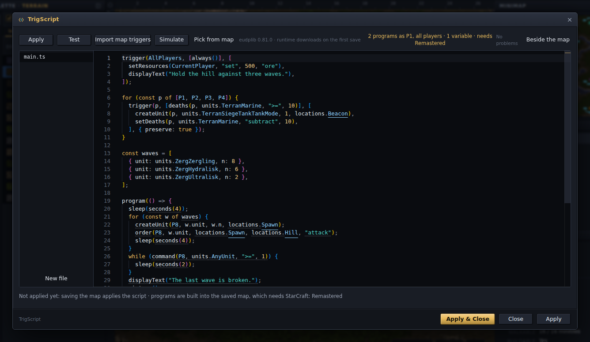

### Opening the script

Triggers ▸ TrigScript… opens the map's script in a window laid out the way VS Code is,
with the same keys. The **Explorer** on the left holds the script's files as a tree —
`main.ts` is where the script starts, the *New file* and *New folder* icons add to it, and
a row's pencil and bin rename and remove it — and, under them, the script's programs with
their variables. A file or a folder is moved by dragging it onto a folder, or by renaming
it with a folder before its name, and the `import`s that pointed at what moved are
rewritten with it; the notice that says so has an **Undo**. No folder means anything to
TrigScript: `tests/` is a habit, not a rule. The strip at the far left switches the
sidebar between the Explorer and **Testing**, the script's [own tests](#tests). Open
files are tabs over the code, and the icons right of the tabs are what you run: **Play**
(F5), **Simulate** (Ctrl+F5), **Apply** (Ctrl+Shift+B), *Pick from map*, the switch to
[beside the map](#beside-the-map), and **…** for the rest. F1 lists every command. Edits
are saved into the map as you type — the files are members of the map archive, like a
sound — and Ctrl+S saves the map from here too.

The code is checked as you type, against the map's own names: `locations.` completes to
the locations the map has, `units.` to every unit type (and the map's custom names),
`switches.` to the switches by number and by the names the map gives them, and
`players.` to the forces. A location passed where a unit belongs is an error as you type
it, and so is a name the map no longer has. The status bar along the bottom counts the
problems, and a click on the count opens **Problems**, the list of them, under the code
(Ctrl+J shows and hides that panel).


There is no build to remember. **Saving the map applies the script**, and so do Test Map
and anything else that takes the map out of the editor: the script runs, the triggers it
recorded go into the map as one contiguous block of the trigger list (replacing the
previous block, or adding the first), and its programs, if it has any, are built into the
file being written. If the script has an error the map is saved anyway, with the triggers
from the last script that worked, and a notice names the file and the line.

**Apply** does the first half when you ask, which is how to look at the triggers in the
Trigger Editor without saving; the status bar says whether the script's triggers are in
the map, and a click there applies it as well. **Play** applies the script, builds the map
exactly as Save would and hands it to [Test Map](#test-map), which starts it in the game.
What each of them reported is kept under **Output**.
The Trigger Editor shows the script's triggers with a `script` badge and will not edit
them; *Open TrigScript* there jumps to the file and line that made one. The Text Trigger
Editor fences them in comments. Hand-made triggers around the block are left alone, and a
hand-made trigger inserted before the block just moves it along.

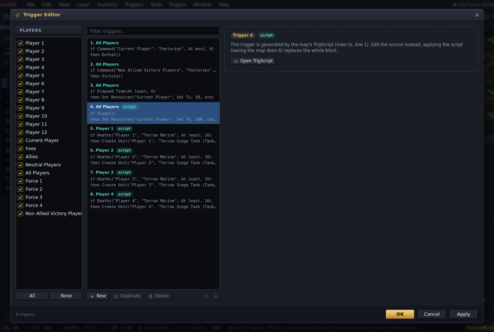

Editing one of the script's triggers by hand makes the block *stale*, and the editor says
so at the next open: how many of its triggers are still the script's and how many were
changed. The next Apply replaces the unchanged ones and keeps the edited ones as
hand-made triggers right after the block, so a wave system tuned in one trigger does not
come back twice; *Append instead* on the notice leaves them all alone and adds a fresh
block after them. While a block is stale, saving leaves the script unapplied and says so.
**Import map triggers** goes the other way: it rewrites the map's hand-made triggers as
`trigger()` calls, in their order, so a map made in the Trigger Editor can carry on as a
script.

**Simulate** runs the script for 480 frames, twenty seconds of the game at Fastest, in a
built-in interpreter and lists, under the code, every action that ran, with its frame and
the source line, and the final value of every program variable. Triggers and programs run side by side in
one world, so a death count a program sets is seen by a trigger. It models death
counters, switches, preserve, list order, the game's arithmetic and the map's players —
a program or a trigger of a force runs for each of its players, and each line says whose
it is — and it has units: the ones placed on the map to start with, then whatever
`createUnit` makes, `giveUnits` hands over, `moveUnit` moves and `killUnitAt` kills, which
`bring` and `command` count. What it cannot know without the game it leaves out: nothing
walks, nothing fights and nothing is built, so no unit dies unless the script kills it. A
script that waits for the enemy to be dead waits for ever here. It is a check on the
logic; the fight is what [tests](#tests) stand in for, and Play is for.

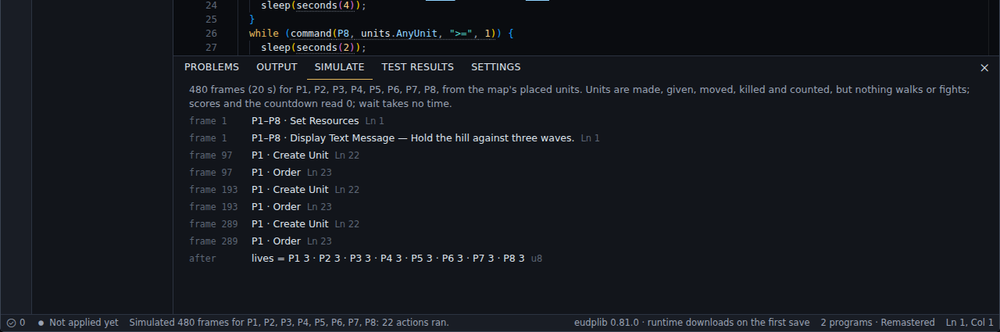

**A map with a program is built when it is saved.** The first time, the eudplib plugin
asks to download its runtime, about 15 MB, once; the desktop app and the container image
carry it. A notice shows while the build runs (a few seconds) with a button to save
without waiting. The file you get is the one to play and to share. It also holds the map
as you see it in the editor, which is what comes back when you open it again, so the
trigger list never fills with generated triggers. One thing changes for the whole map:
the build makes the game run *every* trigger every frame, not every two seconds, the way
hyper triggers do. A preserved trigger that adds a mineral does so twenty-four times a
second in such a map.

The files and a record of the last apply live in the map archive under `trigscript\` —
`main.ts`, any other file, and `build.json` — next to the scenario, so they travel with
the `.scx`. The [Save dialog](#saving) lists them under the archive's other files, each
with a tick, so a copy for release can leave the source out; the triggers stay either
way.

### Tests

A script can test itself. A test is ordinary TypeScript that runs here, in the simulator,
after every change that compiles. It never runs in the game and adds nothing to the map.
If you have used Vitest or Jest, the names are the same ones — `test`, `describe`,
`beforeEach`, `test.only`, `test.skip`, `test.each`, `expect` — imported from
`"trigscript"`.

```ts
import { test, expect } from "trigscript";

// A Marine on the beacon calls the next wave, each bigger than the last.
program(() => {
  let wave = 0;
  while (true) {
    if (countUnits(P1, units.TerranMarine, locations.Beacon) > 0) {
      wave += 1;
      createUnit(P8, units.ZergZergling, wave * 4, locations.Spawn);
      print(`Wave ${wave}`);
      killUnitAt(P1, units.TerranMarine, "All", locations.Beacon);
    }
    sleep(frames(1));
  }
}, { name: "waves" });

test("the second wave is bigger", (sim) => {
  sim.place(P1, units.TerranMarine, locations.Beacon);
  sim.until(() => sim.program("waves").wave === 1);
  sim.place(P1, units.TerranMarine, locations.Beacon);
  sim.until(() => sim.program("waves").wave === 2);
  expect(sim.count(P8, units.ZergZergling, locations.Spawn)).toBe(12);
  expect(sim).toHavePrinted("Wave 2");
});
```

Every test gets `sim`, a world of its own: the map's placed units, locations and players,
the script's programs at their first frame and its triggers beside them, and the same
`random()` every run. What a test does with it:

| | |
| --- | --- |
| `sim.place(player, type, location, count?)`, `sim.kill(unit)`, `sim.remove(unit)`, `sim.give(unit, to)`, `sim.move(unit, to)` | Change the world. `place` hands the units back; `kill` is what a fight is in a test. |
| `sim.frames(n)`, `sim.seconds(n)`, `sim.until(() => …)` | Let the game run. `until` fails the test if it is still not true after 2400 frames, so no test hangs. |
| `sim.press("F2")`, `sim.click()`, `sim.type("-give 100")`, `sim.moveMouse(x, y)` | What a player does, found by the next frame. |
| `sim.count(player, type, location?)`, `sim.units(filter?)`, `sim.resources(player)`, `sim.deaths(player, type)`, `sim.switch(n)` | Read the world back. |
| `sim.program("waves").wave` | A program's variables by their names in the code: numbers, texts, arrays, a record as an object. The program is named by its options, `program(() => { … }, { name: "waves" })`; of a program that runs for several players, `sim.program("lives", P2)`. |
| `sim.printed()`, `expect(sim).toHavePrinted("Wave 2")` | What was shown to the players. |

A test fails when an `expect` does not hold, when it throws, and when a program does what
is always a mistake and the game would pass over in silence, such as reading past the end
of an array. A test that means to see that says `expect(sim).toHaveFaulted()`.

Tests live beside what they test, as above, or in files whose name ends in `.test.ts`, in
any folder. A test file can `import` the script's own functions and test them as plain
TypeScript. It is never part of the map: `main.ts` cannot import one, and a `trigger()` or
a `program()` inside one is an error.

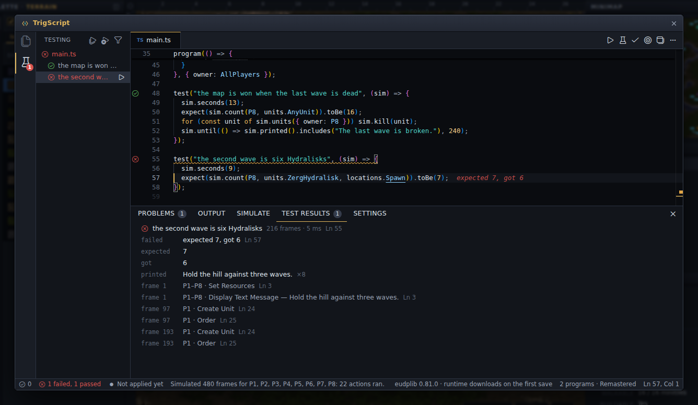

In the editor, every `test(` has a mark in the margin — passed, failed, not run — and a
click on it runs that test. A failure is said where it happened, `expected 7, got 6` at
the end of the line. The **Testing** view lists the tests by folder, file and `describe`,
runs all of them, one of them or the ones that failed, and can show only the failing; the
status bar keeps the count, and **Test Results** under the code has the chosen test's
message, what it printed and what happened frame by frame. Tests run again by themselves
after each change that compiles. A failing test is a warning, not an error: the map still
saves and builds. **Settings ▸ Tests** has a tick, kept in the map, that makes a failing
test refuse the build instead.

### Beside the map

The editor opens two ways. The window is for writing; *Beside the map* — an icon right of
its tabs, or Triggers ▸ TrigScript beside the map — is a panel over the map that blocks
nothing: drag it by its title, resize it by its corner, and keep placing units while the
code sits next to them.

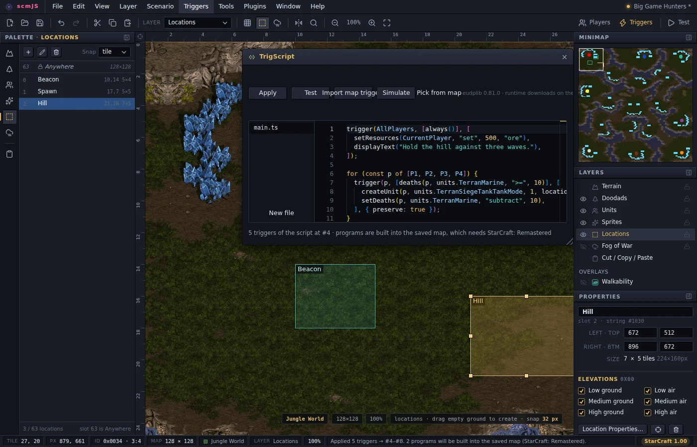

Beside the map, the names in the code and the objects on the map know about each other:

- **Ctrl+click** on `locations.Beacon` scrolls the map to the location and flashes it.
  Hovering the name says where it is and how big.
- **Pick from map** (the target icon, or a right-click in the code): click a location or a
  unit on the map, and its name (`locations.Beacon`, `units.TerranMarine`) lands at the
  cursor. From the window, it first moves the editor beside the map.
- When you rename a location or a switch the script mentions, a notification offers to
  **update the references** in every file. It follows the name the way the code does — an
  alias from `import { locations as L }` counts — and leaves comments, strings and
  anything merely spelled the same alone.

### Writing triggers

A trigger is one call:

```ts
trigger(AllPlayers, [
  bring(CurrentPlayer, units.AnyUnit, locations.Beacon, ">=", 1),
], [
  displayText("You found it!"),
  preserve(),
]);
```

`trigger(players, conditions, actions, options?)` records one trigger. `players` is a
player or a list of them; `conditions` and `actions` are lists of what the condition and
action functions return. The options are the execution flags by name: `{ preserve: true }`
is the same as the `preserve()` action, and `disabled`, `ignoreGameEnd` and the rest are
there too.

Every condition and action the game has is a function named after StarEdit's, in camel
case: `bring`, `deaths`, `command`, `accumulate`, `elapsedTime`, `switchIs` (its real name
is a reserved word), `createUnit`, `displayText`, `setResources`, `moveUnit`, `order`,
`runAiScript`, `victory`. The arguments come in the order the Trigger Editor shows them,
and the ones the editor offers as a list are short words: `">="`, `"<="`, `"=="` for a
comparison; `"set"`, `"add"`, `"subtract"` for a modifier; `"set"`, `"clear"`,
`"toggle"`, `"randomize"` for a switch; `"ore"`, `"gas"`, `"oreAndGas"` for a resource;
`"move"`, `"patrol"`, `"attack"` for an order. A unit count is a number or `"All"`.
StarEdit's own labels (`"At least"`) are accepted as well. `not(condition)` is the
opposite of a condition where one condition can say it: `not(bring(…, ">=", 1))` is "at
most 0". Hover any of them in the editor for its arguments.

Names come from the map. Each display name becomes an identifier — `Terran Marine` is
`units.TerranMarine`, `Terran Siege Tank (Tank Mode)` is
`units.TerranSiegeTankTankMode` — and the display name itself still works as an index,
`units["Terran Marine"]`. `P1` … `P12`, `CurrentPlayer` and `AllPlayers` are constants,
and the other groups are under `players`: `players.Force1`, `players.Foes`,
`players.Allies`. A raw number works wherever a name does, which is how an EUD player or
an odd unit id gets in.

The script is a program that runs when it is applied, and everything TypeScript offers at
that moment is fair game. A loop makes the same trigger for several players; a function
returns a list of actions; a table holds the numbers; a template string builds the text:

```ts
function reinforce(p: Player) {
  return trigger(p, [deaths(p, units.TerranMarine, ">=", 10)], [
    createUnit(p, units.TerranSiegeTankTankMode, 1, locations.Spawn),
    setDeaths(p, units.TerranMarine, "subtract", 10),
    displayText("Reinforcements have arrived."),
  ], { preserve: true });
}

for (const p of [P1, P2, P3, P4]) reinforce(p);
```

Nested lists are flattened and `false`, `null` and `undefined` entries are skipped, so a
helper can return a list of actions and a condition can be written `hardMode && bring(…)`.
What the script records is what the map gets, and the order of the `trigger()` calls is
the order of the triggers.

A condition is a *value* here — the game tests it later — so `if (bring(…))` outside a
program does not do what it looks like, and the editor says so and where the test belongs:
in a trigger's conditions, or in an `if` inside a program.

A script can be several files. `import { x } from "./name"` brings in another file of the
map's script; nothing else can be imported. The library is available as globals, so no
import is needed, and also as the module `"trigscript"` for anyone who prefers
`import { trigger, bring } from "trigscript"`.

`hyperTriggers(P8)` anywhere in the script emits the classic three preserved triggers of
sixty-two waits, so the whole trigger list runs every frame instead of every two seconds.
Give them to a player whose other triggers never wait — a computer slot, usually — since
a Wait stalls every trigger of that player. A map with a program does not need them: its
build already makes the list run every frame.

### Programs

Everything inside `program(() => { … })` runs in the game:

```ts
program(() => {
  let wave = 0;
  let alarm = false;
  while (true) {
    if (bring(P1, units.AnyUnit, locations.Beacon, ">=", 1) && !alarm) {
      alarm = true;
      displayText("They are coming.");
    }
    if (alarm) {
      createUnit(P8, units.ZergZergling, 4, locations.Spawn);
      wave += 1;
    }
    if (wave >= 10) defeat();
    sleep(seconds(20));
  }
}, { owner: P1 });
```

**A program runs every frame, from where it left off.** Its body runs until it reaches a
`sleep()` or its end, all within one frame of the game, and the next frame it carries on
from there. A body that ends stops for good. So the loop above is a game loop: it looks
at the beacon, sends a wave if the alarm is up, and sleeps twenty seconds.

**Variables** hold numbers, booleans, texts and units of the game, and a
`let p = { lives: 3, gold: 0 }` is a variable per field. They live in the game while the map is played and take nothing from
the map: no death counters, no switches, no triggers in the list. Numbers are whole and
signed, as in TypeScript: `a - b` is below zero when `b` is larger, `while (i >= 0)` ends,
and a number below zero is shown with its minus sign. A number runs from −2 147 483 648 to
2 147 483 647 and wraps at either end. A `u8` or `u16` variable (`let lives: u8 = 3`) stays
within 0 … 255 or 0 … 65 535 and stops at both ends, which is what lives and cooldowns
want; a `u32` runs from 0 to 4 294 967 295, for bit masks and hashes, and is kept apart
from a plain number in arithmetic unless `u32(x)` or `i32(x)` says which is meant. `+`,
`-`, `*`, `/` and `%` work between variables, with `Math.min`, `Math.max`, `Math.abs` and
`clamp()`, and so do the bitwise `&`, `|`, `^`, `<<`, `>>` and `>>>`; division is whole and
towards zero, and dividing by a variable that is 0 gives 0. Where the game takes nothing
below zero — hit points, an amount, a unit count — a number below zero goes in as 0.

**Arrays** hold numbers, booleans, texts, units, records or other arrays: `let hp = [10, 20, 30]`, `new Array(12).fill(3)`, an
index that is a constant or a variable (`hp[i] += 7`), `.length`, `for (const x of xs)`,
`fill`, `includes` and `indexOf`. An array that something pushes to grows —
`const queue: number[] = []; queue.push(x); queue.pop() ?? 0` — with no size to declare: the
cells come from a pool the map's programs share, and the workspace's **Settings** view
(Ctrl+,) sets how large it is, a setting kept in the map. An index past the end reads 0 and
stores nothing, and Simulate says where. An array of records — `let waves = [{ count: 4,
delay: 2 }]`, `waves[i].count += 1`, `waves.push({ … })` — hands out its records by
reference, as TypeScript does, and an array of units (`const squad: Unit[] = []`,
`squad.push(u)`) may be kept across a `sleep()`. A record in an array may hold a unit, a text, an array of its own
(`squads[i].members.push(u)`) or another record. An array of arrays is a grid —
`let grid = [[0, 0, 0], [0, 0, 0]]`, `grid[y][x] += 1` — or rows that each grow
(`buckets[i].push(v)`), and `const names: string[] = []` is an array of texts. A list made
outside the program — `const price = [50, 100, 150]`, or a wave table of records — can be
looked up with a variable: `price[level]`, `waves[wave].count`.

**The array methods that take a function** are there, written as in TypeScript: `forEach`,
`some`, `every`, `find`, `findIndex`, `reduce`, `map`, `filter`, `sort` and `reverse`, and
chains of them. `filter` over the units of the game is how to keep some of them:

```ts
program(() => {
  while (true) {
    // The three most hurt units at the base get 20 hit points, every two seconds.
    const hurt = unitsAt(locations.Base, { owner: CurrentPlayer }).filter((u) => u.hp < u.maxHp);
    hurt.sort((a, b) => a.hp - b.hp);
    for (const u of hurt.slice(0, 3)) u.heal(20);
    sleep(seconds(2));
  }
}, { owner: AllPlayers });
```

The function is written into the loop the method becomes, so it costs nothing and sees the
program's variables — and for the same reason it cannot be kept in a variable: write it
where it is used, or name a `function`. `sort` wants its function (`(a, b) => a - b`), runs
within the frame, and is nothing for dozens of items and felt for hundreds every frame; the
end of the line says *sorts in the frame*. `slice`, `concat`, `toSorted`, `toReversed` and
`Array.from` make copies. Patterns and spread work as well: `const { x, y } = mouse(P1)`,
`for (const { count, delay } of waves)`, `[a, b] = [b, a]`, `[...xs, 7]`,
`waves.push({ ...w, count: 9 })`.

**Tables keyed by an id of the game** are arrays with a cell for every id, so a key of the
game is one read: `const bounty: Record<UnitType, number> = { [units.ZergZergling]: 5 }` and
`bounty[u.type]`, `new Map<UnitType, number>()` with `get` (`?? 0` for a key never set),
`set`, `has`, `delete`, `clear` and `size`, `new Set<UnitType>()` with `add` and the same;
`for (const [key, value] of lost)` goes through the keys that are there.
The keys are unit types, players, locations, switches, weapons, upgrades or technologies.

**A `Map` and a `Set` over any number, or over units**, are for keys that are no id of the
game: `new Map<number, number>()` for a tile packed into one number, `new Map<Unit,
number>()` for a cooldown a unit, `new Set<Unit>()` for the units already dealt with. They
go through their keys in the order the keys went in, as JavaScript's do. A key is looked
for, a few steps where a table keyed by ids of the game is one read, and the values are
numbers or booleans. A unit that died stays an entry until it is deleted; in a loop over
the map it reads as no unit, which is the moment to delete it.

**Control flow is what it says.** `if`/`else`, `while`, `do`, `for`, `switch`, `break`,
`continue` and `c ? a : b` all work. Conditions go in an `if` or a `while`; actions stand
as statements. A loop runs all its rounds at once, within the frame, which has one
consequence to keep in mind: a loop that never ends and never sleeps would freeze the
game. The editor refuses one and says where to put `sleep(frames(1))`. A `for` whose
bounds are known when the script is applied is unrolled, and the editor says so at the
end of the line.

**Time is `sleep`.** `sleep(seconds(15))` gives the frame back and carries on that much
later, while other programs and the map's triggers go on. `frames(n)` is the game's own
clock, a second is twenty-four frames at Fastest, and `minutes()` is there too.
Something that runs on its own clock is another program — one program per concurrent
activity. The game's own `wait()` is allowed but is a different thing: it stalls every
trigger of that player, so use it for a short pause (a text, then a sound) and `sleep`
to pass time.

**Edges.** `if (rose(bring(…)))` is true on the frame the condition becomes true and not
again until it has been false in between; `once(…)` is true the first time only.
`random()` is a coin toss, and `random(n)` a whole number from 0 to n − 1.

**Reads: what the game holds is a value.** Every condition that compares a quantity is
also a read of it when the comparison and the amount are left out, and a read goes
wherever a number goes:

```ts
program(() => {
  let price = 50;
  while (true) {
    if (minerals(CurrentPlayer) >= price * 2 && bring(CurrentPlayer, units.AnyUnit, locations.Beacon) >= 1) {
      setResources(CurrentPlayer, "subtract", price, "ore");
      createUnit(CurrentPlayer, units.TerranMarine, 1, locations.Spawn);
      price += deaths(CurrentPlayer, units.TerranMarine);
    }
    sleep(seconds(1));
  }
}, { owner: AllPlayers });
```

`deaths(p, unit)`, `kill(p, unit)`, `bring(p, unit, location)`, `command(p, unit)`,
`accumulate(p, resource)`, `score(p, kind)`, `countdownTimer()` and `elapsedTime()` all
read this way, and the common ones have plainer names: `minerals(p)`, `gas(p)`,
`countUnits(p, unit, location?)`, `kills(p, unit)`, `countdown()`, `elapsed()` — those two
in the game's own seconds, which at Fastest pass about one and a half times as fast as
the seconds of `sleep`. A read means what its condition means — a force's minerals are the force's sum, `units.Men`
counts what Bring counts — and it is taken when the line runs, so `let ore =
minerals(P1)` keeps the number and `minerals(P1)` written twice reads twice. What to read
— the player, the unit, the location — is fixed when the script is applied. About the
players themselves there are `race(p)` (compare it with `races.Zerg`, `.Terran`,
`.Protoss`), `slot(p)` (`slots.Human`, `.Computer`, `.Empty`), `isHuman(p)`,
`hasLeft(p)` and `supply(p, "used" | "max" | "provided")` as the top bar shows it.

**The units on the map are objects.** A loop runs over the ones that match, a pick finds
one, and a unit has properties and things it can be told:

```ts
program(() => {
  while (true) {
    // Everything Player 2 has on the hill is worn down to half health.
    for (const u of unitsAt(locations.Hill, { owner: P2 })) u.hp = u.maxHp / 2;

    // The Marine nearest the beacon is sent to the base; nobody else moves.
    const scout = nearest(units.TerranMarine, locations.Beacon, { owner: P1 });
    if (scout) scout.order("move", locations.Base);

    sleep(seconds(5));
  }
});
```

`unitsAt(location, filter?)`, `unitsOf(player, filter?)` and `allUnits(filter?)` are what
a `for…of` runs over; `first(filter?)`, `nearest(type, location, filter?)` and
`randomUnit(filter?)` give one unit, or `null` when nothing matches — so the `if (scout)`
is required, and the editor says so when it is missing. A filter is `{ type, owner, at }`;
`units.Men`, `units.Buildings` and `units.Factories` work as a type. A unit has `hp`,
`shields` and `energy` in whole points, `maxHp` and `maxShields`, `owner`, `type`, `x`,
`y`, `kills`, `cooldown`, `resources`, the spell timers (`stim`, `lockdown`, `stasis`, …)
and `invincible`, `burrowed`, `cloaked`, `hallucinated`, `underAttack`. Hit points,
shields, energy, kills, the cooldown, the timers and `invincible` can be written; the
position, the owner and the rest are read only, and the editor marks a write to one as
you type. A unit can be told `order("move" | "patrol" | "attack", location)`,
`give(player)`, `kill()`, `remove()`, `damage(n)`, `heal(n)` — or `{ percent: 50 }` — and
`locate(location)`, which centres a location on the unit so that the ordinary actions can
happen where it stands.

A variable can keep a unit across a `sleep`. Units die, and the game hands a dead unit's
place to the next one made, so every use checks that the unit is still the same one:
once it is gone its numbers read 0 and nothing written or told to it has any effect, and
`if (u)` asks whether it is still there. A loop over units runs within one frame, so a
`sleep` inside one is an error; to take units one at a time, find the next after each
sleep. Each loop and each pick looks through all of the game's 1700 unit slots when its
line runs, which is nothing a few times a second and worth a thought every frame: the
editor writes *scans units* at the end of such a line.

**`stats()` reaches the game's own tables**: what a unit type costs, what a weapon does,
which upgrades a player has.

```ts
program(() => {
  stats(units.TerranMarine).minerals = 25;
  stats(units.TerranMarine).speed = 6.5;               // pixels a frame; a Marine walks at 4
  stats(units.ZergZergling).name = "Dog";
  stats(weapons.GaussRifle).damage += 2;
  stats(P1).upgrades[upgrades.TerranInfantryWeapons] = 3;
  stats(P3).color = "teal";
});
```

A field reads as a number (or true / false) and takes `=` and `+=`. Unit types, weapons
(`weapons.`), upgrades (`upgrades.`), technologies (`techs.`) and players each have their
own fields, and the completion list after the dot is the list: only what was played and
seen working in Remastered is offered, and the hover on each field says what it reaches —
most unit-type fields apply to units made after the write, a weapon's to every unit
using it, a colour at once. A write lasts for the game.

**What the players do** is there to read: a key, a mouse button, where the mouse is, and
what a player types.

```ts
program(() => {
  while (true) {
    if (keyPressed(CurrentPlayer, "F8")) createUnit(CurrentPlayer, units.TerranMarine, 1, locations.Anywhere);

    if (clicked(CurrentPlayer, "right")) {
      const at = mouse(CurrentPlayer);
      displayText(`You clicked at ${at.x}, ${at.y}.`);
    }

    const m = chatted(CurrentPlayer, "-spawn {n} {what:unit}");
    if (m) createUnit(CurrentPlayer, m.what, m.n, locations.Anywhere);

    underMouse(CurrentPlayer, { owner: CurrentPlayer })?.heal(10);
    sleep(frames(1));
  }
}, { owner: AllPlayers });
```

A key, a click and a typed line are true on the one frame they arrive, so look for them
in a loop that sleeps one frame at a time. `keyPressed` is true once per press — not
while the key is held, and not while the player is typing a message. `mouse(p)` is the
place on the map under the player's cursor, in pixels (32 to a tile);
`centerLocation(location, x, y)` moves a location there, so that a unit can be created
under the cursor, and `underMouse(p)` is the unit nearest the cursor, or `null`.

`chatted(p, pattern)` is `null` until the player sends a line that fits the pattern, and
then holds what the pattern read out of it. The pattern's own words are matched exactly
and the whole line has to fit; `{n}` reads a whole number, `{what:unit}` a unit type by
its name (the rest of the line, so it comes last) and `{kind:ore|gas}` one of the listed
words, as its place in the list. The editor knows the names in the pattern: after `m.` it
offers `n` and `what`, and nothing else. A pattern starts with a word of its own, such as
`-spawn`, so ordinary talk is left alone. A game played in single player has no chat, so
try typed lines in a multiplayer game — hosting one alone is enough.

All of this reaches every player's computer in step, a few frames after it happens. It
costs the map a little, and only when a program reads input: one free location among the
first 63 (nine when the mouse is read; the script is told when there is no room), and
the Valkyrie and Player 12, which carry the input between computers and must be left
alone.

**A text can hold the program's numbers.** Write it as a template literal:

```ts
program(() => {
  let wave = 0;
  while (true) {
    wave += 1;
    displayText(`Wave ${wave}: you have ${minerals(CurrentPlayer)} ore, ${name(CurrentPlayer)}.`);
    print(`${color(P1)}${name(P1)}\x01 leads with ${kills(P1, units.AnyUnit)} kills`, { to: AllPlayers, position: "center" });
    sleep(seconds(30));
  }
}, { owner: AllPlayers });
```

`name(p)` is the player's name and `color(p)` the colour code of their colour, filled in
by the game. `displayText` shows the text to the current player, as it always has;
`print(text, { to, position })` shows it to someone else — a player, `AllPlayers`, a
force — or, with `position: "center"`, on the line in the middle of the screen where the
game's own messages appear.

**A text is a value.** A `string` variable holds one, a function takes and returns one, a
record has one for a field, and there is no length to declare:

```ts
program(() => {
  let shown = "";
  while (true) {
    const slain = kills(P1, units.AnyUnit);
    const rank = slain >= 50 ? "Veteran" : slain >= 10 ? "Soldier" : "Recruit";
    const line = `${rank}: ${slain} kills, ${Math.max(50 - slain, 0)} to go`;
    if (line != shown) { setMissionObjectives(line); shown = line; }
    sleep(seconds(1));
  }
});
```

Texts take `+`, `+=`, templates, the comparisons, `length`, `s[i]`, `slice`, `indexOf`,
`includes`, `startsWith`, `endsWith`, `padStart`, `padEnd`, `repeat` and
`for (const ch of s)`; a character is a character, so `"저글링".length` is 3. The
objectives, a leaderboard's label, a transmission's line and a unit type's name
(`stats(units.ZergZergling).name = …`) take a text the program made, up to 255 bytes; what
is on the screen is the text as it was when the action ran, so run the action again when
the text changes, as above. A made text holds 1 023 bytes and is cut off past that, which
the game says once in red. `split`, `replace`, `trim` and `parseInt` are not there: keep a
number beside the text it was made into.

**Functions** declared inside the program, or made with `game()` in any file, run in the
game too. Arguments pass by value, they may return a number, a boolean, a text or a unit —
`function canAfford(price: number) { return gold >= price; }` — and they may sleep. A
function used once is written into the program where it is called; one used more than
once is a single copy in the built map that every call runs, which keeps a script with
helpers small. The end of the function's line says which it got (*called ×3*, *inlined
×2*), and hovering it says why: a function that sleeps, or whose parameter has to be
known when the map is built (the player of `setResources(p, …)`), stays inlined. A
function may call itself — `fib(n - 1) + fib(n - 2)`, a flood fill over an array — as long
as it does not sleep: each run has its own parameters and locals, as in TypeScript. It may
go 1 024 calls deep unless the workspace's Settings says otherwise; a call past that stops
the program, and the game says where. Thousands of such calls within one frame make the
game pause, since each keeps its function's variables while it runs.

**Classes** are TypeScript's, declared inside the program: fields, a constructor, methods,
`get` and `set`, `static`, `private`, `extends` with `super`.

```ts
program(() => {
  class Wave {
    left: number;
    constructor(public unit: UnitType, count: number) { this.left = count; }
    get done() { return this.left == 0; }
    send() {
      createUnit(P8, this.unit, 1, locations.Spawn);
      this.left--;
    }
  }
  const waves = [new Wave(units.ZergZergling, 12), new Wave(units.ZergHydralisk, 6)];
  for (const w of waves) {
    print(`${w.left} are on their way`, { to: AllPlayers });
    while (!w.done) { w.send(); sleep(seconds(1)); }
    sleep(seconds(30));
  }
  victory();
});
```

An instance is a record and a method a function handed the instance, so what holds for
functions holds for methods. Which class an instance is, is settled when the script is
applied — nothing of a class is left in the game — and the limits follow from that: an
array of instances holds one class, a function can give back an instance only when every
`return` gives the same one (`return this`, so calls chain, or `return new Wave(…)`), and a
class a program writes to is declared inside it.

**A program runs for its owner** (Player 1 unless `{ owner: … }` says otherwise), as that
player, while that player is in the game. `AllPlayers`, a force or a list of players
makes a **per-player program**: the same code runs for each of those players who is in
the game, computers included, `CurrentPlayer` is that player, and every variable is per
player, each with their own copy — which is how lives, scores and cooldowns are written
once. `let total = shared(0)` is one value they all share.

**Everything the body reads from outside is computed when the script is applied.** A
constant, a helper, a condition, an action: each is worked out once, when the script
runs, and the editor underlines those parts with dots so the boundary is visible as you
type. That is what lets a helper written outside the program supply actions inside it.
It is also the one rule to keep in mind: a program variable cannot reach a condition, an
action or a helper, because those were computed before the game started. The exceptions
are the amount of `setResources`, `setDeaths`, `setScore` and `setCountdownTimer`, the
unit count of `createUnit`, `killUnitAt`, `removeUnitAt` and `giveUnits` and an action's
unit type, which can be variables or expressions over them, and a text: `displayText` and
`print` take any text the program made, and so do the objectives, a leaderboard's label, a
transmission and a unit type's name.

### TrigScript beside TypeScript

Outside `program()` there is nothing to compare: the script is TypeScript, checked by the
TypeScript compiler and run when it is applied, with the whole language and its standard
library. This table is about the inside of a program, where what is written has to become
something the game can do. *Same* means it is written and behaves as in TypeScript; what
differs is said, and what is missing is refused with a message as you type, never passed
over in silence.

| TypeScript | In a program | What is different |
| --- | --- | --- |
| Types: annotations, `interface`, `type`, unions of literals, tuples, generic functions, `as`, `!` | Same | Erased, as in TypeScript. Some decide how a value is kept: `u8`, `u16` and `u32` are widths, and a `Map<UnitType, V>` is kept differently from a `Map<number, V>`. A class takes no type parameters. |
| `let`, `const`, `var` | Same | A variable needs a first value (`let n = 0`). A `const` the script already knows is worked out when the script is applied and takes nothing from the map. |
| `number` | Different | A whole number of 32 bits, signed, wrapping at its ends. No fractions, no `NaN`, no `bigint`. `/` is whole division towards zero, and dividing by 0 gives 0. `u8` and `u16` (which stop at their ends) and `u32` are added. |
| `boolean` | Same | Assigned with `=` only: no `\|\|=` or `&&=`. |
| `string` | Mostly | A value with no length to declare. `length`, `s[i]` and `slice` count characters, so they differ from JavaScript only for an emoji or a rare ideograph. A made text holds 1 023 bytes. No `split`, `replace`, `trim`, `toUpperCase`, `parseInt` or regular expressions. |
| `null`, `undefined` | Units only | `Unit \| null` is real: `first(…)`, `if (u)`, `u?.kill()`. A number, a boolean or a text is never either, so where JavaScript would give `undefined` — `pop()`, `find()`, `get()` — say what it is then: `xs.pop() ?? 0`. No optional fields or parameters (`y?: number`); a parameter's default (`y = 1`) is there. |
| Operators: `+ - * / %`, comparisons, `&&` `\|\|` `!`, `c ? a : b`, the bitwise ones, `??`, `?.`, `++` `--`, the compound assignments | Same | `==` and `===` are one thing, since nothing is coerced. Missing: `**`, `typeof`, `in`, `delete`. |
| `if`, `while`, `do`, `for`, `for…of`, `switch`, `break`, `continue` | Same | A loop runs all its rounds within one frame of the game, so one that never ends must `sleep()` on every path — also a `while (true)` that is only left by a `break`. No `for…in`, no labels. |
| Functions: parameters by value, defaults, rest parameters, recursion, generics | Same | A function that calls itself cannot `sleep()` and has a depth limit. One declared inside another does not see the outer one's variables, only the program's. It returns a number, a boolean, a text, a unit or an instance — not a record or an array it made: hand it the one to fill in. |
| Arrow functions, closures, functions as values | Callbacks only | An arrow is written where a method takes it — `xs.map((x) => x + bonus)` — and sees every variable in reach. It cannot be kept in a variable, an array, a field or a return value. |
| Object literals | Records | A variable a field: nested, passed by reference, spread, taken apart by patterns. The shape is fixed: no `p[key]` with a key that varies, no methods on a literal (a class has them), no `Object.keys`. |
| Destructuring and spread | Same | `...rest` takes the tail of an array of numbers or booleans. |
| Arrays | Mostly | Fixed or growing; of numbers, booleans, texts, units, records, instances and arrays. `push`, `pop`, `length`, `fill`, `includes`, `indexOf`, the methods that take a function, `sort`, `reverse`, `slice`, `concat`, `toSorted`, `toReversed`, `join` of texts, `Array.from`. No `shift`, `unshift`, `splice`, `at` or `flat`, and `map` makes numbers or booleans. `sort` wants its function. An index past the end reads 0 and stores nothing. `const b = a` is not a second name for an array. |
| Classes: fields, constructor, methods, `get` / `set`, `static`, `private`, `readonly`, `extends`, `super`, `abstract`, `implements`, `instanceof` | Same | Declared inside the program. The class of every instance is settled when the script is applied: an array of instances holds one class, and a function gives back an instance only when every `return` gives the same one. No decorators, no class written as a value. |
| `Map`, `Set` | Mostly | Keys are numbers, units or ids of the game; values are numbers or booleans. They go through their keys in the order the keys went in, as JavaScript's do — a table keyed by ids of the game goes by id. |
| `enum` | Outside | Declared above the program, its members are numbers a program can use. |
| `try` / `catch` / `throw` | Missing | The game has no exceptions. What is always a mistake — an index past the end, no room left for an array, a function that called itself too deep — the game says in red, and Simulate lists. |
| `async` / `await`, promises, generators, timers | Missing | `sleep()` is how a program waits. Something on its own clock is another `program()`. |
| `import` | Same | Between the script's files, and from `"trigscript"`; nothing else. A function that another file's program calls is made with `game()`. |
| The standard library | A little | `Math.min`, `Math.max`, `Math.abs`, `String(n)`, `Array.from`, `new Array(n).fill(v)`. `print()` stands in for `console.log` and `random(n)` for `Math.random()`. No `JSON`, `Date` or `Object.*`, and no `Math.sqrt` on a variable: look the value up in a list the script worked out. |
| — | Added | What TypeScript has no word for: `sleep`, `rose` and `once`, reads of the game (`minerals(p)`), units as objects and loops over them, `stats()`, keys, the mouse and chat, `shared()`, per-player programs. |

### Examples

Each of these is a complete `main.ts`. They assume a map with locations named `Beacon`,
`Spawn`, `Base`, `Hill` and `Shop`; use your own names, and the editor completes them.

**Starting resources and a welcome.** The simplest trigger: no preserve, so it runs once,
and `CurrentPlayer` means each player in turn.

```ts
trigger(AllPlayers, [always()], [
  setResources(CurrentPlayer, "set", 500, "ore"),
  setResources(CurrentPlayer, "set", 100, "gas"),
  displayText("Hold the hill for five minutes to win."),
]);
```

**Hyper triggers.** One line, and the whole trigger list runs every frame. Player 8 is
the computer slot here, and nothing else in the script makes that player wait. For a map
of plain triggers; a map with a program runs every frame already.

```ts
hyperTriggers(P8);
```

**Something for every player.** A helper returns the trigger; a loop calls it. Death
counts are the game's own counters, and subtracting ten after the reward makes the
trigger fire again at the next ten, which `preserve: true` allows.

```ts
function reinforce(p: Player) {
  return trigger(p, [deaths(p, units.TerranMarine, ">=", 10)], [
    createUnit(p, units.TerranSiegeTankTankMode, 1, locations.Spawn),
    setDeaths(p, units.TerranMarine, "subtract", 10),
    displayText("Reinforcements have arrived."),
  ], { preserve: true });
}

for (const p of [P1, P2, P3, P4]) reinforce(p);
```

**A shop.** Bring a civilian to the shop with enough minerals, and four marines appear
at the spawn. The civilian is moved out first, so the trigger does not fire again on the
next cycle, and `price` is an ordinary constant used twice.

```ts
const price = 150;

trigger(AllPlayers, [
  bring(CurrentPlayer, units.TerranCivilian, locations.Shop, ">=", 1),
  accumulate(CurrentPlayer, ">=", price, "ore"),
], [
  moveUnit(CurrentPlayer, units.TerranCivilian, 1, locations.Shop, locations.Spawn),
  setResources(CurrentPlayer, "subtract", price, "ore"),
  createUnit(CurrentPlayer, units.TerranMarine, 4, locations.Spawn),
  displayText(`Four marines for ${price} minerals.`),
], { preserve: true });
```

**Waves from a table.** The table is ordinary data; the program walks it, one wave every
forty-five seconds, then waits for the last attacker to die. `for … of` over a list known
when the script is applied is unrolled, so `w.unit` and `w.n` are plain values in each
copy. The program runs as Player 1, so `victory()` is Player 1's; a team needs a
`trigger()` for the others. This one, and every example below with a `program`, makes a
map for StarCraft: Remastered.

```ts
const waves = [
  { unit: units.ZergZergling, n: 8 },
  { unit: units.ZergHydralisk, n: 6 },
  { unit: units.ZergUltralisk, n: 2 },
];

program(() => {
  displayText("The first wave arrives in thirty seconds.");
  sleep(seconds(30));
  for (const w of waves) {
    createUnit(P8, w.unit, w.n, locations.Spawn);
    order(P8, w.unit, locations.Spawn, locations.Base, "attack");
    minimapPing(locations.Spawn);
    sleep(seconds(45));
  }
  while (command(P8, units.AnyUnit, ">=", 1)) {
    sleep(seconds(2));
  }
  displayText("The last wave is broken.");
  victory();
});
```

**Lives, per player.** One program, run for every player: `lives` is a separate counter
for each. When the hero dies the game's death count for it goes to 1; the program resets
that count, takes a life, and either brings the hero back or ends the game for that
player. The `sleep(frames(1))` at the end of the loop is what makes it a game loop: look
once a frame.

```ts
program(() => {
  let lives: u8 = 3;
  while (true) {
    if (deaths(CurrentPlayer, units.JimRaynorMarine, ">=", 1)) {
      setDeaths(CurrentPlayer, units.JimRaynorMarine, "set", 0);
      lives -= 1;
      if (lives == 0) {
        displayText("No lives left.");
        defeat();
      } else {
        createUnit(CurrentPlayer, units.JimRaynorMarine, 1, locations.Spawn);
        displayText("Your hero returns.");
      }
    }
    sleep(frames(1));
  }
}, { owner: AllPlayers });
```

**King of the hill.** A point a second for holding the hill alone, shown on a
leaderboard, and a win at a hundred. `points` is a variable of the program and the
amount of `setScore` follows it; `players.Foes` is "anyone at war with the current
player", so the check is written once for everyone.

```ts
trigger(AllPlayers, [always()], [leaderboardPoints("Hill", "custom")]);

program(() => {
  let points: u16 = 0;
  while (true) {
    if (bring(CurrentPlayer, units.AnyUnit, locations.Hill, ">=", 1)
        && !bring(players.Foes, units.AnyUnit, locations.Hill, ">=", 1)) {
      points += 1;
      setScore(CurrentPlayer, "set", points, "custom");
      if (points >= 100) {
        displayText("The hill is yours.");
        victory();
      }
    }
    sleep(seconds(1));
  }
}, { owner: AllPlayers });
```

**Random events.** Every two minutes, a coin toss decides which of two things happens.
`random()` is the coin; `else` is the other side of it.

```ts
program(() => {
  while (true) {
    sleep(minutes(2));
    if (random()) {
      displayText("Reinforcements pour from the nydus canal.");
      createUnit(P8, units.ZergZergling, 12, locations.Spawn);
    } else {
      displayText("A supply drop: 100 minerals for everyone.");
      setResources(AllPlayers, "add", 100, "ore");
    }
  }
});
```

**A beacon that opens a gate, once.** `rose()` fires on the frame the condition becomes
true, `once()` only the first time it does, so this runs exactly once however long the
unit stands there. Two things happen on their own clocks, so there are two programs.

```ts
program(() => {
  while (true) {
    if (once(bring(P1, units.AnyUnit, locations.Beacon, ">=", 1))) {
      displayText("The gate opens.");
      killUnitAt(P12, units.LeftUpperLevelDoor, "All", locations.Base);
      setSwitch(switches.Switch1, "set");
    }
    sleep(frames(1));
  }
});

program(() => {
  while (true) {
    if (switchIs(switches.Switch1, "set")) {
      createUnit(P8, units.ZergHydralisk, 2, locations.Spawn);
      sleep(seconds(30));
    } else {
      sleep(seconds(1));
    }
  }
});
```

**A heal that each Marine gets once every ten seconds.** A `Map` keyed by units keeps a
number for each of them; a unit that has died reads as no unit in the loop over the map,
which is where its entry is deleted.

```ts
program(() => {
  const wait = new Map<Unit, number>();
  while (true) {
    for (const u of unitsAt(locations.Hill, { owner: P1, type: units.TerranMarine })) {
      if (!wait.has(u)) { u.heal({ percent: 100 }); wait.set(u, 10); }
    }
    for (const [u, left] of wait) {
      if (!u || left <= 1) wait.delete(u); else wait.set(u, left - 1);
    }
    sleep(seconds(1));
  }
});
```

**A map that already has triggers.** Open TrigScript and press **Import map triggers**:
every hand-made trigger comes back as a `trigger()` call in its order, and applying the
script replaces the whole list with what it makes. From there a repeated trigger becomes
a loop, a number used in ten places becomes a constant, and the rest stays as it was.

### Reference

The trigger form and its options:

| | |
| --- | --- |
| `trigger(players, conditions, actions, options?)` | One trigger. `players` is a player or a list; up to 16 conditions and 64 actions. |
| `{ preserve, disabled, ignoreGameEnd, ignoreDisplay, conditionsMet, paused, waitSkipDisabled, flags }` | The options: each execution flag by name, and `flags` for raw bits. |
| `preserve()` | The same as `{ preserve: true }`, as an action. |
| `not(condition)` | The opposite, where one condition can say it: a comparison flips, a switch test flips, `always()` becomes `never()`. "Exactly n" has no opposite and is an error. |
| `disabled(item)` | The condition or action kept in the trigger but switched off, as the Trigger Editor's disable does. |
| `hyperTriggers(owner?)` | The three preserved triggers of sixty-two waits that make the list run every frame. |
| `condition(type, …)`, `action(type, …)` | A record by raw type number and fields, for anything the tables do not know. |
| `memory(address, comparison, value)`, `setMemory(address, modifier, value)` | EUD: the value at a memory address, through the deaths table. |

The words the enumerated arguments take (StarEdit's labels work too):

| Argument | Words |
| --- | --- |
| Comparison | `">="`, `"<="`, `"=="` |
| Modifier | `"set"`, `"add"`, `"subtract"` |
| Switch state, switch action | `"set"`, `"cleared"`; `"set"`, `"clear"`, `"toggle"`, `"randomize"` |
| Resource | `"ore"`, `"gas"`, `"oreAndGas"` |
| Score | `"total"`, `"units"`, `"buildings"`, `"unitsAndBuildings"`, `"kills"`, `"razings"`, `"killsAndRazings"`, `"custom"` |
| Order | `"move"`, `"patrol"`, `"attack"` |
| Alliance | `"enemy"`, `"ally"`, `"alliedVictory"` |
| Unit state (doodads, invincibility) | `"enable"`, `"disable"`, `"toggle"` |
| Count | A number, or `"All"` |
| Text display | `displayText(text)` always displays; `displayText(text, false)` follows the game's message setting |

The names:

| | |
| --- | --- |
| `P1` … `P12`, `CurrentPlayer`, `AllPlayers` | Constants. |
| `players.` | Every player group: `Force1` … `Force4` (and the force's own name), `Foes`, `Allies`, `Neutral`, `NonAlliedVictory`, and the twelve players again. |
| `units.` | Every unit type by StarEdit name as an identifier (`TerranMarine`) or a string index (`units["Terran Marine"]`), and by the custom name the map gives it. `AnyUnit`, `Men`, `Buildings`, `Factories` are there. |
| `locations.` | The map's locations by name; `Anywhere` and `NoLocation`. |
| `switches.` | `Switch1` … `Switch256`, and any name the map sets. |
| `aiScripts.` | The AI scripts by StarEdit name; a four-letter code as a string works too. |
| `weapons.`, `upgrades.`, `techs.`, `colors.` | The game's weapons, upgrades and technologies, for `stats()`; the player colours. |
| A number | Accepted wherever a name is: an EUD player, an unlisted unit id. |

Inside a program:

| | |
| --- | --- |
| `program(body, options?)` | Code that runs in the game; the map then needs StarCraft: Remastered. The one option is `owner`: a player, `AllPlayers`, a force, or a list — the last three run it once per player. |
| `game(fn)` | A function that runs in the game, for programs to call; it can live in any file and be imported. |
| `let n = 0`, `let f = false`, `let s = ""`, `let u: Unit \| null = null`, `let p = { … }` | A number, a boolean, a text, a unit of the game, a record of them. `const` is a value worked out when the script is applied, when it can be. |
| `u8`, `u16`, `u32` | The declared range of a number variable that is never below zero: `let lives: u8 = 3` stops at 0 and at 255; a `u32` wraps at 4 294 967 295. A plain `number` is signed. |
| `u32(x)`, `i32(x)` | The same 32 bits read the other way, for where a `u32` meets a plain number. |
| `number[]`, `boolean[]`, `string[]`, `{ … }[]`, `Unit[]`, `number[][]` | An array of a program; one that is pushed to grows. `push`, `pop`, `length`, `for…of`; of numbers and booleans also `fill`, `includes`, `indexOf`. |
| `forEach`, `some`, `every`, `find`, `findIndex`, `reduce`, `map`, `filter`, `sort`, `reverse` | The array methods that take a function, on arrays and on the units of the game (`unitsOf(P1).filter(…)`). The function is written where it is used. |
| `slice`, `concat`, `toSorted`, `toReversed`, `Array.from`, `[...xs]` | Copies: a new array that grows. |
| `const { x, y } = p`, `const [a, ...rest] = xs`, `[a, b] = [b, a]`, `{ ...p, y: 9 }` | Patterns and spread, in declarations, `for…of`, parameters and assignments. |
| `class`, `new`, `extends`, `get` / `set`, `static` | Classes declared inside the program. An instance is a record; its class is settled when the script is applied. |
| `Record<K, V>`, `Map<K, V>`, `Set<K>` | A table keyed by an id of the game (`UnitType`, `Player`, `Location`, …): a cell for every id. |
| `Map<number, V>`, `Set<number>`, `Map<Unit, V>`, `Set<Unit>` | A table over any number, or over units: keys in the order they went in; values are numbers or booleans. |
| `shared(value)` | In a per-player program, one value for all the players instead of one each. |
| `sleep(duration)` | Give the frame back and carry on later. `frames(n)`, `seconds(n)`, `minutes(n)` make a duration. |
| `rose(condition)`, `once(condition)` | True on the frame the condition becomes true; true the first time only. |
| `random()`, `random(n)` | A coin toss; a whole number from 0 to n − 1. |
| `deaths(p, unit)`, `bring(p, unit, location)`, `score(p, kind)`, … | A comparing condition without its comparison and amount: the number itself. |
| `minerals(p)`, `gas(p)`, `resources(p, kind)`, `countUnits(p, unit, location?)`, `kills(p, unit)`, `countdown()`, `elapsed()` | The same reads by plainer names. |
| `race(p)`, `slot(p)`, `isHuman(p)`, `hasLeft(p)`, `supply(p, of?, race?)` | The player: compare with `races.` and `slots.`; supply `"used"`, `"max"` or `"provided"`, as the top bar shows it. |
| `unitsAt(location, filter?)`, `unitsOf(player, filter?)`, `allUnits(filter?)` | The units a `for…of` runs over; a filter is `{ type, owner, at }`. No `sleep` inside the loop. |
| `first(filter?)`, `nearest(type, location, filter?)`, `randomUnit(filter?)` | One unit, or `null`. |
| `u.hp`, `u.shields`, `u.energy`, `u.kills`, `u.cooldown`, `u.resources`, `u.stim` …, `u.invincible` | Read and written. `u.hp = 0` kills. |
| `u.maxHp`, `u.maxShields`, `u.owner`, `u.type`, `u.x`, `u.y`, `u.orderId`, `u.burrowed`, `u.cloaked`, `u.hallucinated`, `u.underAttack` | Read only. |
| `u.order(kind, location)`, `u.give(player)`, `u.kill()`, `u.remove()`, `u.damage(n)`, `u.heal(n)`, `u.locate(location)` | What a unit can be told; `damage` and `heal` also take `{ percent }`. |
| `stats(unitType)`, `stats(weapon)`, `stats(upgrade)`, `stats(tech)`, `stats(player)` | The game's tables: fields to read, `=` and `+=`. |
| `keyPressed(p, key)`, `clicked(p, button?)` | True on the frame a press arrives. Keys: letters, digits, `"F1"` … `"F12"` (not `"F6"`, which the game keeps to itself), `"Space"`, `"Enter"`, `"Escape"`, the arrows and the rest of the list the editor offers; buttons `"left"`, `"right"`, `"middle"`. |
| `mouse(p)`, `underMouse(p, filter?)`, `centerLocation(location, x, y)` | The cursor's place on the map as `x` and `y`; the unit nearest it (within 48 pixels, or the filter's `within`), or `null`; a location moved onto a point. |
| `chatted(p, pattern)` | `null`, or the values of a typed line: `{n}` a number, `{what:unit}` a unit type, `{kind:ore|gas}` a word's place in its list. |
| `` displayText(`… ${n} …`) ``, `name(p)`, `color(p)` | A text with the program's numbers, a player's name and the colour code of their colour in it, for the current player. |
| `print(text, { to?, position? })` | The same for another player, `AllPlayers` or a force, in the `"chat"` area or the `"center"` line. |
| `string`: `+`, `+=`, `==`, `<`, `length`, `s[i]`, `slice`, `indexOf`, `includes`, `startsWith`, `endsWith`, `padStart`, `padEnd`, `repeat`, `String(n)`, `for (const ch of s)` | A text as a value. The objectives, a leaderboard's label, a transmission and a unit type's name take one the program made. |
| `clamp(x, lo, hi)`, `Math.min`, `Math.max`, `Math.abs`, the bitwise operators | Work on variables. `Math.floor` and its siblings are accepted around a division and change nothing, since division is whole. |
| `wait(ms)` | The game's own Wait: allowed, stalls every trigger of the player, so prefer `sleep`. |

What a program cannot do:

- Play on a version of the game before Remastered. `trigger()` does; a program does not.
- A location or a player is fixed when the script is applied — also in a read; only the
  amounts, the counts, an action's unit type and the texts listed above can follow a
  variable. A sound's path or the next scenario's name is a text written in the script.
- Know that a key is being held, or read a key on a version before Remastered: the game
  reports each press once.
- A condition's own amount cannot be a variable — the game compares a quantity with a
  number it is given — so read the quantity and compare it yourself: `minerals(P1) >= price`.
- Move a unit by writing where it is, cloak it, or change one unit's speed: the game ends
  at a position write and showed nothing for the other two, so they are not offered.
  `order()` and the Move Unit action move units; `stats(type).speed` is a type's speed.
- A boolean has no text of its own (`${alive ? "yes" : "no"}`), and a text has no `split`,
  `replace`, `trim` or `parseInt`.
- Fractions: every number is whole. `Math.sqrt` and the rest of `Math` beyond `min`, `max`
  and `abs` work on what the script knows, not on a variable: look the value up in a list
  the script worked out.
- Keep a function in a variable, an array or a return value; write `function`, or the arrow
  where the method takes it. No `try` / `catch` / `throw` — the game has no exceptions — no
  `async`, no generators, no `for…in`.
- On an array: no `shift`, `unshift` or `splice`; `map` makes numbers or booleans, so push
  texts or records in a `for…of`. A function does not return a record or an array it made:
  hand it the one to fill in.
- Loop for ever without a `sleep()`: the editor refuses it, since the game would freeze.
- No function that calls itself and sleeps, none more than 1 024 calls deep unless the
  workspace's Settings raises it, no `for` unrolled more than 256 times (write a `while`),
  and no number past 2 147 483 647 either way (4 294 967 295 for a `u32`): it wraps.
- A `Map` holds numbers or booleans, and a text is not a key: for anything more, keep the
  place of a row of an array of records in it.
- A program variable cannot reach a helper, a condition or an action, since those were
  computed when the script was applied.

The full description of the language, its compiler and the commands it offers other
plugins is in the plugin's own README at
[scm-js/plugin-trigscript](https://github.com/scm-js/plugin-trigscript).

## Scenario settings

The Scenario menu holds the map's own tables. Each dialog is its own OK / Apply / Cancel
transaction; none of it is in the undo history.

### Map Properties, Players, Forces, Colours


**Map Properties** (Alt+Enter) is the name and description the lobby shows, the tileset,
the size and the revision, with buttons to the rest. Changing the tileset lays the terrain
again with a terrain you pick — tile numbers mean something else in every tileset — and
drops the doodads with it, while units, sprites, locations, fog and triggers stay; or
keep the tile numbers, as SCMDraft does, to see what they draw. **Resize / Crop** grows
or trims the map about a corner or the centre. Both clear the undo history.


**Player Settings** is each slot's controller (Human, Computer, Rescuable, Neutral…),
race, colour and force.


**Force Settings** groups the players into up to four teams and sets, per team, allied
victory, shared vision, allies and random start locations.

**Player Colors** picks each slot's palette colour and, for a Remastered map, a custom
RGB, random, or the player's own choice; the map repaints as you change them.


### Units, upgrades and technology


**Unit Settings**, **Upgrade Settings** and **Technology Settings** edit the cost and
availability tables: a unit's hit points, armour, build time, cost and weapon damage, a
custom name, and which players may build it; an upgrade's cost and levels; a
technology's cost and whether each player starts with it or may research it. A row on
*use default* shows the greyed-out numbers from the game's own data files and seeds itself
from them when you untick it.

### Strings


Every piece of text a map carries — its name, the force names, location names, every
trigger message — is a numbered string, and the **String Editor** lists them all with
where each is used. Edits keep their number, so triggers and locations keep pointing
where they did; *Delete unused* clears out what nothing refers to.

The row of buttons inserts the game's colour codes, each drawn in the colour it produces,
and the preview under the box shows the string the way the game draws it. The same codes
work in every field whose text the game draws: the map name and description, force names,
custom unit names, and the text of a trigger or briefing action — each of those fields
shows the string as the game draws it until you click into it, and has a palette button
at its right-hand end.

The previews follow Remastered's rule, where a colour set on one line carries onto the
next. StarCraft 1.16.1 reset the colour at every line break, so a string written before
the remaster can draw in colours its author never chose; the *1.16.1 colours* tick (also
in Preferences ▸ View) switches every preview to the old rendering, and the Repair
plugin offers to write the reset the old game used to supply.

A map file does not say what encoding its text is in. StarEdit wrote whatever code page
Windows was using — EUC-KR on a Korean machine, Shift_JIS on a Japanese one,
Windows-1252 nearly everywhere else — and 1.16.1 still reads the file that way;
Remastered writes UTF-8 and, reading, tries UTF-8 first and then the code page of the
machine it is running on. The editor guesses the encoding from the file's bytes when a
map opens and shows the guess in **Scenario ▸ Map Revision**, where it can be corrected:
Korean text that opened as garbage is a wrong guess, and choosing *Korean* there fixes
every string at once. The same choice decides how the text is written on save, so a map
made for 1.16.1 on a Korean Windows stays readable there; a new map is UTF-8, and moving
a map to Remastered's STRx table makes it UTF-8 too. A character the chosen encoding
cannot hold is written as `?`, and Check Map and the Save dialog both say so beforehand.

### Sounds and switches

The **Sound Editor** joins the map's sound table with the `.wav` files in the archive:
import, play, remove, and adopt files the archive carries but the table does not list.
Import takes any file the browser can decode (MP3, FLAC, AAC, Ogg, WAV in any encoding)
and writes it as PCM WAV in the format picked next to the button; the default, 22050 Hz
16-bit mono, is what the game's own sounds are, and the smaller presets are for maps
chasing the size limit. A *Play WAV* action then names the file.

**Switches** names the 256 switches triggers set and test, so the trigger editors show
"Gate open" rather than "Switch 3".

## Checking, testing and saving

Before a map is played, it can be checked for common mistakes, tried in the game, and
saved in the form you want to release.

### Check Map


Tools ▸ Check Map looks for what the game would refuse or silently drop: start locations
that do not match the player table, the unit limit (1700), off-map units, a missing or
moved Anywhere, triggers pointing at unused locations or strings past the end of the
table, unit and player values the game does not have, AI scripts it does not ship, Play
WAV actions with no file in the archive, switches tested but never set, and the file's
own health — missing sections, player types where StarEdit's copy disagrees with the
game's, the isometric record. A map with triggers is a scenario, and gets the scenario
checks too: a human player no trigger ever gives Victory or Defeat (in a scenario nobody
wins or loses unless a trigger says so), a missing Set Mission Objectives, and — when
hyper triggers are present — a Wait in another preserved trigger, which stalls that
player's whole trigger queue. Double-click an issue to go to it. The same check runs
inside the Save dialog.

### Test Map


Tools ▸ Test Map (Ctrl+F5) hands the map to the game. Neither StarCraft build opens a map
from the outside, so the editor writes it into a `scmJS` folder under the game's Maps
folder, where Single Player ▸ Custom Game lists it. The desktop app finds the
installation (or takes a folder you pick) and starts the game as well; in Chrome and
Edge the map goes into a folder you pick once, and other browsers download it.

### Saving

Ctrl+S writes the map back where it came from. In Chrome, Edge and the desktop app the
editor keeps a handle to the file it opened, so Save writes in place once the browser has
asked for permission. Firefox and Safari give the editor a file's contents but no way to
write it back, so there every save is a download, and the notice at the bottom right says
so. Save As (Ctrl+Shift+S) and Save Copy As open the Save dialog; a copy is written
without the open map changing its name or file.


The Save dialog asks for a file name, a format and what to keep. Everything else is
folded away underneath and can be left alone:

- **Format**: `.scx` (Brood War), `.scm` (original StarCraft), or a bare `.chk`, the
  scenario alone with no archive around it.
- **What to keep**: *Everything* writes the whole file, so any editor can open it with
  nothing lost. *Smallest that plays* leaves out the parts only an editor reads (the
  isometric record, the editor's copies of the player table and so on) and compresses
  the archive as StarEdit does; the map plays the same, but an editor opening the file
  later has less to work with. *Custom* shows each of those parts with its own tick. The
  map in the editor is not changed either way.
- **Archive** (folded): the compression and StarEdit's encryption tick, and the other
  files in the archive. PKWARE is what StarEdit writes and what Blizzard's own maps are
  stored as, so every StarCraft build reads it; zlib is smaller and needs 1.16.1 or
  Remastered; none is the largest and readable by anything. A map keeps the compression
  it was opened with, and the fold starts open when a map is not stored the usual way.
  The sounds and the files plugins keep in the archive each have a tick, so a copy for
  release can leave them out. A member the editor cannot name — a protected map's
  archive often has no file list — is kept exactly as stored, and the fold says how
  many there are.
- **Sections** (folded): every section the file will hold, with its size and whether it
  changed, was left out or was merged.

If Check Map finds problems, the dialog says how many beside a button that opens it; the
map saves either way.

The options confirmed here are what Ctrl+S reuses for that map from then on.

A plugin that compiles something into the map, as the eudplib plugin does for scripts
that need Remastered, does it while the file is written. The file you save is the one
the game plays, and it carries the map as you see it in the editor inside, which is what
comes back when you open it again. A notice shows while the build runs, with a button to
save without waiting for it. If the build fails, the map is still saved and the notice
says what went wrong; the file then lacks the built part until a later save succeeds.
Test Map builds the same way and stops on a failure instead.

**Save to scmjs.dev…**, under File and under Account, keeps a copy of the map on your
scmjs.dev account as a numbered revision with a note — a backup with a history, and the
way to reach the same map from another machine. It does not change where Ctrl+S writes.
See [Keeping maps on scmjs.dev](#keeping-maps-on-scmjsdev).

### Export an image


File ▸ Export ▸ Image renders the whole map to a PNG, with one dial that decides what
the picture is: at 32 pixels per tile it is the full game art, at 8 or 16 the same
smaller, at 4 and 2 the mean tile colours with units as minimap dots, and at 1 pixel per
tile it is the game's minimap. Units, locations, fog and the grid are each a tick.

Tools ▸ Statistics counts what the map holds — units per player, resources, doodads,
triggers, strings — and Ctrl+F finds a unit, location, sprite, string or trigger by name.

## Your scmjs.dev account

[scmjs.dev](https://scmjs.dev) is the project's own service. An account there does three
things for the editor: it keeps maps for you, with a history of revisions and links
that give anyone a copy, it lets you
share the map you have open so others can edit it with you at the same time
([Editing a map together](#editing-a-map-together)), and it pays
for the AI features in the [next section](#the-ai). None of it is required. The editor
works completely without an account, and it sends nothing to scmjs.dev until you use one
of these features — there is no request at startup unless you are already signed in, and
then only to show your balance.

All of it lives in the scmjs.dev plugin, which is installed and on from the start. If
you would rather not see the Account menu at all, turn the plugin off in Plugins ▸
Manage Plugins….

### Signing in

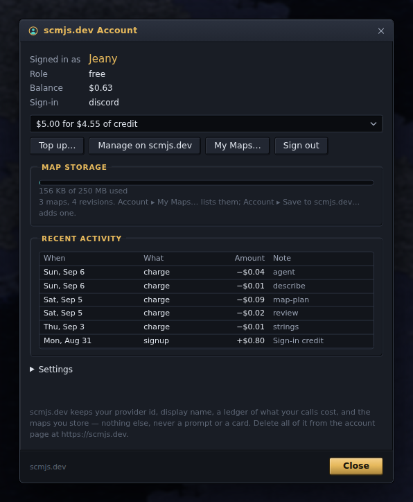

The **Account** menu and the cell at the right end of the status bar are the two ways
in; either opens the Account dialog. Sign in with Discord: the provider's own page opens
in a small window, you approve it there, and the window closes itself. The editor never
sees a password, only a display name and an id from the provider.

Signed in, the dialog shows your name, your balance, the sign-in you used, how much of
your map storage is in use, and a list of recent activity — every AI request with what it
cost, and every credit. The buttons top up the balance, open your account page on
scmjs.dev (to link another sign-in, or delete the account and everything with it), open
My Maps, and sign out. Under *Settings* are two ticks: **Use the AI features**, which
takes the whole of Tools ▸ AI away when off and leaves the account and the maps, and
the status-bar cell.

What scmjs.dev keeps is short: the id and display name from your sign-in, a ledger of
what your requests cost, and the maps you store there. It keeps no prompts and no card
details — payment happens on the payment provider's page. The account page deletes all
of it.

### Keeping maps on scmjs.dev

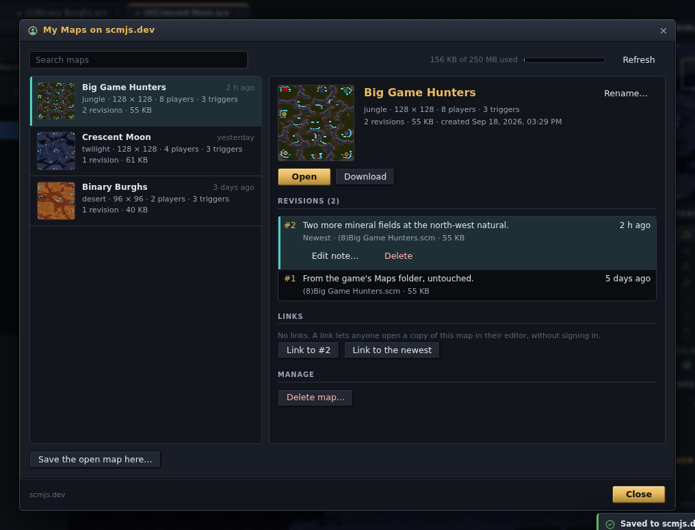

**Account ▸ My Maps…** — also File ▸ Open from scmjs.dev… — lists the maps on your
account, newest change first, each with a picture, its tileset, size and player count,
and how many revisions it has. The box above the list searches the names, tilesets, file
names and notes. The map you last opened or saved from here is picked when the list
arrives, and its revisions appear on the right: the number, the note you wrote, the file
name, the size and when it was saved. Up and Down move through the list, and Enter opens
the map. **Open** puts the picked revision in the editor, asking first if the map you have
open has unsaved changes; **Download** saves the file to disk as it was uploaded; the
note can be added or edited later and the map renamed. A revision can be deleted, except
the last one — delete the map to remove it.

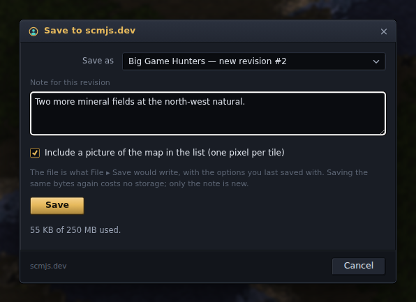

**Account ▸ Save to scmjs.dev…** — also under File, beside Save Copy As — saves the open
map to the account, as a new map or as the next revision of one you pick; the map it was
opened from or last saved to is picked for you. Write a note saying what changed, and
tick whether to include a one-pixel-per-tile picture for the list. The file is what
File ▸ Save would write, with the save options you last confirmed, so what comes back is
playable. It is a copy: Ctrl+S goes on writing to the file on your disk, and nothing on
the account changes until you save there again.

Revisions are numbered in order and a number is never reused. Saving a file whose bytes
are already on the account costs no storage — only the new note is kept — so saving a
note on its own is free. Storage is 250 MB per account on scmjs.dev, shown as a bar in
both dialogs. Maps live on a signed-in account only; the free AI trial cannot store them.

### Giving someone a copy

A link can hand a map to anyone: whoever opens it gets a copy of the map in their own
editor, without signing in. The copy is theirs — it opens as a new file, File ▸ Save
asks where to keep it, and nothing they change reaches your map. To edit a map together
instead, see [Editing a map together](#editing-a-map-together).

**Account ▸ Copy Link to This Map…** saves the open map to your account — as the next
revision of the map it came from, or as a new map — and gives you the link, already on
the clipboard. The link always opens the version you just saved, so a link you have
posted somewhere does not change under the people who follow it; tick *Let the link
follow my later saves* for one that opens whatever you save to that map next.

Pasted into Discord, Slack, a forum or most other places that show previews, a link to
the web editor shows a card with the map's name, who shared it, its tileset, size and
players, and its picture. A link that has been removed shows a card saying it no longer
works.

**Embed…** beside a link in My Maps gives you that card as a picture to put somewhere
yourself, with the link around it: a forum post or signature (BBCode), a GitHub README or
a Discourse forum (Markdown), or a website (HTML). Pick the large picture (1200 × 630) or
the small one (600 × 315) for a signature, and copy the code. The picture's own address
opens nothing: only the link you wrap it in does. When the link is removed, the picture
says the map is no longer shared.

The picture of the map on the card is drawn by your editor when it saves the map to
scmjs.dev, so a map saved without the game's graphics installed gets its size in its
place.

In **My Maps**, the *Links* part of a map lists its links, how many times each was
opened, and **Remove** for each; a removed link stops working at once and the map stays.
*Link to #3* makes a link to the revision you are looking at, *Link to the newest* one
that follows your saves. Deleting a revision removes the links to it, and deleting a map
removes all of its links. A map can have ten links.

Opening a link starts the editor with an *Open a Copy* dialog showing the map's name,
picture, size and who shared it; **Open a copy** opens it. **Account ▸ Open a Map
Link…** takes a link pasted in, which is the way in the desktop editor.

### Balance and costs

The account and the map storage cost nothing. The AI does: each request is charged what
the model's work cost, and the balance in the status bar and the Account dialog is what
you have left. It fills in three steps:

- **A free trial.** The first AI request you make starts one, with no sign-in — one per
  browser. The Account dialog says how much it is worth.
- **Sign-in credit.** Signing in adds a one-time credit (once per sign-in identity) and
  keeps whatever the trial had left. The balance then follows your account, so another
  browser or the desktop app picks it up when you sign in there.
- **Top up.** When that is spent, Top up… in the Account dialog buys credit at cost,
  through a payment page in a new tab. Bought credit does not expire.

Every AI dialog shows what the request cost once it is back and what the session has
cost so far; the *Quality* choice in the AI Options decides how hard the model works on a
request, and so what it costs (see [Options](#options-and-turning-it-off)). Roughly, a
name or a translation costs a few cents and a map plan, a trigger script or a review a
few tens of cents. When the balance runs out the dialog says so and points to the Account
dialog.

## Editing a map together

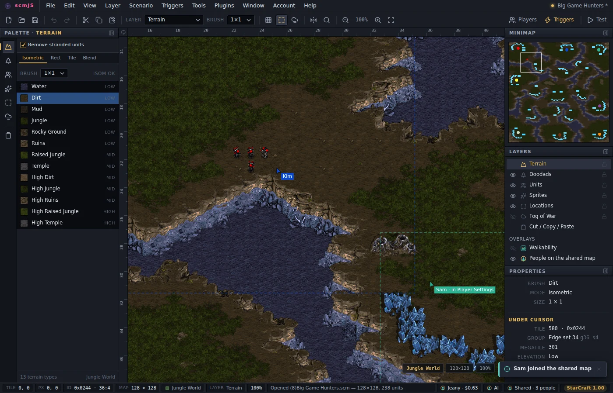

Several people can work on one map at the same time, each in their own editor. One of
them shares the map they have open and sends the others a link; whoever opens it gets the
map in their editor, and from then on every change anyone makes shows up for everyone:
terrain, doodads, units, sprites, locations, fog, the settings dialogs, triggers, strings
and sounds. Each person also sees the others' pointers on the map with their names, a
dashed box in their colour around what each of them has on screen, and which dialog they
are in.

Sharing goes through scmjs.dev: the person who shares needs a signed-in
[account](#your-scmjsdev-account), and the people joining need only the link.

### Sharing a map

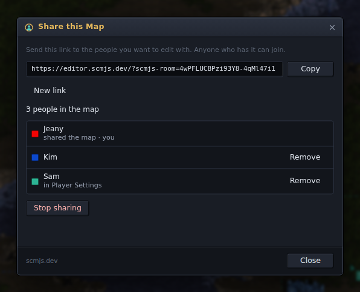

**Account ▸ Share this Map…** asks for a name for the map (its own name to start with) and
how long to **keep it open**, and copies it to scmjs.dev when you press **Start sharing**.
The dialog then shows the link: **Copy** puts it on the clipboard for you to send. A cell
appears in the status bar — *Shared · 3 people* — and clicking it opens the dialog again.
Pasted into Discord, Slack or a forum, the link shows a card with the map's name, who
shared it and, for a map kept open, its picture.

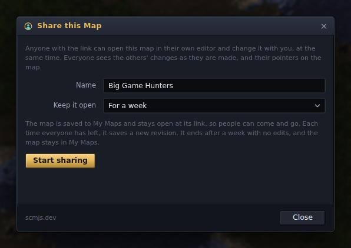

*Keep it open* decides what happens when people leave:

- **Until everyone leaves** shares the map only while people are in it. Nothing is stored:
  sharing ends when you stop it, half an hour after the last person leaves, or when the
  server restarts.
- **For a day**, **for a week** (the choice to start with) or **for a month** saves the map
  to [My Maps](#your-scmjsdev-account) and keeps it open at its link, so people can come and
  go as they like, on different days if they want. Each time everyone has left, the map is
  saved as a new revision with a note naming who changed it (*Edited together: Kim, Sam*),
  and the next person to open the link carries on from there. The time counts from the last
  edit, so a map people are working on stays open, and one nobody has touched for that long
  ends. The dialog shows the date: *ends 3 Oct unless someone edits it*.
- **Until I end it** keeps it open with no time limit. It still ends after a year with no
  edits.

When a map kept open ends, only the sharing ends: the map and its revisions stay in My Maps.
If the map in front came from My Maps, sharing it adds a revision to that map rather than
making a second one.

The dialog lists who is in, in the colour their pointer is drawn in, and what each of them
has open. The link is the key: anyone who has it can join and edit, so send it only to
people you want in the map. Only you, as the person who shared it, see the link and the
controls:

- **Remove** sends one person out of the map. They keep what they had.
- **New link** makes the old link stop working without sending anyone out, for when the
  link went further than you meant.
- **Stop sharing** (**End sharing** on a map kept open) ends it for everyone. On a map kept
  open, **Leave** takes only you out and leaves it open for the others; you can change how
  long it stays open here too.

Up to eight people can be in one map, and an account can share five maps at a time,
counting both kinds. A map shared from the desktop app gets a link to the web editor,
since that is what anyone can open.

### Your shared maps

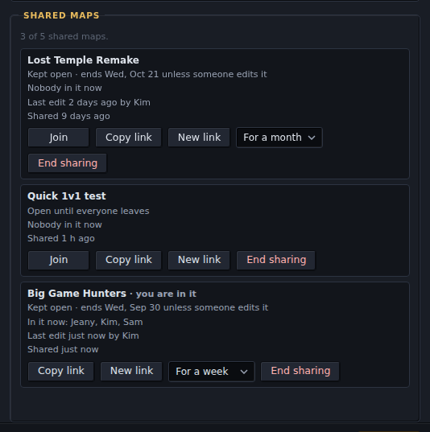

The **Shared maps** part of **Account ▸ Account…** lists every map you are sharing: who is
in it now, the last edit and who made it, and when it ends. Each has **Join**, **Copy
link**, **New link**, how long to keep it open, and **End sharing**. When you are already
sharing five, Share this Map… shows the same list so you can end one first.

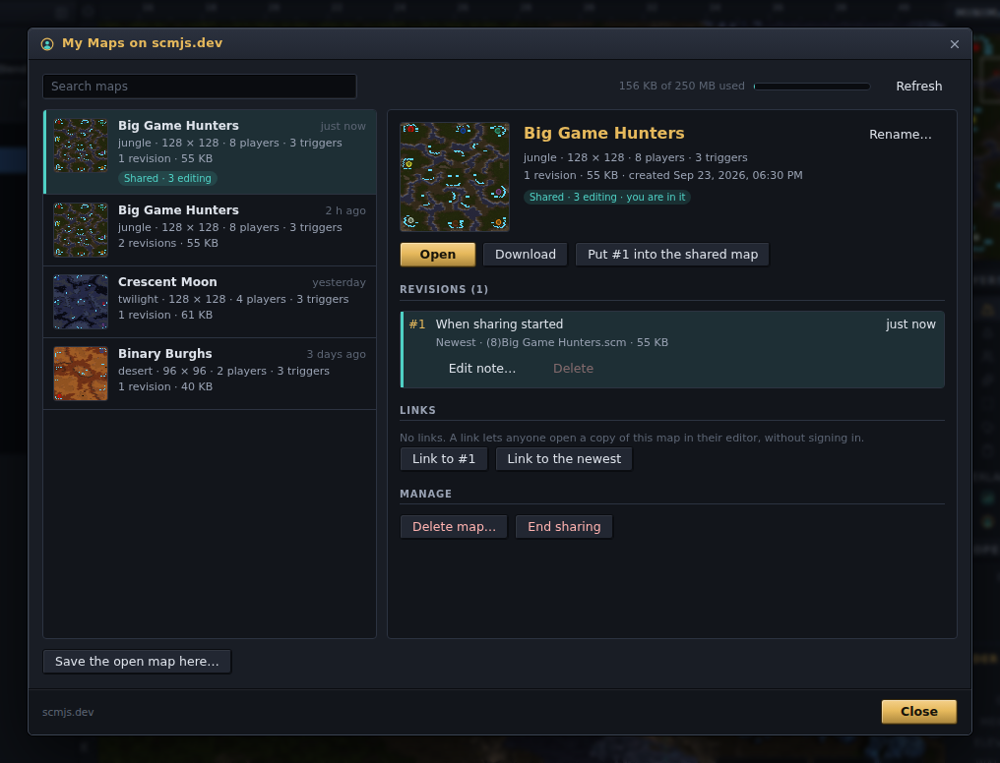

A map kept open also has **Embed…** in that list and in the Share dialog. Its picture
can open a copy of the map (the choice it starts with: a link to the newest revision is
made for it) or the shared map itself. The second lets anyone who sees the picture join
and edit, and the dialog says so; **New link** is the way back if it went further than
you meant.

In **My Maps** a map kept open says so (*Shared · 2 editing*, or when it ends), and
**Join** opens it with whoever is there; **Open** still gives you a revision on its own.
While you are in one of your maps kept open, a revision of it has **Put #N into the shared
map**, which replaces the map for everyone with that revision: the way back if someone
spoiled it. Everyone's undo history starts again, as after a resize, and the map as it was
is not kept unless you saved it first.

### Joining

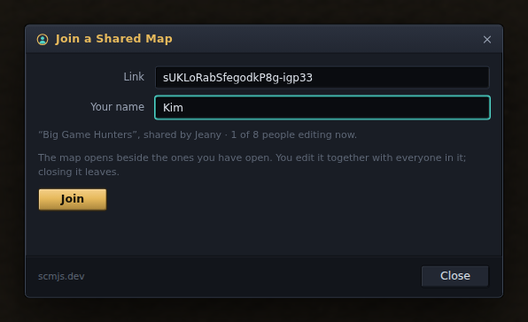

Open the link in a browser and the editor starts with the Join dialog up. In the desktop
app, or in an editor that is already open, paste the link into **Account ▸ Join a Shared
Map…**. The dialog says which map the link leads to, who shared it and how many people are
in it; type the name the others will see you by and press **Join**. The map opens in a new
tab beside whatever you had open (or in place of the empty map the editor starts with).
Closing that tab leaves the shared map.

You can be in one shared map at a time. Joining another leaves the first, which stays
open as an ordinary map.

### Talking to each other

While a shared map is in front, a **Chat** button sits in the bottom-right corner of the
map, next to the tileset and zoom. It opens a small window over the map with what everyone
has written and a line to type in; Enter sends. What you type there goes to everyone in the
map and nowhere else, and typing in it does not trigger the editor's shortcut keys.

When the chat is closed, a new message shows as a notice and as a count on the button. Anyone
who joins later sees what was said before them. The chat is kept only while people are in
the map: it is gone when sharing ends, or when everyone has left a map kept open, and it is
not saved with the map.

### When two people change the same thing

- **Your stroke is never cut in two.** While you hold the mouse button on the map, other
  people's changes wait and arrive when you let go. The same happens while a dialog that
  edits the map is open (Player Settings, the Trigger Editor, Unit Properties and the
  like); the others see that you are in it, next to your pointer and in the Share dialog.
- **The later change wins.** If two people paint the same tile, the change the server got
  second stays. If two people move the same unit, the first move stands and the second is
  dropped, because the unit is no longer where the second person's editor had it; the
  status bar says when some of your change no longer applied. A dialog's OK writes its
  whole table, so if two people change the triggers at the same time, the second OK wins.
  When you see someone in the Trigger Editor, talk before you open it too.
- **Undo is yours.** Ctrl+Z takes back your own changes, not other people's, and leaves a
  tile alone once someone else has painted over it.
- **Resize, a tileset change and a raw section edit** replace the whole map for everyone,
  and everyone's undo history starts again, as it does when you do them alone.

### Saving, and when it ends

Saving is each person's own: File ▸ Save writes your copy to your disk, and anyone in the
map can save at any time. A map shared *until everyone leaves* is kept on scmjs.dev only
while it is shared, and nothing of it is stored there afterwards; a map kept open is one of
the sharer's maps in My Maps, and its revisions stay there after sharing ends. Everyone
still has the map open in their editor when sharing ends, so nobody loses work — save it.

A server restart ends a map shared until everyone leaves, but not a map kept open: the
editors in it reconnect on their own when the server is back and carry on.

If your connection drops, the status bar says *Reconnecting…* and you can keep working:
your changes are kept and sent once the connection is back, and you get everyone else's
changes from while you were gone. The others see you as having lost the connection
meanwhile. If you are away so long that the server has moved on, the shared map opens
again in a new tab with everyone's latest, and your copy stays open in its own tab, with
a note saying how many of your changes the others never got. After two minutes of trying,
the editor gives up and leaves the shared map; the map stays open, and the link still
works.

If the server cannot take one of your changes, your editor leaves the shared map and says
so. The map stays open; save it, or open the link again to carry on with everyone's
latest.

## The AI

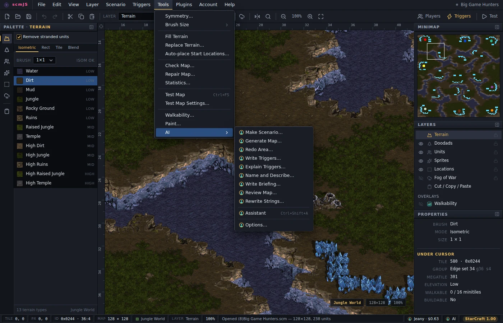

**Tools ▸ AI** holds the AI features. They come with the editor as part of the scmjs.dev
plugin and run on scmjs.dev, so there is no key to paste and no server to set up. The
first request starts the free trial. [The previous section](#your-scmjsdev-account) covers
the account and what requests cost.

A few things are the same for every feature:

- **What is sent.** Only what the feature needs: what you typed and the map's facts (size,
  tileset, players, what is where). Some features also send a picture of the map, the
  strings or the triggers. The map file itself is never sent.
- **Undo.** Every change the AI makes is one undo step, labelled "AI: …". The exception is
  anything written through a settings dialog (the name and description, strings, triggers,
  players, unit settings). Those changes are left out of the undo history, just like when
  you make them by hand, and the dialogs point this out.
- **Cost.** Every AI dialog shows its progress while you wait, and the cost when it
  finishes.

### The assistant

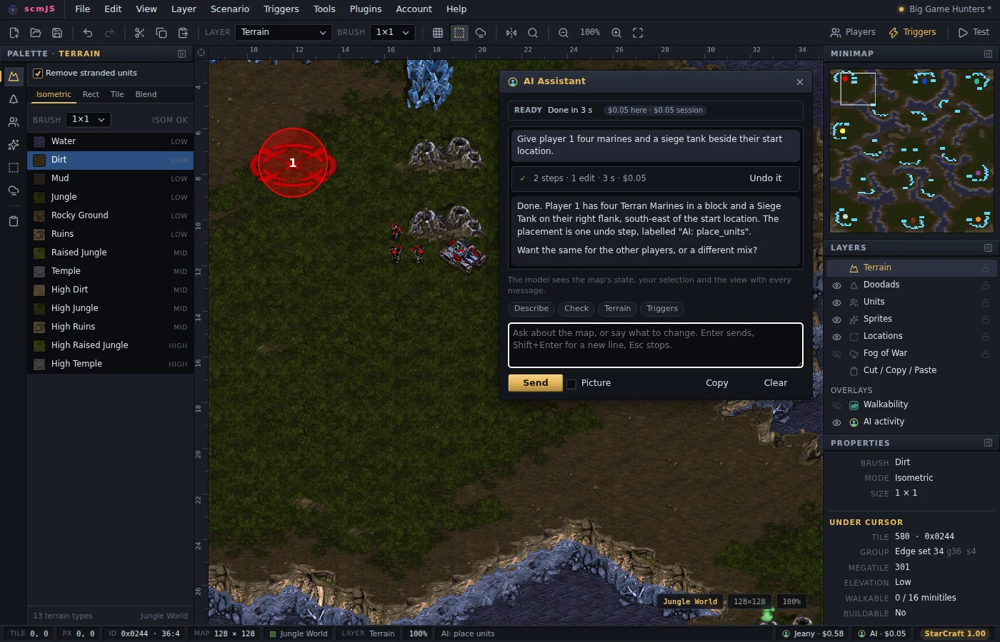

**Assistant** (Ctrl+Shift+A, or the *AI* cell in the status bar) opens a conversation
about the open map. Ask a question or say what to change. The assistant reads the map and
edits it with the editor's own tools while you watch.

It can **read** everything: the map's facts and statistics, units with all their
properties, doodads, sprites, locations, strings, switches, sounds, the triggers and
trigger script, unit, upgrade and technology settings, fog, terrain, Check Map results,
your selection, and a screenshot of any area.

It can **change** nearly everything the editor can: terrain, units, doodads, sprites,
locations, fog, the map's name, triggers, strings, the trigger script, players and forces,
unit, upgrade and technology settings, and the map's size. It also knows the systems and
layout presets that [Make Scenario](#make-scenario) uses, so "add kill to cash" or "make
this a two-lane defense" takes one step. It draws terrain as shapes, such as a plateau with
a ramp that fits, a lane that stays walkable or a river with a bridge. It can tell you
whether units can walk from one place to another. It also checks the rules the game
enforces without telling you (a player who owns nothing is defeated at once), and fixes
them if you ask.

**Watching a turn.** Each turn shows your message, the answer, and the work in between,
folded into one block. While the turn runs, the block shows its latest steps: **▸** marks
a read and **✎** a change. The strip at the top of the panel shows what the assistant is
doing, how long it has taken and what it has cost so far. When the turn ends, the block
folds to one line showing the step and edit counts, any failures, the time, the cost and
an **Undo** button that reverses all of that turn's edits at once. Open the block to see
every step, the screenshots the assistant took (click one to enlarge it) and its
reasoning.

On the map, the area a step is about to change is outlined, and the result flashes after
the change. The view moves to each step and zooms out if the area is too big to show, but
it never zooms in. If you scroll or zoom yourself, the view stays where you put it for the
rest of the turn. To turn the following off completely, untick *Follow the assistant's
work around the map* in Tools ▸ AI ▸ Options…. You can close the panel while the assistant
works, since the status bar shows the same progress. Escape stops the turn.

**Starting a message.** The chips above the input suggest questions based on the layer
you are on and what you have selected. You can also right-click the map and choose *Ask AI
about this spot / the selection / this area…*. Tick *Picture* to send a screenshot of the
visible area with your message. Player Settings has a *Set up with AI…* button that sets
up players and forces from one sentence.

**Cost and limits.** Every message includes the map's current state: players, counts,
locations, the selection, the view and the latest undo step. The first message about a map
also includes a reference for the tileset, doodads, units and trigger vocabulary.
scmjs.dev caches that reference, so later messages cost little more than the words you
type. After 24 rounds of tool calls the assistant stops and offers to continue. You can
change that number in Options.

### Make Scenario

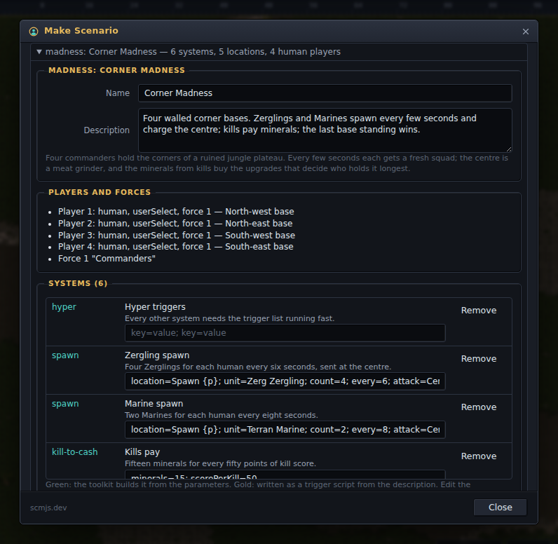

**Make Scenario…** builds a whole scenario from a sentence, such as "a madness map", "an
RPG about a marine lost on a Zerg world" or "a two-lane tower defense". Set the size,
tileset and number of players, then press **Design**.

**The design.** The model starts with a design document and builds nothing until you have
read it. The document covers the genre and premise, the players and forces, each trigger
system and its settings, a plan for the layout and the locations it needs, the objectives
and the briefing. You can edit any of it directly, or open **Change the design first**,
describe what should be different and press **Design again**.

A location name in a system's settings can include `{p}` for the player number, as in
"Spawn {p}". That system is then built once for each player, as long as the numbered
locations exist.

**Building.** **Build** works through the design one step at a time. Each step is a row
that passes or fails separately: the map, terrain and locations, players and forces, each
system, the objectives and briefing, the name, and a Check Map at the end.

- **Terrain.** If the design matches a *layout preset* (corner camps around an arena, lanes
  from spawns to a goal, a walled arena, a bound's winding course, or a town with a chain
  of regions), the editor lays out the terrain itself in about a second. Otherwise the
  model describes the terrain as shapes such as plateaus, lanes, rivers and arenas, and
  the editor draws them with its own brush. That keeps lanes connected and puts ramps and
  bridges only where they fit. This is the slow step, and a clock and the model's
  reasoning show under the rows while it runs.
- **Ramps and bridges.** Ramps always slope down toward the south-west or south-east,
  like the game's own ramps. Ice gets no ramps, and bridges are only drawn in Jungle and
  Space Platform, because those are the only tilesets whose pieces fit what the brush
  draws.
- **Systems.** The editor builds the systems it knows directly from their settings, the
  same way every time, and shows them in green. These include hyper triggers, timed
  spawns, kills paid in minerals, income, waves, lives, shops, healing, respawns,
  teleports, kill zones, leaderboards, countdowns, last standing, alliances, escalation
  stages, and a bound's obstacles and checkpoints. Anything else is written in TrigScript
  and shown in gold, which requires the TrigScript plugin.

When it finishes, choose **Review it…** or **Open the assistant** to keep going.

### Generate Map and Redo Area

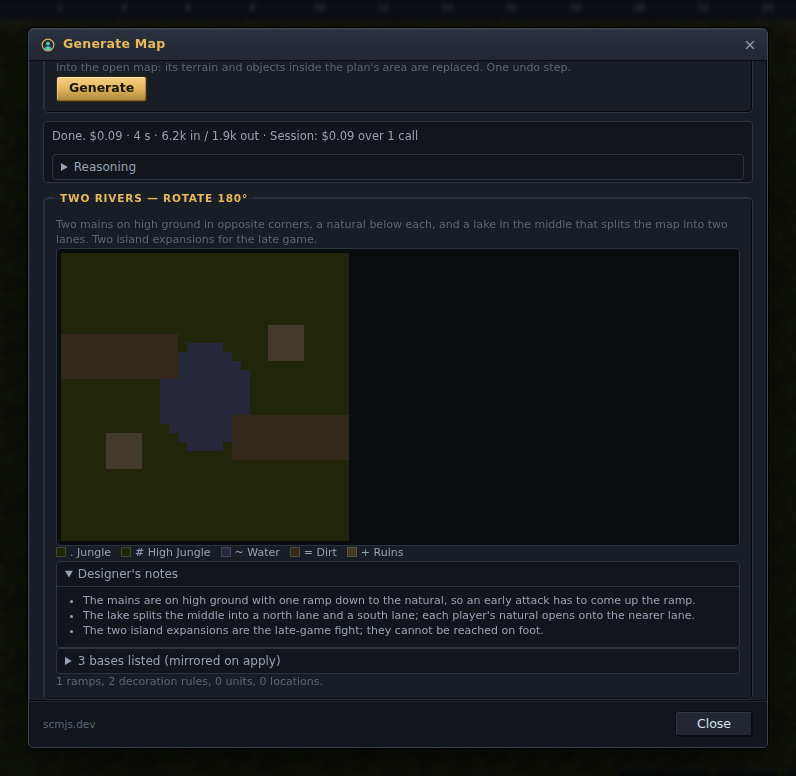

**Generate Map…** lays out a map from a description: the number of players, the kind of
terrain, where the bases go and the symmetry (or let the model choose). The result is a
*plan*, shown before anything is painted. It includes a rough grid of terrain types, the
bases with their mineral lines and geysers, ramps, decoration, a name and description,
and the designer's notes on how the layout is meant to play.

**Apply** paints the plan onto a new map with your chosen size and tileset, or onto the
open map if it is the same size. Terrain is painted with the isometric brush from the
lowest ground up, so cliffs and shores form on their own. Bases are laid out the same way
the Melee Wizard does it, and doodads are scattered where the plan puts them.

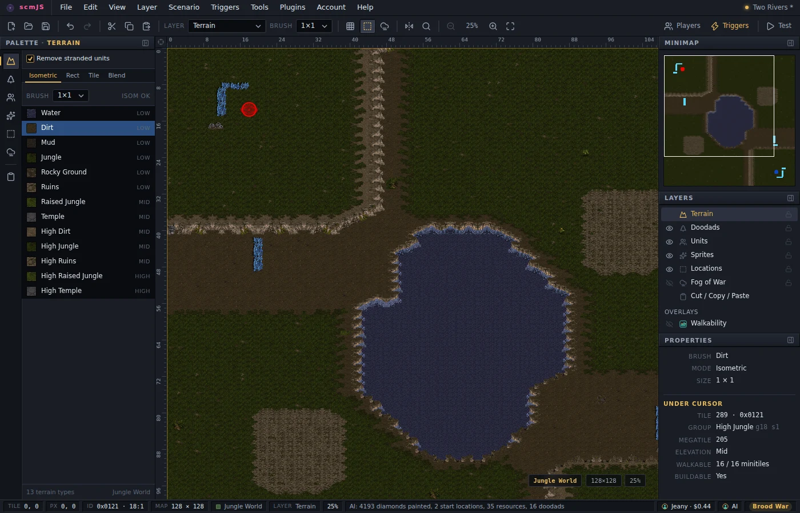

Treat the result as a starting point. **Refine** sends the plan back along with your
changes ("more room around the naturals", "swap the lake for a plateau"), a picture of
the result, and anything the editor refused or Check Map flagged. The revised plan
replaces the old one, and the earlier result is undone first if nothing else was edited
in between. Ramps are placed as doodads chosen by size, so check them against the cliffs
before you play.

**Redo Area…** does the same for one part of an existing map. Mark an area (or right-click
it and choose *Redo this area with AI…*) and describe what should be there. The model sees
the area and a margin around it, plus a picture, so the new ground joins the old at the
edges.

### Triggers

**Write Triggers…** turns a description into triggers written in [TrigScript](#trigscript),
so the TrigScript plugin must be switched on. The model sees the map's own names for its
units, locations and switches. The script is checked here, and if it fails, the errors go
back to the model for up to two rounds of fixes. **Build** installs it the same way
TrigScript's own Build does, and the source is kept with the map. You can add to the
map's existing script or replace all of its triggers.

**Explain Triggers…** describes what the triggers do in play. It can cover all of them, a
range, or the mission briefing, or answer a question about them. The explanation appears
as it is written. The Trigger Editor, the Text Trigger Editor and Mission Briefing also
have *Explain*, *Write…* and *Ask* buttons.

### Names, briefings, reviews and strings

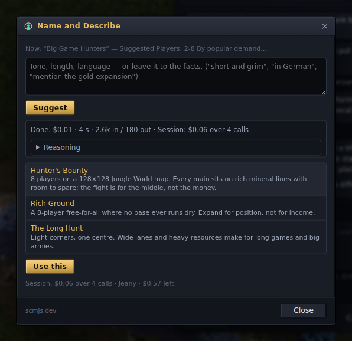

**Name and Describe…** suggests three names with descriptions based on what is on the
map. You can add a hint such as "short and grim" or "in German". Pick one and **Use this**
writes it into Map Properties. Map Properties also has a *Suggest a name* button that fills
in its fields the same way and waits for you to press OK.

**Write Briefing…** writes objectives and narration and creates one mission briefing
trigger per player, with the objectives as a Mission Objectives action and each line as a
Text Message. You can edit the text before it is written.

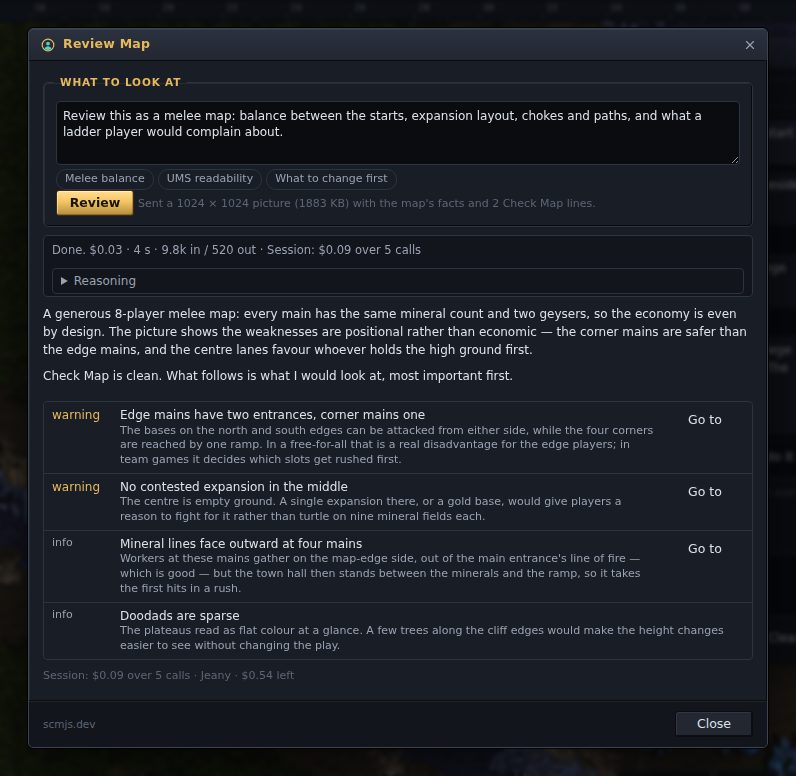

**Review Map…** sends a picture of the whole map with its statistics and Check Map results.
It returns a critique and a list of findings marked info, warning or problem, and findings
that refer to a spot on the map have a **Go to** button. The chips offer a melee balance
review, a readability review for scenarios, or "what to change first".

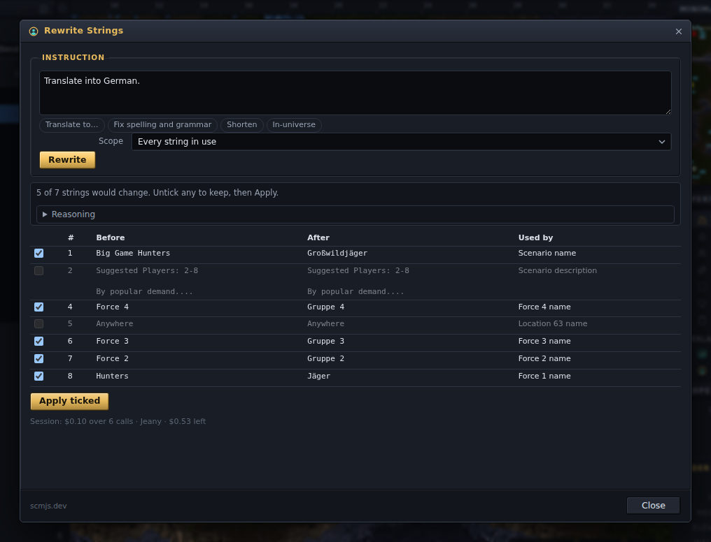

**Rewrite Strings…** applies an instruction to the map's strings, such as translate, fix
spelling and grammar, shorten, or match the map's voice. It can cover every string in use,
or only trigger text, the briefing or names. It shows a before-and-after table with a tick
on every row that would change. **Apply ticked** writes them back in place without
renumbering, so triggers still point at the right strings. The String Editor's *Rewrite
with AI…* button opens the same dialog.

### Options, and turning it off

**Tools ▸ AI ▸ Options…** has a few settings:

- **Quality** sets how much effort the model puts into each request, and so how long it
  takes and what it costs. *Standard* uses the level each feature was tuned for, *Quick*
  is the cheapest and *Thorough* the most careful. You don't choose the model; scmjs.dev
  picks it.
- **Assistant** sets the rounds of tool calls per message and the picture tick. It also
  sets whether the panel floats over the map or docks on the right under the Properties
  panel, and whether the model's reasoning summary shows while it works.

**Use the AI features**, at the top of Options and also in the Account dialog, removes the
whole AI when unticked: the menu, the assistant, the status-bar cell and the AI buttons in
other dialogs. Your account and the maps stored on it are not affected.

## Plugins

Plugins add tools to the editor, and some of what this guide describes is a plugin:
Walkability, Paint, Repair, Terrain from Image, TrigScript, Stamp Library, scmjs.dev
(the account) and the scmscx.com search are installed and on from the start. One more is
installed but starts *off*: TrigEdit, the Text Trigger Editor, which is for text carried
in from SCMDraft rather than for every map. Tick it on in Plugins ▸ Manage Plugins… and
Triggers ▸ Text Trigger Editor… appears. Melee Wizard, Section Explorer and Timelapse are
a click away.


Plugins ▸ Browse Plugins… lists the plugins the project publishes; press Install on one
and it shows where the code comes from before adding it. Plugins ▸ Manage Plugins… lists
what is installed, turns each on or off, and takes the address of any other plugin —
a GitHub repository, a link to its `plugin.json`, or `http://localhost:3000/` while you
write one. A plugin that has settings keeps them on its own page under Edit ▸ Preferences
▸ Plugins. There is no sandbox: a plugin has the same access as the editor itself, so only
add plugins you trust. The Add screen says as much and shows the manifest, the repository
and the addresses it will fetch from.

| Plugin | Where | What it does |
| --- | --- | --- |
| [Walkability](https://github.com/scm-js/plugin-walkability) | View ▸ Walkability (Ctrl+Shift+W) | Draws the ground as a unit walks it: islands, the areas the map divides into and the chokes between them with their widths, height seams with no ramp, and the distances between start locations. Reads only. |
| [Paint](https://github.com/scm-js/plugin-paint) | Tools ▸ Paint… (Ctrl+Shift+P) | Freehand, lines, shapes, spray and text, laying down whatever the active layer's palette has picked — so it paints units, doodads, sprites, terrain or fog depending on the layer. |
| [Repair](https://github.com/scm-js/plugin-repair) | on open, Tools ▸ Repair Map… | Reads a map the way the game does and lists what is missing, damaged, repeated or the wrong size, each with the repair and what the game does without it. Rebuilds a stripped isometric record. |
| [Terrain from Image](https://github.com/scm-js/plugin-image-to-terrain) | File ▸ Import ▸ Terrain from Image… | Turns a picture into terrain, over the whole map or a rectangle you drag, painted with the isometric brush so cliffs and shorelines are laid at every boundary. |
| [scmscx.com](https://github.com/scm-js/plugin-scm-scx) | File ▸ Find on scmscx.com… | Searches the map archive at [scmscx.com](https://scmscx.com) by name, tileset, players and size, shows each map's minimap and details, and opens the one you pick. The site's API sends no cross-origin header, so unless the editor is served from scmscx.com the requests go by way of a small forwarder the plugin comes with; its page in Edit ▸ Preferences ▸ Plugins holds its address and how many minimaps to ask for. |
| [Melee Wizard](https://github.com/scm-js/plugin-melee-wizard) | Tools ▸ Melee Wizard… (Ctrl+Shift+M) | Symmetric start locations, and mineral lines and geysers laid out at the distance the game mines fastest from; presets for main, natural and third; a symmetry check and a resource summary. |
| [TrigScript](https://github.com/scm-js/plugin-trigscript) | Triggers ▸ TrigScript… | Triggers as code: TypeScript files kept inside the map and built into a block of the trigger list — ordinary code that runs when you build, and `program()` bodies that run in the game, built into the saved map by the eudplib plugin (StarCraft: Remastered). See [TrigScript](#trigscript). |
| [Stamp Library](https://github.com/scm-js/plugin-stamp-library) | Tools ▸ Stamp Library… (Ctrl+Shift+L), Edit ▸ Save as Stamp… (Ctrl+Shift+K) | Named pieces — a ramp, a bridge, a cliff corner, a mineral line — saved from the marked area and kept across maps in the browser's storage. Click one and it hangs under the pointer, drawn with the map's graphics, aligned to the isometric lattice it came off; click to lay it down. Search, tags, JSON export and import, and one stamp as a line of text to share. |
| [Section Explorer](https://github.com/scm-js/plugin-section-explorer) | Tools ▸ Section Explorer… (Ctrl+Shift+H) | The map file as the game reads it: every section, a hex editor over the bytes, and what the byte under the cursor means. |
| [Timelapse](https://github.com/scm-js/plugin-timelapse) | View ▸ Timelapse…, the status-bar cell while it records | Records the map as you build it, one frame per change, and plays the recording back with a box around each change. Export it as a GIF or a WebM video. Recordings stay in the browser, and opening the same file again carries on the same recording. |
| [scmjs.dev](https://github.com/scm-js/plugin-scmjs-dev) | Account menu, File ▸ Open from / Save to scmjs.dev…, Tools ▸ AI | Your [scmjs.dev](https://scmjs.dev) account: maps kept on it, links that give anyone a copy of one, a map shared for others to edit with you, and the AI — see [Your scmjs.dev account](#your-scmjsdev-account), [Editing a map together](#editing-a-map-together) and [The AI](#the-ai) above. One tick in its Account dialog turns the AI off and keeps the account. |


Each plugin has its own README with the details. Installing plugins, what they are allowed
to do, and writing one are covered in [docs/plugins.md](docs/plugins.md). Browse Plugins
also lists [Hello World](https://github.com/scm-js/plugin-hello-world), an example plugin
with nothing in it but a Tools menu item, kept as the one to copy when writing your own,
and the [API Playground](https://github.com/scm-js/plugin-api-playground), a code editor
for trying the plugin API on the open map before writing a plugin.

## Keyboard and preferences

Press F1 for a list of every shortcut. These are the ones worth knowing up front:

| Keys | |
| --- | --- |
| `T` `D` `U` `S` `L` `F` `C` | switch layer |
| `[` `]` | brush size |
| Alt+click | pick what is under the cursor |
| Ctrl+Z / Ctrl+Y | undo / redo |
| Del / Esc | delete selection / stop placing |
| Ctrl+O, Ctrl+S, Ctrl+N | open, save, new |
| Ctrl+T, Ctrl+Shift+T | trigger editors |
| Ctrl+F | find |
| Ctrl+A | select all on the layer |
| Ctrl+G | grid |
| Ctrl+0, Ctrl+Shift+0 | 100%, zoom to fit |
| Alt+Enter | map properties |
| Ctrl+F5 | test map |
| Ctrl+Tab, Ctrl+Shift+Tab | next / previous open map (desktop app) |
| Ctrl+Shift+A | AI assistant |


Preferences (Ctrl+,) are kept in the browser. The pages down the left:

- **General** — the editor's language (English or Korean; the default follows the
  browser's, a change applies at once, and a map's own text is untouched by it), the splash
  screen, whether to reopen the last map at startup (the desktop app does it straight
  away; a browser that has to ask before reading the file again offers it in a notice),
  how many recent files to keep, whether each map opens in its own tab, whether to ask
  before replacing a modified map (the same tick decides whether closing the tab or
  quitting the desktop app asks about unsaved changes), the tileset, size and revision a
  new map starts with, and what the Save dialog starts from: how the file was opened, or
  one of its presets, with the compression a map with no file yet gets. The desktop app
  adds whether to check for updates at startup.
- **Editing** — the grid's spacing, colour and style, and what snaps to it (View ▸ Grid
  Settings opens this page); what the palettes start on — the owner of placed units, the
  brush size, the size of a new location; and how many undo levels each map keeps.
- **View** — whether the mouse wheel scrolls (Ctrl+wheel zooms) or zooms, and whether a
  wheel zoom keeps the tile under the pointer in place; whether water and units animate
  and how fast; and whether string previews follow Remastered's colour rule or 1.16.1's.
- **Testing** — Test Map's folder, and in the desktop app whether the game starts after
  the map is written.
- **Plugins** — what to do when an installed plugin has a newer version (a notice, nothing,
  or install it — see [docs/plugins.md](docs/plugins.md#keeping-a-plugin-up-to-date)),
  and a plugin's own settings when it has a page here.
- **Storage** — where the game data comes from, and a list of everything the editor keeps
  in the browser, one row per setting or cache, with a plugin's own data under its name;
  each row can be cleared on its own, or **Clear all data** throws the lot away. The map
  you have open is never kept there and is not touched by any of it. **Export** writes
  the settings and the plugins' own as one file, and **Import** takes such a file into
  another browser or machine; caches and the recent files stay behind.
- **Hotkeys** — the shortcut table.

Nothing is written until OK or Apply; **Reset to defaults** puts every page back. The
placement options, the panels and the recent files are remembered too.

## When something goes wrong

If the editor does something strange (or a bug happens) you can check the debug console to see
what happened, use the bug report option to copy it, or use the **Report an Issue** to send it.

### The debug console

**View ▸ Debug Console** opens a strip along the bottom of the window with the log in it:
maps opened and saved, plugins started and stopped, where the game data came from, and
every error the page threw.

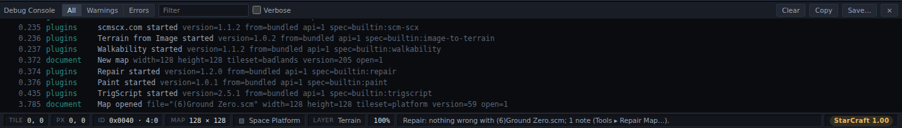

The log is kept whether the strip is open or not, so opening it *after* something odd
happened still shows what happened. The
last couple of thousand lines are kept; **Clear** empties it, for starting clean before
reproducing something.

**Warnings** and **Errors** narrow the list to what went wrong; the box beside them filters
on any text. **Verbose** adds a line for every edit and every call a plugin makes into the
editor. It answers "which plugin did that?", it is noisy by design, and it turns itself off
when you next load the editor.

### Copying a bug report

**Help ▸ Copy Bug Report** puts the log on the clipboard with a short header above it —
the version, the browser or desktop app, where the game data came from, the map's size and
tileset, and the plugins with their versions — ready to paste into an issue, a forum post
or a message. A long session is trimmed to its most recent lines so the paste fits in an
issue; when it is, the report says so.

The console's own **Copy** does the same without the trim, and **Save…** writes the whole
log to a file, for when it is too long to paste.

### Filing an issue

**Help ▸ Report an Issue…** opens a new issue on GitHub with the report already filled in,
under three questions: what you did, what you expected, and what happened. Answer those,
check the rest, and submit. You need a GitHub account.

The automatic issue contains a truncated log. If the lines that matter are not listed, use **Copy Bug Report** and paste it over the
shortened one.

Nothing is sent until you submit the issue yourself. Every report names the map *file* you
have open, the plugins you have installed and the build you are running. Nothing specific
to you is included.

## What it does not do
This section lists what is currently missing in the editor and the limits worth knowing before you rely on a feature.

### Not implemented

- **Changing the shortcuts.** Preferences ▸ Hotkeys lists them but cannot change them (yet).
- **Backups and recovery.** Save overwrites the file, with no `.bak` beside it, and the
  editor does not keep a copy of an unsaved map. If the tab or the app closes without a
  save, the changes are gone. Keep your own copies for now, or use Save to scmjs.dev, which keeps
  every revision.
- **Undo for dialogs.** What a dialog writes (player settings, triggers, strings, the
  scenario's tables) is not in the undo history, as in StarEdit; Cancel is the way back.
  Resizing and changing the tileset clear the undo history.
- **Remastered graphics.** The editor draws the classic graphics from the 1.16 archives,
  not Remastered's HD art.

### Browsers and the desktop app

- In Firefox and Safari, every save is a download, and a recent map reopens through
  File ▸ Open instead of straight from disk. Chrome, Edge and the desktop app write in
  place.
- Test Map in the browser writes the map where the game lists it but cannot start the
  game. In Firefox and Safari it downloads the map.
- The Windows zip does not register `.scm`, `.scx` and `.chk`, since nothing is installed.
  A map dragged onto `scmJS.exe` still opens.
- On macOS the app sees a new version but cannot install it until the app is
  code-signed, so it offers the download page instead.

### Terrain and objects

- The isometric brush needs the map's `ISOM` section. The Repair plugin, on by default,
  rebuilds one a protected map had stripped.
- Symmetry mirrors the brushes, the fills and placing things, but not moving, deleting
  or the Blend brush.
- Changing the tileset lays the terrain again and drops the doodads; the units, sprites,
  locations, fog and triggers stay.

### Triggers and text

- In the Trigger dialogs, EUD values are raw numbers: the EPD box turns a memory address
  into the player value that reaches it, but nothing names what an address holds. For
  named reads and writes of the game (a unit's hit points, a player's minerals, the unit
  tables), use a [TrigScript](#trigscript) program, or the
  [Magenta](https://github.com/scm-js/plugin-magenta) trigger editor (Plugins ▸ Browse
  Plugins…), whose EUD conditions and actions work like the game's own. Both play on
  Remastered only.
- Transmission is the one briefing action no Blizzard map uses, so its layout could not
  be checked against one.
- TrigScript's programs play on Remastered only; `trigger()` works on every version. The
  full list is under [TrigScript's reference](#reference).
- A character the map's text encoding cannot hold is saved as `?`. Check Map and the
  Save dialog say so beforehand.
- The Korean translation was written with a translation, not by a native speaker. A
  review is welcome (see [docs/development.md](docs/development.md#translations)).

### The scmjs.dev features

- The AI, keeping maps on an account and editing a map together all run on scmjs.dev
  and need a connection. The AI starts with a free trial; keeping and sharing maps need an
  account.
- On a shared map, if two people press OK in the same dialog, the second OK wins. A
  resize, a tileset change or a raw section edit starts everyone's undo history again.

### Plugins

A plugin runs with the same access as the editor itself; there is no sandbox. Install
ones from sources you trust. The plugins listed under Browse Plugins… are reviewed
before they are listed.

## Documentation

All of this documentation is also a site — [docs.scmjs.dev](https://docs.scmjs.dev) — with these documents
as pages, a search box, and a reference for every call in the plugin API generated from
the editor's own declarations. It is built from the tag the hosted editor runs, so the
version in its footer is the one at [editor.scmjs.dev](https://editor.scmjs.dev). These
files stay the source; the site renders them.

| Document | Covers |
| --- | --- |
| [docs/installing.md](docs/installing.md) | The hosted editor, the desktop app, the container, and getting the game's graphics |
| [docs/triggers.md](docs/triggers.md) | Every trigger condition and action: what it does, its arguments, its text form and where it is stored |
| [docs/game-data.md](docs/game-data.md) | Where the graphics come from, mods as data sets, and how the pictures get drawn |
| [docs/file-formats.md](docs/file-formats.md) | What the editor does with a map file: what it preserves, what Save can strip, revisions, protected maps |
| [docs/chk-format.md](docs/chk-format.md) | Every section of the scenario file, byte by byte |
| [docs/plugins.md](docs/plugins.md) | Writing and installing plugins; the plugin API |
| [docs/development.md](docs/development.md) | Running from source, the desktop app and the container, releases, contributing |
| [ATTRIBUTION.md](ATTRIBUTION.md) | Provenance of adapted algorithms, tables and dependencies |

## License

The original scm-js source is MIT-licensed; see [LICENSE](LICENSE). That license does
not cover upstream code, packages, research, names or game data.
[ATTRIBUTION.md](ATTRIBUTION.md) records where each of those came from, and
source-level credit sits beside the code it applies to.

StarCraft and Brood War are trademarks of Blizzard Entertainment. This is a fan
project, not affiliated with or endorsed by Blizzard Entertainment.
