# scmJS

A map editor for StarCraft and Brood War that runs in a browser tab, modelled on
StarEdit, SCMDraft 2 and StarForge.

It opens the game's own `.scm` and `.scx` maps (and a bare `.chk` scenario), draws them
with the game's terrain and unit graphics, and saves maps the game plays. Whatever it
does not understand in a file is copied through untouched — an unknown section, a
malformed one, an archive member it cannot name — so a map only loses what you
deliberately change.

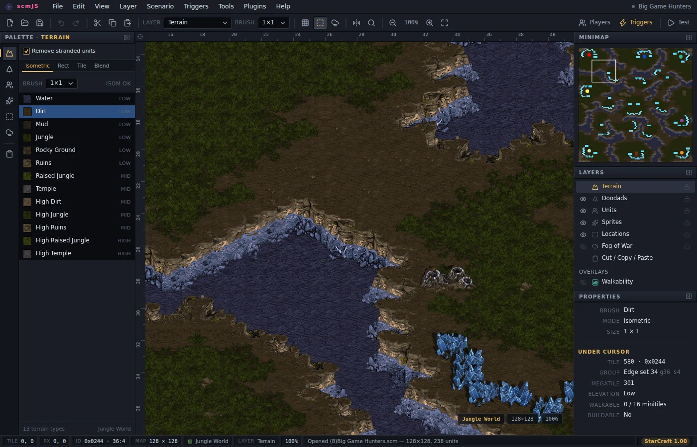

> **Beta.** Nothing here has shipped a campaign yet. Keep backups of maps you care
> about, and check anything important in-game before you rely on it.

This guide is for map makers. It starts with getting the editor running, walks through
a first map, and then goes through each layer and dialog in turn. The technical side —
file formats, game data, writing plugins, building from source — has documents of its
own, listed at the [end](#documentation).

## Getting started

Three ways to run the editor:

- **In the browser.** [editor.scmjs.dev](https://editor.scmjs.dev) is the newest
  numbered release. Nothing to install; your maps stay on your own disk and are never
  uploaded. [nightly.editor.scmjs.dev](https://nightly.editor.scmjs.dev) is rebuilt
  every night from the latest changes, for trying what is coming; being a separate site
  it keeps its own settings and asks for the graphics again.
- **As a desktop app.** The [releases](../../releases) page has installers for Windows,
  macOS and Linux, and a Windows zip to unpack and run without installing. The app finds
  a StarCraft installation on its own, registers `.scm` / `.scx` / `.chk` so a
  double-click opens a map, can start the game for Test Map, and offers new versions in a
  notice when they come out — never installing one on its own.
- **In a container**, for a server on your own network: `docker run --rm -p 8080:80
  ghcr.io/scm-js/scm-js:latest`, then open `http://localhost:8080`.

Building from source is covered in [docs/development.md](docs/development.md).

### The graphics

The editor draws terrain and units with graphics out of StarCraft's own archives.
Blizzard's data is not redistributable and none of it ships with the editor, so on first
use it asks where to get them:

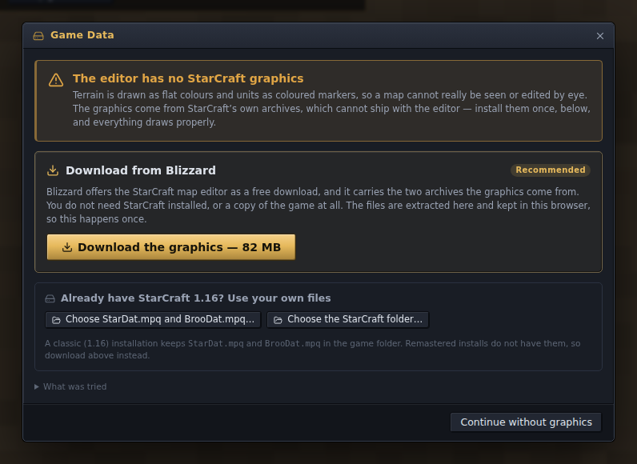

- **Download from Blizzard.** Blizzard offers the standalone StarCraft map editor as a
  free download, and that package carries the two archives the graphics come from. No
  account, nothing to find on your own disk, about 80 MB — take this route if you have
  never had the 1.16 game installed.
- **Use your own files.** Pick `StarDat.mpq` and `BrooDat.mpq`, or the folder holding
  them, from a classic (1.16) installation. Remastered installations do not carry these
  archives; use the download above instead.

The extraction runs in the browser and the result is kept for next time; the desktop
app looks for an installation on its own first. **Help ▸ Game Data…** brings the dialog
back later, to remove the copy or to install a mod's files beside the game's own as a
second *data set* (see [docs/game-data.md](docs/game-data.md#data-sets)).

Without any graphics the editor still runs: terrain is drawn in flat colours and units as
coloured markers, and everything else works.

### Opening a map

Ctrl+O opens a file, and so does dropping one on the window. File ▸ Open Recent lists
what you have had open before; in Chrome, Edge and the desktop app it reopens the file
from disk directly. File ▸ Find on scmscx.com… searches the community map archive and
opens the map you pick, when the editor can reach the site (see
[Plugins](#plugins)).

## The editor window

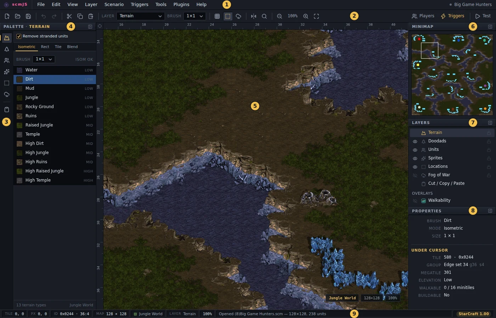

1. **Menu bar.** Every command is here, with its shortcut beside it. The dot at the right
   end glows while the map has unsaved changes.
2. **Toolbar.** New / open / save, undo and redo, cut / copy / paste, the active layer
   and brush size, the grid, locations and fog-of-war toggles, symmetry, find, zoom, and
   buttons for Player Settings, the Trigger Editor and Test Map.
3. **Layer rail.** The seven layers, top to bottom: Terrain, Doodads, Units, Sprites,
   Locations, Fog of War, Cut / Copy / Paste. The keys `T D U S L F C` switch between
   them.
4. **Palette.** What the active layer places: terrain types and brushes, doodads, unit
   types, sprites, the location list, the fog players, the clipboard options.
5. **Map.** Drag to paint or place, click to select, double-click for properties.
   Right-click opens a context menu, or stops whatever you are placing.
6. **Minimap.** Click or drag on it to move the view.
7. **Layers panel.** The eye hides a layer's objects from the view; the padlock locks a
   layer so its tools stop changing the map. Plugin overlays (Walkability, say) are
   listed under it.
8. **Properties.** What is selected, or what is under the cursor: for a tile its id,
   group, elevation, walkability and buildability; for a unit its owner, position and
   vitals; for a location its bounds and elevation flags.
9. **Status bar.** The tile and pixel under the cursor, the tile id, map size, tileset,
   layer and zoom, and a line saying what the last action did or why it was refused.

Scroll with the mouse wheel (Shift for sideways) or the scrollbars, or click on the
minimap. Ctrl++ and Ctrl+− zoom, as do the toolbar's magnifiers; Ctrl+0 is 100% and
Ctrl+Shift+0 fits the whole map in the window. Ctrl+G shows the grid, and View ▸ Grid Settings sets its
size. The panels can be hidden from View ▸ Panels and their widths dragged.

Every layer has its own selection and its own palette. Undo is Ctrl+Z, two hundred steps
deep and shared across all the layers, so a terrain stroke and the units it stranded
come back together. Anything done in a dialog — player settings, triggers, strings — is
its own OK / Apply / Cancel transaction and is not in the undo history, as in StarEdit.

## Your first map

A small melee map, start to finish. Everything here is covered in more depth in the
sections that follow.

### 1. Make the map

Ctrl+N opens New Scenario. Pick a tileset — each is shown as its own ground — a size, and
how many players. The terrain list under the size is what the whole map is filled with,
and the preview shows the result at its real scale. *Place automatically* lays down one
start location per player in a ring; leave it on.

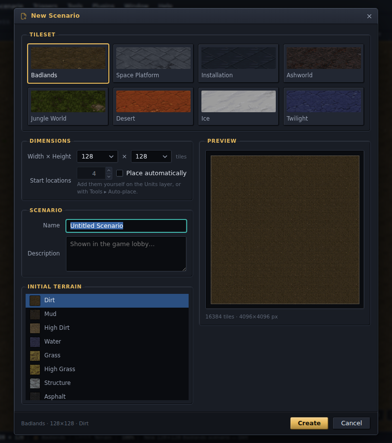

Give the map a name and a description — both are what players see in the game lobby —
and press Create.

### 2. Shape the ground

Stay on the Terrain layer and the **Isometric** tab. Pick *High Dirt* (Badlands; every
tileset has a high ground of its own), set the brush to 3×3, and drag across the map.
The cliffs around the high ground are laid for you, and where a stroke meets a terrain
the new one cannot touch, the terrain in between is put in. Painting *Water* works the
same way and gives you a shore.

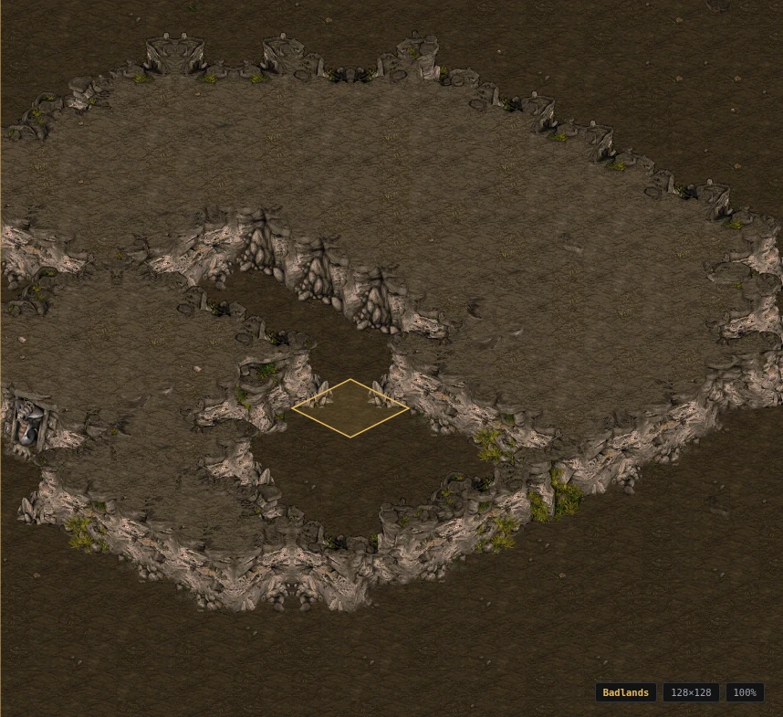

The brush size keys are `[` and `]`. Alt+click picks the terrain under the cursor.
Ctrl+Z takes back the whole stroke.

Ramps are not terrain: they are on the **Doodads** layer. Type `ramp` in its search box
to list them, click one, and click on a cliff edge; the ghost is red until the footprint
sits on ground it fits.

### 3. Place the bases

Switch to the **Units** layer (`U`). The start locations are already there. In the
palette, *Special* holds *Start Location* and *Resources* holds the mineral fields and
the Vespene Geyser, or type a name in the search box. Click a type to arm it, then click
on the map to place; Esc or a right-click stops placing.

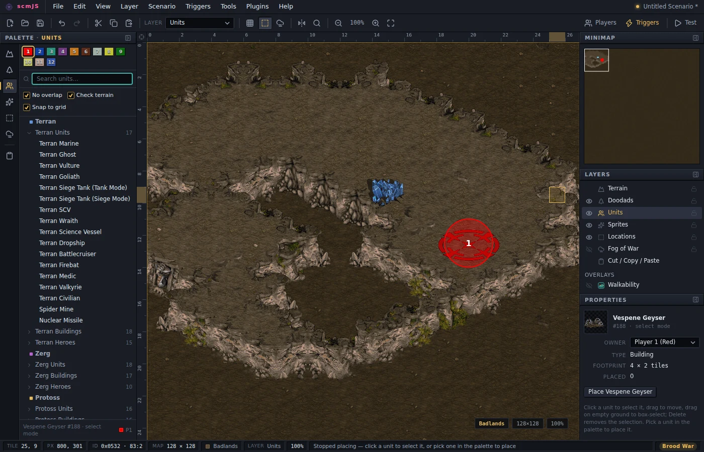

A mineral field holds 1500 minerals and a geyser 5000 gas when placed; double-click one
to change the amount, or select a whole line and set them all at once. Eight fields and
one geyser is the usual main.

*Snap to grid* keeps buildings and resources on the tile grid where the game expects
them. The two ticks above it are the game's own placement rules; a red ghost means the
game would drop the unit when it loaded the map, and the status bar says why.

For a symmetric map, Tools ▸ Symmetry mirrors what you paint and place across the axis
you choose. The Melee Wizard plugin (Plugins ▸ Browse Plugins…) lays out whole bases with
the mineral line at the distance the game mines fastest from.

### 4. Check the players

Scenario ▸ Player Settings is where each slot's controller, race and colour live. A melee
map needs *Human* and *User Selectable* on every slot that has a start location; that is
what a new map is set to already. Force Settings groups them into teams for the lobby.

### 5. Check the map

Tools ▸ Check Map lists what the game would object to: a start location with no player,
a unit off the map, too many units, and so on. Double-click a line to go to it.

View ▸ Walkability (Ctrl+Shift+W) draws the ground as a unit sees it: which areas
connect, where the chokes are and how wide, and which pockets cannot be reached at all.
It updates as you edit.

### 6. Save and play

Ctrl+S saves. A new map opens the Save dialog the first time, where the name and the
file format are chosen; `.scx` is a Brood War map. From then on Ctrl+S writes the file in
place (Chrome, Edge, the desktop app) or downloads it (Firefox, Safari) — the notice at
the bottom right says which.

Ctrl+F5 is Test Map. Neither StarCraft build opens a map handed to it from the outside,
so the editor writes the map into a `scmJS` folder under the game's *Maps* folder, where
**Single Player ▸ Custom Game** lists it; the desktop app then starts the game as well.

That is a playable melee map. Triggers, briefings, custom unit settings and everything a
"Use Map Settings" map needs are in the sections below.

## Terrain

Four brushes, each a tab in the palette:

| Brush | Paints |
| --- | --- |
| Isometric | StarEdit's diamond brush. Sets the diamond under the cursor to a terrain and lays the cliffs and edges around it. The one to use for almost everything. |
| Rect | Flat ground of one terrain type, in left/right tile pairs with StarEdit's random variation mix. No cliffs, no edges. |
| Tile | Any single tile by number: cliff pieces, doodad tiles, anything the tileset has. |
| Blend | One tile next to a tile you picked, chosen from those whose facing edge continues it. |

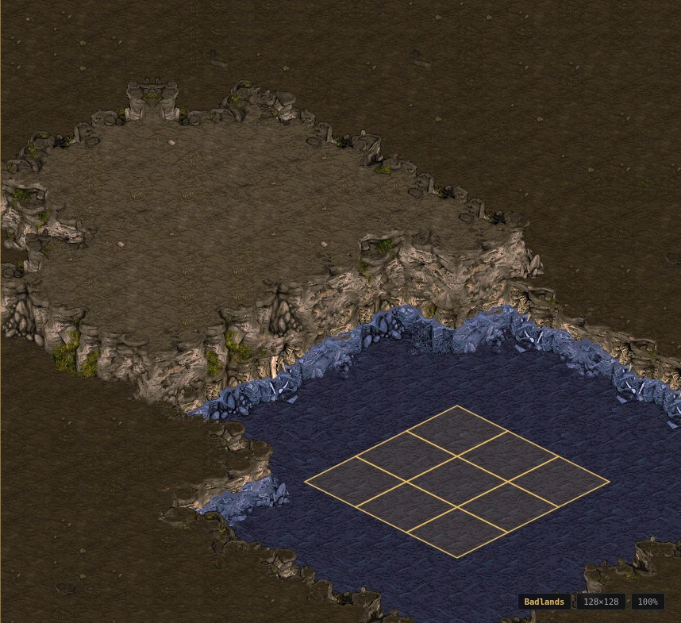

Drag to paint. `[` and `]` resize the brush from 1×1 to 7×7, Alt+click picks the terrain
or tile under the cursor, and right-click offers Pick and Fill Area. The Properties panel
breaks the tile under the cursor into group, slot, elevation, walkability and
buildability.

The isometric brush ripples outward as it paints: a neighbour that cannot legally border
the new terrain becomes the intermediate one, and cliff faces stack as tall as the
tileset draws them. A single click of high ground gives a small mesa; a wider brush gives
flat high ground inside a cliff ring. It needs the map's `ISOM` section, which is the
editor's own record rather than anything the game reads, and which protected maps often
strip. Where a map has none, the tab says so and the Repair plugin (Tools ▸ Repair Map…)
reconstructs it: exact for ground that was laid down isometrically, a best guess under
doodads and hand-placed tiles. The tab also warns when Rect or Tile edits have left the
record out of step with the terrain.

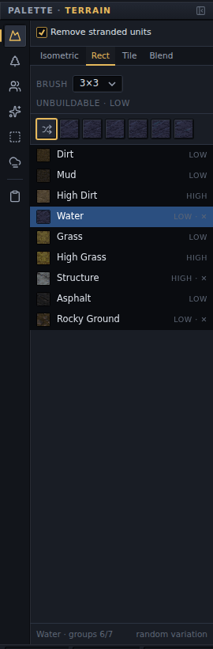 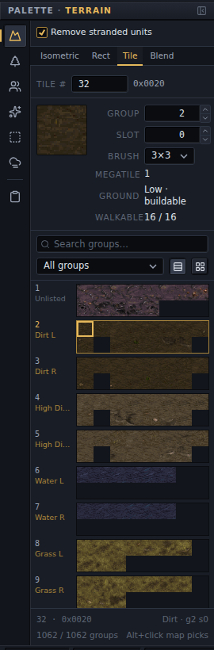 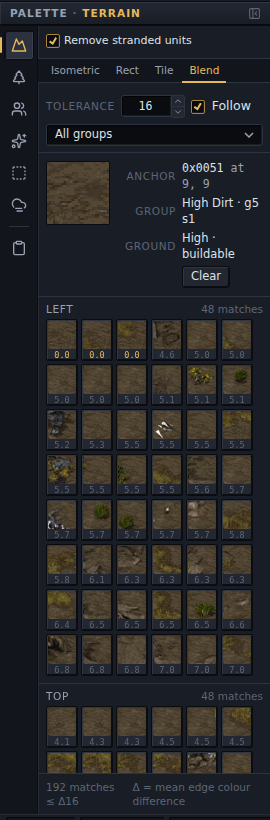

Rect lays the flat pairs and nothing else, which is what you want for filling an area you
will shape afterwards, or for ground under a doodad. Tile is for the pieces the isometric
brush will not give you: a single cliff tile, a doodad's tile, a corner the cliff sets do
not have. Blend is for joins the cliff sets never had — dirt into a doodad's base, one
edge set into another, a hand-laid shoreline: click a tile to make it the anchor, and the
palette lists for each side the tiles whose opposite edge continues its pixels, best
seam first, with the mean colour difference under each thumbnail. Rect, Tile and Blend
leave the isometric record alone, which is what SCMDraft does in its non-isometric modes.

Two overlays on the View menu show what the ground means to the game:

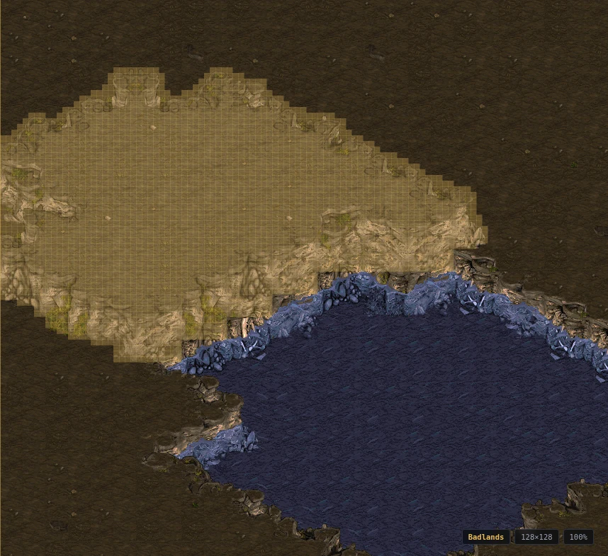

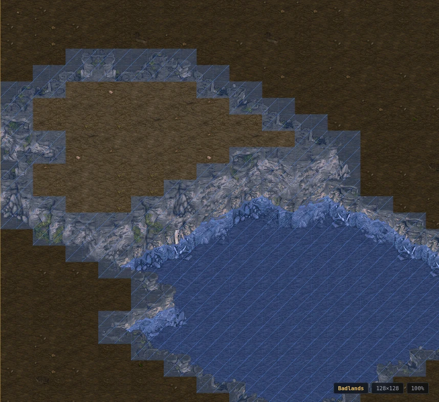

Tools ▸ Replace Terrain turns every tile of one terrain type (or one exact tile) into
another, over the whole map or the area marked on the Cut / Copy / Paste layer; Fill
Terrain lays the whole map anew. Both are one undo step.

Tools ▸ Symmetry mirrors what you do across the map's axes or about its centre — every
brush, the fills, and placing units, sprites, doodads and locations, each as one undo
step. The axes show on the map while a mode is on, the ghost shows where the images will
land, and a doodad that would have to turn is skipped. Blend, moving and deleting are not
mirrored.

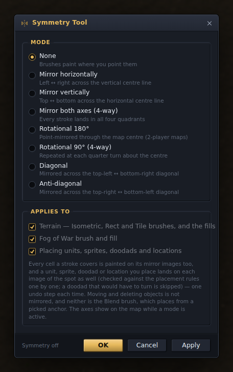

The Terrain palette's *Remove stranded units* tick deletes the units a stroke has just
made illegal (a building now half on a cliff) as part of the same undo step.

## Doodads

Trees, rocks, ruins, ramps, bridges: pieces of terrain that come with their own tiles and,
sometimes, a sprite drawn over them. The palette is built from the current tileset's
own groups, with StarEdit's categories and placement rules.

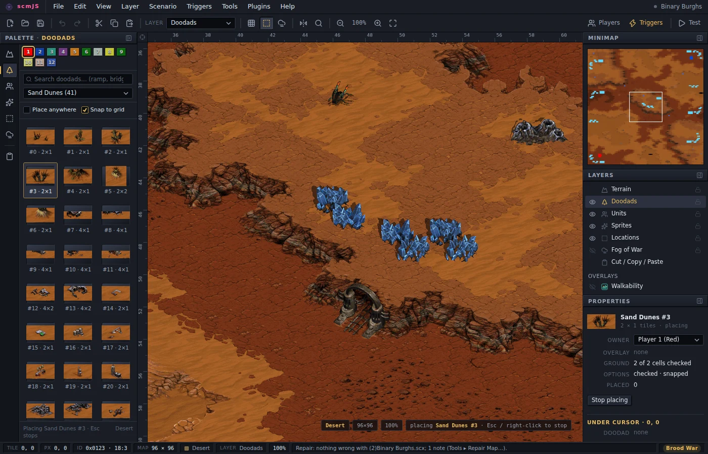

Picking a doodad arms placement, and the ghost turns red where the footprint leaves the
map, covers another doodad or sits on the wrong terrain. *Place anywhere* drops that
rule; *Snap to grid* keeps the footprint on StarEdit's two-tile isometric grid, which it
does for a move as well as a placement. Right-click or Esc stops placing.

Doodads have no names in the game data, so the search box matches what the data does
say: the category (`bridge`, `temple`, `coastal`), the id (`#12`), the footprint
(`6×6`), the sprite or unit an overlay draws (`hdrock`, `Xel'Naga Temple`), and the
word `ramp` for anything whose tiles carry the ramp bit, which StarEdit files under
cliffs and walls without saying so.

A placed doodad stays whole across the three places a map keeps it — its tiles, its
record and any canopy or door overlay — and removing one restores the ground underneath.

## Units

Everything the game has a unit for: the three races' units and buildings, heroes,
critters, resources, start locations, beacons, powerups. The palette groups them by
race, and the search box takes a name or an id.

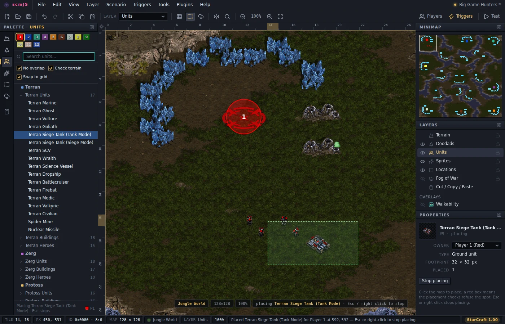

Picking a unit type arms placement, and each click on empty ground places one for the
player selected at the top of the palette. Esc or right-click stops placing and drops you
into select mode, where a click selects, a drag on empty ground marks a box, and a drag on
a unit moves it. Del deletes the selection.

**Snap to grid** puts buildings, resources, start locations and beacons on the tile grid
by their placement box, the way StarEdit stores them, and every other unit on the
nearest tile centre. Turn it off for pixel placement, SCMDraft-style. It applies to a
move as well as a placement, so dragging a unit that sits off the grid brings it back
onto it.

The **placement checks** are on by default and refuse a spot with a red ghost and a
reason in the status bar. They are the rules the game applies when it loads a map and
silently drops the units that do not fit: no overlapping collision boxes for ground units
and buildings, buildable tiles under a building's whole placement box, walkable ground
under a unit. The unit in the way gets outlined. Untick them for a stack of units on
purpose, and expect the game to keep only the first.

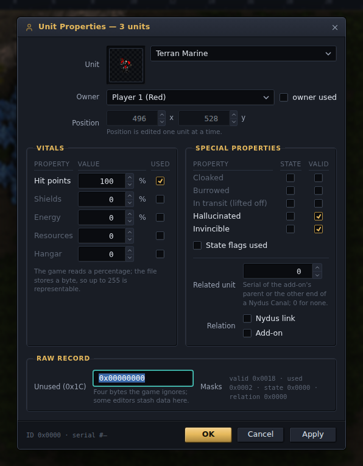

Double-click a unit for every field its record holds: owner, position, hit points,
shields, energy, resources and hangar count with their "used" ticks, the special
properties (cloaked, burrowed, lifted off, hallucinated, invincible), and the related-unit
link an add-on or a Nydus Canal uses. With several units selected, only the fields you
touch are written to all of them, so a mineral line can be set to one amount in one go.

Tools ▸ Auto-place Start Locations puts one start location per player on a ring or in
the corners, each moved to the nearest ground the placement checks accept, and selects
them so you can drag them where you want.

## Sprites

Two kinds. Pure sprites are a graphic drawn where it stands with no unit behind it: tree
canopies, markers, glows. Unit sprites are records the game turns into a unit when the
map loads, which is how StarEdit does Installation doors and traps.

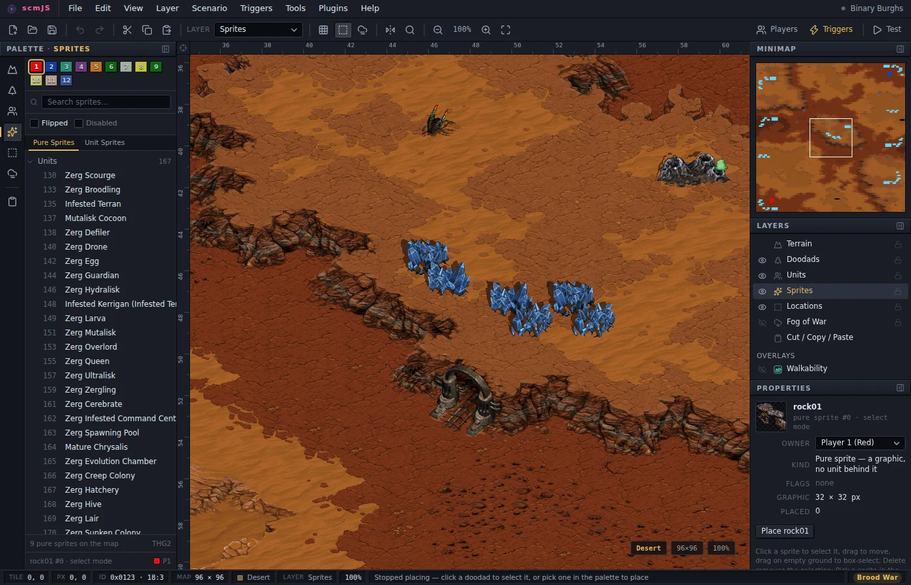

The palette has a tab for each. Pure Sprites lists all 517 entries grouped as Units,
Effects and Doodads, the last named after the graphics file since the game ships no
sprite name table. Placement is free: click anywhere, no rules to refuse a spot. The
*Flipped* and *Disabled* ticks are the sprite flags.

Doodad overlays are ordinary sprite records and can be selected here too. The
Properties panel says which doodad one belongs to and warns that moving it alone leaves
the doodad's tiles behind.

## Locations

The rectangles triggers refer to: "bring a unit to *Beacon*", "create a unit at *Spawn*".
A melee map needs none.

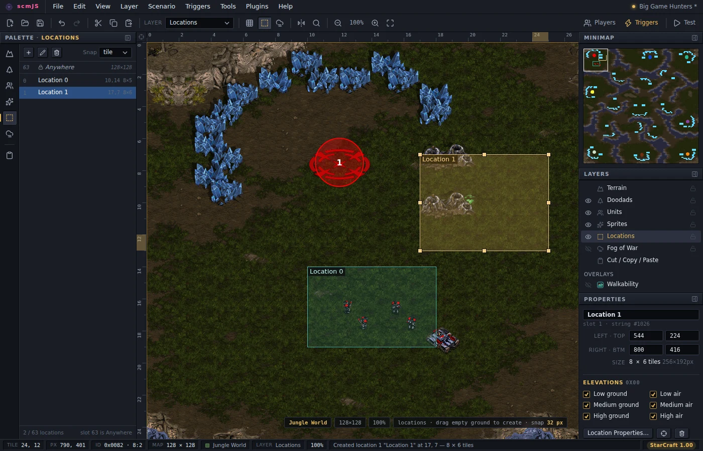

Drag on empty ground to create one, drag the eight handles to resize, drag inside to
move, arrow keys to nudge. *Snap* is off, 8 or 16 pixels, one tile or 64 px, and a move
snaps the box's corner rather than the pointer, so a box picked up off-grid lands on
it. The palette lists every location in use, and Scenario ▸ Locations is the same list
as a sortable table.

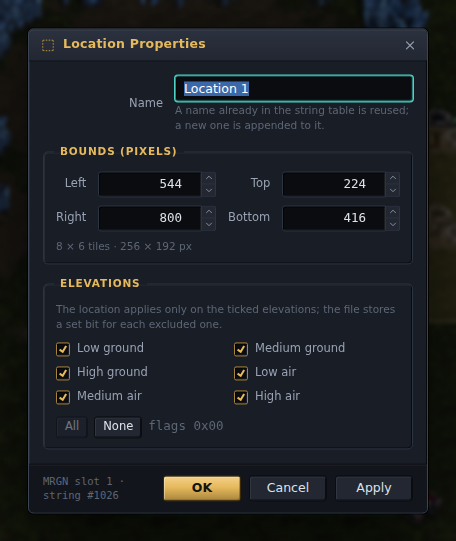

Double-click one for its name and exact bounds, and for the elevation ticks: a location
applies only on the ticked elevations, which is how you keep a trigger from firing on the
cliff above it. An amber stripe on a location's row marks one that excludes something.

Locations live in a fixed table of slots — 64 in original maps, 255 in Brood War — so
nothing is ever inserted or removed: a new location takes the lowest free slot, deleting
one blanks it, and triggers keep pointing at the slot they named. The last slot is
**Anywhere**, the location every trigger can pick, and the game and other editors depend
on it being exactly the map. It is pinned at the top of the list with a lock, never
drawn, never picked by a click, and cannot be moved, renamed or deleted. If a map's
Anywhere has gone missing or drifted off the map bounds, the editor offers to put it
back.

## Fog of war

Which tiles a player starts the game unable to see. Every player has their own, and a
map that carries no fog data at all starts fully fogged — which is what a new map does,
and what the editor draws until the first stroke.

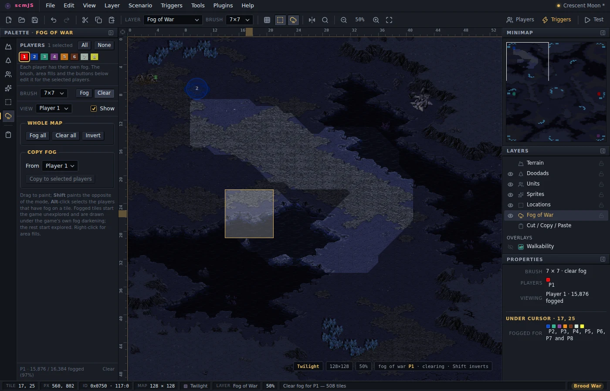

Select any of the eight players at the top of the palette and every stroke and fill edits
all of them at once; *View* picks whose fog the map and minimap show. *Fog* and *Clear*
are the brush modes, Shift-drag paints the opposite, and Alt+click picks up which players
have fog on a tile. Fog All, Clear All, Invert and Copy Fog act on the whole map for the
selected players.

Fogged tiles darken over everything, units and locations included, in the tint the game
itself uses for that tileset.

## Cut, copy and paste

Drag on the map with the Cut / Copy / Paste layer active (`C`) to mark a rectangle, then
Ctrl+C or Ctrl+X. On the object layers the same keys act on the selection instead, and
the clip is the selection's bounding box carrying just those objects, so a base can be
copied from either side.

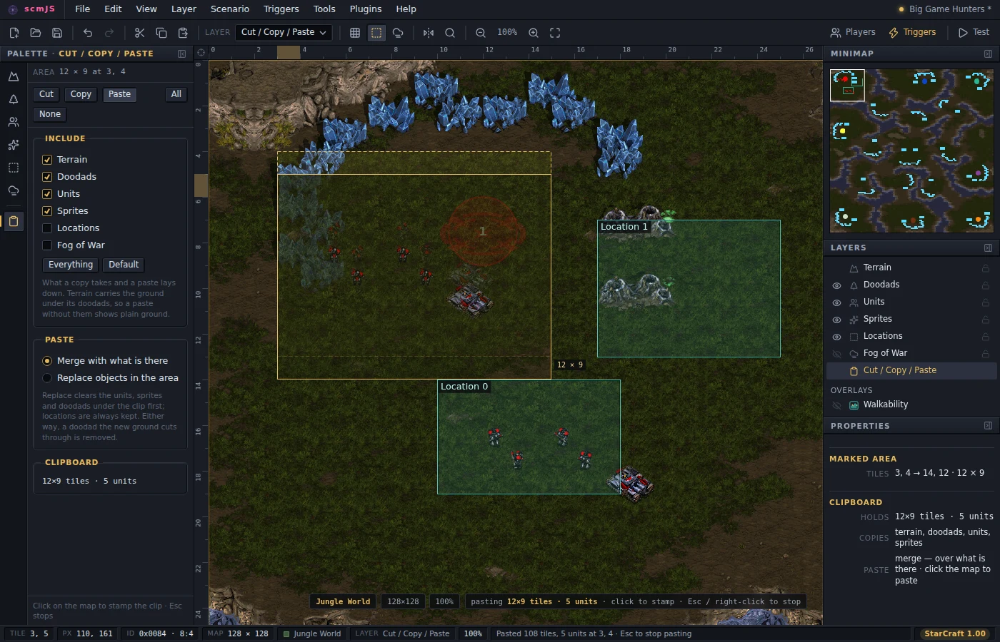

*Include* says both what a copy takes and what a paste lays down: terrain, doodads,
units, sprites, locations, fog. Terrain carries the ground under the doodads too, so a
paste without doodads shows plain ground rather than half a tree. Doodads are re-stamped
with their overlays, units get fresh serials with add-on and Nydus links kept when both
ends came along, and locations take free slots, which is the one thing a paste can run
out of.

Ctrl+V arms the pointer with a ghost of the clip. A click stamps it and stays armed for
the next; Esc or right-click stops. *Merge* adds to what is there; *Replace* clears the
units, sprites and doodads under the clip first, though never locations. Terrain from a
different tileset is refused, since tile numbers mean something else there, while the
objects still paste. The clip survives File ▸ Open, which is how a base moves between
maps.

## Triggers

Triggers are what turn a map into a scenario: *when* these conditions hold *for* these
players, *do* these actions. In a melee game the map's triggers are ignored and the game
applies its own rules, so a melee map needs none (Blizzard's own carry the three standard
ones — defeat, victory, starting resources — for anyone who opens them as Use Map
Settings); a "Use Map Settings" map is nothing but triggers. Three editors over the same
list, and a fourth for mission briefings.

### The Trigger Editor

Ctrl+T. The StarEdit form: a player filter on the left, the trigger list in the middle,
and for the selected trigger its players, up to 16 conditions and up to 64 actions.

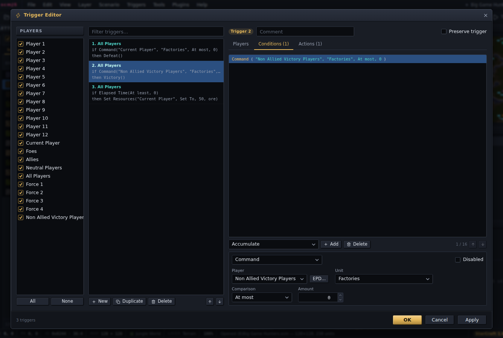

Every condition and action the game has is there, each argument gets a widget of its
kind — a player pick, a unit type list, a location list, a number, a text box with the
colour codes — and any value the tables do not list stays selectable as a raw number,
which is how EUD players and odd unit ids get in. An item can be disabled without deleting
it, as in SCMDraft; a disabled one is kept in the file and skipped by the game. *Preserve
trigger* is the flag that keeps a trigger firing more than once.

### The Text Trigger Editor

Ctrl+Shift+T. The same triggers as text, in SCMDraft 2's TrigEdit syntax, so text from
SCMDraft pastes in and text from here pastes back out. Compile checks it and reports the
first line that does not parse.

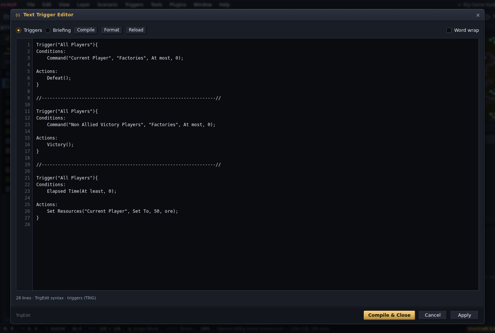

A leading `;` disables a line, and a `Flags:` block carries the trigger flags SCMDraft
has no syntax for. The *Briefing* switch at the top edits the mission briefing in the
same syntax.

### The Script Editor

A plugin, Trigger Script ([scm-js/plugin-trigger-script](https://github.com/scm-js/plugin-trigger-script)),
installed from Plugins ▸ Browse Plugins…. It keeps a TypeScript file inside the map that
generates triggers, at two levels: one `trigger()` call per trigger, and structured code
with variables, `if`, loops and functions, which compiles down to a state machine built
out of death counters — no EUD anywhere in it, so what comes out runs on any version of
the game. A built-in simulator runs thirty cycles of the result and says what happened.
The language is described in that repository's README.

Triggers a plugin generates show up in the Trigger Editor with a badge and are locked
there, with a button to the plugin's own editor; the text editor fences them in
comments; hand-made triggers around them are left alone.

### Mission briefings

Triggers ▸ Mission Briefing… is the same form over the briefing action set: text,
portraits, transmissions and the pauses between them, one briefing per player. The
layout is checked against the briefings on Blizzard's own multiplayer maps.

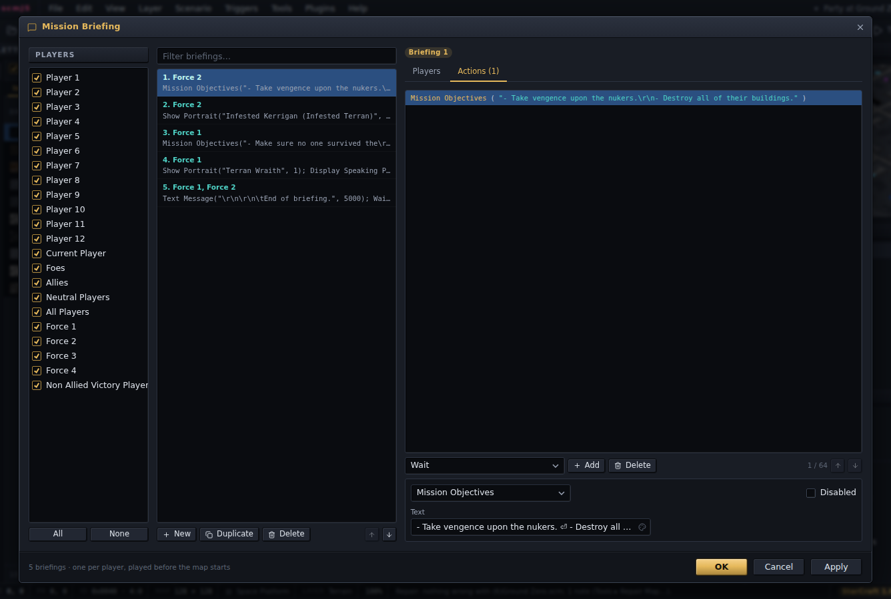

### Unit properties slots

Triggers ▸ Unit Properties Slots… is the table behind the *Create Unit with Properties*
action: 64 slots, each the hit points, shields and energy (as percentages), resources,
hangar count and special states a trigger applies to the units it creates. The action's
argument lists the slots by what they set and opens this editor on one.

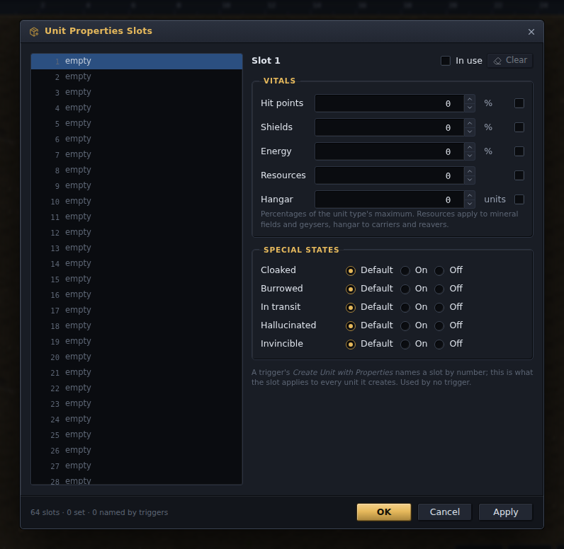

### EUD

For EUD work, the player pick next to a Deaths condition or Set Deaths action has an
*EPD* box: type a memory address and it becomes the player value that reaches it
through the deaths table, and a raw value shows which address it reaches. Check Map
points out the raw values so they are not mistaken for errors.

File ▸ Import and Export carry triggers as `.trg` files (SCMDraft's format) or as text,
appending to or replacing the map's list. Triggers ▸ Validate Triggers is Check Map
restricted to them.

## Scenario settings

The Scenario menu holds the map's own tables. Each dialog is its own OK / Apply / Cancel
transaction; none of it is in the undo history.

### Map Properties, Players, Forces, Colours

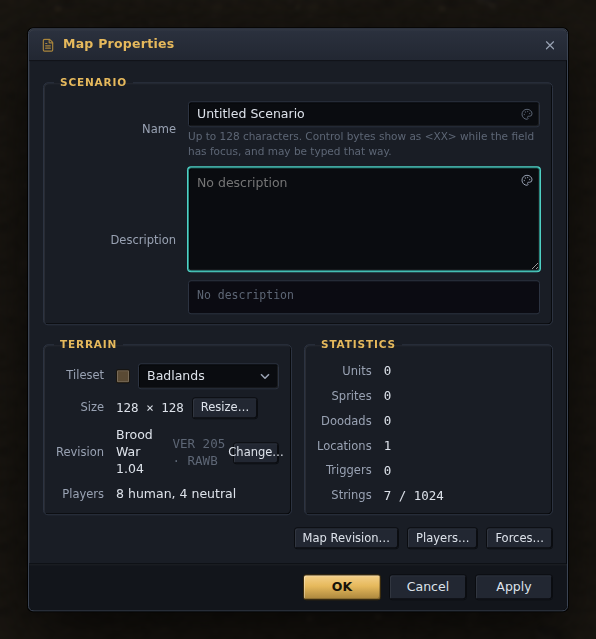

**Map Properties** (Alt+Enter) is the name and description the lobby shows, the tileset,
the size and the revision, with buttons to the rest. Changing the tileset lays the terrain
again with a terrain you pick — tile numbers mean something else in every tileset — and
drops the doodads with it, while units, sprites, locations, fog and triggers stay; or
keep the tile numbers, as SCMDraft does, to see what they draw. **Resize / Crop** grows
or trims the map about a corner or the centre. Both clear the undo history.

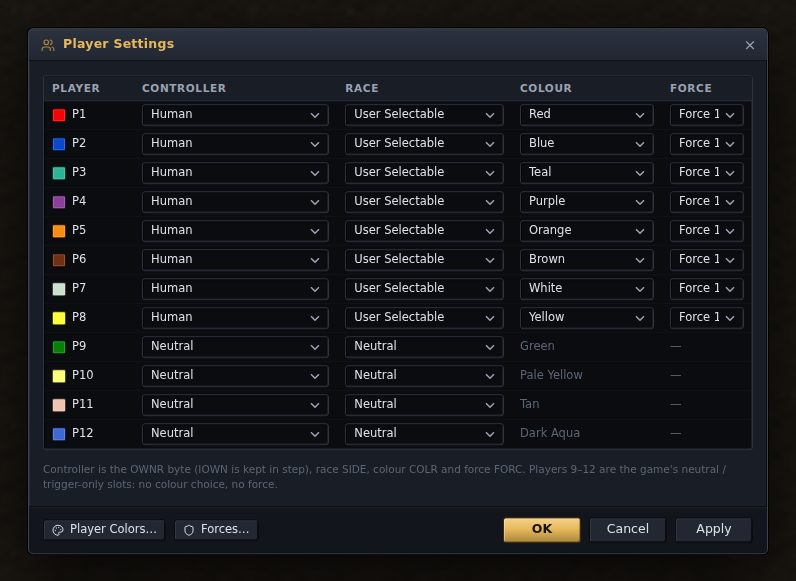

**Player Settings** is each slot's controller (Human, Computer, Rescuable, Neutral…),
race, colour and force.

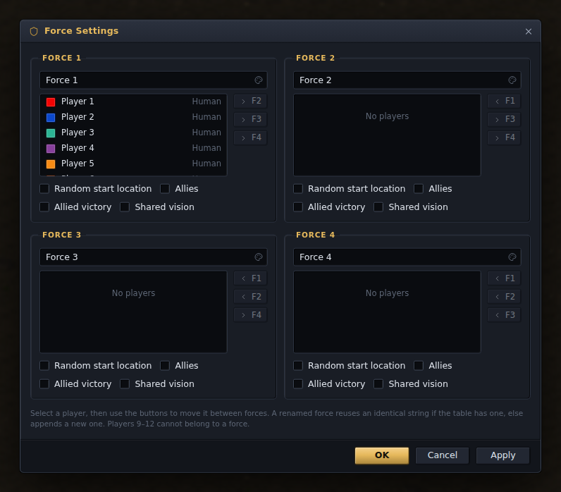

**Force Settings** groups the players into up to four teams and sets, per team, allied
victory, shared vision, allies and random start locations.

**Player Colors** picks each slot's palette colour and, for a Remastered map, a custom
RGB, random, or the player's own choice; the map repaints as you change them.

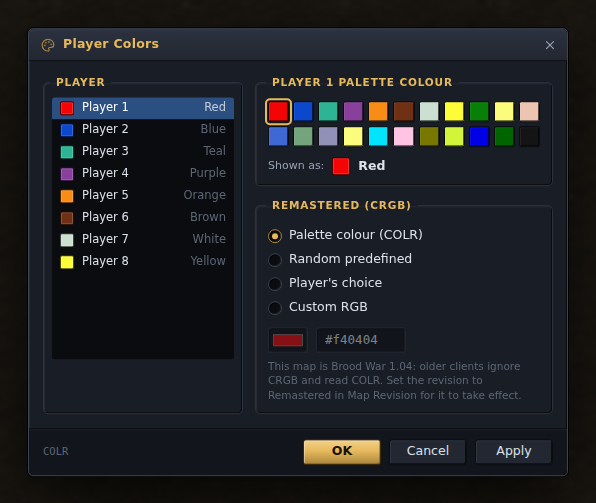

### Units, upgrades and technology

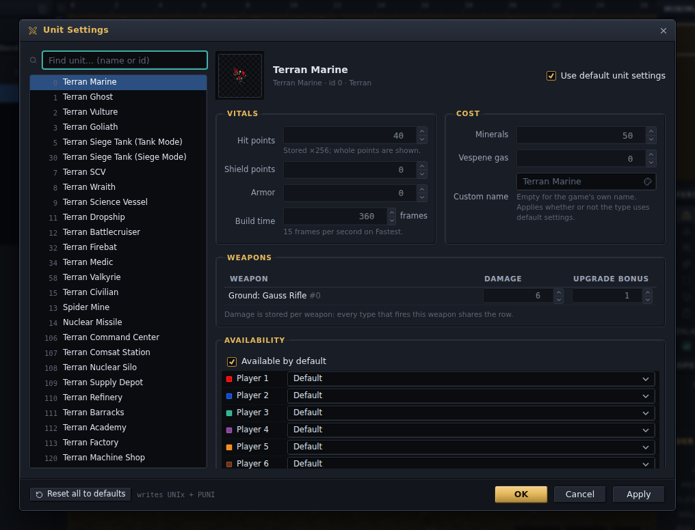

**Unit Settings**, **Upgrade Settings** and **Technology Settings** edit the cost and
availability tables: a unit's hit points, armour, build time, cost and weapon damage, a
custom name, and which players may build it; an upgrade's cost and levels; a
technology's cost and whether each player starts with it or may research it. A row on
*use default* shows the greyed-out numbers from the game's own data files and seeds itself
from them when you untick it.

### Strings

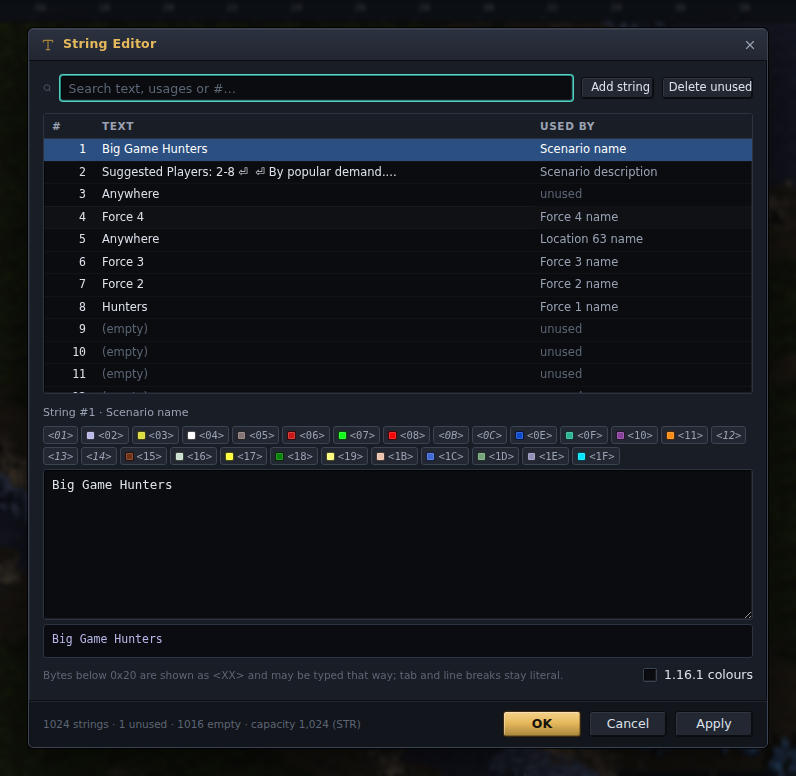

Every piece of text a map carries — its name, the force names, location names, every
trigger message — is a numbered string, and the **String Editor** lists them all with
where each is used. Edits keep their number, so triggers and locations keep pointing
where they did; *Delete unused* clears out what nothing refers to.

The row of buttons inserts the game's colour codes, each drawn in the colour it produces,
and the preview under the box shows the string the way the game draws it. The same codes
work in every field whose text the game draws: the map name and description, force names,
custom unit names, and the text of a trigger or briefing action — each of those fields
shows the string as the game draws it until you click into it, and has a palette button
at its right-hand end.

The previews follow Remastered's rule, where a colour set on one line carries onto the
next. StarCraft 1.16.1 reset the colour at every line break, so a string written before
the remaster can draw in colours its author never chose; the *1.16.1 colours* tick (also
in Preferences ▸ Display) switches every preview to the old rendering, and the Repair
plugin offers to write the reset the old game used to supply.

### Sounds and switches

The **Sound Editor** joins the map's sound table with the `.wav` files in the archive:
import, play, remove, and adopt files the archive carries but the table does not list.
Import takes any file the browser can decode (MP3, FLAC, AAC, Ogg, WAV in any encoding)
and writes it as PCM WAV in the format picked next to the button; the default, 22050 Hz
16-bit mono, is what the game's own sounds are, and the smaller presets are for maps
chasing the size limit. A *Play WAV* action then names the file.

**Switches** names the 256 switches triggers set and test, so the trigger editors show
"Gate open" rather than "Switch 3".

## Checking, testing and saving

### Check Map

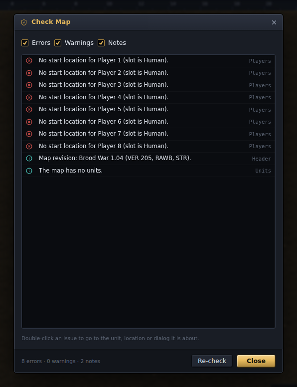

Tools ▸ Check Map looks for what the game would refuse or silently drop: start locations
that do not match the player table, the unit limit (1700), off-map units, a missing or
moved Anywhere, triggers pointing at unused locations or strings past the end of the
table, unit and player values the game does not have, AI scripts it does not ship, Play
WAV actions with no file in the archive, switches tested but never set, and the file's
own health — missing sections, player types where StarEdit's copy disagrees with the
game's, the isometric record. Double-click an issue to go to it. The same check runs
inside the Save dialog.

### Test Map

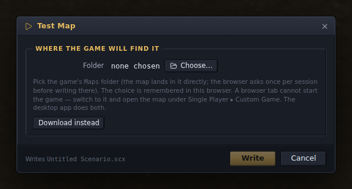

Tools ▸ Test Map (Ctrl+F5) hands the map to the game. Neither StarCraft build opens a map
from the outside, so the editor writes it into a `scmJS` folder under the game's Maps
folder, where Single Player ▸ Custom Game lists it. The desktop app finds the
installation (or takes a folder you pick) and starts the game as well; in Chrome and
Edge the map goes into a folder you pick once, and other browsers download it.

### Saving

Ctrl+S writes the map back where it came from. In Chrome, Edge and the desktop app the
editor keeps a handle to the file it opened, so Save writes in place once the browser has
asked for permission. Firefox and Safari give the editor a file's contents but no way to
write it back, so there every save is a download, and the notice at the bottom right says
so. Save As (Ctrl+Shift+S) and Save Copy As open the Save dialog; a copy is written
without the open map changing its name or file.

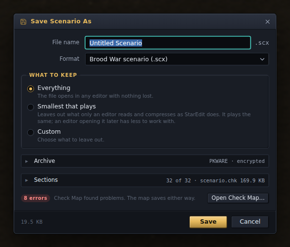

The Save dialog is where the file's shape is decided:

- **Format**: `.scx` (Brood War), `.scm` (original StarCraft), or a bare `.chk`, the
  scenario alone with no archive around it.
- **Compression**: PKWARE is what StarEdit writes and what Blizzard's own maps are
  stored as, so every StarCraft build reads it; zlib is smaller and needs 1.16.1 or
  Remastered; none is the largest and readable by anything. A map keeps the compression
  it was opened with. StarEdit's encryption is a tick beside it.
- **Other files in the archive**: the sounds and the files plugins keep there, each with
  a tick, so a copy for release can leave them out. A member the editor cannot name — a
  protected map's archive often has no file list — is kept exactly as stored, and the
  dialog says how many there are.
- **Sections**: the parts of the file only an editor reads (the isometric record, the
  editor's copies of the player table and so on) can be left out to make a smaller file
  — the dialog says what each costs an editor later, and *Smallest that plays* ticks
  them all. The map in the editor is not changed.

The options confirmed here are what Ctrl+S reuses for that map from then on.

### Export an image

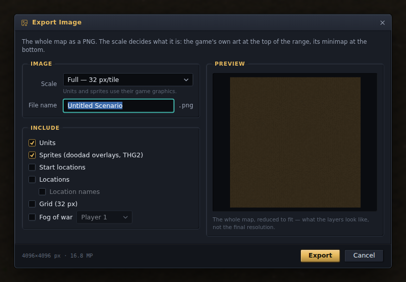

File ▸ Export ▸ Image renders the whole map to a PNG, with one dial that decides what
the picture is: at 32 pixels per tile it is the full game art, at 8 or 16 the same
smaller, at 4 and 2 the mean tile colours with units as minimap dots, and at 1 pixel per
tile it is the game's minimap. Units, locations, fog and the grid are each a tick.

Tools ▸ Statistics counts what the map holds — units per player, resources, doodads,
triggers, strings — and Ctrl+F finds a unit, location, sprite, string or trigger by name.

## Plugins

Plugins add tools to the editor, and some of what this guide describes is a plugin:
Walkability, Paint, Repair, Terrain from Image and the scmscx.com search are installed
and on from the start, and Melee Wizard, Trigger Script, Section Explorer and AI are a
click away.

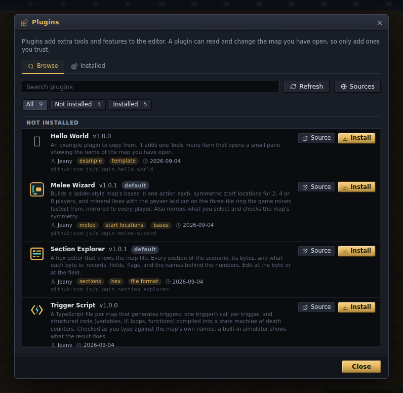

Plugins ▸ Browse Plugins… lists the plugins the project publishes; press Install on one
and it shows where the code comes from before adding it. Plugins ▸ Manage Plugins… lists
what is installed, turns each on or off, and takes the address of any other plugin —
a GitHub repository, a link to its `plugin.json`, or `http://localhost:3000/` while you
write one. There is no sandbox: a plugin has the same access as the editor itself, so only
add plugins you trust. The Add screen says as much and shows the manifest, the repository
and the addresses it will fetch from.

| Plugin | Where | What it does |
| --- | --- | --- |
| [Walkability](https://github.com/scm-js/plugin-walkability) | View ▸ Walkability (Ctrl+Shift+W) | Draws the ground as a unit walks it: islands, the areas the map divides into and the chokes between them with their widths, height seams with no ramp, and the distances between start locations. Reads only. |
| [Paint](https://github.com/scm-js/plugin-paint) | Tools ▸ Paint… (Ctrl+Shift+P) | Freehand, lines, shapes, spray and text, laying down whatever the active layer's palette has picked — so it paints units, doodads, sprites, terrain or fog depending on the layer. |
| [Repair](https://github.com/scm-js/plugin-repair) | on open, Tools ▸ Repair Map… | Reads a map the way the game does and lists what is missing, damaged, repeated or the wrong size, each with the repair and what the game does without it. Rebuilds a stripped isometric record. |
| [Terrain from Image](https://github.com/scm-js/plugin-image-to-terrain) | File ▸ Import ▸ Terrain from Image… | Turns a picture into terrain, over the whole map or a rectangle you drag, painted with the isometric brush so cliffs and shorelines are laid at every boundary. |
| [scmscx.com](https://github.com/scm-js/plugin-scm-scx) | File ▸ Find on scmscx.com… | Searches the map archive at [scmscx.com](https://scmscx.com) and opens the map you pick. The site does not yet allow a page served elsewhere to read it, so today the dialog explains and links to the site instead. |
| [Melee Wizard](https://github.com/scm-js/plugin-melee-wizard) | Tools ▸ Melee Wizard… (Ctrl+Shift+M) | Symmetric start locations, and mineral lines and geysers laid out at the distance the game mines fastest from; presets for main, natural and third; a symmetry check and a resource summary. |
| [Trigger Script](https://github.com/scm-js/plugin-trigger-script) | Triggers ▸ Script Editor… | A TypeScript file kept inside the map and compiled into a block of the trigger list — `if`, loops and variables included. |
| [Section Explorer](https://github.com/scm-js/plugin-section-explorer) | Tools ▸ Section Explorer… (Ctrl+Shift+H) | The map file as the game reads it: every section, a hex editor over the bytes, and what the byte under the cursor means. |
| [AI](https://github.com/scm-js/plugin-ai) | Tools ▸ AI | Generates and reviews maps, writes triggers and briefings, rewrites strings, and an assistant panel that edits the map from a description. Needs a server to talk to, or your own Anthropic key. |

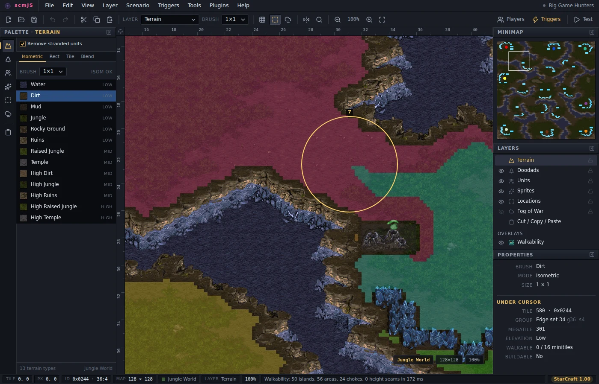

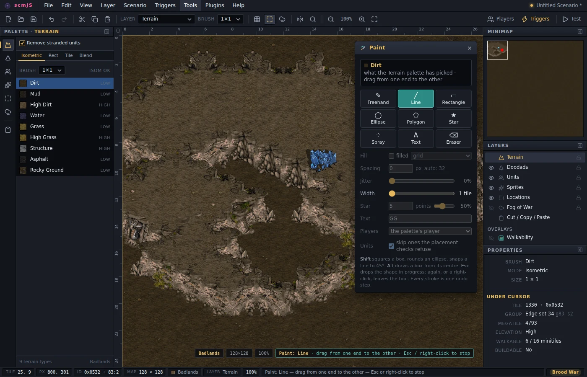

Each plugin has its own README with the details. Installing plugins, what they are allowed
to do, and writing one are covered in [docs/plugins.md](docs/plugins.md). Browse Plugins
also lists [Hello World](https://github.com/scm-js/plugin-hello-world), an example plugin
with nothing in it but a Tools menu item, kept as the one to copy when writing your own.

## Keyboard and preferences

F1 lists every shortcut. The ones worth knowing up front:

| Keys | |
| --- | --- |
| `T` `D` `U` `S` `L` `F` `C` | switch layer |
| `[` `]` | brush size |
| Alt+click | pick what is under the cursor |
| Ctrl+Z / Ctrl+Y | undo / redo |
| Del / Esc | delete selection / stop placing |
| Ctrl+O, Ctrl+S, Ctrl+N | open, save, new |
| Ctrl+T, Ctrl+Shift+T | trigger editors |
| Ctrl+F | find |
| Ctrl+A | select all on the layer |
| Ctrl+G | grid |
| Ctrl+0, Ctrl+Shift+0 | 100%, zoom to fit |
| Alt+Enter | map properties |
| Ctrl+F5 | test map |

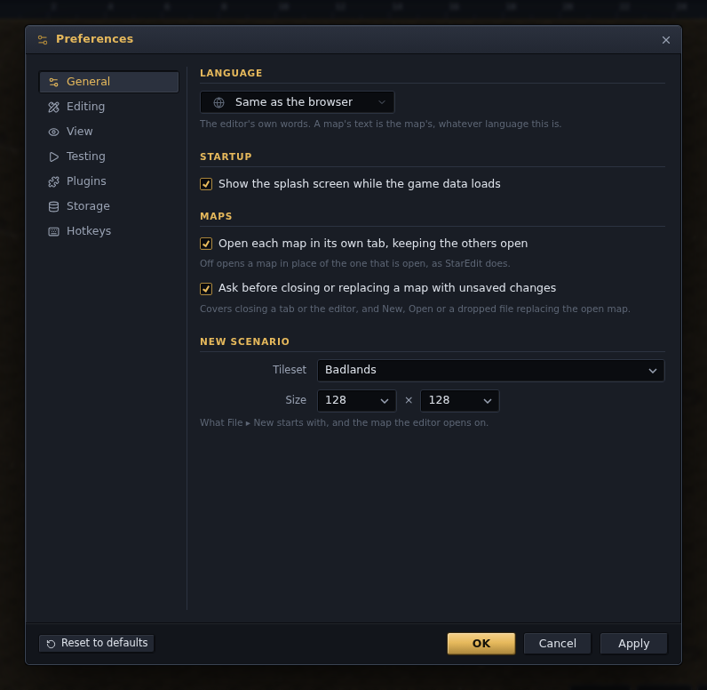

Preferences (Ctrl+,) are kept in the browser: the splash screen, whether to ask before
replacing a modified map (the same tick decides whether closing the tab or quitting the
desktop app asks about unsaved changes), the tileset and size a new map starts with,
whether water and units animate and how fast, Test Map's folder, and — in the desktop app
— whether to check for updates at startup. The grid, the snaps, the placement options,
the panels and the recent files are remembered too. Its *Browser storage* box lists
everything the editor keeps, one row per setting or cache, with a plugin's own data under
its name; each row can be cleared on its own, or **Clear all data** throws the lot away.
The map you have open is never kept there and is not touched by any of it.

## What works, and what does not

### Map files

| | Status |
| --- | --- |
| Open and save `.scm`, `.scx`, `.chk` | Yes. Save writes in place where the browser allows it (Chrome, Edge, the desktop app) and downloads elsewhere; the Save dialog chooses compression (PKWARE as StarEdit, zlib, none), encryption, which archive files ride along and which editor-only sections are left out, and shows what it will write first. |
| Preserve unmodelled sections, repeated sections and custom archive files | Yes |
| New map, with the full section set StarEdit writes | Yes |
| Resize and crop, with a 3×3 anchor | Yes |
| Switch revision: StarCraft 1.00, Hybrid, Brood War, Remastered | Yes |
| Change a map's tileset | Yes, in Map Properties: the terrain is laid again with the new tileset's terrain (the doodads go with it, everything else stays), or keep the tile numbers as SCMDraft does. Clears the undo history. |
| Open Recent | Yes. In Chrome, Edge and the desktop app a recent map reopens from disk (the file handle is kept in the browser; it asks once before reading). Firefox and Safari keep the names and reopen through File ▸ Open. |
| Open a map from the file manager | Yes, in the desktop app. The installers (Windows setup, `.deb`, AppImage, macOS) register `.scm`, `.scx` and `.chk`, so a double-click, "Open with", a drag onto the app's icon or a path on the command line opens the map — in the running window when one is already up. The Windows zip registers nothing (nothing is installed), but a map dragged onto `scmJS.exe` still opens. Dropping a map anywhere on the window works in every build, and in the browser. |
| In-app updates | Yes, in the desktop app. It checks GitHub at startup (a preference, on by default) and offers what it finds in a notice; Help ▸ Check for Updates… asks on demand. Nothing downloads or installs without being asked. Windows, the Linux AppImage and the `.deb` apply the update themselves; macOS can see one but not install it until the app is code-signed, so it offers the download page instead. |
| More than one map open at once | No. One map per tab or window; open the editor twice. |

### Terrain

| | Status |
| --- | --- |
| Isometric brush | Yes. Needs the map's `ISOM` section; the Repair plugin (on by default) rebuilds a stripped one. |
| Rect, Tile and Blend brushes | Yes |
| Flood fill, fill map, pick tile | Yes |
| Elevation and buildability overlays | Yes: ground height per minitile, unbuildable tiles hatched. |
| Water and lava animation | Yes |
| Symmetry | Yes. The Isometric, Rect and Tile brushes, the fills, the Fog brush, and placing units, sprites, doodads and locations all land on the images of the spot too (mirror, both axes, 180°, 90° and the diagonals on a square map). Moving and deleting are not mirrored, and neither is Blend. |
| Replace Terrain | Yes. One terrain type (or one exact tile) becomes another, over the whole map or the marked area, laid as the Rect brush lays it; one undo step. |
| Terrain from Image | Yes, as a plugin installed by default (File ▸ Import, or right-click the terrain palette / map: *into Area…* lets you drag the target first). File, paste, drop or URL; colour adjustments; key colours per terrain with an eyedropper; despeckle and island removal. |

### Objects

| | Status |
| --- | --- |
| Doodads: catalogue, placement rules, overlays, move, delete | Yes |
| Units: placement checks, properties, team colours, idle animation | Yes |
| Sprites: pure and unit sprites, flags, properties | Yes |
| Locations: create, resize, snap, rename, elevation flags | Yes |
| Fog of war, per player | Yes |
| Cut, copy and paste, including between maps | Yes |
| Paint: lines, rectangles, ellipses, polygons, stars, freehand, spray, text and an eraser, out of units, sprites, doodads, terrain or fog | Yes, as a plugin (on by default): Tools ▸ Paint…. Outlined or filled, spaced, jittered, per-player; one undo step each. |
| Find a map and open it | Yes, as a plugin (scmscx.com, on by default): File ▸ Find on scmscx.com… searches the map archive by name, tileset, players and size, shows minimaps, and opens the map you pick. |
| Auto-place Start Locations | Yes. Tools ▸ Auto-place Start Locations puts one per player on a ring or in the corners, each moved to the nearest ground the placement checks accept, as one undo step. The Melee Wizard plugin (install it from Plugins ▸ Browse Plugins…, then Tools ▸ Melee Wizard…) does the elaborate version: click where Player 1 starts and the others land on its images under the symmetry you chose, with bases. |
| Lock a layer | Yes, in the Layers panel: a locked layer's tools stop changing the map. |
| Lay out a base's resources: the mineral line on the three-tile ring, the geyser past its end, for every player at once | Yes, as a plugin (Melee Wizard). Press on the hall spot and drag towards the minerals; presets for main, natural and third; amounts, end-patch amounts, mineral types; spots the map refuses are shown in red and left out. Also bases at every start location in one go, a blocking patch tool, mirroring the selected units, a symmetry check and a resource summary. |
| See what a unit can walk: islands, unreachable pockets, the areas a map divides into and the chokes between them with widths, cliff seams with no ramp, ground distances between start locations | Yes, as a plugin (Walkability, installed by default: View ▸ Walkability or Ctrl+Shift+W). Read from the game's own minitile flags with buildings and resources as walls, drawn over the map as an overlay that stays on while you place units and follows every edit; hover reads the ground under the pointer; Tools ▸ Walkability… is the settings and the lists. |

### Triggers

| | Status |
| --- | --- |
| Classic editor: every condition and action, per-item disable | Yes |
| Text editor in SCMDraft's TrigEdit syntax | Yes |
| Script editor: a TypeScript subset that generates triggers | Yes, as a plugin (Trigger Script: install it from Plugins ▸ Browse Plugins…, then Triggers ▸ Script Editor…). |
| Import and export `.trg` and text triggers | Yes |
| Validate triggers | Yes |
| Mission briefings | Yes: the classic editor, the text editor's Briefing mode, Find and Statistics. The field layout is checked against the briefings on Blizzard's own maps (Ground Zero, Spring Thaw), which put the portrait slot where the community reference does not. Transmission is the one action no Blizzard map uses. |
| Create Unit with Properties (CUWP) | Yes. Triggers ▸ Unit Properties Slots… edits the 64 slots (vitals, resources, hangar, the special states), the action picks a slot by what it sets, and Check Map flags a slot that sets nothing. |
| EUD triggers | Yes, as far as an editor without an address database goes: any raw player and unit value is accepted, the player pick has an EPD box that turns a memory address into the player value a Deaths condition or Set Deaths action needs (and shows the address a raw value reaches), Check Map points out the raw values, and the script's raw level has `Memory` / `SetMemory`. |

### Scenario data

| | Status |
| --- | --- |
| Map properties, players, forces, colours (including Remastered RGB) | Yes |
| Unit, upgrade and technology settings, with per-player availability | Yes |
| String editor with a usage list, and unused-string cleanup | Yes |
| Switch names | Yes |
| Sound editor | Import converts MP3, FLAC, AAC, Ogg and any WAV to PCM WAV at a chosen rate; play, remove, adopt archive files and re-encode a listed `.wav` all work. The editor reads every WAV encoding the game and the usual tools produce itself (8 to 32-bit PCM, float, A-law, µ-law, IMA and Microsoft ADPCM), so the game's own sounds play and convert; MP3, Ogg and FLAC go through the browser's decoders. |

### Tools

| | Status |
| --- | --- |
| Check Map | Yes |
| Find (units, locations, sprites, strings, triggers) | Yes |
| Statistics | Yes |
| Export the map as a PNG, from full art down to a minimap | Yes |
| Import and export strings | Yes |
| Plugins (Plugins ▸ Browse Plugins… / Manage Plugins…) | Yes. Search the project's published plugins and install one, or load a `plugin.ts` from any public repository or URL; it can add menu items, context-menu entries, hotkeys, dialogs, floating panels and map tools of its own, and edit the map through undo. See [docs/plugins.md](docs/plugins.md). |
| Look at and edit the file itself: every CHK section, its bytes, what each byte means | Yes, as a plugin (Section Explorer: install it from Plugins ▸ Browse Plugins…, then Tools ▸ Section Explorer…). A hex editor with the sections listed, fields coloured and named, values edited as numbers, choices, flags or text; sections added, removed, renamed and reordered. |
| Repair a protected or damaged map: missing, repeated, mis-sized or hidden sections, a stripped ISOM | Yes, as a plugin (Repair, on by default: it checks every map as it opens, and Tools ▸ Repair Map… runs it by hand) |
| Test Map | Yes (Ctrl+F5). Neither StarCraft build opens a map from the outside, so Test Map writes the map into a `scmJS` folder under the game's Maps folder, where Single Player ▸ Custom Game lists it, and the desktop app starts the game as well. In Chrome and Edge the map goes into a folder you pick once (the game's Maps folder); other browsers download it. |
| Generate a map from a description, write triggers from one, explain triggers, name and describe the map, write a briefing, get a critique, translate the strings, or ask an assistant to make changes | Yes, as a plugin (AI: install it from Plugins ▸ Browse Plugins…, then Tools ▸ AI). It needs a server that holds an Anthropic key — [scm-js/ai-server](https://github.com/scm-js/ai-server) is one to deploy — or your own key typed into its settings. Every change it makes is one undo step. |

## Documentation

All of it is also a site — [docs.scmjs.dev](https://docs.scmjs.dev) — with these documents
as pages, a search box, and a reference for every call in the plugin API generated from
the editor's own declarations. It is built from the tag the hosted editor runs, so the
version in its footer is the one at [editor.scmjs.dev](https://editor.scmjs.dev). These
files stay the source; the site renders them.

| Document | Covers |
| --- | --- |
| [docs/game-data.md](docs/game-data.md) | Where the graphics come from, mods as data sets, and how the pictures get drawn |
| [docs/file-formats.md](docs/file-formats.md) | What is in a map file, what the editor preserves, revisions, protected maps |
| [docs/plugins.md](docs/plugins.md) | Writing and installing plugins; the plugin API |
| [docs/development.md](docs/development.md) | Running from source, the desktop app and the container, releases, contributing |
| [ATTRIBUTION.md](ATTRIBUTION.md) | Provenance of adapted algorithms, tables and dependencies |

The screenshots in this guide are made by `scripts/guide-screenshots.mjs` against the
editor's own fixture maps, so they can be taken again when the chrome changes.

## License

The original scm-js source is MIT-licensed; see [LICENSE](LICENSE). That license does
not cover upstream code, packages, research, names or game data.
[ATTRIBUTION.md](ATTRIBUTION.md) records where each of those came from, and
source-level credit sits beside the code it applies to.

StarCraft and Brood War are trademarks of Blizzard Entertainment. This is a fan
project, not affiliated with or endorsed by Blizzard Entertainment.
