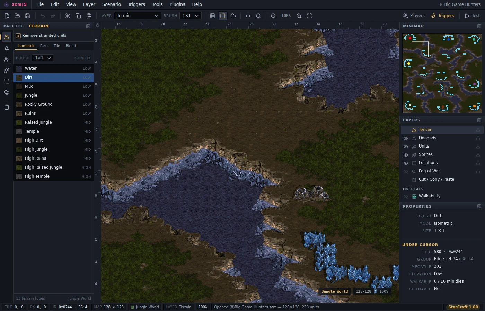

# scmJS

scmJS is a map editor for StarCraft, Brood War, and StarCraft: Remastered, modelled on StarEdit, SCMDraft 2, and StarForge. It is available in the browser and as a desktop app.

It opens the game's `.scm` and `.scx` maps (and a bare `.chk` scenario), draws them
with the game's terrain and unit graphics, and saves maps the game plays. Whatever it
does not understand in a file is copied through untouched - an unknown section, a
malformed one, an archive member it cannot name - so a map only loses what you
deliberately change.

> **Beta.** This editor needs to be extensively tested. Keep backups of maps you care
> about, and check anything important in-game before you rely on it.

The [user guide](docs/guide.md) covers everything the editor does, starting with
[your first map](docs/guide.md#your-first-map). It is also at
[docs.scmjs.dev](https://docs.scmjs.dev), with a search box.

## What it does

Besides the terrain, units, locations and triggers every StarCraft editor has, scmJS
does some things other editors do not. Each links to where it is explained; the ones marked
*Browse Plugins* are one click away under Plugins ▸ Browse Plugins… rather than installed
from the start.

- **Classic or Remastered graphics.** Point the editor at a StarCraft: Remastered
  installation and it draws the map with Remastered's terrain, units and moving water,
  at twice the detail. View ▸ Remastered Graphics switches between that and the classic
  look at any time. See [Classic or Remastered graphics](docs/guide.md#classic-or-remastered-graphics).
- **Several people on one map.** Share the map you have open, and anyone you send the
  link to edits it with you from their own editor, seeing the others' changes and
  pointers as they happen. See [Editing a map together](docs/guide.md#editing-a-map-together).
- **Triggers as code.** [TrigScript](docs/trigscript.md) writes triggers in TypeScript kept
  inside the map: loops and helpers that produce ordinary triggers, tests, and a simulator
  that plays the script through before you do. For StarCraft: Remastered, `program()`
  code runs in the game itself, with variables, arrays and functions, and is built into
  the map when you save.
- **Triggers as a graph.** Trigger Map (*Browse Plugins*) shows which triggers set a
  switch, a death counter or a location and which ones read it, and lists switches
  nothing sets, counters nothing reads and triggers that never run. See [Plugins](docs/guide.md#plugins).
- **The ground as a unit walks it.** View ▸ Walkability (Ctrl+Shift+W) draws the islands,
  the areas the map divides into, the chokes between them with their widths, and the
  distances between start locations. See [Plugins](docs/guide.md#plugins).
- **Damaged and protected maps.** The Repair plugin reads a map the way the game does
  when it opens, lists what is missing or broken with the fix for each, and rebuilds the
  isometric record protectors strip, so the terrain brush works again. Section Explorer
  (*Browse Plugins*) shows the file byte by byte, with what each byte means. See
  [Protected and damaged maps](docs/file-formats.md#protected-and-damaged-maps).
- **Nothing lost on save.** A section the editor does not know, a malformed one, or an
  archive file it cannot name is written back exactly as it was read. See
  [Opening and saving maps](docs/file-formats.md).
- **Terrain from a picture.** File ▸ Import ▸ Terrain from Image… turns an image into
  terrain, with cliffs and shores laid at every boundary. See [Plugins](docs/guide.md#plugins).
- **Stamps.** Save a ramp, a bridge or a mineral line once and lay it down on any later
  map from the Stamp Library. See [Cut, copy and paste](docs/guide.md#cut-copy-and-paste).
- **Doodads into terrain.** Right-click a doodad and *Convert Doodad to Terrain* keeps its
  tiles as ordinary ground you can edit tile by tile. See [Doodads](docs/guide.md#doodads).
- **A recording of the build.** Timelapse (*Browse Plugins*) records the map one change
  at a time and exports it as a GIF or a WebM video. See [Plugins](docs/guide.md#plugins).
- **Maps from scmscx.com.** File ▸ Find on scmscx.com… searches the community map archive
  and opens the map you pick; a link to `editor.scmjs.dev/scmscx/` and the map's id opens
  it straight away. See [Opening a map](docs/guide.md#opening-a-map).
- **Work kept.** Several maps open at once in tabs, a recovery copy of unsaved work if the
  editor closes, and the version a save replaced kept as a `.bak` or under File ▸ Previous
  Versions. See [Saving](docs/guide.md#saving) and [Recovery copies](docs/guide.md#recovery-copies).
- **In English or Korean.** Preferences ▸ General switches the editor's language. See
  [Keyboard and preferences](docs/guide.md#keyboard-and-preferences).

## Getting started

- **In the browser** at [editor.scmjs.dev](https://editor.scmjs.dev). Nothing to install,
  and your maps stay on your own disk.
- **As a desktop app** for Windows, macOS and Linux, from the [releases](../../releases)
  page. It finds a StarCraft installation on its own and opens a map on a double-click.
- **In a container**, for a server on your own network: `docker run --rm -p 8080:80
  ghcr.io/scm-js/scm-js:latest`, then open `http://localhost:8080`.

The game's graphics do not ship with the editor; on first use it offers a free download
from Blizzard, or takes the `.mpq` files of a classic installation. See
[docs/installing.md](docs/installing.md) for all of it, then the guide's
[first map](docs/guide.md#your-first-map).

## Documentation

All of this documentation is also a site — [docs.scmjs.dev](https://docs.scmjs.dev) — with these documents
as pages, a search box, and a reference for every call in the plugin API generated from
the editor's own declarations. It is built from the tag the hosted editor runs, so the
version in its footer is the one at [editor.scmjs.dev](https://editor.scmjs.dev). These
files stay the source; the site renders them.

| Document | Covers |
| --- | --- |
| [docs/guide.md](docs/guide.md) | The user guide: a first map, then each layer and dialog, saving, sharing, plugins and preferences |
| [docs/installing.md](docs/installing.md) | The hosted editor, the desktop app, the container, and getting the game's graphics |
| [docs/trigscript.md](docs/trigscript.md) | TrigScript, triggers written as TypeScript: the script window, tests, programs that run in the game, examples and the reference |
| [docs/triggers.md](docs/triggers.md) | Every trigger condition and action: what it does, its arguments, its text form and where it is stored |
| [docs/game-data.md](docs/game-data.md) | Where the graphics come from, mods as data sets, and how the pictures get drawn |
| [docs/file-formats.md](docs/file-formats.md) | What the editor does with a map file: what it preserves, what Save can strip, revisions, protected maps |
| [docs/chk-format.md](docs/chk-format.md) | Every section of the scenario file, byte by byte |
| [docs/plugins.md](docs/plugins.md) | Writing and installing plugins; the plugin API |
| [docs/development.md](docs/development.md) | Running from source, the desktop app and the container, releases, contributing |
| [ATTRIBUTION.md](ATTRIBUTION.md) | Provenance of adapted algorithms, tables and dependencies |

## License

The original scm-js source is MIT-licensed; see [LICENSE](LICENSE). That license does
not cover upstream code, packages, research, names or game data.
[ATTRIBUTION.md](ATTRIBUTION.md) records where each of those came from, and
source-level credit sits beside the code it applies to.

StarCraft and Brood War are trademarks of Blizzard Entertainment. This is a fan
project, not affiliated with or endorsed by Blizzard Entertainment.
