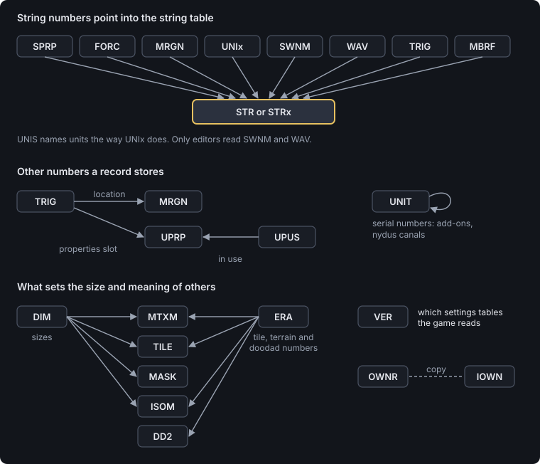
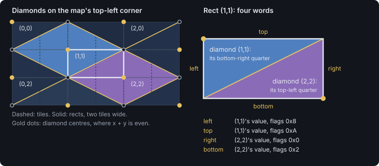
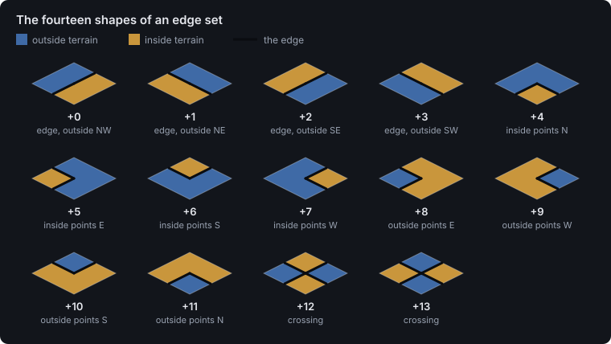
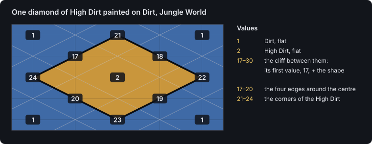

# CHK format reference

This reference gives the byte layout of every section of a StarCraft and Brood War
scenario file (`scenario.chk`), with what each section is for, what the game does when a file repeats
it, whether a map can do without it, and the values its fields take.

This page describes the format, not any one editor. What scmJS does with a file as a whole
(the archive around the scenario, protected maps, what Save keeps and what it can strip)
is in [Opening and saving maps](file-formats.md). The facts in the table at the top of
each page (size, repeats, required, read by) and the value and flag tables come from the
code the editor reads and writes maps with. The byte layouts are checked by its tests
against the same code, which re-encodes Blizzard's own maps byte for byte. The community's
older reference is
[wiki.staredit.net/wiki/Scenario.chk](http://wiki.staredit.net/wiki/Scenario.chk), which
this one agrees with except where a page says otherwise.

The same layouts are also published as a [Kaitai Struct](https://kaitai.io) description,
[chk.ksy](chk.ksy), generated from the same tables as this page. The Kaitai compiler turns
it into a parser for C++, C#, Go, Java, JavaScript, Python and several other languages,
and the [Kaitai Web IDE](https://ide.kaitai.io) opens a `scenario.chk` with it and shows
every section field by field. It reads a file as it is laid out, one section after
another, and leaves the rules for [repeated sections](#repeated-sections) and
[odd lengths](#odd-lengths) to the program using it.

## The container

A scenario is a flat run of sections, with no header of its own. Each section is a
four-character name, a 32-bit length, and that many bytes of data:

| Offset | Type | Holds |
| --- | --- | --- |
| 0 | 4 characters | The name, padded with spaces to four: `VER `, `DIM `, `STR ` |
| 4 | i32 | The length of the data, in bytes |
| 8 | the length | The data |

The next section starts straight after the data. Sections may come in any order, and the
game does not need them in the order StarEdit writes them (the order of this reference).
A name the game does not know is skipped.

All numbers in every section are little-endian. Unsigned unless a layout says `i32`.
Positions are in pixels, and a tile is 32 pixels square. Player slots are numbered from 0
for Player 1 to 11 for Player 12. Text is never stored in a section itself: a section holds
a *string number*, the position of the text in the [string table](#str), and 0 means no
text.

### Repeated sections

The game reads the sections one after another into fixed places in memory, so a section
that appears twice is not simply replaced by its second copy. Each section's page says
which of these applies to it:

- **Only the last copy counts.** Most sections.
- **Every copy is written over the start of the same fixed-size space**, in file order, so
  a later copy replaces only as many bytes as it carries. A second `MTXM` half the size of
  the map rewrites the top half of the terrain and leaves the bottom as the first copy had
  it. The terrain sections, the fog and the locations work this way.
- **Every copy counts.** The records of all of them are one list, in file order: two
  `TRIG` sections are one longer trigger list. Units, sprites, doodads, triggers and
  briefings work this way.

### Odd lengths

A length can be shorter or longer than the section needs, or run past the end of the
file, or be negative, which makes the game read backwards from where it is. Map protectors
use all of these, since each is something the game reads one way and a careless editor
another. [Protected maps](#protected-maps) goes through them and how to read such a file,
and [Opening and saving maps](file-formats.md#protected-and-damaged-maps) says what scmJS
does with one.

## Protected maps

Starcraft itself reads maps different than how editors do, which allows one to 'protect' a map by modifying it in a special way. None of it
is encryption. Each trick relies on one of the rules on this page that the game follows
and a simple reader does not, which also means a reader that follows them reads the map
as the game does. The archive around the scenario has tricks of its own, such as a
missing file list or a renamed scenario; those are in
[Opening and saving maps](file-formats.md#protected-and-damaged-maps).

### In the container

| What the file does | What the game does | What a reader has to do |
| --- | --- | --- |
| Repeats a section | Combines the copies by the section's rule: only the last counts, every copy's records count, or each copy is written over the start of one fixed space ([Repeated sections](#repeated-sections)) | Keep every copy in file order and combine them by the same rule. A reader that takes the first copy, or the last, sees a decoy wherever the rule is a different one. |
| Gives a terrain, fog or location section a copy shorter than the section's size | Writes it over the start of the space, leaving the rest as it was: zeros, or what an earlier copy wrote | Start from a zeroed space of the full size and write every copy over it in turn. |
| Gives a section more bytes than the game reads | Reads what it needs and ignores the rest | Read only the size the section's page gives. |
| Ends a record section in part of a record | Reads the whole records | Drop the remainder. |
| Declares a length that runs past the end of the file | Reads the bytes that are there | Take what is there rather than rejecting the file. |
| Declares a negative length | Moves backwards by that much and reads on from there, so bytes are read a second time as different sections | Stop there, or follow the jump; nothing after it can be read as ordinary sections. |
| Includes sections whose names mean nothing, or are not text at all | Skips them | Skip them rather than rejecting the file. |
| Leaves bytes after the last section | Nothing | Keep them or drop them; they are not part of the map. |
| Puts the sections in an unusual order | Reads them in any order | Do not depend on StarEdit's order. |

### In the sections

| Section | What the file does | What it means |
| --- | --- | --- |
| [`ISOM`](#isom), [`TILE`](#tile), [`DD2`](#dd2) | Leaves them out, or fills them with zeros | The game never reads them, so the map plays the same. An editor loses the isometric brush, the ground under each doodad, and the doodads as objects it can select. `ISOM` can be rebuilt from the tiles (exactly where the terrain was painted isometrically), and a new `TILE` copied from `MTXM`, which gives back the ground but keeps the doodads' tiles in it. |
| [`IVER`](#iver), [`IVE2`](#ive2), [`IOWN`](#iown), [`UPUS`](#upus), [`SWNM`](#swnm), [`WAV`](#wav) | Leaves them out | Only editors read these either. The switch names and the list of sounds are gone; the sounds themselves stay in the archive, and the trigger actions that play them still name them. |
| [`MTXM`](#mtxm), [`MASK`](#mask), [`MRGN`](#mrgn) | Splits them into several copies, some of them short or full of junk | Only the combined result counts: each copy written over the one before, in file order. A copy of junk followed by a full copy of the real terrain draws the real terrain. |
| [`UNIT`](#unit), [`THG2`](#thg2), [`TRIG`](#trig), [`MBRF`](#mbrf) | Splits the records across several copies | Every copy's records count, in file order. A reader that keeps only one copy loses units or triggers. |
| [`STR`](#str) | Makes strings overlap, share bytes, or start inside the offset table | A string is whatever lies between its offset and the next 0 byte. Read each one from its own offset and assume nothing about where it sits. An editor that writes the table back has to lay the strings out afresh. |
| [`ERA`](#era) | Sets bits above the low three | Only the low three bits pick the tileset. |
| Any fixed-size section | Makes it longer than its size | The game reads the size it needs; the rest can hold anything. |

### Reading a protected map

A reader that does these things reads a protected map as the game does:

1. Read the headers one after another, and keep every section with its place in the file,
   repeats included.
2. At a negative length, stop, unless you mean to follow the game back through the file.
3. At a length past the end of the file, take the bytes that are there.
4. Skip any name you do not know.
5. Combine the copies of each section by its rule, the *More than one copy* row of its
   page. For the sections whose copies are written over one space, start from zeros at
   the size the page gives.
6. In a record section, drop a partial record at the end.
7. Read each string from its own offset.

Writing the result back as one copy of each section, in StarEdit's order, gives an
ordinary file that holds the same map.

## Sections

The sections are listed here in the order StarEdit writes them. *Read by editors* means the game skips the section and
a map plays the same without it. *By revision* means the section is required in some
[revisions](#revisions) of the file and not others.

<!-- generated: index -->
| Section | Holds | Read by | Required |
| --- | --- | --- | --- |
| [`TYPE`](#type) | Which game the file is for | the game |  |
| [`VER␠`](#ver) | The file's revision, which decides which sections the game reads | the game | yes |
| [`IVER`](#iver) | A version stamp older versions of StarEdit wrote | editors |  |
| [`IVE2`](#ive2) | StarEdit's version stamp | editors |  |
| [`VCOD`](#vcod) | A verification table the game checks the file against when it loads a map, and refuses the map when the check fails | the game | yes |
| [`IOWN`](#iown) | StarEdit's own copy of `OWNR` | editors |  |
| [`OWNR`](#ownr) | Who controls each of the 12 player slots: a human, a computer, a rescuable player, a neutral one, or nobody | the game | yes |
| [`ERA␠`](#era) | The tileset | the game | yes |
| [`DIM␠`](#dim) | The map's size in tiles | the game | yes |
| [`SIDE`](#side) | Each player's race | the game | yes |
| [`MTXM`](#mtxm) | The terrain the game draws: one 16-bit tile number per tile, including the tiles of placed doodads | the game | yes |
| [`PUNI`](#puni) | Which unit types each player may build | the game | yes |
| [`UPGR`](#upgr) | How far each player may research each upgrade, and the level they start at, for the 46 upgrades of the original game | the game | by revision |
| [`PTEC`](#ptec) | Whether each player may research each ability, and whether they start with it, for the 24 abilities of the original game | the game | by revision |
| [`UNIT`](#unit) | The units placed on the map, 36 bytes each | the game | yes |
| [`ISOM`](#isom) | The isometric record, which an editor's isometric brush paints with: the lattice of terrain diamonds from which it works out the cliffs and edges between terrain types | editors |  |
| [`TILE`](#tile) | The terrain with the doodads left out: what is under each doodad | editors |  |
| [`DD2␠`](#dd2) | The doodads placed on the map, as objects an editor can select and remove | editors |  |
| [`THG2`](#thg2) | Sprites placed on the map | the game | yes |
| [`MASK`](#mask) | Fog of war at the start: which players begin with each tile unexplored | the game |  |
| [`STR␠`](#str) | The string table | the game | yes |
| [`STRx`](#strx) | The string table of StarCraft: Remastered: the same as `STR` with 32-bit numbers, so the table has no 64 KB limit | the game |  |
| [`UPRP`](#uprp) | The 64 unit properties slots used by the Create Unit with Properties action | the game | yes |
| [`UPUS`](#upus) | Which of the 64 `UPRP` slots StarEdit considers in use | editors |  |
| [`MRGN`](#mrgn) | The locations | the game | yes |
| [`TRIG`](#trig) | The triggers, 2400 bytes each, in the order they run | the game | yes |
| [`MBRF`](#mbrf) | The mission briefings, in the same 2400-byte record as a trigger, with their own set of actions | the game | yes |
| [`SPRP`](#sprp) | The scenario's name and description, as string numbers | the game | yes |
| [`FORC`](#forc) | The four forces: which force each of Players 1 to 8 is in, each force's name, and its settings | the game | yes |
| [`WAV␠`](#wav) | StarEdit's list of the sounds in the map: the name of each sound file in the archive, as a string number | editors |  |
| [`UNIS`](#unis) | Unit settings for the original game | the game | by revision |
| [`UPGS`](#upgs) | Upgrade costs and research times for the 46 upgrades of the original game | the game | by revision |
| [`TECS`](#tecs) | Ability costs, research times and energy costs for the 24 abilities of the original game | the game | by revision |
| [`SWNM`](#swnm) | The names of the 256 switches, as string numbers | editors |  |
| [`COLR`](#colr) | The colour of each of Players 1 to 8 | the game |  |
| [`PUPx`](#pupx) | `UPGR` for Brood War: the same tables, for 61 upgrades | the game | by revision |
| [`PTEx`](#ptex) | `PTEC` for Brood War: the same tables, for 44 abilities | the game | by revision |
| [`UNIx`](#unix) | `UNIS` for Brood War: the same tables, with 130 weapons | the game | by revision |
| [`UPGx`](#upgx) | `UPGS` for Brood War: the same tables for 61 upgrades, with one unused byte after the first | the game | by revision |
| [`TECx`](#tecx) | `TECS` for Brood War: the same tables, for 44 abilities | the game | by revision |
| [`CRGB`](#crgb) | StarCraft: Remastered's player colours | the game |  |
<!-- /generated -->

## Revisions

The [`VER`](#ver) value is the file's revision, and it decides which sections the game
reads. [`TYPE`](#type) goes with it.

<!-- generated: revisions -->
| Revision | `VER` | `TYPE` | Extension |
| --- | --- | --- | --- |
| StarCraft 1.00 | 59 | `RAWS` | `.scm` |
| Hybrid 1.04 | 63 | `RAWS` | `.scm` |
| Brood War 1.04 | 205 | `RAWB` | `.scx` |
| Remastered 1.21+ | 206 | `RAWB` | `.scx` |
<!-- /generated -->

Brood War added units, upgrades and technologies, so it has wider versions of the five
settings tables, under new names: [`UNIS`](#unis) and [`UNIx`](#unix),
[`UPGS`](#upgs) and [`UPGx`](#upgx), [`UPGR`](#upgr) and [`PUPx`](#pupx),
[`TECS`](#tecs) and [`TECx`](#tecx), [`PTEC`](#ptec) and [`PTEx`](#ptex). A StarCraft 1.00
file needs the original five, a Brood War file the `x` five, and a hybrid file both, so the
original game reads one set and Brood War the other. Blizzard's own Brood War maps carry
only the `x` tables.


## How the sections fit together

Most sections stand alone, but many numbers in them point into another section, and a few
sections decide the size or the meaning of others.



| A number in | Points at |
| --- | --- |
| [`SPRP`](#sprp), [`FORC`](#forc), [`MRGN`](#mrgn), [`UNIS`](#unis) and [`UNIx`](#unix), [`SWNM`](#swnm), [`WAV`](#wav), and the actions of [`TRIG`](#trig) and [`MBRF`](#mbrf) | A string in [`STR`](#str), or [`STRx`](#strx) on a Remastered map that has one. String numbers count from 1, and 0 means none. |
| A condition or action of [`TRIG`](#trig) | A location of [`MRGN`](#mrgn), counted from 1: location 1 is the first record, and Anywhere, the 64th record, is location 64. |
| The Create Unit with Properties action | A slot of [`UPRP`](#uprp), counted from 1. |
| [`UPUS`](#upus) | The slots of `UPRP`, in the same order. |
| A [`UNIT`](#unit) record's linked unit | Another `UNIT` record, by its serial number: an add-on and the building it belongs to, or two nydus canals. |
| [`IOWN`](#iown) | The same twelve player slots as [`OWNR`](#ownr); editors show one and the game reads the other. |
| [`MTXM`](#mtxm) and [`TILE`](#tile) | Tile groups of the tileset [`ERA`](#era) names. |
| [`ISOM`](#isom) | The values of the tileset `ERA` names. |
| A [`DD2`](#dd2) record | A doodad of the tileset `ERA` names. The doodad's tiles are in `MTXM` and its sprite, if it has one, in [`THG2`](#thg2). |

[`DIM`](#dim) sets the size of four sections: [`MTXM`](#mtxm) and [`TILE`](#tile) hold two
bytes per tile, [`MASK`](#mask) one, and [`ISOM`](#isom) (width ÷ 2 + 1) × (height + 1) × 8
bytes. [`VER`](#ver) decides which of the settings tables the game reads; see
[Revisions](#revisions).

## TYPE

Which game the file is for. It goes with [`VER`](#ver): see [Revisions](#revisions).

<!-- generated: section TYPE -->
| Name | `TYPE` (54 59 50 45) |
| --- | --- |
| Size | 4 bytes. |
| Read by | The game. |
| Required | No. |
| More than one copy | Only the last copy counts. |
| In scmJS | Read, and written again when you change what it holds. |

Layout:

| Offset | Type | Holds |
| --- | --- | --- |
| 0 | 4 characters | `RAWS` for a StarCraft file, `RAWB` for Brood War |
<!-- /generated -->

## VER

The file's revision, which decides which sections the game reads. The values are in
[Revisions](#revisions).

<!-- generated: section VER -->
| Name | `VER␠` (56 45 52 20) |
| --- | --- |
| Size | 2 bytes. |
| Read by | The game. |
| Required | Yes. The game does not load a map without it. |
| More than one copy | Only the last copy counts. |
| In scmJS | Read, and written again when you change what it holds. |

Layout:

| Offset | Type | Holds |
| --- | --- | --- |
| 0 | u16 | The revision; see [Revisions](#revisions) |
<!-- /generated -->

## IVER

A version stamp older versions of StarEdit wrote. Nothing reads it. StarEdit leaves it out
of the maps it writes now, and so does a new map made in the editor.

<!-- generated: section IVER -->
| Name | `IVER` (49 56 45 52) |
| --- | --- |
| Size | 2 bytes. |
| Read by | Editors only. The game skips it. |
| Required | No. |
| More than one copy | Only the last copy counts. |
| In scmJS | Kept as it is and written back unchanged. |

Layout:

| Offset | Type | Holds |
| --- | --- | --- |
| 0 | u16 | StarEdit's version number, an older form |
<!-- /generated -->

## IVE2

StarEdit's version stamp. The game does not read it.

<!-- generated: section IVE2 -->
| Name | `IVE2` (49 56 45 32) |
| --- | --- |
| Size | 2 bytes. |
| Read by | Editors only. The game skips it. |
| Required | No. |
| More than one copy | Only the last copy counts. |
| In scmJS | Kept as it is and written back unchanged. |

Layout:

| Offset | Type | Holds |
| --- | --- | --- |
| 0 | u16 | StarEdit's version number; 11 in a map StarEdit saves for Brood War |
<!-- /generated -->

## VCOD

A verification table the game checks the file against when it loads a map, and refuses the
map when the check fails. Every map StarEdit writes carries the same 1040 bytes, and a new
map made in the editor gets them too.

<!-- generated: section VCOD -->
| Name | `VCOD` (56 43 4F 44) |
| --- | --- |
| Size | 1040 bytes. |
| Read by | The game. |
| Required | Yes. The game does not load a map without it. |
| More than one copy | Only the last copy counts. |
| In scmJS | Kept as it is and written back unchanged. |

Layout:

| Offset | Type | Holds |
| --- | --- | --- |
| 0 | u32 × 256 | Seeds |
| 1024 | u8 × 16 | Operations |
<!-- /generated -->

The table StarEdit writes, for a program that wants to check whether a map carries it:

<!-- generated: vcod -->
| Fact | Value |
| --- | --- |
| Length | 1040 bytes |
| SHA-256 | `c13ca25290b5d075eae9705d68a7b8c30af498c36c10e138627f8b49b795392f` |
| The 16 operation bytes | `01 04 05 06 02 01 05 02 00 03 07 07 05 04 06 03` |
<!-- /generated -->

This page does not describe how the game computes the check. A map with a different table
is one the game may refuse, so an editor making a new map should copy StarEdit's.

## IOWN

StarEdit's own copy of [`OWNR`](#ownr). The game reads `OWNR`; StarEdit shows this one. The
editor writes both the same, and Check Map warns when a file's two disagree.

<!-- generated: section IOWN -->
| Name | `IOWN` (49 4F 57 4E) |
| --- | --- |
| Size | 12 bytes. |
| Read by | Editors only. The game skips it. |
| Required | No. |
| More than one copy | Only the last copy counts. |
| In scmJS | Read, and written again when you change what it holds. |

Layout:

| Offset | Type | Holds |
| --- | --- | --- |
| 0 | u8 × 12 | StarEdit's copy of each player's [type](#ownr), one byte per player slot, Player 1 first |
<!-- /generated -->

## OWNR

Who controls each of the 12 player slots: a human, a computer, a rescuable player, a
neutral one, or nobody. Players 9 to 12 are normally Neutral or Inactive.

<!-- generated: section OWNR -->
| Name | `OWNR` (4F 57 4E 52) |
| --- | --- |
| Size | 12 bytes. |
| Read by | The game. |
| Required | Yes. The game does not load a map without it. |
| More than one copy | Only the last copy counts. |
| In scmJS | Read, and written again when you change what it holds. |

Layout:

| Offset | Type | Holds |
| --- | --- | --- |
| 0 | u8 × 12 | Each player's type, one byte per player slot, Player 1 first |

| Value | Type |
| --- | --- |
| 0 | Inactive — the slot does not exist |
| 1 | Computer (game) — set by the game once it starts; rarely stored |
| 2 | Occupied — set by the game for a joined human; rarely stored |
| 3 | Rescuable — units join whoever reaches them |
| 4 | Computer (unused) |
| 5 | Computer — aI-controlled |
| 6 | Human — open slot in the lobby |
| 7 | Neutral — owned by no one; players 9–12 are usually this |
| 8 | Closed — lobby slot closed |
| 9 | Observer |
<!-- /generated -->

## ERA

The tileset. Only the low three bits count; the rest are ignored.

<!-- generated: section ERA -->
| Name | `ERA␠` (45 52 41 20) |
| --- | --- |
| Size | 2 bytes. |
| Read by | The game. |
| Required | Yes. The game does not load a map without it. |
| More than one copy | Only the last copy counts. |
| In scmJS | Read, and written again when you change what it holds. |

Layout:

| Offset | Type | Holds |
| --- | --- | --- |
| 0 | u16 | The tileset. The game uses the low three bits |

| Value | Tileset |
| --- | --- |
| 0 | Badlands |
| 1 | Space Platform |
| 2 | Installation |
| 3 | Ashworld |
| 4 | Jungle World |
| 5 | Desert |
| 6 | Ice |
| 7 | Twilight |
<!-- /generated -->

## DIM

The map's size in tiles. The sizes of [`MTXM`](#mtxm), [`TILE`](#tile), [`MASK`](#mask)
and [`ISOM`](#isom) follow from it. StarEdit offers sides of 64, 96, 128, 192 and 256
tiles.

<!-- generated: section DIM -->
| Name | `DIM␠` (44 49 4D 20) |
| --- | --- |
| Size | 4 bytes. |
| Read by | The game. |
| Required | Yes. The game does not load a map without it. |
| More than one copy | Only the last copy counts. |
| In scmJS | Read, and written again when you change what it holds. |

Layout:

| Offset | Type | Holds |
| --- | --- | --- |
| 0 | u16 | Width in tiles |
| 2 | u16 | Height in tiles |
<!-- /generated -->

## SIDE

Each player's race.

In a Use Map Settings game, a player whose race is User Selectable gets the melee starting
units of the race they pick, and the units the map places for them are left out. A map that
places units for a player should give that player a race. (This was found playing
StarCraft: Remastered.)

<!-- generated: section SIDE -->
| Name | `SIDE` (53 49 44 45) |
| --- | --- |
| Size | 12 bytes. |
| Read by | The game. |
| Required | Yes. The game does not load a map without it. |
| More than one copy | Only the last copy counts. |
| In scmJS | Read, and written again when you change what it holds. |

Layout:

| Offset | Type | Holds |
| --- | --- | --- |
| 0 | u8 × 12 | Each player's race, one byte per player slot, Player 1 first |

| Value | Race |
| --- | --- |
| 0 | Zerg |
| 1 | Terran |
| 2 | Protoss |
| 3 | Independent |
| 4 | Neutral |
| 5 | User Selectable |
| 6 | Random |
| 7 | Inactive |
<!-- /generated -->

## MTXM

The terrain the game draws: one 16-bit tile number per tile, including the tiles of placed
doodads. A tile number is a tile group of the tileset times 16 plus the tile's place in the
group, 0 to 15.

<!-- generated: section MTXM -->
| Name | `MTXM` (4D 54 58 4D) |
| --- | --- |
| Size | 2 bytes per tile: width × height × 2. |
| Read by | The game. |
| Required | Yes. The game does not load a map without it. |
| More than one copy | Every copy is written over the start of the same fixed-size space, in file order, so a later copy replaces only as many bytes as it carries. |
| In scmJS | Read, and written again when you change what it holds. |
<!-- /generated -->

Tile (x, y), counting from 0 at the top left, is at byte (y × width + x) × 2.

### What a tile number points at

A tile number is a *tile group* and a *variation*: the group is the number divided by 16,
and the variation the remainder. Tile 0x0132 is group 19, variation 2. The groups are the
records of the tileset's CV5 file, 52 bytes each:

| Offset | Type | Holds |
| --- | --- | --- |
| 0 | u16 | The terrain type the group belongs to; 1 for a doodad's group |
| 2 | u16 | Flags: buildability and walkability in the low byte, ground height in the high byte |
| 4 | u16 × 4 | Links for the left, top, right and bottom sides, which the isometric brush matches ([ISOM](#from-diamonds-to-tiles)) |
| 12 | u16 × 4 | Stack links for the same sides, which say how pieces of a cliff face continue above and below |
| 20 | u16 × 16 | The megatile of each of the 16 variations |

A megatile is a 32 × 32 picture made of sixteen 8 × 8 minitiles, and leads to its pixels
as [Game data](game-data.md#how-terrain-is-drawn) describes. Walkability and height are
kept per minitile, in the VF4 file.

A doodad's group keeps other things where terrain groups keep their links: the sprite or
unit drawn over it at offset 4, its name in `stat_txt.tbl` at 8, its number in the
tileset's doodad list (the number a [`DD2`](#dd2) record stores) at 12, and its width and
height in tiles at 14 and 16. A doodad spans one group per row of tiles: row r of a doodad
whose first group is g is group g + r, and column c is variation c.

## PUNI

Which unit types each player may build. For every player and unit type there is an answer
of its own and a flag saying whether to use the default answer instead, and one default
answer per unit type.

<!-- generated: section PUNI -->
| Name | `PUNI` (50 55 4E 49) |
| --- | --- |
| Size | 5700 bytes. |
| Read by | The game. |
| Required | Yes. The game does not load a map without it. |
| More than one copy | Only the last copy counts. |
| In scmJS | Read, and written again when you change what it holds. |

Layout:

| Offset | Type | Holds |
| --- | --- | --- |
| 0 | u8 × 2736 | Per player, per unit type: 1 if the player can build it. Player 1's 228 bytes first |
| 2736 | u8 × 228 | Per unit type: 1 if it can be built, for every player that uses the default |
| 2964 | u8 × 2736 | Per player, per unit type: 1 if the player uses the default |
<!-- /generated -->

### Example

The answer for a player and a unit type is the player's own byte, unless the player's
*uses the default* byte is 1, in which case it is the unit type's default. The byte for
Player p and unit type u is at p × 228 + u in each of the two per-player tables. The same
three tables, in the same order, make up [`UPGR`](#upgr), [`PTEC`](#ptec),
[`PUPx`](#pupx) and [`PTEx`](#ptex).

Here Carriers (unit type 72) are allowed by default, every player takes the default except
Player 3, and Player 3's own byte says no:

<!-- generated: example PUNI -->
```text
  72  00  Player 1, Carrier: may not build it, but see below
 528  00  Player 3, Carrier: may not build it
2808  01  the default for Carriers: may build them
3036  01  Player 1 uses the default, so may build them
3492  00  Player 3 does not, so may not
```
<!-- /generated -->

Player 1's own byte also says no, but it is never read, because Player 1 takes the default.

## UPGR

How far each player may research each upgrade, and the level they start at, for the 46
upgrades of the original game. Laid out as [`PUNI`](#puni) is: each player's own values, the
defaults, and whether each player uses the defaults. Brood War reads [`PUPx`](#pupx)
instead.

<!-- generated: section UPGR -->
| Name | `UPGR` (55 50 47 52) |
| --- | --- |
| Size | 1748 bytes. |
| Read by | The game. |
| Required | In a StarCraft 1.00 or hybrid file (`VER` below 205). |
| More than one copy | Only the last copy counts. |
| In scmJS | Read, and written again when you change what it holds. |

Layout:

| Offset | Type | Holds |
| --- | --- | --- |
| 0 | u8 × 552 | Per player, per upgrade: the highest level they may research. Player 1's 46 bytes first |
| 552 | u8 × 552 | Per player, per upgrade: the level they start at |
| 1104 | u8 × 46 | Per upgrade: the default highest level |
| 1150 | u8 × 46 | Per upgrade: the default starting level |
| 1196 | u8 × 552 | Per player, per upgrade: 1 if the player uses the defaults |
<!-- /generated -->

## PTEC

Whether each player may research each ability, and whether they start with it, for the
24 abilities of the original game. Brood War reads [`PTEx`](#ptex) instead.

<!-- generated: section PTEC -->
| Name | `PTEC` (50 54 45 43) |
| --- | --- |
| Size | 912 bytes. |
| Read by | The game. |
| Required | In a StarCraft 1.00 or hybrid file (`VER` below 205). |
| More than one copy | Only the last copy counts. |
| In scmJS | Read, and written again when you change what it holds. |

Layout:

| Offset | Type | Holds |
| --- | --- | --- |
| 0 | u8 × 288 | Per player, per ability: 1 if they may research it. Player 1's 24 bytes first |
| 288 | u8 × 288 | Per player, per ability: 1 if they start with it |
| 576 | u8 × 24 | Per ability: the default for may research |
| 600 | u8 × 24 | Per ability: the default for start with |
| 624 | u8 × 288 | Per player, per ability: 1 if the player uses the defaults |
<!-- /generated -->

## UNIT

The units placed on the map, 36 bytes each. Start locations are units too, of type 214.

A unit record can set the unit's hit points, shields, energy, resources and hangar as
percentages or amounts, and states such as cloaked or burrowed. Each of these is used only
when its bit is set in the record's fields-set or special-states word, so a record can set
the hit points alone.

The units of a human player slot nobody takes are removed when the game starts; Neutral
units stay. (Found playing StarCraft: Remastered.)

<!-- generated: section UNIT -->
| Name | `UNIT` (55 4E 49 54) |
| --- | --- |
| Size | 36 bytes per unit. |
| Read by | The game. |
| Required | Yes. The game does not load a map without it. |
| More than one copy | Every copy counts: the records of all of them, in file order. |
| In scmJS | Read, and written again when you change what it holds. |

Each unit:

| Offset | Type | Holds |
| --- | --- | --- |
| 0 | u32 | The unit's serial number, unique in the map; add-ons and nydus canals are linked by it |
| 4 | u16 | X position in pixels |
| 6 | u16 | Y position in pixels |
| 8 | u16 | Unit type |
| 10 | u16 | How the unit is linked to another (relations, below) |
| 12 | u16 | Which special states the record sets (below) |
| 14 | u16 | Which of the following fields the record sets (fields set, below) |
| 16 | u8 | Owner, 0 for Player 1 |
| 17 | u8 | Hit points, per cent of the maximum |
| 18 | u8 | Shields, per cent |
| 19 | u8 | Energy, per cent |
| 20 | u32 | Resources, for a mineral field or geyser |
| 24 | u16 | Units in the hangar: interceptors or scarabs |
| 26 | u16 | The special states themselves |
| 28 | u32 | Unused |
| 32 | u32 | Serial number of the linked unit |

Relations:

| Bit | Meaning |
| --- | --- |
| 0x0200 | Nydus link |
| 0x0400 | Add-on |

Special states:

| Bit | Meaning |
| --- | --- |
| 0x01 | Cloaked |
| 0x02 | Burrowed |
| 0x04 | In transit |
| 0x08 | Hallucinated |
| 0x10 | Invincible |

Fields set:

| Bit | Meaning |
| --- | --- |
| 0x01 | Owner |
| 0x02 | Hit points |
| 0x04 | Shields |
| 0x08 | Energy |
| 0x10 | Resources |
| 0x20 | Hangar |
| 0x40 | State |
<!-- /generated -->

### Example

A Protoss Carrier for Player 2 with half its hit points, full shields and four
interceptors. The record sets the owner, hit points, shields and hangar, so the game uses
those four fields and ignores energy and resources:

<!-- generated: example UNIT -->
```text
   0  11 00 00 00  serial number 17
   4  50 06        x 1616 px (tile 50)
   6  50 03        y 848 px (tile 26)
   8  48 00        unit type 72, Protoss Carrier
  10  00 00        not linked
  12  00 00        sets no special states
  14  27 00        sets: owner, hit points, shields, hangar
  16  01           owner: Player 2
  17  32           hit points 50%
  18  64           shields 100%
  19  00           energy 0% (not set, so not used)
  20  00 00 00 00  resources 0 (not set)
  24  04 00        4 in the hangar
  26  00 00        no special states
  28  00 00 00 00  unused
  32  00 00 00 00  no linked unit
```
<!-- /generated -->

## ISOM

The isometric record, which an editor's isometric brush paints with: the lattice of
terrain diamonds from which it works out the cliffs and edges between terrain types. Only
editors read it. Without it the map plays the same, but an editor cannot paint it
isometrically until the record is rebuilt, which the Repair plugin can do from the tiles.

How StarEdit's brush uses this record was worked out by reverse-engineering StarEdit for
[Chkdraft](https://github.com/TheNitesWhoSay/Chkdraft). What follows describes the record
in those terms, and each claim about real files was checked against Blizzard's own maps.

<!-- generated: section ISOM -->
| Name | `ISOM` (49 53 4F 4D) |
| --- | --- |
| Size | (width ÷ 2 + 1) × (height + 1) × 8 bytes. |
| Read by | Editors only. The game skips it. |
| Required | No. |
| More than one copy | Every copy is written over the start of the same fixed-size space, in file order, so a later copy replaces only as many bytes as it carries. |
| In scmJS | Read, and written again when you change what it holds. |

Each rect:

| Offset | Type | Holds |
| --- | --- | --- |
| 0 | u16 | The word on the rect's left side |
| 2 | u16 | Its top side |
| 4 | u16 | Its right side |
| 6 | u16 | Its bottom side |
<!-- /generated -->

### Diamonds and rects

The isometric brush does not paint tiles. It paints *diamonds*, 128 pixels wide and 64
tall: four tiles across and two down. Their centres sit on a lattice of points 64 pixels
apart across and 32 apart down, at every other point of it, the ones whose coordinates
add up to an even number. Diamond (x, y) is centred on pixel (64 × x, 32 × y), so the
diamonds along the top and left edges of the map are half off it.

The section does not store diamonds one by one. It stores *rects*: 64 by 32 pixels, two
tiles side by side, with rect (x, y) having its top-left corner on lattice point (x, y).
Two corners of every rect are diamond centres, and the line between its other two corners
cuts the rect into two triangles, each one quarter of one of those diamonds:

- When x + y is even, the diamonds are centred on the top-left and bottom-right corners,
  and the cut runs from the top-right corner to the bottom-left.
- When x + y is odd, the diamonds are centred on the top-right and bottom-left corners,
  and the cut runs the other way.



The rects are stored row by row from the top left, width ÷ 2 + 1 of them across and
height + 1 down. That is one column and one row more than the map covers, so that the
diamonds centred on the right and bottom edges have all four quarters stored. Rect (x, y)
starts at byte (y × (width ÷ 2 + 1) + x) × 8.

### The four words of a rect

A rect is four 16-bit words, one for each of its sides, in the order left, top, right,
bottom. Each word belongs to the quarter of a diamond that lies along that side, and holds
the diamond's value and which quarter it is:

```text
word = value × 16 + flags        value = word >> 4        flags = word & 0xF
```

So every diamond's value is stored eight times, twice in each of the four rects it covers.
On every Blizzard map checked, all eight copies agree. The flag bits give the quarter
(bits 2 and 3) and which of its two sides of the rect the word is on (bit 1):

<!-- generated: isom flags -->
| Low four bits | Quarter of its diamond | The diamond's centre is the rect's | Side of the rect |
| --- | --- | --- | --- |
| 0x0 | top-left | bottom-right corner | right |
| 0x2 | top-left | bottom-right corner | bottom |
| 0x4 | top-right | bottom-left corner | left |
| 0x6 | top-right | bottom-left corner | bottom |
| 0x8 | bottom-right | top-left corner | left |
| 0xA | bottom-right | top-left corner | top |
| 0xC | bottom-left | top-right corner | top |
| 0xE | bottom-left | top-right corner | right |
<!-- /generated -->

Bits 0 and 15 are scratch space for StarEdit's brush while it paints. They are 0 in a
saved file.

StarEdit writes the flag bits when its brush sets a diamond. The ground a map was started
with, where nobody has painted since, can hold the right value with the flag bits left at
0. On the eight Blizzard maps checked, every word with wrong flags is of this kind: all of
them hold one flat terrain per map, the one the map was started with. So a program reading
the lattice should work out which diamond a word belongs to from where the word is in its
rect, and treat the flags as a check at most.

The words in the extra column and row that belong to diamonds past the edge of the lattice
still hold values on Blizzard's maps. Nothing on the map depends on them.

### What a value means

A value is one of two things:

- **A flat terrain.** The diamond is that terrain all over. Every terrain StarEdit's
  palette offers has one value; on Jungle World, 1 is Dirt, 2 High Dirt and 3 Water.
- **One shape of an edge set.** An edge set is the border between two terrains that can
  touch: a cliff between low and high ground, a shore, the edge of jungle on dirt. A set
  takes fourteen values in a row, one for each shape the border can take through a
  diamond, and a diamond's value is the set's first value plus its shape, 0 to 13.

Of the two terrains a set joins, one is laid as a patch on the other: high dirt on dirt,
dirt on water, jungle on dirt. Here the terrain underneath is called the *outside*
terrain and the patch the *inside* one, since the border runs around the inside. North is
up the map.

<!-- generated: isom shapes -->
| Shape | The diamond is |
| --- | --- |
| +0 | Edge; the outside terrain to the north-west |
| +1 | Edge; the outside terrain to the north-east |
| +2 | Edge; the outside terrain to the south-east |
| +3 | Edge; the outside terrain to the south-west |
| +4 | Corner of the inside terrain, pointing north |
| +5 | Corner of the inside terrain, pointing east |
| +6 | Corner of the inside terrain, pointing south |
| +7 | Corner of the inside terrain, pointing west |
| +8 | Corner of the outside terrain, pointing east |
| +9 | Corner of the outside terrain, pointing west |
| +10 | Corner of the outside terrain, pointing south |
| +11 | Corner of the outside terrain, pointing north |
| +12 | Crossing: the inside terrain at the north and south corners, the outside at the east and west |
| +13 | Crossing: the outside terrain at the north and south corners, the inside at the east and west |
<!-- /generated -->



Each quarter of a diamond is the outside terrain, the inside terrain, or crossed by the
border. The border runs through the centre of the diamond and meets the middle of a side,
where the diamond beside it carries it on, so a run of edge diamonds draws one unbroken
line. The values are not in any game file: StarEdit has them built in, for each tileset.
[Values by tileset](#values-by-tileset) lists them all.

### A worked example

A Jungle World map covered in Dirt, value 1, with one diamond of High Dirt painted on it
with StarEdit's smallest brush:



The painted diamond takes High Dirt's value, 2. The brush then joins it to the Dirt around
it with the cliff between the two, values 17 to 30. The four diamonds that share a side
with the centre become the four straight edges, 17 to 20, and the four beyond them, which
only touch it at a point, become the corners where the high ground ends, 21 to 24. On the
map this is a small raised plateau with a cliff all the way round, and no flat High Dirt
tile at all: the centre diamond's four quarters all lie in rects that also hold part of the
cliff.

Here are two rects from the middle, as the section holds them. The map is 16 tiles wide,
so a row holds 9 rects and rect (x, y) starts at byte (9 × y + x) × 8:

<!-- generated: example ISOM -->
```text
 240  18 01  rect (3,3) left   0x0118: diamond (3,3), value 17, bits 0x8
 242  1A 01  rect (3,3) top    0x011A: diamond (3,3), value 17, bits 0xA
 244  20 00  rect (3,3) right  0x0020: diamond (4,4), value 2, bits 0x0
 246  22 00  rect (3,3) bottom 0x0022: diamond (4,4), value 2, bits 0x2
 248  24 00  rect (4,3) left   0x0024: diamond (4,4), value 2, bits 0x4
 250  2C 01  rect (4,3) top    0x012C: diamond (5,3), value 18, bits 0xC
 252  2E 01  rect (4,3) right  0x012E: diamond (5,3), value 18, bits 0xE
 254  26 00  rect (4,3) bottom 0x0026: diamond (4,4), value 2, bits 0x6
```
<!-- /generated -->

Rect (3,3) is even, so its left and top words belong to diamond (3,3), the north-west edge,
and its right and bottom words to diamond (4,4), the flat High Dirt in the centre. Rect
(4,3) is odd: its left and bottom words belong to the centre and its top and right words
to diamond (5,3), the north-east edge.

### From diamonds to tiles

The lattice holds no tiles. After each stroke the brush works out new tiles for every rect
it changed, and writes them to [`MTXM`](#mtxm) and [`TILE`](#tile):

1. Each of the rect's four words names a quarter of a diamond. From the diamond's value
   and the quarter, the brush gets a *link number* for that side of the rect.
2. It looks for the tile group in the tileset whose own four links match. Every group of
   the tileset's CV5 file carries a link for each side (see
   [what a tile number points at](#what-a-tile-number-points-at)). The rect's left tile
   comes from that group, which is always an even number, and its right tile from the
   next one.
3. It picks one of the group's variations at random, the same one for both tiles.
4. A cliff face is taller than one rect, so the rows below the top of a cliff are chosen to
   continue it, by the groups' stack links.

Link numbers up to 48 are shared by any two pieces that can meet; higher ones only join
pieces of the same edge set. A flat terrain carries the same link on all four sides. The
table of links for each value is not stored anywhere either: an editor builds it from the
tileset's CV5 and the values above.

Since the game draws `MTXM` and never reads this section, the two can disagree without
anyone noticing in a game. Tiles placed one by one, blends and doodads are all tiles no
lattice produces. The next isometric stroke over them replaces them with what the lattice
says.

### Values by tileset

The value of each flat terrain, and the first value of each edge set with its outside and
inside terrains. Numbers between these (Badlands 10 to 12, for example) are not used.

<!-- generated: isom values -->
Badlands:

| Value | Terrain, or outside / inside |
| --- | --- |
| 1 | Dirt |
| 2 | High Dirt |
| 3 | Water |
| 4 | Grass |
| 5 | Asphalt |
| 6 | Rocky Ground |
| 7 | High Grass |
| 8 | Structure |
| 9 | Mud |
| 13–26 | Dirt / High Dirt |
| 27–40 | Water / Dirt |
| 41–54 | Dirt / Grass |
| 55–68 | Dirt / Rocky Ground |
| 69–82 | High Dirt / High Grass |
| 83–96 | Dirt / Asphalt |
| 97–110 | Asphalt / Structure |
| 111–124 | Dirt / Mud |

Space Platform:

| Value | Terrain, or outside / inside |
| --- | --- |
| 1 | Space |
| 2 | Platform |
| 4 | High Platform |
| 8 | Solar Array |
| 9 | Low Platform |
| 10 | Rusty Pit |
| 11 | Plating |
| 12 | High Plating |
| 13 | Elevated Catwalk |
| 14 | Dark Platform |
| 24–37 | Space / Platform |
| 38–51 | Platform / High Platform |
| 52–65 | Platform / Solar Array |
| 66–79 | Low Platform / Platform |
| 80–93 | Rusty Pit / Platform |
| 94–107 | Platform / Plating |
| 108–121 | High Platform / High Plating |
| 122–135 | Platform / Elevated Catwalk |
| 136–149 | Platform / Dark Platform |

Installation:

| Value | Terrain, or outside / inside |
| --- | --- |
| 1 | Substructure |
| 2 | Floor |
| 3 | Roof |
| 4 | Substructure Plating |
| 5 | Plating |
| 6 | Substructure Panels |
| 7 | Bottomless Pit |
| 22–35 | Substructure / Floor |
| 36–49 | Floor / Roof |
| 50–63 | Substructure / Substructure Plating |
| 64–77 | Floor / Plating |
| 78–91 | Substructure / Substructure Panels |
| 92–105 | Bottomless Pit / Substructure |

Ashworld:

| Value | Terrain, or outside / inside |
| --- | --- |
| 1 | Magma |
| 2 | Dirt |
| 3 | Lava |
| 4 | Shale |
| 5 | High Dirt |
| 6 | High Lava |
| 7 | High Shale |
| 8 | Broken Rock |
| 27–40 | Magma / Dirt |
| 41–54 | Dirt / High Dirt |
| 55–68 | Dirt / Lava |
| 69–82 | High Dirt / High Lava |
| 83–96 | Dirt / Shale |
| 97–110 | High Dirt / High Shale |
| 111–124 | Dirt / Broken Rock |

Jungle World, Desert, Ice and Twilight, which share one numbering:

| Value | Jungle World | Desert | Ice | Twilight |
| --- | --- | --- | --- | --- |
| 1 | Dirt | Dirt | Snow | Dirt |
| 2 | High Dirt | High Dirt | High Snow | High Dirt |
| 3 | Water | Tar | Ice | Water |
| 4 | Jungle | Sand Dunes | Dirt | Crushed Rock |
| 5 | Raised Jungle | Sandy Sunken Pit | Water | Sunken Ground |
| 6 | Rocky Ground | Rocky Ground | Rocky Snow | Crevices |
| 7 | Ruins | Crags | Grass | Flagstones |
| 8 | Temple | Compound | Outpost | Basilica |
| 9 | High Jungle | High Sand Dunes | High Dirt | High Crushed Rock |
| 10 | High Ruins | High Crags | High Grass | High Flagstones |
| 11 | High Raised Jungle | High Sandy Sunken Pit | High Water | High Sunken Ground |
| 12 | High Temple | High Compound | High Outpost | High Basilica |
| 13 | Mud | Dried Mud | Moguls | Mud |
| 17–30 | Dirt / High Dirt | Dirt / High Dirt | Snow / High Snow | Dirt / High Dirt |
| 31–44 | Water / Dirt | Tar / Dirt | Ice / Snow | Water / Dirt |
| 45–58 | Dirt / Jungle | Dirt / Sand Dunes | Snow / Dirt | Dirt / Crushed Rock |
| 59–72 | Dirt / Rocky Ground | Dirt / Rocky Ground | Snow / Rocky Snow | Dirt / Crevices |
| 73–86 | Jungle / Raised Jungle | Sand Dunes / Sandy Sunken Pit | Dirt / Water | Crushed Rock / Sunken Ground |
| 87–100 | Jungle / Ruins | Sand Dunes / Crags | Dirt / Grass | Crushed Rock / Flagstones |
| 101–114 | Jungle / Temple | Sand Dunes / Compound | Dirt / Outpost | Crushed Rock / Basilica |
| 115–128 | High Dirt / High Jungle | High Dirt / High Sand Dunes | High Snow / High Dirt | High Dirt / High Crushed Rock |
| 129–142 | High Jungle / High Ruins | High Sand Dunes / High Crags | High Dirt / High Grass | High Crushed Rock / High Flagstones |
| 143–156 | High Jungle / High Raised Jungle | High Sand Dunes / High Sandy Sunken Pit | High Dirt / High Water | High Crushed Rock / High Sunken Ground |
| 157–170 | High Jungle / High Temple | High Sand Dunes / High Compound | High Dirt / High Outpost | High Crushed Rock / High Basilica |
| 171–184 | Dirt / Mud | Dirt / Dried Mud | Snow / Moguls | Dirt / Mud |
<!-- /generated -->

## TILE

The terrain with the doodads left out: what is under each doodad. Only editors read it,
to put the ground back when a doodad is removed.

<!-- generated: section TILE -->
| Name | `TILE` (54 49 4C 45) |
| --- | --- |
| Size | 2 bytes per tile: width × height × 2. |
| Read by | Editors only. The game skips it. |
| Required | No. |
| More than one copy | Every copy is written over the start of the same fixed-size space, in file order, so a later copy replaces only as many bytes as it carries. |
| In scmJS | Read, and written again when you change what it holds. |
<!-- /generated -->

## DD2

The doodads placed on the map, as objects an editor can select and remove. Only editors
read it: the game sees a doodad as its tiles in [`MTXM`](#mtxm) and its sprite in
[`THG2`](#thg2).

<!-- generated: section DD2 -->
| Name | `DD2␠` (44 44 32 20) |
| --- | --- |
| Size | 8 bytes per doodad. |
| Read by | Editors only. The game skips it. |
| Required | No. |
| More than one copy | Every copy counts: the records of all of them, in file order. |
| In scmJS | Read, and written again when you change what it holds. |

Each doodad:

| Offset | Type | Holds |
| --- | --- | --- |
| 0 | u16 | Doodad number in the tileset's list of doodads |
| 2 | u16 | X of the middle of the doodad, in pixels |
| 4 | u16 | Y of the middle of the doodad, in pixels |
| 6 | u8 | Owner |
| 7 | u8 | 1 if disabled, else 0 |
<!-- /generated -->

### Example

<!-- generated: example DD2 -->
```text
   0  2B 00  doodad 43 of the tileset's list
   2  10 04  x 1040 px, the middle of the doodad
   4  F0 02  y 752 px
   6  0B     owner: Player 12
   7  00     enabled
```
<!-- /generated -->

This record is all an editor has to say a doodad is there. What the game shows comes from
elsewhere: the doodad's tiles are written into [`MTXM`](#mtxm), where the game draws them,
while [`TILE`](#tile) keeps the ground they cover so an editor can put it back when the
doodad is removed. A doodad with a sprite, such as a tree top, also has a
[`THG2`](#thg2) record, and so does one that is a unit, such as a door. The tileset's CV5
says how big the doodad is and which tiles it uses (see
[what a tile number points at](#what-a-tile-number-points-at)). Deleting the `DD2` record
alone leaves the doodad on the map for the game, just no longer selectable in an editor.

## THG2

Sprites placed on the map. A *pure* sprite (flag 0x1000) is a picture drawn where it stands:
a tree top, a glow, a doodad's overlay. Without that flag the record is a unit sprite, and
the game creates a unit of that type when the map loads; that is how StarEdit places the
Installation's doors and traps. Flag 0x8000 starts such a unit disabled.

<!-- generated: section THG2 -->
| Name | `THG2` (54 48 47 32) |
| --- | --- |
| Size | 10 bytes per sprite. |
| Read by | The game. |
| Required | Yes. The game does not load a map without it. |
| More than one copy | Every copy counts: the records of all of them, in file order. |
| In scmJS | Read, and written again when you change what it holds. |

Each sprite:

| Offset | Type | Holds |
| --- | --- | --- |
| 0 | u16 | Sprite number, or the unit type for a unit sprite (see the flags) |
| 2 | u16 | X in pixels |
| 4 | u16 | Y in pixels |
| 6 | u8 | Owner |
| 7 | u8 | Unused |
| 8 | u16 | Flags (below) |

Flags:

| Bit | Meaning |
| --- | --- |
| 0x1000 | Pure sprite |
| 0x4000 | Flipped |
| 0x8000 | Disabled |
<!-- /generated -->

### Example

Two records: a pure sprite, drawn and nothing more, and an Installation door, which the
game makes into a unit of that type when the map loads. Its disabled flag makes it start
closed.

<!-- generated: example THG2 -->
```text
   0  82 00  sprite 130
   2  80 02  x 640 px
   4  90 01  y 400 px
   6  0B     owner: Player 12
   7  00     unused
   8  00 10  flags: pure sprite
```

```text
  10  CD 00  unit type 205, Left Upper Level Door
  12  C0 04  x 1216 px
  14  50 02  y 592 px
  16  0B     owner: Player 12
  17  00     unused
  18  00 80  flags: disabled
```
<!-- /generated -->

## MASK

Fog of war at the start: which players begin with each tile unexplored. A new map made in
StarEdit or the editor starts every tile unexplored for every player. A map with no `MASK`
plays fully fogged.

<!-- generated: section MASK -->
| Name | `MASK` (4D 41 53 4B) |
| --- | --- |
| Size | 1 byte per tile: width × height. |
| Read by | The game. |
| Required | No. |
| More than one copy | Every copy is written over the start of the same fixed-size space, in file order, so a later copy replaces only as many bytes as it carries. |
| In scmJS | Read, and written again when you change what it holds. |
<!-- /generated -->

Only Players 1 to 8 have a bit. A byte of 0x05, bits 0 and 2, means Players 1 and 3 start
with that tile unexplored and the other six start with it explored. Every Blizzard map
checked has 0xFF in every byte.

## STR

The string table. Every piece of text in the map is here, and other sections refer to it by
number: the scenario name and description, force names, location names, custom unit names,
switch names, sound file names, and the text and sounds of trigger actions.

The section starts with the number of strings, then one offset per string, counted from the
start of the section, and then the text. Each string ends with a 0 byte. String numbers
count from 1: the first offset is string 1. Several strings may share the same offset.
Because the offsets are 16-bit, the whole table must fit in 64 KB.

The table does not say how its bytes spell characters. StarEdit wrote the code page of the
Windows it ran on: EUC-KR (CP949) for Korean, Shift_JIS for Japanese, GBK or Big5 for
Chinese, Windows-1251 for Russian, Windows-1252 for the rest. 1.16.1 reads a file in the
code page of the machine it runs on. Remastered reads `STR` as UTF-8 when the bytes are
valid UTF-8, and in the local code page when they are not. How scmJS guesses the encoding
is in [Opening and saving maps](file-formats.md#what-the-editor-does-with-it).

<!-- generated: section STR -->
| Name | `STR␠` (53 54 52 20) |
| --- | --- |
| Size | Whatever the text needs. |
| Read by | The game. |
| Required | Yes. The game does not load a map without it. |
| More than one copy | Only the last copy counts. |
| In scmJS | Read, and written again when you change what it holds. |
<!-- /generated -->

Layout:

| Offset | Type | Holds |
| --- | --- | --- |
| 0 | u16 | How many strings there are |
| 2 | u16 × that many | Where each string starts, counted from the start of the section |
| after the offsets | text | The strings, each ending in a 0 byte |

A string runs from its offset to the next 0 byte, and nothing else marks where it ends.
So two strings can share their bytes, one string can be the end of another, and an offset
can point anywhere in the section, the offset table included. An offset at or past the end
of the section leads to no text, and an editor has to read it as no string.

StarEdit writes a table of 1024 strings, and points every unused one at a single 0 byte
straight after the offsets: an empty string. Every Blizzard map checked is laid out this
way.

### Example

A table of three strings, the first and the third the same text. The third shares the
first one's bytes, and the lone 0 after the offsets is where an unused string would point:

<!-- generated: example STR -->
```text
   0  03 00                    3 strings
   2  09 00                    string 1 starts at 9
   4  0F 00                    string 2 starts at 15
   6  09 00                    string 3 starts at 9
   8  00                       a lone 0: an empty string
   9  48 69 6C 6C 73 00        "Hills" and its 0
  15  46 6F 72 63 65 20 31 00  "Force 1" and its 0
```
<!-- /generated -->

### Control codes

Bytes 0x01 to 0x1F in a string are not characters. Most set the colour of the text after
them, and a few align it, hide it or cut it short. Editors write them as `<XX>`, the byte
in hexadecimal, and the game draws the text from the byte where the code stands. In
1.16.1 each new line of a string starts in the default colour again; in Remastered a
colour carries on to the next line of the same string.

<!-- generated: text codes -->
| Byte | Written | What it does |
| --- | --- | --- |
| 0x01 | `<01>` | Mimic (keeps the current colour) |
| 0x02 | `<02>` | Colour: Cyan (#b8b8e8) |
| 0x03 | `<03>` | Colour: Yellow (#dcdc3c) |
| 0x04 | `<04>` | Colour: White (#ffffff) |
| 0x05 | `<05>` | Colour: Grey (#847474) |
| 0x06 | `<06>` | Colour: Red (#c81818) |
| 0x07 | `<07>` | Colour: Green (#10fc18) |
| 0x08 | `<08>` | Colour: Red — player 1 (#f40404) |
| 0x09 | `<09>` | Tab |
| 0x0A | `<0A>` | Newline |
| 0x0B | `<0B>` | Invisible |
| 0x0C | `<0C>` | Remove beyond (newline in the small font) |
| 0x0D | `<0D>` | Carriage return |
| 0x0E | `<0E>` | Colour: Blue — player 2 (#0c48cc) |
| 0x0F | `<0F>` | Colour: Teal — player 3 (#2cb494) |
| 0x10 | `<10>` | Colour: Purple — player 4 (#88409c) |
| 0x11 | `<11>` | Colour: Orange — player 5 (#f88c14) |
| 0x12 | `<12>` | Right align |
| 0x13 | `<13>` | Centre align |
| 0x14 | `<14>` | Invisible |
| 0x15 | `<15>` | Colour: Brown — player 6 (#703014) |
| 0x16 | `<16>` | Colour: White — player 7 (#cce0d0) |
| 0x17 | `<17>` | Colour: Yellow — player 8 (#fcfc38) |
| 0x18 | `<18>` | Colour: Green — player 9 (#088008) |
| 0x19 | `<19>` | Colour: Brighter yellow — player 10 (#fcfc7c) |
| 0x1A | `<1A>` | Nothing |
| 0x1B | `<1B>` | Colour: Pinkish — player 11 (#ecc4b0) |
| 0x1C | `<1C>` | Colour: Dark cyan — player 12 (#4068d4) |
| 0x1D | `<1D>` | Colour: Grey-green (#74a47c) |
| 0x1E | `<1E>` | Colour: Blue-grey (#9090b8) |
| 0x1F | `<1F>` | Colour: Turquoise (#00e4fc) |
<!-- /generated -->

## STRx

The string table of StarCraft: Remastered: the same as [`STR`](#str) with 32-bit numbers,
so the table has no 64 KB limit. Only Remastered reads it, and it is always UTF-8. A map with `STRx`
does not need `STR`.

<!-- generated: section STRx -->
| Name | `STRx` (53 54 52 78) |
| --- | --- |
| Size | Whatever the text needs. |
| Read by | The game. |
| Required | In place of `STR ` on a Remastered map that uses it. |
| More than one copy | Only the last copy counts. |
| In scmJS | Read, and written again when you change what it holds. |
<!-- /generated -->

Layout:

| Offset | Type | Holds |
| --- | --- | --- |
| 0 | u32 | How many strings there are |
| 4 | u32 × that many | Where each string starts, counted from the start of the section |
| after the offsets | text | The strings, each ending in a 0 byte |

## UPRP

The 64 unit properties slots used by the
[Create Unit with Properties](triggers.md#create-unit-with-properties) action. A slot is
laid out as a [`UNIT`](#unit) record's properties are, and each field or state is only
applied when its bit is set, so a slot can set the hit points alone.

<!-- generated: section UPRP -->
| Name | `UPRP` (55 50 52 50) |
| --- | --- |
| Size | 1280 bytes: 64 slots of 20. |
| Read by | The game. |
| Required | Yes. The game does not load a map without it. |
| More than one copy | Only the last copy counts. |
| In scmJS | Read, and written again when you change what it holds. |

Each slot:

| Offset | Type | Holds |
| --- | --- | --- |
| 0 | u16 | Which special states the slot sets (below) |
| 2 | u16 | Which fields the slot sets (below) |
| 4 | u8 | Owner; unused |
| 5 | u8 | Hit points, per cent |
| 6 | u8 | Shields, per cent |
| 7 | u8 | Energy, per cent |
| 8 | u32 | Resources |
| 12 | u16 | Units in the hangar |
| 14 | u16 | The special states themselves |
| 16 | u32 | Unused |

Special states:

| Bit | Meaning |
| --- | --- |
| 0x01 | Cloaked |
| 0x02 | Burrowed |
| 0x04 | In transit |
| 0x08 | Hallucinated |
| 0x10 | Invincible |

Fields set:

| Bit | Meaning |
| --- | --- |
| 0x01 | Owner |
| 0x02 | Hit points |
| 0x04 | Shields |
| 0x08 | Energy |
| 0x10 | Resources |
| 0x20 | Hangar |
<!-- /generated -->

## UPUS

Which of the 64 [`UPRP`](#uprp) slots StarEdit considers in use. The game does not read it.

<!-- generated: section UPUS -->
| Name | `UPUS` (55 50 55 53) |
| --- | --- |
| Size | 64 bytes. |
| Read by | Editors only. The game skips it. |
| Required | No. |
| More than one copy | Only the last copy counts. |
| In scmJS | Read, and written again when you change what it holds. |

Layout:

| Offset | Type | Holds |
| --- | --- | --- |
| 0 | u8 × 64 | Per slot: 1 if StarEdit considers it in use |
<!-- /generated -->

## MRGN

The locations. A StarCraft 1.00 map has 64 slots and a Brood War map 255. Slot 64 is
*Anywhere*, the whole map. An unused slot has no name and no size.

The elevation word works the other way round from how StarEdit shows it: a set bit
**leaves out** that elevation, so 0 means the location covers every elevation. Conditions
such as [Bring](triggers.md#bring) only count units on the elevations the location
covers.

<!-- generated: section MRGN -->
| Name | `MRGN` (4D 52 47 4E) |
| --- | --- |
| Size | 20 bytes per location. |
| Read by | The game. |
| Required | Yes. The game does not load a map without it. |
| More than one copy | Every copy is written over the start of the same fixed-size space, in file order, so a later copy replaces only as many bytes as it carries. |
| In scmJS | Read, and written again when you change what it holds. |

Each location:

| Offset | Type | Holds |
| --- | --- | --- |
| 0 | i32 | Left edge, in pixels |
| 4 | i32 | Top edge |
| 8 | i32 | Right edge |
| 12 | i32 | Bottom edge |
| 16 | u16 | Name, a string number |
| 18 | u16 | Elevations the location leaves out (below) |

Elevations:

| Bit | Meaning |
| --- | --- |
| 0x01 | Low ground |
| 0x02 | Medium ground |
| 0x04 | High ground |
| 0x08 | Low air |
| 0x10 | Medium air |
| 0x20 | High air |
<!-- /generated -->

### Example

A location covering five tiles across and four down, for ground units only. The right and
bottom edges are the pixel just past the last tile, and the elevation word lists what the
location leaves out:

<!-- generated: example MRGN -->
```text
   0  40 01 00 00  left 320 px (tile 10)
   4  80 01 00 00  top 384 px (tile 12)
   8  E0 01 00 00  right 480 px: tiles up to 14
  12  00 02 00 00  bottom 512 px: tiles up to 15
  16  05 00        name: string 5
  18  38 00        leaves out low air, medium air, high air
```
<!-- /generated -->

## TRIG

The triggers, 2400 bytes each, in the order they run. The record is laid out in the
[trigger reference](triggers.md#the-trigger-record), which also has a page for every
condition and action.

<!-- generated: section TRIG -->
| Name | `TRIG` (54 52 49 47) |
| --- | --- |
| Size | 2400 bytes per trigger. |
| Read by | The game. |
| Required | Yes. The game does not load a map without it. |
| More than one copy | Every copy counts: the records of all of them, in file order. |
| In scmJS | Read, and written again when you change what it holds. |

Each trigger:

| Offset | Type | Holds |
| --- | --- | --- |
| 0 | u8 × 2400 | One trigger; see [the trigger record](triggers.md#the-trigger-record) |
<!-- /generated -->

## MBRF

The mission briefings, in the same 2400-byte record as a trigger, with their own set of
[actions](triggers.md#mission-briefing-actions).

<!-- generated: section MBRF -->
| Name | `MBRF` (4D 42 52 46) |
| --- | --- |
| Size | 2400 bytes per briefing. |
| Read by | The game. |
| Required | Yes. The game does not load a map without it. |
| More than one copy | Every copy counts: the records of all of them, in file order. |
| In scmJS | Read, and written again when you change what it holds. |

Each briefing:

| Offset | Type | Holds |
| --- | --- | --- |
| 0 | u8 × 2400 | One briefing, in the same record as a trigger |
<!-- /generated -->

## SPRP

The scenario's name and description, as string numbers.

<!-- generated: section SPRP -->
| Name | `SPRP` (53 50 52 50) |
| --- | --- |
| Size | 4 bytes. |
| Read by | The game. |
| Required | Yes. The game does not load a map without it. |
| More than one copy | Only the last copy counts. |
| In scmJS | Read, and written again when you change what it holds. |

Layout:

| Offset | Type | Holds |
| --- | --- | --- |
| 0 | u16 | The scenario's name, a string number |
| 2 | u16 | Its description, a string number |
<!-- /generated -->

## FORC

The four forces: which force each of Players 1 to 8 is in, each force's name, and its
settings. Players 9 to 12 are in no force.

<!-- generated: section FORC -->
| Name | `FORC` (46 4F 52 43) |
| --- | --- |
| Size | 20 bytes. |
| Read by | The game. |
| Required | Yes. The game does not load a map without it. |
| More than one copy | Only the last copy counts. |
| In scmJS | Read, and written again when you change what it holds. |

Layout:

| Offset | Type | Holds |
| --- | --- | --- |
| 0 | u8 × 8 | The force of each of Players 1 to 8, 0 to 3 |
| 8 | u16 × 4 | The name of each force, a string number |
| 16 | u8 × 4 | Each force's flags (below) |

Force flags:

| Bit | Meaning |
| --- | --- |
| 0x01 | Random start |
| 0x02 | Allied |
| 0x04 | Allied victory |
| 0x08 | Shared vision |
<!-- /generated -->

### Example

Players 1 to 4 against 5 to 8. The first force is allied, shares vision, wins together and
has random start positions; the second only has random start positions:

<!-- generated: example FORC -->
```text
   0  00     Player 1: force 1
   1  00     Player 2: force 1
   2  00     Player 3: force 1
   3  00     Player 4: force 1
   4  01     Player 5: force 2
   5  01     Player 6: force 2
   6  01     Player 7: force 2
   7  01     Player 8: force 2
   8  03 00  force 1's name: string 3
  10  04 00  force 2's name: string 4
  12  05 00  force 3's name: string 5
  14  06 00  force 4's name: string 6
  16  0F     force 1: random start, allied, allied victory, shared vision
  17  01     force 2: random start
  18  00     force 3: no flags
  19  00     force 4: no flags
```
<!-- /generated -->

## WAV

StarEdit's list of the sounds in the map: the name of each sound file in the archive, as a
string number. The game does not read it. A Play WAV or Transmission action stores the
string number of its sound itself, not a place in this list.

<!-- generated: section WAV -->
| Name | `WAV␠` (57 41 56 20) |
| --- | --- |
| Size | 2048 bytes. |
| Read by | Editors only. The game skips it. |
| Required | No. |
| More than one copy | Only the last copy counts. |
| In scmJS | Read, and written again when you change what it holds. |

Layout:

| Offset | Type | Holds |
| --- | --- | --- |
| 0 | u32 × 512 | The name of each sound, a string number; 0 for an empty slot |
<!-- /generated -->

## UNIS

Unit settings for the original game. For each unit type that does not use the game's own
values: hit points, shields, armour, build time, costs, name and weapon damage. Brood War
reads [`UNIx`](#unix) instead.

<!-- generated: section UNIS -->
| Name | `UNIS` (55 4E 49 53) |
| --- | --- |
| Size | 4048 bytes. |
| Read by | The game. |
| Required | In a StarCraft 1.00 or hybrid file (`VER` below 205). |
| More than one copy | Only the last copy counts. |
| In scmJS | Read, and written again when you change what it holds. |

Layout:

| Offset | Type | Holds |
| --- | --- | --- |
| 0 | u8 × 228 | Per unit type: 1 to use the game's own values and ignore the rest of this section |
| 228 | u32 × 228 | Hit points × 256 |
| 1140 | u16 × 228 | Shields |
| 1596 | u8 × 228 | Armour |
| 1824 | u16 × 228 | Build time, in game frames |
| 2280 | u16 × 228 | Mineral cost |
| 2736 | u16 × 228 | Gas cost |
| 3192 | u16 × 228 | Name, a string number; 0 for the default name |
| 3648 | u16 × 100 | Per weapon: base damage |
| 3848 | u16 × 100 | Per weapon: damage added by each upgrade level |
<!-- /generated -->

## UPGS

Upgrade costs and research times for the 46 upgrades of the original game. Each upgrade has
a cost for its first level and an amount added for each level after. Brood War reads
[`UPGx`](#upgx) instead.

<!-- generated: section UPGS -->
| Name | `UPGS` (55 50 47 53) |
| --- | --- |
| Size | 598 bytes. |
| Read by | The game. |
| Required | In a StarCraft 1.00 or hybrid file (`VER` below 205). |
| More than one copy | Only the last copy counts. |
| In scmJS | Read, and written again when you change what it holds. |

Layout:

| Offset | Type | Holds |
| --- | --- | --- |
| 0 | u8 × 46 | Per upgrade: 1 to use the game's own values |
| 46 | u16 × 46 | Mineral cost of the first level |
| 138 | u16 × 46 | Minerals added for each further level |
| 230 | u16 × 46 | Gas cost of the first level |
| 322 | u16 × 46 | Gas added for each further level |
| 414 | u16 × 46 | Research time of the first level, in game frames |
| 506 | u16 × 46 | Time added for each further level |
<!-- /generated -->

## TECS

Ability costs, research times and energy costs for the 24 abilities of the original game.
Brood War reads [`TECx`](#tecx) instead.

<!-- generated: section TECS -->
| Name | `TECS` (54 45 43 53) |
| --- | --- |
| Size | 216 bytes. |
| Read by | The game. |
| Required | In a StarCraft 1.00 or hybrid file (`VER` below 205). |
| More than one copy | Only the last copy counts. |
| In scmJS | Read, and written again when you change what it holds. |

Layout:

| Offset | Type | Holds |
| --- | --- | --- |
| 0 | u8 × 24 | Per ability: 1 to use the game's own values |
| 24 | u16 × 24 | Mineral cost |
| 72 | u16 × 24 | Gas cost |
| 120 | u16 × 24 | Research time, in game frames |
| 168 | u16 × 24 | Energy cost |
<!-- /generated -->

## SWNM

The names of the 256 switches, as string numbers. The game does not read it; triggers use
the switches' numbers.

<!-- generated: section SWNM -->
| Name | `SWNM` (53 57 4E 4D) |
| --- | --- |
| Size | 1024 bytes. |
| Read by | Editors only. The game skips it. |
| Required | No. |
| More than one copy | Only the last copy counts. |
| In scmJS | Read, and written again when you change what it holds. |

Layout:

| Offset | Type | Holds |
| --- | --- | --- |
| 0 | u32 × 256 | The name of each switch, a string number; 0 for none |
<!-- /generated -->

## COLR

The colour of each of Players 1 to 8. StarCraft: Remastered can override it with
[`CRGB`](#crgb).

<!-- generated: section COLR -->
| Name | `COLR` (43 4F 4C 52) |
| --- | --- |
| Size | 8 bytes. |
| Read by | The game. |
| Required | No. |
| More than one copy | Only the last copy counts. |
| In scmJS | Read, and written again when you change what it holds. |

Layout:

| Offset | Type | Holds |
| --- | --- | --- |
| 0 | u8 × 8 | The colour of each of Players 1 to 8 |

| Value | Colour |
| --- | --- |
| 0 | Red |
| 1 | Blue |
| 2 | Teal |
| 3 | Purple |
| 4 | Orange |
| 5 | Brown |
| 6 | White |
| 7 | Yellow |
| 8 | Green |
| 9 | Pale Yellow |
| 10 | Tan |
| 11 | Dark Aqua |
| 12 | Pale Green |
| 13 | Bluish Grey |
| 14 | Pale Yellow II |
| 15 | Cyan |
| 16 | Pink |
| 17 | Olive |
| 18 | Lime |
| 19 | Navy |
| 20 | Dark Green |
| 21 | Black |
<!-- /generated -->

## PUPx

[`UPGR`](#upgr) for Brood War: the same tables, for 61 upgrades.

<!-- generated: section PUPx -->
| Name | `PUPx` (50 55 50 78) |
| --- | --- |
| Size | 2318 bytes. |
| Read by | The game. |
| Required | In a hybrid or Brood War file (`VER` 63 and up). |
| More than one copy | Only the last copy counts. |
| In scmJS | Read, and written again when you change what it holds. |

Layout:

| Offset | Type | Holds |
| --- | --- | --- |
| 0 | u8 × 732 | Per player, per upgrade: the highest level they may research. Player 1's 61 bytes first |
| 732 | u8 × 732 | Per player, per upgrade: the level they start at |
| 1464 | u8 × 61 | Per upgrade: the default highest level |
| 1525 | u8 × 61 | Per upgrade: the default starting level |
| 1586 | u8 × 732 | Per player, per upgrade: 1 if the player uses the defaults |
<!-- /generated -->

## PTEx

[`PTEC`](#ptec) for Brood War: the same tables, for 44 abilities.

<!-- generated: section PTEx -->
| Name | `PTEx` (50 54 45 78) |
| --- | --- |
| Size | 1672 bytes. |
| Read by | The game. |
| Required | In a hybrid or Brood War file (`VER` 63 and up). |
| More than one copy | Only the last copy counts. |
| In scmJS | Read, and written again when you change what it holds. |

Layout:

| Offset | Type | Holds |
| --- | --- | --- |
| 0 | u8 × 528 | Per player, per ability: 1 if they may research it. Player 1's 44 bytes first |
| 528 | u8 × 528 | Per player, per ability: 1 if they start with it |
| 1056 | u8 × 44 | Per ability: the default for may research |
| 1100 | u8 × 44 | Per ability: the default for start with |
| 1144 | u8 × 528 | Per player, per ability: 1 if the player uses the defaults |
<!-- /generated -->

## UNIx

[`UNIS`](#unis) for Brood War: the same tables, with 130 weapons.

<!-- generated: section UNIx -->
| Name | `UNIx` (55 4E 49 78) |
| --- | --- |
| Size | 4168 bytes. |
| Read by | The game. |
| Required | In a hybrid or Brood War file (`VER` 63 and up). |
| More than one copy | Only the last copy counts. |
| In scmJS | Read, and written again when you change what it holds. |

Layout:

| Offset | Type | Holds |
| --- | --- | --- |
| 0 | u8 × 228 | Per unit type: 1 to use the game's own values and ignore the rest of this section |
| 228 | u32 × 228 | Hit points × 256 |
| 1140 | u16 × 228 | Shields |
| 1596 | u8 × 228 | Armour |
| 1824 | u16 × 228 | Build time, in game frames |
| 2280 | u16 × 228 | Mineral cost |
| 2736 | u16 × 228 | Gas cost |
| 3192 | u16 × 228 | Name, a string number; 0 for the default name |
| 3648 | u16 × 130 | Per weapon: base damage |
| 3908 | u16 × 130 | Per weapon: damage added by each upgrade level |
<!-- /generated -->

### Example

Each column is one value per unit type, so a unit type's values are spread across the
section: its entry in each column is at the column's offset plus the unit type times the
column's width. A Carrier (unit type 72) given 400 hit points and a new cost:

<!-- generated: example UNIx -->
```text
  72  00           does not use the game's own values
 516  00 90 01 00  hit points 102400 = 400 × 256
1284  96 00        shields 150
1668  04           armour 4
1968  34 08        build time 2100 frames
2424  2C 01        300 minerals
2880  C8 00        200 gas
3336  00 00        the game's own name
```
<!-- /generated -->

The first byte is what makes the rest count: while it is 1, the game uses its own values
for the unit type and ignores the other columns. [`UNIS`](#unis) is laid out the same way
with 100 weapons instead of 130, so every column is at the same offset except the last,
the damage each upgrade adds.

## UPGx

[`UPGS`](#upgs) for Brood War: the same tables for 61 upgrades, with one unused byte after
the first.

<!-- generated: section UPGx -->
| Name | `UPGx` (55 50 47 78) |
| --- | --- |
| Size | 794 bytes. |
| Read by | The game. |
| Required | In a hybrid or Brood War file (`VER` 63 and up). |
| More than one copy | Only the last copy counts. |
| In scmJS | Read, and written again when you change what it holds. |

Layout:

| Offset | Type | Holds |
| --- | --- | --- |
| 0 | u8 × 61 | Per upgrade: 1 to use the game's own values |
| 61 | u8 | Unused |
| 62 | u16 × 61 | Mineral cost of the first level |
| 184 | u16 × 61 | Minerals added for each further level |
| 306 | u16 × 61 | Gas cost of the first level |
| 428 | u16 × 61 | Gas added for each further level |
| 550 | u16 × 61 | Research time of the first level, in game frames |
| 672 | u16 × 61 | Time added for each further level |
<!-- /generated -->

## TECx

[`TECS`](#tecs) for Brood War: the same tables, for 44 abilities.

<!-- generated: section TECx -->
| Name | `TECx` (54 45 43 78) |
| --- | --- |
| Size | 396 bytes. |
| Read by | The game. |
| Required | In a hybrid or Brood War file (`VER` 63 and up). |
| More than one copy | Only the last copy counts. |
| In scmJS | Read, and written again when you change what it holds. |

Layout:

| Offset | Type | Holds |
| --- | --- | --- |
| 0 | u8 × 44 | Per ability: 1 to use the game's own values |
| 44 | u16 × 44 | Mineral cost |
| 132 | u16 × 44 | Gas cost |
| 220 | u16 × 44 | Research time, in game frames |
| 308 | u16 × 44 | Energy cost |
<!-- /generated -->

## CRGB

StarCraft: Remastered's player colours. For each of Players 1 to 8, how its colour is
chosen, and a colour of its own. The RGB value is used only when the mode is Custom; with
Palette the game uses the [`COLR`](#colr) colour, which is also what every older version
reads.

<!-- generated: section CRGB -->
| Name | `CRGB` (43 52 47 42) |
| --- | --- |
| Size | 32 bytes. |
| Read by | The game. |
| Required | No. |
| More than one copy | Only the last copy counts. |
| In scmJS | Read, and written again when you change what it holds. |

Layout:

| Offset | Type | Holds |
| --- | --- | --- |
| 0 | u8 × 24 | Red, green and blue for each of Players 1 to 8, three bytes each |
| 24 | u8 × 8 | How each player's colour is chosen (modes, below) |

Colour modes:

| Value | Meaning |
| --- | --- |
| 0 | Random |
| 1 | Player choice |
| 2 | Custom |
| 3 | Palette |
<!-- /generated -->

## In the source

| What | Where |
| --- | --- |
| Reading and writing the run of sections, repeats and odd lengths | `src/formats/chk/reader.ts` |
| Each section's size, repeat rule and whether the game reads it | `src/formats/chk/sections/registry.ts` |
| The codecs, and the flag values in the tables here | `src/formats/chk/sections/*.ts` |
| Required sections, and what a new map is made of | `src/formats/chk/create.ts` |
| The revisions and the order sections are written in | `src/formats/chk/scenario.ts` |
| The isometric brush, the lattice geometry and the tiles it lays | `src/editor/isom.ts` |
| The ISOM values of each tileset | `src/data/isomTables.ts` |
| The CV5 tile group record | `src/formats/tileset/decode.ts` |
| The control codes in text | `src/editor/textColors.ts` |
| The byte layouts and the generated blocks of this page | `scripts/lib/chk-reference.mjs`, written by `npm run docs:reference` |
| The pictures on this page | `scripts/lib/chk-diagrams.mjs`, written to `docs/images/` by `npm run docs:reference` |
| `chk.ksy`, the Kaitai Struct description | `scripts/lib/chk-kaitai.mjs`, written by `npm run docs:reference` |
