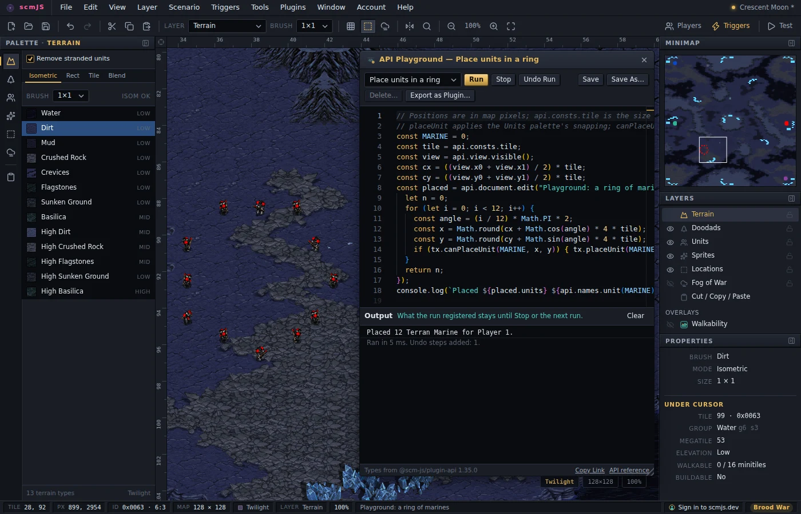
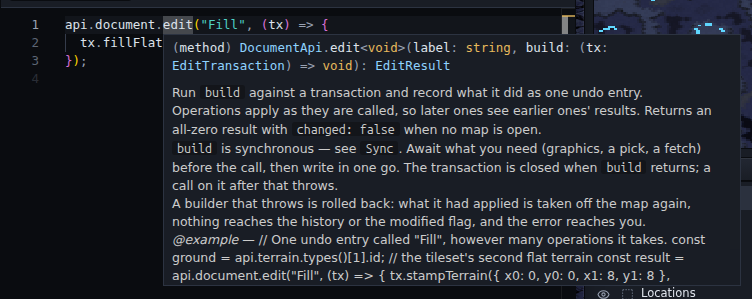

# Plugins

A plugin is a small program the editor loads from a public Git repository or a web
address. It can add menu items, hotkeys, dialogs, panels, map tools and overlays, and it
can read and change the open map through the same undo model the built-in tools use.

This page has three parts:

- **[Using plugins](#using-plugins)**: what is available, how to install one, what a
  plugin is allowed to do, and how to update or remove one.
- **[Writing a plugin](#writing-a-plugin)**: trying the API in the playground first, the
  two files a plugin is made of, how to develop and publish one.
- **[The API, group by group](#the-api-group-by-group)**: what each part of the API is
  for and the rules a signature does not show. Every call has its own entry in the
  [API reference](https://docs.scmjs.dev/api/), generated from the editor's declarations.

How the editor loads plugins internally is in
[docs/development.md](development.md#the-plugin-host).

## Using plugins

This part is for map makers: which plugins there are, how to install and update them,
and what you are trusting when you do.

### What is available

Nine plugins are installed and on from the start, and one more is installed but off. The
rest are in Plugins ▸ **Browse Plugins…**. The [user guide](../README.md#plugins)
describes each in more detail, and each repository has its own README.

| Plugin | Starts | Where it appears | What it does |
| --- | --- | --- | --- |
| [Walkability](https://github.com/scm-js/plugin-walkability) | on | View ▸ Walkability | Shows the ground as units walk it: islands, chokes and their widths, distances between starts. |
| [Paint](https://github.com/scm-js/plugin-paint) | on | Tools ▸ Paint… | Freehand, lines, shapes, spray and text with whatever the active layer's palette has picked. |
| [Repair](https://github.com/scm-js/plugin-repair) | on | on open, Tools ▸ Repair Map… | Finds what is missing, damaged or the wrong size in a map file, and repairs it. |
| [Terrain from Image](https://github.com/scm-js/plugin-image-to-terrain) | on | File ▸ Import ▸ Terrain from Image… | Turns a picture into terrain with the isometric brush. |
| [TrigScript](https://github.com/scm-js/plugin-trigscript) | on | Triggers ▸ TrigScript… | Triggers written as TypeScript, kept inside the map. |
| [Stamp Library](https://github.com/scm-js/plugin-stamp-library) | on | Tools ▸ Stamp Library… | Saved pieces of map (a ramp, a mineral line) to lay down again on any map. |
| [scmscx.com](https://github.com/scm-js/plugin-scm-scx) | on | File ▸ Find on scmscx.com… | Searches the scmscx.com map archive and opens the map you pick. |
| [scmjs.dev](https://github.com/scm-js/plugin-scmjs-dev) | on | Account menu | Your scmjs.dev account: stored maps, share links, editing a map together. |
| [eudplib](https://github.com/scm-js/plugin-eudplib) | on | (none of its own) | A library other plugins build EUD maps with. TrigScript and Magenta use it. |
| [TrigEdit](https://github.com/scm-js/plugin-trigedit) | off | Triggers ▸ Text Trigger Editor… | The text trigger format, for triggers carried over from SCMDraft. |
| [Melee Wizard](https://github.com/scm-js/plugin-melee-wizard) | Browse | Tools ▸ Melee Wizard… | Symmetric start locations, mineral lines and geysers. |
| [Section Explorer](https://github.com/scm-js/plugin-section-explorer) | Browse | Tools ▸ Section Explorer… | The map file's sections in a hex editor, with what each byte means. |
| [Magenta](https://github.com/scm-js/plugin-magenta) | Browse | Triggers ▸ Magenta… | A trigger editor where each trigger reads as a sentence, with Remastered EUD conditions and actions. |
| [Timelapse](https://github.com/scm-js/plugin-timelapse) | Browse | View ▸ Timelapse… | Records the map as you build it and exports the recording as a GIF or video. |
| [Aftermath](https://github.com/scm-js/plugin-aftermath) | Browse | File ▸ Open Replay… | Plays a replay back over its map: heat maps, build orders, APM. |
| [Hello World](https://github.com/scm-js/plugin-hello-world) | Browse | Tools ▸ Hello World… | An example plugin to copy when writing your own. |
| [API Playground](https://github.com/scm-js/plugin-api-playground) | Browse | Tools ▸ API Playground | A code editor with the plugin API in scope. Runs a few lines against the open map, and exports them as a new plugin. |

The installed ones are *defaults*: they are built into the editor, so a fresh install has
them without going to the network. A default can be turned off but not removed.

### Installing one

- **From the list.** Plugins ▸ **Browse Plugins…**, then **Install** on a row.
- **From an address.** Plugins ▸ **Manage Plugins…**, then paste the address.
- **From a link.** A link to the editor ending in `?plugin=github:scm-js/<repository>`
  offers that plugin when the editor opens: the same confirmation as Browse Plugins if it
  is not installed, or a notice with **Turn It On** if it is installed but off. The
  documentation's **Try it** links use this to offer the API Playground. Only the
  project's own repositories can be named this way.

Either way the editor shows where the code comes from and asks before it adds anything.
An address can take any of these forms:

| Address | What it points at |
| --- | --- |
| `github:owner/repo` | A GitHub repository, at its default branch. |
| `github:owner/repo@v1.2` | A tag, branch or commit of it. |
| `github:owner/repo@v1.2/plugins/mine` | A folder inside a repository, for several plugins in one. |
| `https://github.com/owner/repo/tree/v1.2/plugins/mine` | The same, copied from the browser's address bar. |
| `https://…/plugin.json` | A plugin's manifest anywhere: GitLab, a gist, your own server. |
| `https://…/plugin.ts` | A single plugin file with no manifest. |
| `http://localhost:3000/` | A folder holding `plugin.json` on your own machine, while you write a plugin. |

### What you are trusting

**There is no sandbox.** A plugin has the same access as the editor: it can read and
change the open map, read and write the files in the map archive and the editor's browser
storage, and make network requests. It is the same trust a browser extension asks for, so
only add plugins you trust.

Before any code is fetched, the Add screen shows what the plugin says about itself (name,
version, author, description and icon from its `plugin.json`), links to its repository,
and the addresses the code will come from. Nothing has run yet, so this is the moment to
look at the repository. The screen has three options:

| Option | Default | What it does |
| --- | --- | --- |
| Enable it now | on | Start the plugin as soon as it is added. |
| Pin to this version | on | Store the exact commit the address points at today, so the plugin never changes under you. |
| Load from a copy saved here | off | Keep a copy of the plugin's files in this browser and load from that until you press Reload. |

A plugin that needs another one (see [Requiring another plugin](#requiring-another-plugin))
lists it under *Also installs*.

### Keeping a plugin up to date

A pinned plugin never changes by itself; a push to its repository reaches nobody who has
it installed. To move forward:

- **Check for update** on a row in Manage Plugins asks the repository for its newest
  release. If it is newer, the button becomes *Update to …*, which shows the new manifest
  and asks before changing anything. **Check all for updates** does every row.
- Only releases (version tags) count. Commits pushed after the newest release are not
  offered.
- Browse Plugins also marks *v… available* on a row when its list carries a newer version
  than the one you run.

Preferences ▸ Plugins ▸ **Plugin updates** decides whether the editor looks for you. It
reads the plugin list at most once every six hours, one request however many plugins you
have.

| Choice | What happens |
| --- | --- |
| Tell me (default) | A notice names what is newer, with a button to Manage Plugins. |
| Do nothing | Nothing is checked until you press a row's button. |
| Install them | Newer versions of the plugins you added yourself are installed. Defaults, plugins loading from a saved copy, plugins that are off, and versions that need a newer editor are only named in the notice. |

**Defaults** move with the editor: each release carries the versions it was tested with,
and a built-in default is never checked until you press its button. Updating one makes it
an ordinary plugin fetched from its repository at each start; **Revert** on the row goes
back to the version the editor ships.

The other buttons on a row:

- **Reload** fetches the plugin again and replaces any saved copy. For a pinned plugin
  that is the same commit, so it is mostly for plugins you are writing.
- **Turning a plugin off** removes everything it added: menu items, hotkeys, dialogs,
  panels, overlays and listeners.
- **Remove** also takes it off the list. Defaults cannot be removed.

A plugin that fails to load raises a notice with a button to Manage Plugins, where its row
shows the error.

### Where a plugin keeps its data

- **In the browser.** A plugin's settings appear in Preferences ▸ Storage as one row under
  its id, with a button to clear them. Clear all data removes them too.
- **In the map.** A plugin can keep files inside the map archive, so they travel with the
  map. TrigScript keeps its scripts this way. The Save dialog lists these files and can
  leave them out.

### Sources

Browse Plugins reads *registries*: JSON files listing plugins and the address each installs
from. The project's own is [`scm-js/registry`](https://github.com/scm-js/registry), and the
**Sources** button adds others. A registry only decides what is *offered*; installing from
it goes through the same Add screen and pinning as a pasted address.

Plugins you have that no registry lists (one you added by address, or one a list dropped)
are shown under *Already installed*, marked *not listed*.

## Writing a plugin

A plugin is one TypeScript or JavaScript file exporting an `activate(api)` function, next
to a `plugin.json`, in a public repository. There is no build step to start with: the
editor fetches the source, transpiles it in the browser and calls `activate`.

### Trying the API first

The [API Playground](https://github.com/scm-js/plugin-api-playground) plugin lets you
call the API before setting anything up. Install it from Plugins ▸ Browse Plugins… and
open Tools ▸ API Playground. Its panel has a code editor where `api` is already defined.
Write a few lines, press Ctrl+Enter, and they run against the open map.



- **Stop** removes everything the run added: menu items, listeners, panels, overlays,
  map tools and timers. Running again stops the previous run first.
- **Undo Run** undoes the run's edits to the map.
- The list at the top has worked examples, one idea each.
- **Export as Plugin…** saves the snippet as a zip holding `plugin.json`, a `plugin.ts`
  with the snippet as the body of `activate`, and the typings and build setup described
  below.
- A whole `plugin.ts` pasted in runs too: its `activate` is called, and what it returns
  is called on **Stop**.

Type `api.` for completion. Hovering over a name shows its documentation, the same text
as the [API reference](https://docs.scmjs.dev/api/).



On the documentation site, an example that runs as it is written has a **Try it** link.
It opens the editor with the example in the playground, and offers to install the
playground if you do not have it. Nothing runs until you press Run. **Copy Link**, at the
foot of the panel, makes the same kind of link for your own snippet.

### Starting a plugin

Start from [Hello World](https://github.com/scm-js/plugin-hello-world), or from a snippet
exported from the playground. Hello World's `plugin.ts` is about sixty lines, mostly
comments, and the typings, type-check, build and CI described below are already set up
in it. The sections below explain those pieces one at a time.

### The two files

`plugin.json`:

```json
{
  "name": "Hello",
  "version": "1.0.0",
  "description": "Says hello from the Tools menu.",
  "entry": "plugin.ts",
  "icon": "icon.svg",
  "api": 1
}
```

| Field | Meaning |
| --- | --- |
| `name` | The only required field. |
| `id` | Used for storage keys and log lines. Derived from `name` when absent. |
| `entry` | The source file. Defaults to `plugin.ts`, then `plugin.js`. |
| `api` | The API version the plugin needs. An older editor refuses to load it. |
| `icon` | See [The icon](#the-icon). |
| `build` | A pre-built bundle to load instead of the source. See [Building](#building). |
| `requires` | Other plugins this one needs. See [Requiring another plugin](#requiring-another-plugin). |

`plugin.ts`:

```ts
import type { PluginApi } from "@scm-js/plugin-api";

export default function activate(api: PluginApi) {
  api.menu.add("Tools", {
    label: "Say Hello",
    enabled: () => api.document.isOpen(),
    run: () => api.ui.status(`Hello, ${api.document.info()?.name}!`),
  });
}
```

Everything `add` and `on` return is a `Disposable`. Keep the ones you want to remove early
and ignore the rest: turning the plugin off disposes all of them. A function returned from
`activate` also runs when the plugin is turned off, for things the API does not know about,
such as timers or sockets. `activate` may be `async`.

### Developing locally

```sh
npx serve --cors .
```

Paste `http://localhost:3000/` into Plugins ▸ Manage Plugins…, and press **Reload** on its
row after each change.

### The typings

```sh
npm i -D @scm-js/plugin-api
```

The package is types only: one `index.d.ts`. The `import type` line is removed before the
file runs, so the package matters only for editing and type-checking. The same files are
tagged at [`scm-js/plugin-api`](https://github.com/scm-js/plugin-api) if you prefer a git
dependency.

The package's major version is the API version, so `^1` in `package.json` is right. New
calls do not change the version, since they break nothing that does not use them; the
version is kept for a change that would.

### What the editor does for you

- **Every edit is one undo entry.** `api.document.edit` takes a label and a function,
  applies your operations, and commits them as one history entry, the way a brush stroke
  is recorded. The right file sections are saved, the map repaints, and doodads or units
  your terrain change left stranded are handled in the same entry. If your function
  throws, the edit is rolled back.
- **What you add is removed for you.** Menu items, hotkeys, dialogs, panels, overlays,
  map tools and listeners are all tracked, and turning the plugin off, reloading or
  removing it takes them away whether or not you cleaned up.
- **Reading is safe with no map open.** Reads answer `null`, `[]` or `false` instead of
  throwing. The exception is the raw-bytes path, `document.sections`, whose `file()` and
  `bytes()` throw.
- **The game's graphics may be missing.** The editor works without Blizzard's data, so
  anything needing the tileset degrades: a terrain operation writes nothing and says so in
  its result. Check what you get back.

### Imports and dependencies

- **Write plain DOM.** `api.ui.dialog` and `api.ui.panel` give you an element to fill.
  `api.ui.widgets` builds buttons, fields and lists in the editor's own style. If you want
  a framework, bundle it.
- **Relative imports work**, with or without an extension (`./convert`, `./convert.js`
  meaning `convert.ts`, or a folder's `index.ts`).
- **Package imports need a bundle.** `import x from "some-package"` is refused when the
  editor loads source, because it has no module resolver. `import type` from
  `@scm-js/plugin-api` is fine, since it is removed first. For a real dependency, ship a
  bundle (see [Building](#building)).

### The icon

`icon` is shown in Manage Plugins and in the title bar of your plugin's dialogs.

| `icon` | Meaning |
| --- | --- |
| `"icon.svg"`, `"art/mark.png"` | An image beside the manifest (`.png .svg .jpg .gif .webp .avif .ico`). |
| `"https://…/mark.png"` | An image anywhere. |
| `"data:image/svg+xml,…"` | An image inline in the manifest. |
| `"🗺️"` | Up to four characters, drawn as text. |

Anything else, or an image that fails to load, shows the default plugin mark. Draw for a
30 px square (it is also shown at 14 px) with no frame: an icon that is a bordered square
looks like a second checkbox next to the row's own. Terrain from Image's `icon.svg` is an
example.

### Building

A plugin can ship a bundle and name it in the manifest:

```json
"build": "dist/plugin.js"
```

The editor then imports that one file instead of compiling your source file by file. It
is faster for anything bigger than one file, and the only way to use an npm dependency.
Keep `entry` in the manifest too: it is what people read, and what loads when no bundle
is published.

The project's plugins all build with one esbuild command:

```json
"build": "esbuild plugin.ts --bundle --format=esm --target=es2022 --platform=browser --outfile=dist/plugin.js",
"dev": "npm run build -- --watch"
```

Commit `dist/plugin.js`, because the editor loads it straight from the repository at the
version the address names. The shared workflow in
[`scm-js/.github`](https://github.com/scm-js/.github) does the rest:

```yaml
name: CI
on:
  push: { branches: [main], tags: ["v*"] }
  pull_request:
  schedule: [{ cron: "0 6 * * 1" }]
permissions: { contents: write }
jobs:
  ci:
    uses: scm-js/.github/.github/workflows/plugin-ci.yml@main
```

- On a push to `main` it type-checks, tests, rebuilds the bundle and commits it.
- On a `v*` tag it rebuilds and checks the committed bundle matches, so a pinned version
  is exactly what its source builds to.
- Weekly, it type-checks against the newest `@scm-js/plugin-api`.

Ship the bundle unminified. Users judge a plugin by reading its repository.

### What your users see

- **Your manifest is all they see before deciding.** Fill in name, version, author,
  description, icon, repository and homepage.
- **They are pinned to a commit.** A push reaches nobody already running the plugin. They
  move forward with the update check, which shows them your new manifest first. Tag your
  releases: tags are what the registry lists and what the update check offers.
- **They may run a copy saved in their browser**, replaced only when they press Reload.

### Requiring another plugin

A plugin can depend on another, such as a trigger editor that needs a compiler. Name it
in the manifest with the same address you would paste into Manage Plugins:

```json
{ "name": "Magenta", "requires": ["github:scm-js/plugin-eudplib"] }
```

The editor then treats the two as a pair:

- Adding yours adds the required one first, with the same options.
- Turning yours on turns it on, and at startup it starts before yours.
- While yours is on, it cannot be turned off or removed; its row says which plugin needs it.

The manifest does not say which version is enough. The two meet through `api.services`:
the required plugin provides a service with a version, and yours checks it and explains in
its own UI when it is too old. If the required plugin is missing, yours still starts and
simply sees no service.

### Talking to a server

You call `fetch` yourself. Two things only show up in the desktop app:

- **The desktop app's origin is `app://scmjs`.** The web builds are
  `https://editor.scmjs.dev` and `https://nightly.editor.scmjs.dev`. Your server's CORS
  settings need to allow all three, or desktop requests fail as if the server were down.
- **Open a sign-in popup blank, then point it.** A link opens in the user's real browser,
  which cannot post a session back. Open an empty named window
  (`window.open("", "my-plugin-signin", "width=540,height=720")`) and set its
  `location.href` once your server says where to go.

### Getting listed

[`scm-js/registry`](https://github.com/scm-js/registry) is generated from the `scm-js`
organisation: every repository named `plugin-…`, or with both the `scmjs` and `plugin`
topics, is listed with the `plugin.json` at its newest version tag. It refreshes hourly.

For a plugin anywhere else, fill in the
[submission form](https://github.com/scm-js/registry/issues/new?template=submit-plugin.yml)
with your repository's address and the search words you want. The listing reads the rest
from your `plugin.json`. A bot checks the repository right away and replies with what it
found, and then someone reads the code and decides whether to list it.

Any URL serving a file in the same format is a registry, and users can add one under
Sources.

## The API, group by group

This part covers what each group is for and the rules that matter when using it. For
every call's signature and options, follow the **Reference** link under each heading or
start at [docs.scmjs.dev/api](https://docs.scmjs.dev/api/).

### Asynchronous calls, and the one synchronous builder

**Asynchronous calls return promises.** There are no completion callbacks. When the user
dismisses something (Esc, Cancel, a right-click, the ×), the promise resolves with `null`
or `false` instead of rejecting, so the normal path needs no `try`. This covers opening,
saving and exporting maps, loading game data, and everything that waits for the user
(pickers, `confirm`, `prompt` and so on).

```ts
const rect = await api.ui.pickArea({ prompt: "Pick an area to flatten" });
if (rect) {                                   // null: Esc, a right-click, or no map
  await api.tileset.load();                   // the graphics the fill needs
  const ground = api.terrain.types()[1].id;   // the tileset's second flat terrain
  api.document.edit("Flatten", (tx) => tx.stampTerrain(rect, ground));
}
```

The remaining callbacks are real callbacks: event listeners, widget handlers, a dialog's
`mount`, and the pointer and `draw` hooks of map tools and overlays. Each returns a
`Disposable` or cleanup function.

**A transaction's function must be synchronous.** `document.edit(label, build)` and
`document.update(label, build)` commit the moment `build` returns. An `async` function
would commit at its first `await`, and the rest would change the map outside the undo
entry. TypeScript refuses one, and the editor catches it at run time too.

```ts
// Wrong: commits at the await; the placement lands outside the undo entry.
api.document.edit("Place", async tx => {
  await api.data.load();
  tx.placeUnit(0, 0, 128, 128);
});

// Right: await first, then write.
await api.data.load();
api.document.edit("Place", tx => tx.placeUnit(0, 0, 128, 128));
```

For long work, `api.ui.progress` shows a panel over the map that does not block editing.
Its `signal` is an `AbortSignal`, so a `fetch` stops when the user cancels:

```ts
const job = api.ui.progress("Converting", { cancellable: true });
try {
  for (let i = 0; i < steps; i++) {
    if (job.cancelled()) break;
    job.report(i / steps, `Row ${i}`);
    await fetch(url, { signal: job.signal });
  }
} finally {
  job.done();
}
```

### The three kinds of write

Every change a plugin makes to the map goes through one of three calls, matching the
editor's own three ways of writing: a brush stroke, a dialog's OK, and a raw file edit.

| Call | Covers | Undo | If your function throws |
| --- | --- | --- | --- |
| `document.edit(label, build)` | Terrain and objects: tiles, ISOM, units, sprites, doodads, locations, fog. | One history entry. | Rolled back. |
| `document.update(label, build)` | Tables and settings: triggers, briefing, strings, switch names, name and description, players, forces, unit / upgrade / tech settings, sounds, map revision. | None, as with a settings dialog. | What was written stays. |
| `document.sections.*` | The file's raw bytes, any section. | None, and the history is cleared. | Nothing is written. |

In both transactions each operation applies immediately, so a later one sees what an
earlier one did. Calling the transaction after the function has returned throws.

Once a plugin is turned off, anything it left behind can no longer change the map: writes
do nothing and log a line in the Debug Console.

### `api.document`

[Reference](https://docs.scmjs.dev/api/document/)

The open map as a whole.

- **Reading:** `isOpen()`, `info()` (name, size, tileset, whether modified), `history()`
  (the undo and redo labels), and `scenario()` for the whole parsed map. Treat
  `scenario()` as read-only: changing it directly skips undo and is not saved.
- **Writing:** `edit` and `update` (above), and `undo()` / `redo()`.
- **Files:** `open`, `create`, `save`, `saveAs`, `close`, `export` (the map as a `File`,
  the way Save writes it, ready to upload) and `renderImage` (a PNG).
- **Whole-map changes:** `resize` and `changeTileset`. Both clear the undo history, as the
  editor's own dialogs do.
- **Several open maps:** `id()` is the map in front, `list()` every open map, `activate(id)`
  brings one to the front. Every other call works on the map in front. Key anything you
  keep per map on `id()`. Only switch maps when the user asked for it.
- **Files inside the archive:** `extras` lists, reads and writes files stored next to the
  scenario (`list`, `get`, `set`, `remove`). Keep yours in a folder of your own
  (`my-plugin\notes.json`); they are written on the next Save.

### `api.document.sections`

[Reference](https://docs.scmjs.dev/api/document/)

The map file as a list of sections, as the game reads it and Save writes it, with unsaved
edits already included. Section Explorer is built on it, and Repair uses its helpers.

- **Reading:** `list()` gives each section's name, offset, size and what the editor knows
  about it. `bytes(index)` is one section's payload, `combined(name)` what the game uses
  when a name is repeated, and `file()` the whole file.
- **Writing:** `write`, `rename`, `insert`, `remove`, `move` and `replaceFile`. After each,
  the file is parsed again from scratch and becomes the open map, so the change reaches
  every part of the editor even for sections it does not understand. The undo history and
  selections are cleared, and the `"document"` event fires with reason `"replace"`. Each
  returns the parser's `warnings`. Indices shift after an insert or remove, so call
  `list()` again.
- **Helpers for repairs:** `required()` (the sections this map's revision must have),
  `defaults(name)` (what File ▸ New would write), `trailing()` (bytes after the last
  readable section), `chkOf(file)` (the scenario inside an `.scx` / `.scm`) and
  `rebuild(names?)` (re-encode sections from the editor's model, fixing sizes, repeats and
  broken string offsets).

### `api.document.buildSteps`

[Reference](https://docs.scmjs.dev/api/document/)

For a plugin that compiles something into the map, such as a script turned into triggers.
A build step runs whenever the map leaves the editor (Save, Test Map and
`document.export`), so the user keeps one file and keeps editing the unbuilt map.

```ts
api.document.buildSteps.add({
  id: "compile",
  label: "My Compiler",
  applies: () => api.document.extras.get("my-plugin\\main.txt") !== null,
  async run({ map, fileName, purpose, signal }) {
    return compile(map);   // an .scx in, an .scx out
  },
});
```

- `applies()` is asked on every save and must be cheap. While it is false, Save is
  unchanged.
- `run` gets the map as Save would write it and returns the built map. Steps from several
  plugins run one after another, in activation order. `purpose` is `"save"`, `"test"` or
  `"export"`.
- The editor keeps the unbuilt scenario inside the file and shows that one when the map is
  opened again, so generated triggers never appear in the trigger list. See
  [Opening and saving maps](file-formats.md#built-maps).
- **A step cannot cost the user a save.** If `run` throws, the map is saved unbuilt and a
  notice shows your error message, so write it for the user. A *Save without it* button
  aborts `signal`. Test Map stops on an error instead.
- `before({ id, label, applies?, run })` runs earlier, on the open map rather than on the
  bytes, and may use `document.update` and `document.edit`. TrigScript uses it to write
  its triggers into the trigger list before every save.
- `builtBy()` says which steps built the file the open map came from.

A bare `.chk` is never built, since it has nowhere to keep the unbuilt copy.

### `EditTransaction`

[Reference](https://docs.scmjs.dev/api/document/)

What `document.edit` passes to its function. When the function returns, the transaction
removes doodads the terrain change broke and units the new ground cannot hold (if the
Units palette's *Remove stranded units* is on), commits and repaints.

- **Terrain:** read and set tiles (`tileAt`, `setTile`, `setTiles`), the editor's brushes
  (`stampTerrain`, `paintIsom`, `fillArea`, `placeBlend`, `replaceTerrain`, `fillFlat`),
  and the ISOM lattice (`rebuildIsom`, `tilesFromIsom`). Most brushes need the tileset
  graphics.
- **Objects:** units (`placeUnit`, `canPlaceUnit`, `addUnits`, `moveUnits`,
  `updateUnits`, `placeStartLocations`, …), sprites, doodads (`placeDoodad`,
  `convertDoodads`), locations (`addLocation`, `editLocation`; slot 63, Anywhere, is
  protected), fog (`setFog`, `floodFog`, …) and `paste` for a whole `Clip`.
- **Symmetry:** `mirror` and `mirrorPoint` give the positions Tools ▸ Symmetry would also
  paint, so your edit can follow the user's setting.
- `note(text)` adds a line to the status bar message.

`placeUnit` places the way the Units palette does but makes no checks; ask `canPlaceUnit`
first if you want them.

### `UpdateTransaction`

[Reference](https://docs.scmjs.dev/api/document/)

What `document.update` passes to its function. The result's `sections` lists the file
sections actually changed, and `changed` is false when nothing was.

| Part | What it covers |
| --- | --- |
| `tx.triggers`, `tx.briefing` | The trigger and briefing lists: `list`, `add`, `replace`, `remove`, `move`, `set`, `fromText`. |
| `tx.strings` | The string table. `intern(text)` reuses an identical string or adds one and never overwrites, since an index may be shared. `set(index, text)` overwrites a slot. |
| `tx.switches` | Switch names. |
| `tx.properties` | The scenario's name and description. |
| `tx.players`, `tx.forces` | Player slots (type, race, colour, force) and the four forces. |
| `tx.unitTypes`, `tx.upgrades`, `tx.techs` | Unit, upgrade and technology settings, with the game's defaults alongside. |
| `tx.sounds`, `tx.cuwp` | WAV slots, and the unit property slots used by *Create Unit with Properties*. |
| `tx.setVersion`, `tx.setTextEncoding` | The map revision and the text encoding. |

Ids are the game's (units.dat, upgrades.dat, techdata.dat; `api.names` lists them).
Players are 0-based, as in the file; the editor shows `slot + 1`.

```js
const { condition, action, comparison, player } = api.consts.triggers;

api.document.update("Add a countdown", (tx) => {
  const trigger = api.triggers.newTrigger([player.Player1]);
  const timer = api.triggers.newCondition(condition.CountdownTimer);
  timer.comparison = comparison.AtMost;
  timer.amount = 30;
  trigger.conditions[0] = timer;

  const say = api.triggers.newAction(action.DisplayText);
  say.text = tx.strings.intern("30 seconds remaining");
  trigger.actions[0] = say;
  trigger.actions[1] = api.triggers.newAction(action.PreserveTrigger);
  tx.triggers.add(trigger);
});
```

There is no undo entry. To offer one, keep a copy of what you replaced
(`api.triggers.list()` before) and put it back with `tx.triggers.set(...)`.

### `api.settings`

[Reference](https://docs.scmjs.dev/api/settings/)

The same views as the `UpdateTransaction` parts, for reading without a transaction:
players, forces, unit types, upgrades, techs, sounds, unit property slots, and
`version()` (revision and text encoding). Write through `document.update`.

### `api.triggers`

[Reference](https://docs.scmjs.dev/api/triggers/)

Reading triggers and everything needed to show one. Writing is `document.update`.

- `list()` and `briefing()` return copies. A record is 16 conditions and 64 actions of
  plain numbers.
- `defs` says what each condition and action type means and which record field holds each
  argument. `text` prints and parses the text trigger format. `summarize` gives the three
  lines the trigger list shows.
- `newTrigger`, `newCondition` and `newAction` make blank records.
- `usage()` lists every death counter and switch the triggers use, for a plugin that needs
  counters of its own. `epd` and `addressOf` do EUD address arithmetic.

**To generate triggers, write text.** `tx.triggers.fromText` parses the text format,
interns its strings and resolves names against the open map. That is easier than filling
records field by field:

```ts
const source = `
Trigger("Player 1"){
Conditions:
  Bring("Current Player", "Any unit", "Beacon Alpha", At least, 1);
Actions:
  Display Text Message(Always Display, "You found it!");
  Preserve Trigger();
}`;
api.document.update("Add the beacon trigger", (tx) => {
  tx.triggers.fromText(source);      // throws with the line number on a parse error
});
```

Use `newTrigger` / `newCondition` / `newAction` to change one field of an existing record.

**Claiming generated triggers.** `claim(spec)` marks a run of the trigger list as made by
your plugin. The Trigger Editor badges and locks those rows and shows your description
with a button that opens your plugin. The Text Trigger Editor fences them off, and Import
Triggers warns before replacing them.

The run is found by content: `spec.locate(list)` returns `{ start, count }`, or null when
the triggers were edited or removed. Keep a hash of what you generated and search for it,
as TrigScript does. Call `refresh()` on the handle after regenerating. `claims()` lists
every plugin's claimed runs.

### `api.query`

[Reference](https://docs.scmjs.dev/api/query/)

Read-only questions about the open map.

- **What is where:** `unitAt`, `spriteAt`, `doodadAt`, `locationAt`, `unitsIn`,
  `unitsOf`, `startLocations`, `fogAt`.
- **Placement:** `placement(unitId, x, y)` gives the Units palette's verdict with a reason
  in words; `doodadPlacement` checks a doodad's ground.
- **The editor's own tools:** `validate()` (Check Map's issues), `statistics()`,
  `find(options)` (the Ctrl+F search), `strings()`, `stringUsage()`, `unusedStrings()`.

A linter plugin is `validate()`, `find()` and `view.goTo`.

### `api.view`

[Reference](https://docs.scmjs.dev/api/view/)

Where the map view is looking, and showing the user something.

- `zoom` / `setZoom`, `visible()`, `center(x, y)`, `cursorTile()`, the View menu's options
  (`flags` / `setFlags`) and grid size.
- `goTo(target)` scrolls to a tile, unit, sprite or location and selects it. An issue from
  `query.validate()` carries a target it accepts.
- `reveal(rect)` glides the view to show an area, and resolves `false` if the user moved
  the view first. A plugin following its own work should stop following then.
- `flash(target)` briefly highlights tiles, units or locations. Use it for "this just
  changed" so every plugin's highlight looks the same.

### `api.data`

[Reference](https://docs.scmjs.dev/api/data/)

The game's own tables (`units.dat` and the rest): hit points, costs, weapons, flags,
graphics. Call `load()` first. Everything is null when the game data was never installed,
so degrade instead of throwing.

### `api.gameData`

[Reference](https://docs.scmjs.dev/api/game-data/)

Which set of game files the editor uses (the game's own, or a mod's), and installing,
switching and removing sets; the plugin side of Help ▸ Game Data…. The `"gameData"` event
fires on every change.

A mod's files replace the game's in the same formats, so `data`, `tileset`, `graphics` and
`names` follow them automatically. Mods that extend the game's table sizes are not
covered. A plugin written only for the game's own data can check `profile().id`
(`"starcraft"`) and turn itself off for anything else.

### `api.consts`

[Reference](https://docs.scmjs.dev/api/consts/)

The numbers the map file is written in, so a plugin does not hard-code them: pixels per
tile, the start location and resource unit ids, the unit and sprite flag bits, the
Anywhere location's slot, and `triggers` — every condition and action type, player group
and argument value.

```js
const arg = api.triggers.defs.action(record.type).args[0];
const values = api.consts.triggers[arg.kind];      // e.g. { AtLeast: 0, AtMost: 1, Exactly: 10 }
```

These live on `api` rather than in the npm package because the package is types only. A
value imported from it type-checks and is then `undefined` at run time. Anything you need
while running has to come from `api`.

### `api.graphics`

[Reference](https://docs.scmjs.dev/api/graphics/)

The images the map view draws, for your own lists and previews: `unitImage`,
`spriteImage`, `tileImage`, `doodadImage`, `renderRect` (part of the map as a PNG) and
`renderClip` (a `Clip` as the paste preview draws it).

Unit and sprite images load lazily, so the first request often returns null. Call
`requestUnit` / `requestSprite`, and redraw in `onImageLoaded`.

### `api.commands`

[Reference](https://docs.scmjs.dev/api/commands/)

Named actions, so a menu item, a hotkey, a context-menu entry and another plugin can all
reach the same one:

```js
api.commands.register({ id: "convert", title: "Convert Image…", run: () => open() });
api.menu.add("Tools", { label: "Convert Image…", command: "convert" });
api.hotkeys.add("Ctrl+Shift+I", { command: "convert" });
```

An id without a dot is prefixed with your plugin's id (`"convert"` becomes
`"image-to-terrain.convert"`); one with a dot is used as is, for a name other plugins can
rely on. `run(id)` runs anyone's command. Since plugins start in no fixed order, listen
for the `"commands"` event before calling another plugin's.

### `api.services`

[Reference](https://docs.scmjs.dev/api/services/)

A command is one action; a service is an object to share, such as an account, a server
connection or a compiler. One plugin provides it by name and others reach it by that name,
whichever starts first.

```js
// The provider (the scmjs.dev plugin):
api.services.provide("account", accountService);

// A consumer:
api.services.watch("scmjs-dev.account", (account) => {
  if (account) useSessionFrom(account);
  else useOwnSignIn();
});
```

`watch` calls you immediately and again whenever the provider changes. Names follow the
command rule. The object's shape is up to the provider: publish a `contract.d.ts` in its
repository for consumers to import with `import type`, and pass a `version` to `provide`
so consumers can check it.

### `api.sync`

[Reference](https://docs.scmjs.dev/api/sync/)

Editing a map together. The editor turns each change to the map into an *op* (plain JSON)
and applies other people's ops in the order a server gives. Your plugin carries them
between the two. The scmjs.dev plugin's shared maps are built on this.

```js
const session = api.sync.start({
  send: (op) => socket.send(JSON.stringify({ type: "op", op })),
  onEnd: (reason) => leaveRoom(reason),
});
socket.onmessage = (m) => {
  const msg = JSON.parse(m.data);
  if (msg.type === "ack") session.confirm();      // the server accepted our oldest op
  if (msg.type === "op") session.receive(msg.op); // someone else's, in the server's order
};
```

**The server's job is small:** put everyone's ops in one order, confirm each to its
sender, and pass it on to the others. It never needs to read the map.

**The editor does the rest.** Your own ops apply at once. If someone else's arrives before
the server has confirmed yours, the editor undoes yours, applies theirs and reapplies
yours, so every editor ends with the same map. Changes find their objects by content, so
an edit to a unit someone else deleted is dropped.

- Incoming ops wait while the user holds a mouse button on the map, while a dialog that
  edits the map is open, or while another map is in front (`holding()` says which).
- `snapshot()` is the map as a file for people joining. It is null while anything is
  pending.
- One session runs at a time. It ends on `stop()`, when the map closes, or when the plugin
  is turned off. If the server rejects one of your ops, end the session: your copy no
  longer matches.

### `api.terrain`

[Reference](https://docs.scmjs.dev/api/terrain/)

Read-only help with the current tileset: the terrains that can be painted (`types`,
`isomTypes`), what a tile is (`tileInfo`, `terrainAt`, `color`, `heightOf`), the ISOM
lattice (`diamondAt`, `diamondsIn`), `floodRegion` and `blendCandidates`. Also the
Terrain palette's current brush (`active` / `setActive`) and Tools ▸ Symmetry
(`symmetry` / `setSymmetry`, `mirror`).

`checkIsom()` measures how well the ISOM lattice matches the tiles. Offer a rebuild when
it reports `stale`, not merely `mismatched`: some mismatch (hand-placed tiles, blends)
never goes away.

### `api.tileset`

[Reference](https://docs.scmjs.dev/api/tileset/)

The open map's tileset: `id()`, `name()`, `isLoaded()`, `load()` and `raw()` for the
decoded data. `load()` resolves `false` when the graphics were never installed, which is
a normal state. `load("jungle")` fetches another tileset without changing the map, which
`graphics.renderClip` needs to draw a clip from a map on that tileset.

### `api.selection`

[Reference](https://docs.scmjs.dev/api/selection/)

The marked area (`markedArea` / `markArea`), the selected units, sprites, doodads and
locations (by index, with a setter for each), the active layer, and the Layers panel's
locks.

### `api.clipboard`

[Reference](https://docs.scmjs.dev/api/clipboard/)

The Cut / Copy / Paste layer, sharing the user's clipboard: `copy`, `cut`, `paste`,
`clip` / `setClip`, and the parts and paste mode. A `Clip` can be pasted into another map.
`capture()` returns what `copy` would take without touching the user's clipboard, for a
plugin that keeps its own clips, like Stamp Library.

### `api.exchange`

[Reference](https://docs.scmjs.dev/api/exchange/)

The formats behind File ▸ Import / Export: SCMDraft's `.trg` trigger files
(`encodeTrg` / `decodeTrg`) and the tab-separated strings file (`formatStrings` /
`parseStrings`).

### `api.palette`

[Reference](https://docs.scmjs.dev/api/palette/)

What the Units, Sprites, Doodads and Fog palettes have picked and what they list, so a
plugin can use "whatever the user chose" without a picker of its own. Paint does this.
It also holds the placement rules (collision, terrain, snap to grid, remove stranded
units) that `placeUnit`, `canPlaceUnit` and `query.placement` follow. The Terrain
palette's pick is `terrain.active()`.

### `api.names`

[Reference](https://docs.scmjs.dev/api/names/)

The names behind the numbers in a map: units, upgrades, techs, weapons, player types,
races, player groups, trigger types and AI scripts from the game (with a mod's own names
under a mod's data set, see [docs/game-data.md](game-data.md#names)), and strings,
locations, switches, players and tiles from the open map. The list forms return
`{ value, label }[]` for a drop-down.

### `api.text`

[Reference](https://docs.scmjs.dev/api/text/)

StarCraft's text control codes (bytes 0x01–0x1F, written `<XX>`), from the same table the
String Editor uses. Use it rather than your own copy: the numbering is easy to get wrong.

- `codes()` lists every code; `runs(text)` splits a string into coloured runs the way the
  game draws it; `plain(text)` removes the codes.
- **Colour carried across lines.** The original game reset the colour at each line break;
  Remastered carries it on. `bleedingLines` finds lines that now draw in a colour their
  author did not choose, and `fixBleeding` fixes them without changing the text.
- **Stacked text.** The original game drew `Name<12>by Author` as two pieces on one line;
  Remastered does not. `stackedLines` finds these lines and `flattenStacks` lays them out
  left to right. The original look cannot be restored, so offer this repair rather than
  applying it by default.

Repair's string checks are these functions over `api.query.strings()`.

### `api.ui`

[Reference](https://docs.scmjs.dev/api/ui/)

Everything a plugin shows. The main pieces:

| Call | What it is |
| --- | --- |
| `status`, `toast` | The status bar, and a notice over the map that goes away by itself. |
| `confirm`, `alert`, `prompt` | Simple questions in the editor's style. |
| `dialog(spec)` | A modal dialog. |
| `panel(spec)` | A panel that floats over the map, or sits in the right-hand dock. |
| `statusItem(spec)` | A cell of your own in the status bar. |
| `mapButton(spec)` | A button in the row at the map's bottom-right corner. |
| `dialogSlot(id, spec)` | A button or row added to a built-in dialog's footer. |
| `preferencesPage(spec)` | A page of your own in Edit ▸ Preferences. |
| `mapTool(spec)` | Take over the pointer on the map. |
| `overlay(spec)` | A drawing over the map the user can switch on and off. |
| `pickArea`, `pickTile`, `pickObject`, `pickFiles` | Ask the user to choose something. |
| `widgets`, `el` | Build dialog and panel content in the editor's style. |
| `progress` | A progress panel over the map for long work. |
| `saveFile`, `loadImage`, `readClipboardImage` | Files and pictures. |
| `open`, `ask`, `openDialogs` | Built-in dialogs. |

**Dialogs** are modal and cover the map. `mount(body, handle)` fills an empty element;
`buttons` sets the footer (an empty list removes it); `onPaste` and `onDrop` receive
pasted or dropped files and text. To pick something on the map from a dialog, close it,
pick, and reopen it with the result, as Terrain from Image does. A dialog can offer a slot
of its own (`spec.slot`) for other plugins to add to.

**Panels** block nothing: the user keeps editing while one is open. A floating panel can
be dragged and, with `resizable: true`, resized. `dock: "right"` puts it in the dock
under the built-in panels, which suits anything kept open while working.

**Status items and map buttons** are for things that should stay visible without a panel,
like a background job or an unread count. Keep the handle and call `set(...)` as things
change. Use map buttons sparingly; the row is small.

**Preferences pages** are where settings belong, rather than behind a menu item of your
own. One page per plugin, listed under Plugins.

**Dialog slots** add to a built-in dialog's footer. The slot can read and fill in the
dialog's form before the user presses OK:

| Dialog id | Fields it lends |
| --- | --- |
| `mapProperties` | `name`, `description` |
| `triggerEditor`, `stringEditor`, `playerSettings`, `missionBriefing` | none |
| `trigedit.text` (TrigEdit's Text Trigger Editor) | `text` |

**Map tools** receive every press, move and release on the map before the active layer
does, and can draw a preview. Esc or a right-click stops the tool, and only one runs at a
time. Paint is the example.

**Overlays** draw over the map while the user works on any layer, and never take the
pointer. They appear under View and in the Layers panel with a visibility toggle.
Walkability is the example.

**Showing that work is in progress.** A dialog that does not change while it works looks
broken. `ui.widgets` has one set of tools for this, so plugins look alike:

| Widget | When to use it |
| --- | --- |
| `spinner` | Waiting for something of unknown length. |
| `progressBar` | Work whose length is known, such as a download. |
| `skeleton` | A grey placeholder in the shape of a list or picture that is coming. |
| `busy(target)` | Cover a box while its contents are replaced. |
| `button(label, { busy })` | Disable a button while the work it started runs. |
| `statusLine` | One line at the bottom of a dialog for progress, the result, errors and a Cancel. |
| `steps`, `fold` | Work in stages, and a block folded to one summary line. |

```js
const status = api.ui.widgets.statusLine();
const search = api.ui.widgets.button("Search", { onClick: () => void run() });

async function run() {
  const stop = new AbortController();
  const cover = api.ui.widgets.busy(results, "Searching…");
  status.busy("Searching…");
  status.cancel(() => stop.abort());
  search.setBusy(true);
  try {
    const found = await fetch(url, { signal: stop.signal }).then((r) => r.json());
    status.set(`${found.length} found.`, "ok");
    fill(results, found);
  } catch (err) {
    status.set(err.name === "AbortError" ? "Stopped." : String(err), "error");
  } finally {
    cover.done();
    search.setBusy(false);
    status.cancel(null);
  }
}
```

Work started from a dialog belongs on that dialog's status line. `ui.progress` is for work
that runs while the user carries on editing the map.

### `api.menu` / `api.contextMenu` / `api.hotkeys`

References: [menu](https://docs.scmjs.dev/api/menu/),
[context menu](https://docs.scmjs.dev/api/context-menu/),
[hotkeys](https://docs.scmjs.dev/api/hotkeys/)

- **`menu.add(path, item)`.** `path` is a menu (`"Tools"`) or a submenu (`"File/Import"`),
  always in English; the editor translates built-in labels itself. Items go at the end
  of the menu unless `after` names an item to follow. A path that names no existing
  submenu creates one for your plugin (`"Tools/AI"`), and one that names no menu creates
  a top-level menu before Help (`"Account"`). `icon: "plugin"` marks an item with your
  plugin's icon.
- **`contextMenu.add(surface, item)`.** Surfaces are `"viewport"` (the map) and
  `"terrainPalette"`. The item's functions receive what was under the pointer.
- **`hotkeys.add("Ctrl+Shift+I", run)`.** Plugin hotkeys are checked before the built-in
  ones, and never while typing or while a dialog is open.

All three accept a `command` id instead of `run`; see `api.commands`.

### `api.i18n`

[Reference](https://docs.scmjs.dev/api/i18n/)

Translating your plugin the way the editor translates itself: the English text is the
key, and a missing translation shows the English.

```ts
api.i18n.register({ ko: {
  "Count units…": "유닛 세기…",
  "{n, plural, one {# unit} other {# units}}": "유닛 {n, plural, other {#개}}",
} });
api.menu.add("Tools", {
  label: api.i18n.t("Count units…"),
  run: () => api.ui.alert(api.i18n.t("{n, plural, one {# unit} other {# units}}", { n: api.query.unitsOf(0).length })),
});
```

- `t(text, params)` translates; `tc(context, text, params)` does the same for identical
  English meant two ways.
- Placeholders are a subset of ICU MessageFormat: `{name}`, `plural` and `select`. For
  Korean, `{name|을}` picks the particle that agrees with the value (을/를, 이/가, 은/는,
  과/와, 으로/로).
- `language` is the current language (`"en"`, `"ko"`). The `"language"` event fires when
  it changes, so you can relabel what is showing.

The editor's `scripts/i18n.mjs` can check a plugin's catalogues against its source too;
see [docs/development.md](development.md#translations).

### `api.events`

[Reference](https://docs.scmjs.dev/api/events/)

`on(event, fn)` returns a `Disposable`. Listeners run after the change, in plugin
activation order, and cannot block or change it. A listener that rewrites the map (Repair
does) causes a new `"document"` event that every listener sees.

| Event | When |
| --- | --- |
| `"document"` | The map in front changed. `reason` is `"open"`, `"new"`, `"close"`, `"replace"` (reparsed after a raw edit) or `"switch"` (another open map came to the front). Carries the map's `id`. |
| `"commit"` | One change was committed: `reason` (`"edit"`, `"undo"`, `"redo"`, `"tables"`, `"whole"`, `"remote"`), its `label`, the tile `area` it touched, and which `parts` changed. For following changes one by one, as Timelapse does. |
| `"terrain"` | Any committed map edit, undo or redo. |
| `"units"`, `"doodads"`, `"sprites"`, `"locations"` | That list changed. |
| `"settings"`, `"triggers"` | A settings dialog's OK; the trigger or briefing list. |
| `"layer"`, `"selection"`, `"clipboard"` | The active layer, the selection, the marked area or clip. |
| `"view"`, `"tool"` | The view moved or its options changed; a map tool or pick started or stopped. |
| `"palette"`, `"options"` | A palette's pick; an editing option or preference. |
| `"modified"`, `"file"` | The unsaved-changes flag; the file's name, save options, archive files or recent list. |
| `"commands"`, `"services"` | A plugin added or removed a command or service. |
| `"dialogs"` | A dialog opened or closed. |
| `"gameData"`, `"language"` | The game data or the editor's language changed. |

A plugin that acts on maps as they open listens for `"open"`. One that keeps data per map
keys it on `id` and drops entries `document.list()` no longer has.

### `api.storage`

[Reference](https://docs.scmjs.dev/api/storage/)

`get(key, fallback)`, `set(key, value)` and `remove(key)` keep JSON in the browser under
your plugin's id. `set` returns `false` when the browser refuses (the quota is a few
megabytes for the whole editor), so a plugin storing the user's work can say so. Users
can see and clear your keys in Preferences ▸ Storage, so never keep the only copy of
something there.

### `api.scope()`

[Reference](https://docs.scmjs.dev/api/)

A child of your `api` that can be removed as a whole. Everything registered through
`scope.api` (menu items, hotkeys, listeners, panels, dialogs, overlays, map tools,
commands, services) is removed when you call `scope.dispose()`, and the plugin's own
registrations stay. After the dispose, writes to the map through `scope.api` are refused,
as they are for a plugin that has been turned off, so a timer or a request that finishes
late cannot change the map. Scopes can contain scopes, and turning the plugin off removes
every scope it made.

It is for a plugin that runs other code for a while and then takes it back: the API
Playground runs each snippet in a scope, and a plugin with a mode that adds its own menu
items and listeners can do the same. A scope uses the plugin's own id, storage and name
in the log. Timers and sockets are not registrations, so clear them yourself.

### `api.plugin`, `api.apiVersion`, `api.log(...)`

[Reference](https://docs.scmjs.dev/api/)

Your plugin's `id`, `name` and `source`, the API version, and a logger. `log` writes to
the browser console and to the editor's View ▸ Debug Console, which users copy into bug
reports, so write lines someone else could follow. The console also records when your
plugin starts, the edits it makes, and listeners that throw; with **Verbose** on, it
records every API call.

## Plugins to read

Each plugin is its own repository with a README, built against the same API. Read the one
closest to what you are writing.

| Plugin | Read it for |
| --- | --- |
| [Hello World](https://github.com/scm-js/plugin-hello-world) | The smallest complete plugin, with the toolchain set up. Copy it to start. |
| [Paint](https://github.com/scm-js/plugin-paint) | A map tool with a preview, one `document.edit` per stroke, a panel, and following the active palette. |
| [Walkability](https://github.com/scm-js/plugin-walkability) | A read-only overlay recomputed on edit events, with a panel for the readout. |
| [Terrain from Image](https://github.com/scm-js/plugin-image-to-terrain) | A dialog built from widgets, paste and drop, picking an area from a dialog, a whole picture in one edit. |
| [Melee Wizard](https://github.com/scm-js/plugin-melee-wizard) | Placing units with the editor's placement checks, and honouring symmetry. |
| [Repair](https://github.com/scm-js/plugin-repair) | Acting on the `"document"` event, `document.sections` and its repair helpers, `api.text`. |
| [Section Explorer](https://github.com/scm-js/plugin-section-explorer) | Reading and writing raw sections, and `api.names`. |
| [scmscx.com](https://github.com/scm-js/plugin-scm-scx) | Opening a map fetched from another site, and every waiting widget with cancellation. |
| [TrigScript](https://github.com/scm-js/plugin-trigscript) | Build steps, claimed triggers, a resizable panel workspace, files kept in the map, published commands. |
| [TrigEdit](https://github.com/scm-js/plugin-trigedit) | Printing and parsing the text format, `claims`, and a dialog offering a slot to other plugins. |
| [Magenta](https://github.com/scm-js/plugin-magenta) | `requires` and a service from another plugin, `document.update` for single records, EUD constants. |
| [eudplib](https://github.com/scm-js/plugin-eudplib) | A library plugin: one versioned service, a Web Worker, a large runtime downloaded once. |
| [Stamp Library](https://github.com/scm-js/plugin-stamp-library) | `api.storage` for user data, `clipboard.capture`, `tx.paste`, rendered thumbnails. |
| [Timelapse](https://github.com/scm-js/plugin-timelapse) | The `"commit"` event, `graphics.renderClip`, IndexedDB for large data, a preferences page. |
| [Aftermath](https://github.com/scm-js/plugin-aftermath) | Reading a file format of its own and drawing it over the map with an overlay. |
| [API Playground](https://github.com/scm-js/plugin-api-playground) | `api.scope()` to remove what other code registered, the plugin API's own typings in a code editor. |
| [scmjs.dev](https://github.com/scm-js/plugin-scmjs-dev) | Services, its own menu, status items, docked panels, dialog slots, `api.sync` for shared maps. |
