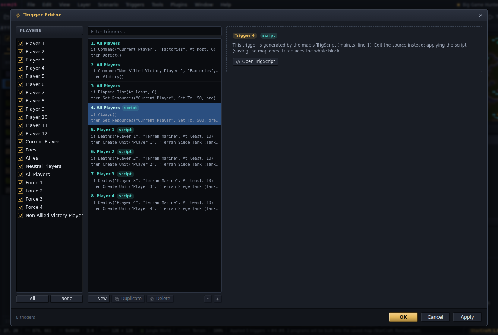
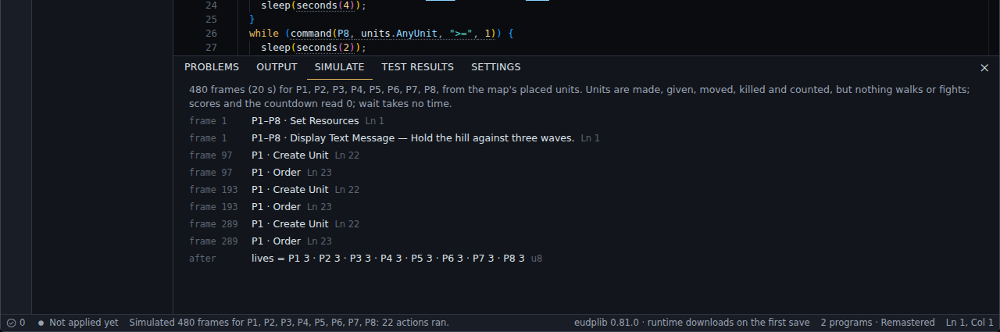
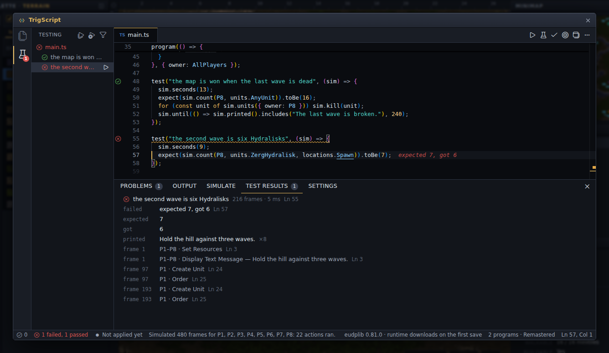
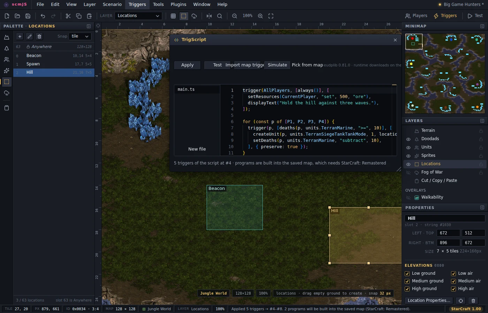

# TrigScript

TrigScript is a way to write triggers as code. The code is TypeScript and it lives inside
the map. It is a plugin, on from the start: Triggers ▸ TrigScript… opens it as soon as a
map is open.

Two ideas carry it. The files are real TypeScript and they *run* when the script is
applied: every `trigger()` call they make becomes one trigger of the map, so a helper
that returns the ten triggers a shop needs, a loop over the players, a table of waves and
the whole standard library are there to write triggers *with*. Those are ordinary
triggers, the same kind the Trigger Editor shows, and a map made of them plays on any
version of the game.

Code inside `program(() => { … })` runs *in the game* instead: variables, arrays, texts,
functions, classes, loops and `sleep`, so a lives counter or a wave timer is written as a loop rather
than as a dozen triggers with hand-numbered death counts. Programs are built into the map
by the eudplib plugin, another default, when the map is [saved](guide.md#saving), and **a map with a
program in it needs StarCraft: Remastered**. A script that only calls `trigger()` never
involves any of that.


## Opening the script

Triggers ▸ TrigScript… opens the map's script in a window laid out the way VS Code is,
with the same keys. The **Explorer** on the left holds the script's files as a tree —
`main.ts` is where the script starts, the *New file* and *New folder* icons add to it, and
a row's pencil and bin rename and remove it — and, under them, the script's programs with
their variables. A file or a folder is moved by dragging it onto a folder, or by renaming
it with a folder before its name, and the `import`s that pointed at what moved are
rewritten with it; the notice that says so has an **Undo**. No folder means anything to
TrigScript: `tests/` is a habit, not a rule. The strip at the far left switches the
sidebar between the Explorer and **Testing**, the script's [own tests](#tests). Open
files are tabs over the code, and the icons right of the tabs are what you run: **Play**
(F5), **Simulate** (Ctrl+F5), **Apply** (Ctrl+Shift+B), *Pick from map*, the switch to
[beside the map](#beside-the-map), and **…** for the rest. F1 lists every command. Edits
are saved into the map as you type — the files are members of the map archive, like a
sound — and Ctrl+S saves the map from here too.

The code is checked as you type, against the map's own names: `locations.` completes to
the locations the map has, `units.` to every unit type (and the map's custom names),
`switches.` to the switches by number and by the names the map gives them, and
`players.` to the forces. A location passed where a unit belongs is an error as you type
it, and so is a name the map no longer has. The status bar along the bottom counts the
problems, and a click on the count opens **Problems**, the list of them, under the code
(Ctrl+J shows and hides that panel).


There is no build to remember. **Saving the map applies the script**, and so do Test Map
and anything else that takes the map out of the editor: the script runs, the triggers it
recorded go into the map as one contiguous block of the trigger list (replacing the
previous block, or adding the first), and its programs, if it has any, are built into the
file being written. If the script has an error the map is saved anyway, with the triggers
from the last script that worked, and a notice names the file and the line.

**Apply** does the first half when you ask, which is how to look at the triggers in the
Trigger Editor without saving; the status bar says whether the script's triggers are in
the map, and a click there applies it as well. **Play** applies the script, builds the map
exactly as Save would and hands it to [Test Map](guide.md#test-map), which starts it in the game.
What each of them reported is kept under **Output**.
The Trigger Editor shows the script's triggers with a `script` badge and will not edit
them; *Open TrigScript* there jumps to the file and line that made one. The Text Trigger
Editor fences them in comments. Hand-made triggers around the block are left alone, and a
hand-made trigger inserted before the block just moves it along.



Editing one of the script's triggers by hand makes the block *stale*, and the editor says
so at the next open: how many of its triggers are still the script's and how many were
changed. The next Apply replaces the unchanged ones and keeps the edited ones as
hand-made triggers right after the block, so a wave system tuned in one trigger does not
come back twice; *Append instead* on the notice leaves them all alone and adds a fresh
block after them. While a block is stale, saving leaves the script unapplied and says so.
**Import map triggers** goes the other way: it rewrites the map's hand-made triggers as
`trigger()` calls, in their order, so a map made in the Trigger Editor can carry on as a
script.

**Simulate** runs the script for 480 frames, twenty seconds of the game at Fastest, in a
built-in interpreter and lists, under the code, every action that ran, with its frame and
the source line, and the final value of every program variable. Triggers and programs run side by side in
one world, so a death count a program sets is seen by a trigger. It models death
counters, switches, preserve, list order, the game's arithmetic and the map's players —
a program or a trigger of a force runs for each of its players, and each line says whose
it is — and it has units: the ones placed on the map to start with, then whatever
`createUnit` makes, `giveUnits` hands over, `moveUnit` moves and `killUnitAt` kills, which
`bring` and `command` count. What it cannot know without the game it leaves out: nothing
walks, nothing fights and nothing is built, so no unit dies unless the script kills it. A
script that waits for the enemy to be dead waits for ever here. It is a check on the
logic; the fight is what [tests](#tests) stand in for, and Play is for.



**A map with a program is built when it is saved.** The first time, the eudplib plugin
asks to download its runtime, about 15 MB, once; the desktop app and the container image
carry it. A notice shows while the build runs (a few seconds) with a button to save
without waiting. The file you get is the one to play and to share. It also holds the map
as you see it in the editor, which is what comes back when you open it again, so the
trigger list never fills with generated triggers. One thing changes for the whole map:
the build makes the game run *every* trigger every frame, not every two seconds, the way
hyper triggers do. A preserved trigger that adds a mineral does so twenty-four times a
second in such a map.

The files and a record of the last apply live in the map archive under `trigscript\` —
`main.ts`, any other file, and `build.json` — next to the scenario, so they travel with
the `.scx`. The [Save dialog](guide.md#saving) lists them under the archive's other files, each
with a tick, so a copy for release can leave the source out; the triggers stay either
way.

## Tests

A script can test itself. A test is ordinary TypeScript that runs here, in the simulator,
after every change that compiles. It never runs in the game and adds nothing to the map.
If you have used Vitest or Jest, the names are the same ones — `test`, `describe`,
`beforeEach`, `test.only`, `test.skip`, `test.each`, `expect` — imported from
`"trigscript"`.

```ts
import { test, expect } from "trigscript";

// A Marine on the beacon calls the next wave, each bigger than the last.
program(() => {
  let wave = 0;
  while (true) {
    if (countUnits(P1, units.TerranMarine, locations.Beacon) > 0) {
      wave += 1;
      createUnit(P8, units.ZergZergling, wave * 4, locations.Spawn);
      print(`Wave ${wave}`);
      killUnitAt(P1, units.TerranMarine, "All", locations.Beacon);
    }
    sleep(frames(1));
  }
}, { name: "waves" });

test("the second wave is bigger", (sim) => {
  sim.place(P1, units.TerranMarine, locations.Beacon);
  sim.until(() => sim.program("waves").wave === 1);
  sim.place(P1, units.TerranMarine, locations.Beacon);
  sim.until(() => sim.program("waves").wave === 2);
  expect(sim.count(P8, units.ZergZergling, locations.Spawn)).toBe(12);
  expect(sim).toHavePrinted("Wave 2");
});
```

Every test gets `sim`, a world of its own: the map's placed units, locations and players,
the script's programs at their first frame and its triggers beside them, and the same
`random()` every run. What a test does with it:

| | |
| --- | --- |
| `sim.place(player, type, location, count?)`, `sim.kill(unit)`, `sim.remove(unit)`, `sim.give(unit, to)`, `sim.move(unit, to)` | Change the world. `place` hands the units back; `kill` is what a fight is in a test. |
| `sim.frames(n)`, `sim.seconds(n)`, `sim.until(() => …)` | Let the game run. `until` fails the test if it is still not true after 2400 frames, so no test hangs. |
| `sim.press("F2")`, `sim.click()`, `sim.type("-give 100")`, `sim.moveMouse(x, y)` | What a player does, found by the next frame. |
| `sim.count(player, type, location?)`, `sim.units(filter?)`, `sim.resources(player)`, `sim.deaths(player, type)`, `sim.switch(n)` | Read the world back. |
| `sim.program("waves").wave` | A program's variables by their names in the code: numbers, texts, arrays, a record as an object. The program is named by its options, `program(() => { … }, { name: "waves" })`; of a program that runs for several players, `sim.program("lives", P2)`. |
| `sim.printed()`, `expect(sim).toHavePrinted("Wave 2")` | What was shown to the players. |

A test fails when an `expect` does not hold, when it throws, and when a program does what
is always a mistake and the game would pass over in silence, such as reading past the end
of an array. A test that means to see that says `expect(sim).toHaveFaulted()`.

Tests live beside what they test, as above, or in files whose name ends in `.test.ts`, in
any folder. A test file can `import` the script's own functions and test them as plain
TypeScript. It is never part of the map: `main.ts` cannot import one, and a `trigger()` or
a `program()` inside one is an error.



In the editor, every `test(` has a mark in the margin — passed, failed, not run — and a
click on it runs that test. A failure is said where it happened, `expected 7, got 6` at
the end of the line. The **Testing** view lists the tests by folder, file and `describe`,
runs all of them, one of them or the ones that failed, and can show only the failing; the
status bar keeps the count, and **Test Results** under the code has the chosen test's
message, what it printed and what happened frame by frame. Tests run again by themselves
after each change that compiles. A failing test is a warning, not an error: the map still
saves and builds. **Settings ▸ Tests** has a tick, kept in the map, that makes a failing
test refuse the build instead.

## Beside the map

The editor opens two ways. The window is for writing; *Beside the map* — an icon right of
its tabs, or Triggers ▸ TrigScript beside the map — is a panel over the map that blocks
nothing: drag it by its title, resize it by its corner, and keep placing units while the
code sits next to them.



Beside the map, the names in the code and the objects on the map know about each other:

- **Ctrl+click** on `locations.Beacon` scrolls the map to the location and flashes it.
  Hovering the name says where it is and how big.
- **Pick from map** (the target icon, or a right-click in the code): click a location or a
  unit on the map, and its name (`locations.Beacon`, `units.TerranMarine`) lands at the
  cursor. From the window, it first moves the editor beside the map.
- When you rename a location or a switch the script mentions, a notification offers to
  **update the references** in every file. It follows the name the way the code does — an
  alias from `import { locations as L }` counts — and leaves comments, strings and
  anything merely spelled the same alone.

## Writing triggers

A trigger is one call:

```ts
trigger(AllPlayers, [
  bring(CurrentPlayer, units.AnyUnit, locations.Beacon, ">=", 1),
], [
  displayText("You found it!"),
  preserve(),
]);
```

`trigger(players, conditions, actions, options?)` records one trigger. `players` is a
player or a list of them; `conditions` and `actions` are lists of what the condition and
action functions return. The options are the execution flags by name: `{ preserve: true }`
is the same as the `preserve()` action, and `disabled`, `ignoreGameEnd` and the rest are
there too.

Every condition and action the game has is a function named after StarEdit's, in camel
case: `bring`, `deaths`, `command`, `accumulate`, `elapsedTime`, `switchIs` (its real name
is a reserved word), `createUnit`, `displayText`, `setResources`, `moveUnit`, `order`,
`runAiScript`, `victory`. The arguments come in the order the Trigger Editor shows them,
and the ones the editor offers as a list are short words: `">="`, `"<="`, `"=="` for a
comparison; `"set"`, `"add"`, `"subtract"` for a modifier; `"set"`, `"clear"`,
`"toggle"`, `"randomize"` for a switch; `"ore"`, `"gas"`, `"oreAndGas"` for a resource;
`"move"`, `"patrol"`, `"attack"` for an order. A unit count is a number or `"All"`.
StarEdit's own labels (`"At least"`) are accepted as well. `not(condition)` is the
opposite of a condition where one condition can say it: `not(bring(…, ">=", 1))` is "at
most 0". Hover any of them in the editor for its arguments.

Names come from the map. Each display name becomes an identifier — `Terran Marine` is
`units.TerranMarine`, `Terran Siege Tank (Tank Mode)` is
`units.TerranSiegeTankTankMode` — and the display name itself still works as an index,
`units["Terran Marine"]`. `P1` … `P12`, `CurrentPlayer` and `AllPlayers` are constants,
and the other groups are under `players`: `players.Force1`, `players.Foes`,
`players.Allies`. A raw number works wherever a name does, which is how an EUD player or
an odd unit id gets in.

The script is a program that runs when it is applied, and everything TypeScript offers at
that moment is fair game. A loop makes the same trigger for several players; a function
returns a list of actions; a table holds the numbers; a template string builds the text:

```ts
function reinforce(p: Player) {
  return trigger(p, [deaths(p, units.TerranMarine, ">=", 10)], [
    createUnit(p, units.TerranSiegeTankTankMode, 1, locations.Spawn),
    setDeaths(p, units.TerranMarine, "subtract", 10),
    displayText("Reinforcements have arrived."),
  ], { preserve: true });
}

for (const p of [P1, P2, P3, P4]) reinforce(p);
```

Nested lists are flattened and `false`, `null` and `undefined` entries are skipped, so a
helper can return a list of actions and a condition can be written `hardMode && bring(…)`.
What the script records is what the map gets, and the order of the `trigger()` calls is
the order of the triggers.

A condition is a *value* here — the game tests it later — so `if (bring(…))` outside a
program does not do what it looks like, and the editor says so and where the test belongs:
in a trigger's conditions, or in an `if` inside a program.

A script can be several files. `import { x } from "./name"` brings in another file of the
map's script; nothing else can be imported. The library is available as globals, so no
import is needed, and also as the module `"trigscript"` for anyone who prefers
`import { trigger, bring } from "trigscript"`.

`hyperTriggers(P8)` anywhere in the script emits the classic three preserved triggers of
sixty-two waits, so the whole trigger list runs every frame instead of every two seconds.
Give them to a player whose other triggers never wait — a computer slot, usually — since
a Wait stalls every trigger of that player. A map with a program does not need them: its
build already makes the list run every frame.

## Programs

Everything inside `program(() => { … })` runs in the game:

```ts
program(() => {
  let wave = 0;
  let alarm = false;
  while (true) {
    if (bring(P1, units.AnyUnit, locations.Beacon, ">=", 1) && !alarm) {
      alarm = true;
      displayText("They are coming.");
    }
    if (alarm) {
      createUnit(P8, units.ZergZergling, 4, locations.Spawn);
      wave += 1;
    }
    if (wave >= 10) defeat();
    sleep(seconds(20));
  }
}, { owner: P1 });
```

**A program runs every frame, from where it left off.** Its body runs until it reaches a
`sleep()` or its end, all within one frame of the game, and the next frame it carries on
from there. A body that ends stops for good. So the loop above is a game loop: it looks
at the beacon, sends a wave if the alarm is up, and sleeps twenty seconds.

**Variables** hold numbers, booleans, texts and units of the game, and a
`let p = { lives: 3, gold: 0 }` is a variable per field. They live in the game while the map is played and take nothing from
the map: no death counters, no switches, no triggers in the list. Numbers are whole and
signed, as in TypeScript: `a - b` is below zero when `b` is larger, `while (i >= 0)` ends,
and a number below zero is shown with its minus sign. A number runs from −2 147 483 648 to
2 147 483 647 and wraps at either end. A `u8` or `u16` variable (`let lives: u8 = 3`) stays
within 0 … 255 or 0 … 65 535 and stops at both ends, which is what lives and cooldowns
want; a `u32` runs from 0 to 4 294 967 295, for bit masks and hashes, and is kept apart
from a plain number in arithmetic unless `u32(x)` or `i32(x)` says which is meant. `+`,
`-`, `*`, `/` and `%` work between variables, with `Math.min`, `Math.max`, `Math.abs` and
`clamp()`, and so do the bitwise `&`, `|`, `^`, `<<`, `>>` and `>>>`; division is whole and
towards zero, and dividing by a variable that is 0 gives 0. Where the game takes nothing
below zero — hit points, an amount, a unit count — a number below zero goes in as 0.

**Arrays** hold numbers, booleans, texts, units, records or other arrays: `let hp = [10, 20, 30]`, `new Array(12).fill(3)`, an
index that is a constant or a variable (`hp[i] += 7`), `.length`, `for (const x of xs)`,
`fill`, `includes` and `indexOf`. An array that something pushes to grows —
`const queue: number[] = []; queue.push(x); queue.pop() ?? 0` — with no size to declare: the
cells come from a pool the map's programs share, and the workspace's **Settings** view
(Ctrl+,) sets how large it is, a setting kept in the map. An index past the end reads 0 and
stores nothing, and Simulate says where. An array of records — `let waves = [{ count: 4,
delay: 2 }]`, `waves[i].count += 1`, `waves.push({ … })` — hands out its records by
reference, as TypeScript does, and an array of units (`const squad: Unit[] = []`,
`squad.push(u)`) may be kept across a `sleep()`. A record in an array may hold a unit, a text, an array of its own
(`squads[i].members.push(u)`) or another record. An array of arrays is a grid —
`let grid = [[0, 0, 0], [0, 0, 0]]`, `grid[y][x] += 1` — or rows that each grow
(`buckets[i].push(v)`), and `const names: string[] = []` is an array of texts. A list made
outside the program — `const price = [50, 100, 150]`, or a wave table of records — can be
looked up with a variable: `price[level]`, `waves[wave].count`.

**The array methods that take a function** are there, written as in TypeScript: `forEach`,
`some`, `every`, `find`, `findIndex`, `reduce`, `map`, `filter`, `sort` and `reverse`, and
chains of them. `filter` over the units of the game is how to keep some of them:

```ts
program(() => {
  while (true) {
    // The three most hurt units at the base get 20 hit points, every two seconds.
    const hurt = unitsAt(locations.Base, { owner: CurrentPlayer }).filter((u) => u.hp < u.maxHp);
    hurt.sort((a, b) => a.hp - b.hp);
    for (const u of hurt.slice(0, 3)) u.heal(20);
    sleep(seconds(2));
  }
}, { owner: AllPlayers });
```

The function is written into the loop the method becomes, so it costs nothing and sees the
program's variables — and for the same reason it cannot be kept in a variable: write it
where it is used, or name a `function`. `sort` wants its function (`(a, b) => a - b`), runs
within the frame, and is nothing for dozens of items and felt for hundreds every frame; the
end of the line says *sorts in the frame*. `slice`, `concat`, `toSorted`, `toReversed` and
`Array.from` make copies. Patterns and spread work as well: `const { x, y } = mouse(P1)`,
`for (const { count, delay } of waves)`, `[a, b] = [b, a]`, `[...xs, 7]`,
`waves.push({ ...w, count: 9 })`.

**Tables keyed by an id of the game** are arrays with a cell for every id, so a key of the
game is one read: `const bounty: Record<UnitType, number> = { [units.ZergZergling]: 5 }` and
`bounty[u.type]`, `new Map<UnitType, number>()` with `get` (`?? 0` for a key never set),
`set`, `has`, `delete`, `clear` and `size`, `new Set<UnitType>()` with `add` and the same;
`for (const [key, value] of lost)` goes through the keys that are there.
The keys are unit types, players, locations, switches, weapons, upgrades or technologies.

**A `Map` and a `Set` over any number, or over units**, are for keys that are no id of the
game: `new Map<number, number>()` for a tile packed into one number, `new Map<Unit,
number>()` for a cooldown a unit, `new Set<Unit>()` for the units already dealt with. They
go through their keys in the order the keys went in, as JavaScript's do. A key is looked
for, a few steps where a table keyed by ids of the game is one read, and the values are
numbers or booleans. A unit that died stays an entry until it is deleted; in a loop over
the map it reads as no unit, which is the moment to delete it.

**Control flow is what it says.** `if`/`else`, `while`, `do`, `for`, `switch`, `break`,
`continue` and `c ? a : b` all work. Conditions go in an `if` or a `while`; actions stand
as statements. A loop runs all its rounds at once, within the frame, which has one
consequence to keep in mind: a loop that never ends and never sleeps would freeze the
game. The editor refuses one and says where to put `sleep(frames(1))`. A `for` whose
bounds are known when the script is applied is unrolled, and the editor says so at the
end of the line.

**Time is `sleep`.** `sleep(seconds(15))` gives the frame back and carries on that much
later, while other programs and the map's triggers go on. `frames(n)` is the game's own
clock, a second is twenty-four frames at Fastest, and `minutes()` is there too.
Something that runs on its own clock is another program — one program per concurrent
activity. The game's own `wait()` is allowed but is a different thing: it stalls every
trigger of that player, so use it for a short pause (a text, then a sound) and `sleep`
to pass time.

**Edges.** `if (rose(bring(…)))` is true on the frame the condition becomes true and not
again until it has been false in between; `once(…)` is true the first time only.
`random()` is a coin toss, and `random(n)` a whole number from 0 to n − 1.

**Reads: what the game holds is a value.** Every condition that compares a quantity is
also a read of it when the comparison and the amount are left out, and a read goes
wherever a number goes:

```ts
program(() => {
  let price = 50;
  while (true) {
    if (minerals(CurrentPlayer) >= price * 2 && bring(CurrentPlayer, units.AnyUnit, locations.Beacon) >= 1) {
      setResources(CurrentPlayer, "subtract", price, "ore");
      createUnit(CurrentPlayer, units.TerranMarine, 1, locations.Spawn);
      price += deaths(CurrentPlayer, units.TerranMarine);
    }
    sleep(seconds(1));
  }
}, { owner: AllPlayers });
```

`deaths(p, unit)`, `kill(p, unit)`, `bring(p, unit, location)`, `command(p, unit)`,
`accumulate(p, resource)`, `score(p, kind)`, `countdownTimer()` and `elapsedTime()` all
read this way, and the common ones have plainer names: `minerals(p)`, `gas(p)`,
`countUnits(p, unit, location?)`, `kills(p, unit)`, `countdown()`, `elapsed()` — those two
in the game's own seconds, which at Fastest pass about one and a half times as fast as
the seconds of `sleep`. A read means what its condition means — a force's minerals are the force's sum, `units.Men`
counts what Bring counts — and it is taken when the line runs, so `let ore =
minerals(P1)` keeps the number and `minerals(P1)` written twice reads twice. What to read
— the player, the unit, the location — is fixed when the script is applied. About the
players themselves there are `race(p)` (compare it with `races.Zerg`, `.Terran`,
`.Protoss`), `slot(p)` (`slots.Human`, `.Computer`, `.Empty`), `isHuman(p)`,
`hasLeft(p)` and `supply(p, "used" | "max" | "provided")` as the top bar shows it.

**The units on the map are objects.** A loop runs over the ones that match, a pick finds
one, and a unit has properties and things it can be told:

```ts
program(() => {
  while (true) {
    // Everything Player 2 has on the hill is worn down to half health.
    for (const u of unitsAt(locations.Hill, { owner: P2 })) u.hp = u.maxHp / 2;

    // The Marine nearest the beacon is sent to the base; nobody else moves.
    const scout = nearest(units.TerranMarine, locations.Beacon, { owner: P1 });
    if (scout) scout.order("move", locations.Base);

    sleep(seconds(5));
  }
});
```

`unitsAt(location, filter?)`, `unitsOf(player, filter?)` and `allUnits(filter?)` are what
a `for…of` runs over; `first(filter?)`, `nearest(type, location, filter?)` and
`randomUnit(filter?)` give one unit, or `null` when nothing matches — so the `if (scout)`
is required, and the editor says so when it is missing. A filter is `{ type, owner, at }`;
`units.Men`, `units.Buildings` and `units.Factories` work as a type. A unit has `hp`,
`shields` and `energy` in whole points, `maxHp` and `maxShields`, `owner`, `type`, `x`,
`y`, `kills`, `cooldown`, `resources`, the spell timers (`stim`, `lockdown`, `stasis`, …)
and `invincible`, `burrowed`, `cloaked`, `hallucinated`, `underAttack`. Hit points,
shields, energy, kills, the cooldown, the timers and `invincible` can be written; the
position, the owner and the rest are read only, and the editor marks a write to one as
you type. A unit can be told `order("move" | "patrol" | "attack", location)`,
`give(player)`, `kill()`, `remove()`, `damage(n)`, `heal(n)` — or `{ percent: 50 }` — and
`locate(location)`, which centres a location on the unit so that the ordinary actions can
happen where it stands.

A variable can keep a unit across a `sleep`. Units die, and the game hands a dead unit's
place to the next one made, so every use checks that the unit is still the same one:
once it is gone its numbers read 0 and nothing written or told to it has any effect, and
`if (u)` asks whether it is still there. A loop over units runs within one frame, so a
`sleep` inside one is an error; to take units one at a time, find the next after each
sleep. Each loop and each pick looks through all of the game's 1700 unit slots when its
line runs, which is nothing a few times a second and worth a thought every frame: the
editor writes *scans units* at the end of such a line.

**`stats()` reaches the game's own tables**: what a unit type costs, what a weapon does,
which upgrades a player has.

```ts
program(() => {
  stats(units.TerranMarine).minerals = 25;
  stats(units.TerranMarine).speed = 6.5;               // pixels a frame; a Marine walks at 4
  stats(units.ZergZergling).name = "Dog";
  stats(weapons.GaussRifle).damage += 2;
  stats(P1).upgrades[upgrades.TerranInfantryWeapons] = 3;
  stats(P3).color = "teal";
});
```

A field reads as a number (or true / false) and takes `=` and `+=`. Unit types, weapons
(`weapons.`), upgrades (`upgrades.`), technologies (`techs.`) and players each have their
own fields, and the completion list after the dot is the list: only what was played and
seen working in Remastered is offered, and the hover on each field says what it reaches —
most unit-type fields apply to units made after the write, a weapon's to every unit
using it, a colour at once. A write lasts for the game.

**What the players do** is there to read: a key, a mouse button, where the mouse is, and
what a player types.

```ts
program(() => {
  while (true) {
    if (keyPressed(CurrentPlayer, "F8")) createUnit(CurrentPlayer, units.TerranMarine, 1, locations.Anywhere);

    if (clicked(CurrentPlayer, "right")) {
      const at = mouse(CurrentPlayer);
      displayText(`You clicked at ${at.x}, ${at.y}.`);
    }

    const m = chatted(CurrentPlayer, "-spawn {n} {what:unit}");
    if (m) createUnit(CurrentPlayer, m.what, m.n, locations.Anywhere);

    underMouse(CurrentPlayer, { owner: CurrentPlayer })?.heal(10);
    sleep(frames(1));
  }
}, { owner: AllPlayers });
```

A key, a click and a typed line are true on the one frame they arrive, so look for them
in a loop that sleeps one frame at a time. `keyPressed` is true once per press — not
while the key is held, and not while the player is typing a message. `mouse(p)` is the
place on the map under the player's cursor, in pixels (32 to a tile);
`centerLocation(location, x, y)` moves a location there, so that a unit can be created
under the cursor, and `underMouse(p)` is the unit nearest the cursor, or `null`.

`chatted(p, pattern)` is `null` until the player sends a line that fits the pattern, and
then holds what the pattern read out of it. The pattern's own words are matched exactly
and the whole line has to fit; `{n}` reads a whole number, `{what:unit}` a unit type by
its name (the rest of the line, so it comes last) and `{kind:ore|gas}` one of the listed
words, as its place in the list. The editor knows the names in the pattern: after `m.` it
offers `n` and `what`, and nothing else. A pattern starts with a word of its own, such as
`-spawn`, so ordinary talk is left alone. A game played in single player has no chat, so
try typed lines in a multiplayer game — hosting one alone is enough.

All of this reaches every player's computer in step, a few frames after it happens. It
costs the map a little, and only when a program reads input: one free location among the
first 63 (nine when the mouse is read; the script is told when there is no room), and
the Valkyrie and Player 12, which carry the input between computers and must be left
alone.

**A text can hold the program's numbers.** Write it as a template literal:

```ts
program(() => {
  let wave = 0;
  while (true) {
    wave += 1;
    displayText(`Wave ${wave}: you have ${minerals(CurrentPlayer)} ore, ${name(CurrentPlayer)}.`);
    print(`${color(P1)}${name(P1)}\x01 leads with ${kills(P1, units.AnyUnit)} kills`, { to: AllPlayers, position: "center" });
    sleep(seconds(30));
  }
}, { owner: AllPlayers });
```

`name(p)` is the player's name and `color(p)` the colour code of their colour, filled in
by the game. `displayText` shows the text to the current player, as it always has;
`print(text, { to, position })` shows it to someone else — a player, `AllPlayers`, a
force — or, with `position: "center"`, on the line in the middle of the screen where the
game's own messages appear.

**A text is a value.** A `string` variable holds one, a function takes and returns one, a
record has one for a field, and there is no length to declare:

```ts
program(() => {
  let shown = "";
  while (true) {
    const slain = kills(P1, units.AnyUnit);
    const rank = slain >= 50 ? "Veteran" : slain >= 10 ? "Soldier" : "Recruit";
    const line = `${rank}: ${slain} kills, ${Math.max(50 - slain, 0)} to go`;
    if (line != shown) { setMissionObjectives(line); shown = line; }
    sleep(seconds(1));
  }
});
```

Texts take `+`, `+=`, templates, the comparisons, `length`, `s[i]`, `slice`, `indexOf`,
`includes`, `startsWith`, `endsWith`, `padStart`, `padEnd`, `repeat` and
`for (const ch of s)`; a character is a character, so `"저글링".length` is 3. The
objectives, a leaderboard's label, a transmission's line and a unit type's name
(`stats(units.ZergZergling).name = …`) take a text the program made, up to 255 bytes; what
is on the screen is the text as it was when the action ran, so run the action again when
the text changes, as above. A made text holds 1 023 bytes and is cut off past that, which
the game says once in red. `split`, `replace`, `trim` and `parseInt` are not there: keep a
number beside the text it was made into.

**Functions** declared inside the program, or made with `game()` in any file, run in the
game too. Arguments pass by value, they may return a number, a boolean, a text or a unit —
`function canAfford(price: number) { return gold >= price; }` — and they may sleep. A
function used once is written into the program where it is called; one used more than
once is a single copy in the built map that every call runs, which keeps a script with
helpers small. The end of the function's line says which it got (*called ×3*, *inlined
×2*), and hovering it says why: a function that sleeps, or whose parameter has to be
known when the map is built (the player of `setResources(p, …)`), stays inlined. A
function may call itself — `fib(n - 1) + fib(n - 2)`, a flood fill over an array — as long
as it does not sleep: each run has its own parameters and locals, as in TypeScript. It may
go 1 024 calls deep unless the workspace's Settings says otherwise; a call past that stops
the program, and the game says where. Thousands of such calls within one frame make the
game pause, since each keeps its function's variables while it runs.

**Classes** are TypeScript's, declared inside the program: fields, a constructor, methods,
`get` and `set`, `static`, `private`, `extends` with `super`.

```ts
program(() => {
  class Wave {
    left: number;
    constructor(public unit: UnitType, count: number) { this.left = count; }
    get done() { return this.left == 0; }
    send() {
      createUnit(P8, this.unit, 1, locations.Spawn);
      this.left--;
    }
  }
  const waves = [new Wave(units.ZergZergling, 12), new Wave(units.ZergHydralisk, 6)];
  for (const w of waves) {
    print(`${w.left} are on their way`, { to: AllPlayers });
    while (!w.done) { w.send(); sleep(seconds(1)); }
    sleep(seconds(30));
  }
  victory();
});
```

An instance is a record and a method a function handed the instance, so what holds for
functions holds for methods. Which class an instance is, is settled when the script is
applied — nothing of a class is left in the game — and the limits follow from that: an
array of instances holds one class, a function can give back an instance only when every
`return` gives the same one (`return this`, so calls chain, or `return new Wave(…)`), and a
class a program writes to is declared inside it.

**A program runs for its owner** (Player 1 unless `{ owner: … }` says otherwise), as that
player, while that player is in the game. `AllPlayers`, a force or a list of players
makes a **per-player program**: the same code runs for each of those players who is in
the game, computers included, `CurrentPlayer` is that player, and every variable is per
player, each with their own copy — which is how lives, scores and cooldowns are written
once. `let total = shared(0)` is one value they all share.

**Everything the body reads from outside is computed when the script is applied.** A
constant, a helper, a condition, an action: each is worked out once, when the script
runs, and the editor underlines those parts with dots so the boundary is visible as you
type. That is what lets a helper written outside the program supply actions inside it.
It is also the one rule to keep in mind: a program variable cannot reach a condition, an
action or a helper, because those were computed before the game started. The exceptions
are the amount of `setResources`, `setDeaths`, `setScore` and `setCountdownTimer`, the
unit count of `createUnit`, `killUnitAt`, `removeUnitAt` and `giveUnits` and an action's
unit type, which can be variables or expressions over them, and a text: `displayText` and
`print` take any text the program made, and so do the objectives, a leaderboard's label, a
transmission and a unit type's name.

## TrigScript beside TypeScript

Outside `program()` there is nothing to compare: the script is TypeScript, checked by the
TypeScript compiler and run when it is applied, with the whole language and its standard
library. This table is about the inside of a program, where what is written has to become
something the game can do. *Same* means it is written and behaves as in TypeScript; what
differs is said, and what is missing is refused with a message as you type, never passed
over in silence.

| TypeScript | In a program | What is different |
| --- | --- | --- |
| Types: annotations, `interface`, `type`, unions of literals, tuples, generic functions, `as`, `!` | Same | Erased, as in TypeScript. Some decide how a value is kept: `u8`, `u16` and `u32` are widths, and a `Map<UnitType, V>` is kept differently from a `Map<number, V>`. A class takes no type parameters. |
| `let`, `const`, `var` | Same | A variable needs a first value (`let n = 0`). A `const` the script already knows is worked out when the script is applied and takes nothing from the map. |
| `number` | Different | A whole number of 32 bits, signed, wrapping at its ends. No fractions, no `NaN`, no `bigint`. `/` is whole division towards zero, and dividing by 0 gives 0. `u8` and `u16` (which stop at their ends) and `u32` are added. |
| `boolean` | Same | Assigned with `=` only: no `\|\|=` or `&&=`. |
| `string` | Mostly | A value with no length to declare. `length`, `s[i]` and `slice` count characters, so they differ from JavaScript only for an emoji or a rare ideograph. A made text holds 1 023 bytes. No `split`, `replace`, `trim`, `toUpperCase`, `parseInt` or regular expressions. |
| `null`, `undefined` | Units only | `Unit \| null` is real: `first(…)`, `if (u)`, `u?.kill()`. A number, a boolean or a text is never either, so where JavaScript would give `undefined` — `pop()`, `find()`, `get()` — say what it is then: `xs.pop() ?? 0`. No optional fields or parameters (`y?: number`); a parameter's default (`y = 1`) is there. |
| Operators: `+ - * / %`, comparisons, `&&` `\|\|` `!`, `c ? a : b`, the bitwise ones, `??`, `?.`, `++` `--`, the compound assignments | Same | `==` and `===` are one thing, since nothing is coerced. Missing: `**`, `typeof`, `in`, `delete`. |
| `if`, `while`, `do`, `for`, `for…of`, `switch`, `break`, `continue` | Same | A loop runs all its rounds within one frame of the game, so one that never ends must `sleep()` on every path — also a `while (true)` that is only left by a `break`. No `for…in`, no labels. |
| Functions: parameters by value, defaults, rest parameters, recursion, generics | Same | A function that calls itself cannot `sleep()` and has a depth limit. One declared inside another does not see the outer one's variables, only the program's. It returns a number, a boolean, a text, a unit or an instance — not a record or an array it made: hand it the one to fill in. |
| Arrow functions, closures, functions as values | Callbacks only | An arrow is written where a method takes it — `xs.map((x) => x + bonus)` — and sees every variable in reach. It cannot be kept in a variable, an array, a field or a return value. |
| Object literals | Records | A variable a field: nested, passed by reference, spread, taken apart by patterns. The shape is fixed: no `p[key]` with a key that varies, no methods on a literal (a class has them), no `Object.keys`. |
| Destructuring and spread | Same | `...rest` takes the tail of an array of numbers or booleans. |
| Arrays | Mostly | Fixed or growing; of numbers, booleans, texts, units, records, instances and arrays. `push`, `pop`, `length`, `fill`, `includes`, `indexOf`, the methods that take a function, `sort`, `reverse`, `slice`, `concat`, `toSorted`, `toReversed`, `join` of texts, `Array.from`. No `shift`, `unshift`, `splice`, `at` or `flat`, and `map` makes numbers or booleans. `sort` wants its function. An index past the end reads 0 and stores nothing. `const b = a` is not a second name for an array. |
| Classes: fields, constructor, methods, `get` / `set`, `static`, `private`, `readonly`, `extends`, `super`, `abstract`, `implements`, `instanceof` | Same | Declared inside the program. The class of every instance is settled when the script is applied: an array of instances holds one class, and a function gives back an instance only when every `return` gives the same one. No decorators, no class written as a value. |
| `Map`, `Set` | Mostly | Keys are numbers, units or ids of the game; values are numbers or booleans. They go through their keys in the order the keys went in, as JavaScript's do — a table keyed by ids of the game goes by id. |
| `enum` | Outside | Declared above the program, its members are numbers a program can use. |
| `try` / `catch` / `throw` | Missing | The game has no exceptions. What is always a mistake — an index past the end, no room left for an array, a function that called itself too deep — the game says in red, and Simulate lists. |
| `async` / `await`, promises, generators, timers | Missing | `sleep()` is how a program waits. Something on its own clock is another `program()`. |
| `import` | Same | Between the script's files, and from `"trigscript"`; nothing else. A function that another file's program calls is made with `game()`. |
| The standard library | A little | `Math.min`, `Math.max`, `Math.abs`, `String(n)`, `Array.from`, `new Array(n).fill(v)`. `print()` stands in for `console.log` and `random(n)` for `Math.random()`. No `JSON`, `Date` or `Object.*`, and no `Math.sqrt` on a variable: look the value up in a list the script worked out. |
| — | Added | What TypeScript has no word for: `sleep`, `rose` and `once`, reads of the game (`minerals(p)`), units as objects and loops over them, `stats()`, keys, the mouse and chat, `shared()`, per-player programs. |

## Examples

Each of these is a complete `main.ts`. They assume a map with locations named `Beacon`,
`Spawn`, `Base`, `Hill` and `Shop`; use your own names, and the editor completes them.

**Starting resources and a welcome.** The simplest trigger: no preserve, so it runs once,
and `CurrentPlayer` means each player in turn.

```ts
trigger(AllPlayers, [always()], [
  setResources(CurrentPlayer, "set", 500, "ore"),
  setResources(CurrentPlayer, "set", 100, "gas"),
  displayText("Hold the hill for five minutes to win."),
]);
```

**Hyper triggers.** One line, and the whole trigger list runs every frame. Player 8 is
the computer slot here, and nothing else in the script makes that player wait. For a map
of plain triggers; a map with a program runs every frame already.

```ts
hyperTriggers(P8);
```

**Something for every player.** A helper returns the trigger; a loop calls it. Death
counts are the game's own counters, and subtracting ten after the reward makes the
trigger fire again at the next ten, which `preserve: true` allows.

```ts
function reinforce(p: Player) {
  return trigger(p, [deaths(p, units.TerranMarine, ">=", 10)], [
    createUnit(p, units.TerranSiegeTankTankMode, 1, locations.Spawn),
    setDeaths(p, units.TerranMarine, "subtract", 10),
    displayText("Reinforcements have arrived."),
  ], { preserve: true });
}

for (const p of [P1, P2, P3, P4]) reinforce(p);
```

**A shop.** Bring a civilian to the shop with enough minerals, and four marines appear
at the spawn. The civilian is moved out first, so the trigger does not fire again on the
next cycle, and `price` is an ordinary constant used twice.

```ts
const price = 150;

trigger(AllPlayers, [
  bring(CurrentPlayer, units.TerranCivilian, locations.Shop, ">=", 1),
  accumulate(CurrentPlayer, ">=", price, "ore"),
], [
  moveUnit(CurrentPlayer, units.TerranCivilian, 1, locations.Shop, locations.Spawn),
  setResources(CurrentPlayer, "subtract", price, "ore"),
  createUnit(CurrentPlayer, units.TerranMarine, 4, locations.Spawn),
  displayText(`Four marines for ${price} minerals.`),
], { preserve: true });
```

**Waves from a table.** The table is ordinary data; the program walks it, one wave every
forty-five seconds, then waits for the last attacker to die. `for … of` over a list known
when the script is applied is unrolled, so `w.unit` and `w.n` are plain values in each
copy. The program runs as Player 1, so `victory()` is Player 1's; a team needs a
`trigger()` for the others. This one, and every example below with a `program`, makes a
map for StarCraft: Remastered.

```ts
const waves = [
  { unit: units.ZergZergling, n: 8 },
  { unit: units.ZergHydralisk, n: 6 },
  { unit: units.ZergUltralisk, n: 2 },
];

program(() => {
  displayText("The first wave arrives in thirty seconds.");
  sleep(seconds(30));
  for (const w of waves) {
    createUnit(P8, w.unit, w.n, locations.Spawn);
    order(P8, w.unit, locations.Spawn, locations.Base, "attack");
    minimapPing(locations.Spawn);
    sleep(seconds(45));
  }
  while (command(P8, units.AnyUnit, ">=", 1)) {
    sleep(seconds(2));
  }
  displayText("The last wave is broken.");
  victory();
});
```

**Lives, per player.** One program, run for every player: `lives` is a separate counter
for each. When the hero dies the game's death count for it goes to 1; the program resets
that count, takes a life, and either brings the hero back or ends the game for that
player. The `sleep(frames(1))` at the end of the loop is what makes it a game loop: look
once a frame.

```ts
program(() => {
  let lives: u8 = 3;
  while (true) {
    if (deaths(CurrentPlayer, units.JimRaynorMarine, ">=", 1)) {
      setDeaths(CurrentPlayer, units.JimRaynorMarine, "set", 0);
      lives -= 1;
      if (lives == 0) {
        displayText("No lives left.");
        defeat();
      } else {
        createUnit(CurrentPlayer, units.JimRaynorMarine, 1, locations.Spawn);
        displayText("Your hero returns.");
      }
    }
    sleep(frames(1));
  }
}, { owner: AllPlayers });
```

**King of the hill.** A point a second for holding the hill alone, shown on a
leaderboard, and a win at a hundred. `points` is a variable of the program and the
amount of `setScore` follows it; `players.Foes` is "anyone at war with the current
player", so the check is written once for everyone.

```ts
trigger(AllPlayers, [always()], [leaderboardPoints("Hill", "custom")]);

program(() => {
  let points: u16 = 0;
  while (true) {
    if (bring(CurrentPlayer, units.AnyUnit, locations.Hill, ">=", 1)
        && !bring(players.Foes, units.AnyUnit, locations.Hill, ">=", 1)) {
      points += 1;
      setScore(CurrentPlayer, "set", points, "custom");
      if (points >= 100) {
        displayText("The hill is yours.");
        victory();
      }
    }
    sleep(seconds(1));
  }
}, { owner: AllPlayers });
```

**Random events.** Every two minutes, a coin toss decides which of two things happens.
`random()` is the coin; `else` is the other side of it.

```ts
program(() => {
  while (true) {
    sleep(minutes(2));
    if (random()) {
      displayText("Reinforcements pour from the nydus canal.");
      createUnit(P8, units.ZergZergling, 12, locations.Spawn);
    } else {
      displayText("A supply drop: 100 minerals for everyone.");
      setResources(AllPlayers, "add", 100, "ore");
    }
  }
});
```

**A beacon that opens a gate, once.** `rose()` fires on the frame the condition becomes
true, `once()` only the first time it does, so this runs exactly once however long the
unit stands there. Two things happen on their own clocks, so there are two programs.

```ts
program(() => {
  while (true) {
    if (once(bring(P1, units.AnyUnit, locations.Beacon, ">=", 1))) {
      displayText("The gate opens.");
      killUnitAt(P12, units.LeftUpperLevelDoor, "All", locations.Base);
      setSwitch(switches.Switch1, "set");
    }
    sleep(frames(1));
  }
});

program(() => {
  while (true) {
    if (switchIs(switches.Switch1, "set")) {
      createUnit(P8, units.ZergHydralisk, 2, locations.Spawn);
      sleep(seconds(30));
    } else {
      sleep(seconds(1));
    }
  }
});
```

**A heal that each Marine gets once every ten seconds.** A `Map` keyed by units keeps a
number for each of them; a unit that has died reads as no unit in the loop over the map,
which is where its entry is deleted.

```ts
program(() => {
  const wait = new Map<Unit, number>();
  while (true) {
    for (const u of unitsAt(locations.Hill, { owner: P1, type: units.TerranMarine })) {
      if (!wait.has(u)) { u.heal({ percent: 100 }); wait.set(u, 10); }
    }
    for (const [u, left] of wait) {
      if (!u || left <= 1) wait.delete(u); else wait.set(u, left - 1);
    }
    sleep(seconds(1));
  }
});
```

**A map that already has triggers.** Open TrigScript and press **Import map triggers**:
every hand-made trigger comes back as a `trigger()` call in its order, and applying the
script replaces the whole list with what it makes. From there a repeated trigger becomes
a loop, a number used in ten places becomes a constant, and the rest stays as it was.

## Reference

The trigger form and its options:

| | |
| --- | --- |
| `trigger(players, conditions, actions, options?)` | One trigger. `players` is a player or a list; up to 16 conditions and 64 actions. |
| `{ preserve, disabled, ignoreGameEnd, ignoreDisplay, conditionsMet, paused, waitSkipDisabled, flags }` | The options: each execution flag by name, and `flags` for raw bits. |
| `preserve()` | The same as `{ preserve: true }`, as an action. |
| `not(condition)` | The opposite, where one condition can say it: a comparison flips, a switch test flips, `always()` becomes `never()`. "Exactly n" has no opposite and is an error. |
| `disabled(item)` | The condition or action kept in the trigger but switched off, as the Trigger Editor's disable does. |
| `hyperTriggers(owner?)` | The three preserved triggers of sixty-two waits that make the list run every frame. |
| `condition(type, …)`, `action(type, …)` | A record by raw type number and fields, for anything the tables do not know. |
| `memory(address, comparison, value)`, `setMemory(address, modifier, value)` | EUD: the value at a memory address, through the deaths table. |

The words the enumerated arguments take (StarEdit's labels work too):

| Argument | Words |
| --- | --- |
| Comparison | `">="`, `"<="`, `"=="` |
| Modifier | `"set"`, `"add"`, `"subtract"` |
| Switch state, switch action | `"set"`, `"cleared"`; `"set"`, `"clear"`, `"toggle"`, `"randomize"` |
| Resource | `"ore"`, `"gas"`, `"oreAndGas"` |
| Score | `"total"`, `"units"`, `"buildings"`, `"unitsAndBuildings"`, `"kills"`, `"razings"`, `"killsAndRazings"`, `"custom"` |
| Order | `"move"`, `"patrol"`, `"attack"` |
| Alliance | `"enemy"`, `"ally"`, `"alliedVictory"` |
| Unit state (doodads, invincibility) | `"enable"`, `"disable"`, `"toggle"` |
| Count | A number, or `"All"` |
| Text display | `displayText(text)` always displays; `displayText(text, false)` follows the game's message setting |

The names:

| | |
| --- | --- |
| `P1` … `P12`, `CurrentPlayer`, `AllPlayers` | Constants. |
| `players.` | Every player group: `Force1` … `Force4` (and the force's own name), `Foes`, `Allies`, `Neutral`, `NonAlliedVictory`, and the twelve players again. |
| `units.` | Every unit type by StarEdit name as an identifier (`TerranMarine`) or a string index (`units["Terran Marine"]`), and by the custom name the map gives it. `AnyUnit`, `Men`, `Buildings`, `Factories` are there. |
| `locations.` | The map's locations by name; `Anywhere` and `NoLocation`. |
| `switches.` | `Switch1` … `Switch256`, and any name the map sets. |
| `aiScripts.` | The AI scripts by StarEdit name; a four-letter code as a string works too. |
| `weapons.`, `upgrades.`, `techs.`, `colors.` | The game's weapons, upgrades and technologies, for `stats()`; the player colours. |
| A number | Accepted wherever a name is: an EUD player, an unlisted unit id. |

Inside a program:

| | |
| --- | --- |
| `program(body, options?)` | Code that runs in the game; the map then needs StarCraft: Remastered. The one option is `owner`: a player, `AllPlayers`, a force, or a list — the last three run it once per player. |
| `game(fn)` | A function that runs in the game, for programs to call; it can live in any file and be imported. |
| `let n = 0`, `let f = false`, `let s = ""`, `let u: Unit \| null = null`, `let p = { … }` | A number, a boolean, a text, a unit of the game, a record of them. `const` is a value worked out when the script is applied, when it can be. |
| `u8`, `u16`, `u32` | The declared range of a number variable that is never below zero: `let lives: u8 = 3` stops at 0 and at 255; a `u32` wraps at 4 294 967 295. A plain `number` is signed. |
| `u32(x)`, `i32(x)` | The same 32 bits read the other way, for where a `u32` meets a plain number. |
| `number[]`, `boolean[]`, `string[]`, `{ … }[]`, `Unit[]`, `number[][]` | An array of a program; one that is pushed to grows. `push`, `pop`, `length`, `for…of`; of numbers and booleans also `fill`, `includes`, `indexOf`. |
| `forEach`, `some`, `every`, `find`, `findIndex`, `reduce`, `map`, `filter`, `sort`, `reverse` | The array methods that take a function, on arrays and on the units of the game (`unitsOf(P1).filter(…)`). The function is written where it is used. |
| `slice`, `concat`, `toSorted`, `toReversed`, `Array.from`, `[...xs]` | Copies: a new array that grows. |
| `const { x, y } = p`, `const [a, ...rest] = xs`, `[a, b] = [b, a]`, `{ ...p, y: 9 }` | Patterns and spread, in declarations, `for…of`, parameters and assignments. |
| `class`, `new`, `extends`, `get` / `set`, `static` | Classes declared inside the program. An instance is a record; its class is settled when the script is applied. |
| `Record<K, V>`, `Map<K, V>`, `Set<K>` | A table keyed by an id of the game (`UnitType`, `Player`, `Location`, …): a cell for every id. |
| `Map<number, V>`, `Set<number>`, `Map<Unit, V>`, `Set<Unit>` | A table over any number, or over units: keys in the order they went in; values are numbers or booleans. |
| `shared(value)` | In a per-player program, one value for all the players instead of one each. |
| `sleep(duration)` | Give the frame back and carry on later. `frames(n)`, `seconds(n)`, `minutes(n)` make a duration. |
| `rose(condition)`, `once(condition)` | True on the frame the condition becomes true; true the first time only. |
| `random()`, `random(n)` | A coin toss; a whole number from 0 to n − 1. |
| `deaths(p, unit)`, `bring(p, unit, location)`, `score(p, kind)`, … | A comparing condition without its comparison and amount: the number itself. |
| `minerals(p)`, `gas(p)`, `resources(p, kind)`, `countUnits(p, unit, location?)`, `kills(p, unit)`, `countdown()`, `elapsed()` | The same reads by plainer names. |
| `race(p)`, `slot(p)`, `isHuman(p)`, `hasLeft(p)`, `supply(p, of?, race?)` | The player: compare with `races.` and `slots.`; supply `"used"`, `"max"` or `"provided"`, as the top bar shows it. |
| `unitsAt(location, filter?)`, `unitsOf(player, filter?)`, `allUnits(filter?)` | The units a `for…of` runs over; a filter is `{ type, owner, at }`. No `sleep` inside the loop. |
| `first(filter?)`, `nearest(type, location, filter?)`, `randomUnit(filter?)` | One unit, or `null`. |
| `u.hp`, `u.shields`, `u.energy`, `u.kills`, `u.cooldown`, `u.resources`, `u.stim` …, `u.invincible` | Read and written. `u.hp = 0` kills. |
| `u.maxHp`, `u.maxShields`, `u.owner`, `u.type`, `u.x`, `u.y`, `u.orderId`, `u.burrowed`, `u.cloaked`, `u.hallucinated`, `u.underAttack` | Read only. |
| `u.order(kind, location)`, `u.give(player)`, `u.kill()`, `u.remove()`, `u.damage(n)`, `u.heal(n)`, `u.locate(location)` | What a unit can be told; `damage` and `heal` also take `{ percent }`. |
| `stats(unitType)`, `stats(weapon)`, `stats(upgrade)`, `stats(tech)`, `stats(player)` | The game's tables: fields to read, `=` and `+=`. |
| `keyPressed(p, key)`, `clicked(p, button?)` | True on the frame a press arrives. Keys: letters, digits, `"F1"` … `"F12"` (not `"F6"`, which the game keeps to itself), `"Space"`, `"Enter"`, `"Escape"`, the arrows and the rest of the list the editor offers; buttons `"left"`, `"right"`, `"middle"`. |
| `mouse(p)`, `underMouse(p, filter?)`, `centerLocation(location, x, y)` | The cursor's place on the map as `x` and `y`; the unit nearest it (within 48 pixels, or the filter's `within`), or `null`; a location moved onto a point. |
| `chatted(p, pattern)` | `null`, or the values of a typed line: `{n}` a number, `{what:unit}` a unit type, `{kind:ore|gas}` a word's place in its list. |
| `` displayText(`… ${n} …`) ``, `name(p)`, `color(p)` | A text with the program's numbers, a player's name and the colour code of their colour in it, for the current player. |
| `print(text, { to?, position? })` | The same for another player, `AllPlayers` or a force, in the `"chat"` area or the `"center"` line. |
| `string`: `+`, `+=`, `==`, `<`, `length`, `s[i]`, `slice`, `indexOf`, `includes`, `startsWith`, `endsWith`, `padStart`, `padEnd`, `repeat`, `String(n)`, `for (const ch of s)` | A text as a value. The objectives, a leaderboard's label, a transmission and a unit type's name take one the program made. |
| `clamp(x, lo, hi)`, `Math.min`, `Math.max`, `Math.abs`, the bitwise operators | Work on variables. `Math.floor` and its siblings are accepted around a division and change nothing, since division is whole. |
| `wait(ms)` | The game's own Wait: allowed, stalls every trigger of the player, so prefer `sleep`. |

What a program cannot do:

- Play on a version of the game before Remastered. `trigger()` does; a program does not.
- A location or a player is fixed when the script is applied — also in a read; only the
  amounts, the counts, an action's unit type and the texts listed above can follow a
  variable. A sound's path or the next scenario's name is a text written in the script.
- Know that a key is being held, or read a key on a version before Remastered: the game
  reports each press once.
- A condition's own amount cannot be a variable — the game compares a quantity with a
  number it is given — so read the quantity and compare it yourself: `minerals(P1) >= price`.
- Move a unit by writing where it is, cloak it, or change one unit's speed: the game ends
  at a position write and showed nothing for the other two, so they are not offered.
  `order()` and the Move Unit action move units; `stats(type).speed` is a type's speed.
- A boolean has no text of its own (`${alive ? "yes" : "no"}`), and a text has no `split`,
  `replace`, `trim` or `parseInt`.
- Fractions: every number is whole. `Math.sqrt` and the rest of `Math` beyond `min`, `max`
  and `abs` work on what the script knows, not on a variable: look the value up in a list
  the script worked out.
- Keep a function in a variable, an array or a return value; write `function`, or the arrow
  where the method takes it. No `try` / `catch` / `throw` — the game has no exceptions — no
  `async`, no generators, no `for…in`.
- On an array: no `shift`, `unshift` or `splice`; `map` makes numbers or booleans, so push
  texts or records in a `for…of`. A function does not return a record or an array it made:
  hand it the one to fill in.
- Loop for ever without a `sleep()`: the editor refuses it, since the game would freeze.
- No function that calls itself and sleeps, none more than 1 024 calls deep unless the
  workspace's Settings raises it, no `for` unrolled more than 256 times (write a `while`),
  and no number past 2 147 483 647 either way (4 294 967 295 for a `u32`): it wraps.
- A `Map` holds numbers or booleans, and a text is not a key: for anything more, keep the
  place of a row of an array of records in it.
- A program variable cannot reach a helper, a condition or an action, since those were
  computed when the script was applied.

The full description of the language, its compiler and the commands it offers other
plugins is in the plugin's own README at
[scm-js/plugin-trigscript](https://github.com/scm-js/plugin-trigscript).
